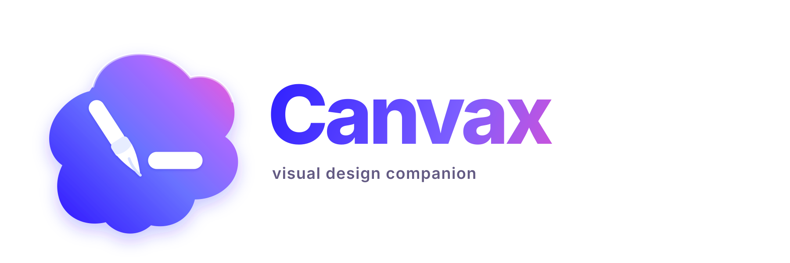
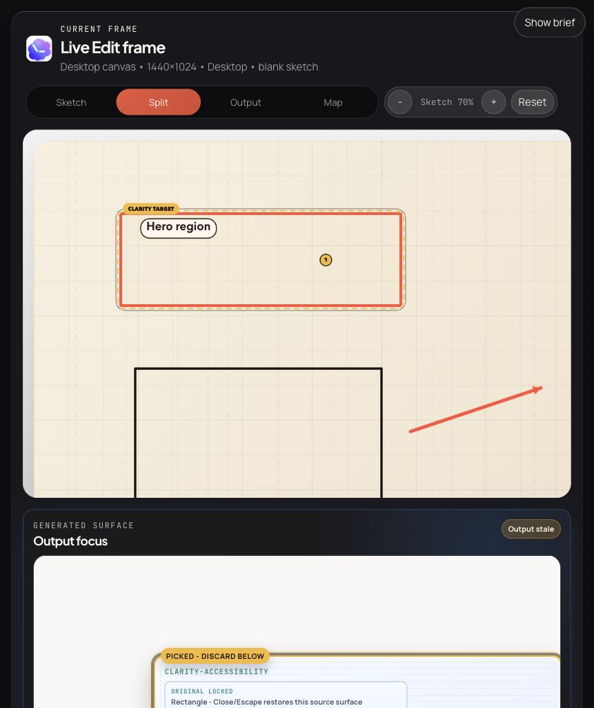
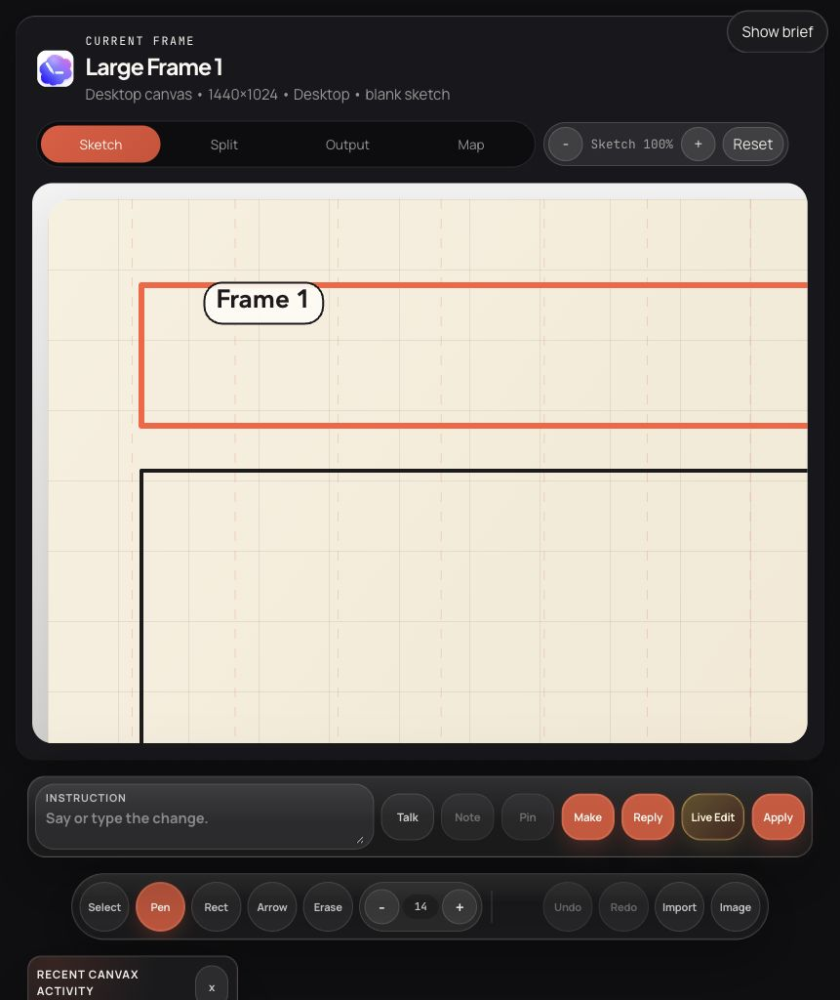
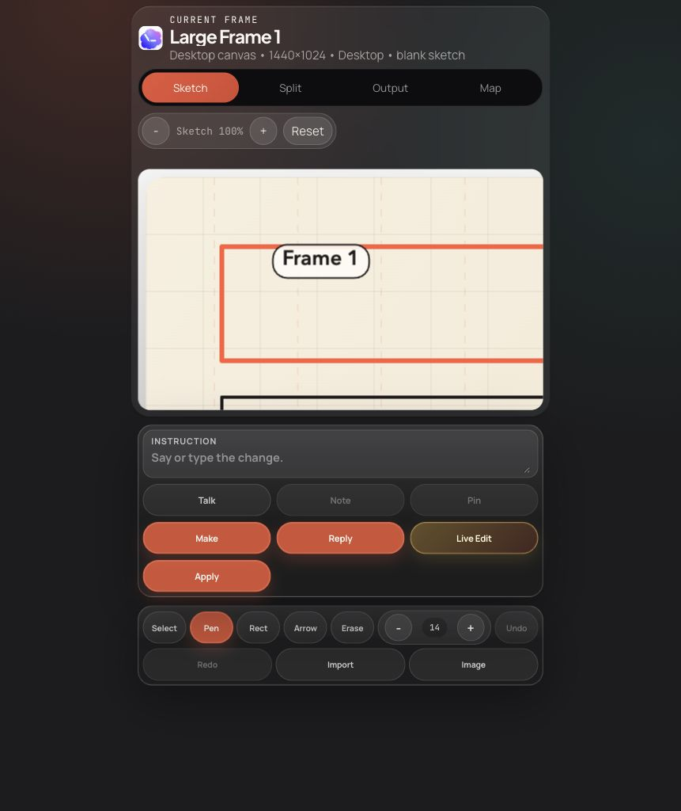
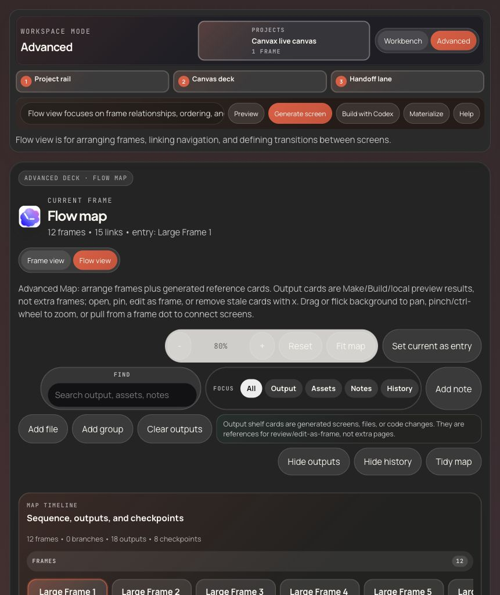

# Canvax



Canvax is a Codex-first visual sketch companion. It gives you a canvas inside the Codex working loop for rough UI, product flows, book spreads, storyboards, comic pages, posters, image directions, motion ideas, Qt layouts, or raw visual notes, then keeps a live export in the workspace so Codex can work from the sketch instead of forcing you to translate everything into text first.

This project was created collaboratively with OpenAI Codex.

## What Canvax Is

Canvax has three entry points:

- `./canvax`: the local command that starts or reuses the browser canvas service.
- `/canvax`: the preferred slash-listed skill entry inside Codex. It should attach the thread to Canvax and navigate the in-app browser to the full board.
- `$canvax`: the explicit skill invocation fallback. It uses the same handoff instructions when the slash entry is not available.

That means Canvax is **a local service plus a Codex skill surfaced as a slash entry**. It is not currently a native first-party built-in Codex command.

When the Codex app has the in-app browser available, `/canvax` is the preferred entry point: the skill starts or reuses the local service and instructs Codex to navigate the in-app browser to `http://localhost:3210/` instead of sending the designer to a separate browser. That full board is the stable default while the narrower `?host=codex-sidecar` scratchpad remains an optional embedded surface.

The copy for the skill directory lives in [docs/SKILL_LISTING.md](docs/SKILL_LISTING.md).

## Screenshots

Live Edit keeps the selected region small and explicit while variants preview in the same Workbench surface.



The Workbench is the default designer surface for sketching, notes, voice handoff, Make, Reply, Live Edit, and Apply.



The Codex sidecar route keeps the scratchpad compact when the in-app browser is narrow.



Advanced mode keeps the spatial map, generated references, manifests, and handoff controls available for deeper project work.



## System Snapshot

```text
                   CURRENT CANVAX SHAPE

  user sketch/voice
         |
         v
  +------------------+        save/export         +-------------------+
  | Board            | -------------------------> | Local service     |
  | web/index.html   |                            | scripts/canvax.mjs|
  | web/app.js       | <------------------------- | preview-state/api |
  +------------------+        live state          +-------------------+
         |                                                   |
         | open Preview                                      | write files
         v                                                   v
  +------------------+                            +-------------------+
  | Preview          | <------------------------- | exports/          |
  | web/preview.*    |     manifests/artifacts    | artifacts/        |
  +------------------+                            +-------------------+
         |
         v
  +------------------+
  | Codex            |
  | /canvax skill    |
  | $canvax skill    |
  +------------------+
```

The important contract is simple: the designer sketches and speaks in Canvax, Canvax writes structured local handoff files, Codex reads those files, and Codex publishes output manifests back so the canvas and Preview stay attached to the work.

## Core Loop

Canvax is built around one loop: sketch, speak or type intent, generate or bind output, draw corrections over that output, and let Codex continue from the latest structured handoff. It is useful for UI/UX, app flows, book pages, storyboards, comics, posters, image direction, and free-form visual notes.

Today the reliable path is local and no-API by default:

- Workbench is the default sketchpad for drawing, voice/text intent, generated output, corrections, Make, Apply, and Preview.
- Advanced keeps project switching, the spatial Map, design kits, manifests, export inspection, and debugging tools available when needed.
- Canvax writes live exports, checkpoints, task packs, image prompt packs, and Codex output manifests under `exports/` and `artifacts/`.
- Codex reads those files, changes real workspace files or local artifacts, then publishes output manifests back so the board and Preview remain attached.

Direct ChatGPT/Codex image generation and raw Codex microphone access are host capabilities, not something this localhost board can claim by itself. Canvax currently exports image host tasks, image prompt packs, voice/transcript notes, and structured live-edit requests. When the Codex app exposes first-party bridges for Images or realtime voice, those exported contracts are the integration point.

The full capability inventory belongs in [docs/FEATURES.md](docs/FEATURES.md). Day-to-day operation belongs in [docs/USAGE.md](docs/USAGE.md).

## Command Reality

`/canvax` is the preferred Codex-facing entry because it is how the installed `canvax` skill is surfaced in the slash list. This repo does not currently install a separate native slash-command file. The actual install path is the skill symlink at `~/.codex/skills/canvax`.

What the code controls today:

- `node scripts/install-canvax-skill.mjs` installs or refreshes the skill wrapper.
- `./canvax` starts or reuses the local service.
- `./canvax --open-codex` starts or reuses the service, then uses macOS UI automation to activate Codex Desktop, run `View > Open Browser Tab`, focus the browser address bar, and load the board URL.
- `./canvax --close-codex` toggles the Codex browser panel closed when it is open. This is best-effort because Codex exposes a browser-panel toggle shortcut, not a documented close-browser API for skills.
- `./canvax --status --json` reports `url`, `codexEditorUrl`, and `codexSidecarUrl`.
- `codexEditorUrl` points to `http://localhost:3210/`, the stable default Codex in-app browser target. `codexSidecarUrl` points to `http://localhost:3210/?host=codex-sidecar` for the optional compact surface.

So the honest contract is: `/canvax` invokes the Canvax skill, the skill runs `./canvax --open-codex` when local macOS UI automation is available, and Codex should land on the reported board URL in the in-app browser. `$canvax` remains the explicit skill invocation fallback when the slash-list entry is unavailable. If macOS Accessibility permission blocks automation, use `View > Open Browser Tab` and paste the reported URL.

## Why It Ships This Way

The official Codex docs currently give us reliable support for skills, slash-command surfacing, scripting, and App Server based custom clients. They do not currently document a native embedded arbitrary drawing surface inside the first-party Codex app itself. Because of that, Canvax ships today as a local companion app plus a skill wrapper instead of pretending there is a hidden internal canvas API.

Relevant docs:

- [Codex app commands](https://developers.openai.com/codex/app/commands)
- [Codex CLI features](https://developers.openai.com/codex/cli/features)
- [Codex config reference](https://developers.openai.com/codex/config-reference)
- [Codex App Server](https://developers.openai.com/codex/app-server/)

## Quick Start

### 1. Install the Codex skill

```bash
node scripts/install-canvax-skill.mjs
```

This creates a symlink at `~/.codex/skills/canvax`.

Restart Codex if it is already open.

### 2. Open the editor from Codex

In Codex:

- invoke `/canvax` from the slash list
- use `$canvax` only as the explicit skill fallback

The skill starts or reuses the local service through `./canvax --open-codex`. On macOS, that helper drives Codex Desktop through `View > Open Browser Tab` and loads `http://localhost:3210/`.

Then sketch in the board opened through the Codex in-app browser, and continue the same chat with prompts like:

- `use my current Canvax`
- `read the latest Canvax`
- `implement this sketch`
- `turn this into a spec`

### 3. Start the service manually when needed

```bash
./canvax
```

That ensures one Canvax service is running on `http://localhost:3210` by default.

Use `./canvax --open-external` only when you explicitly want the board in your default system browser, or `./canvax --chrome` when you explicitly want Google Chrome.

## Documentation Map

Start here:

- [Install guide](docs/INSTALL.md): setup and `/canvax` behavior.
- [Usage guide](docs/USAGE.md): operator workflow and handoff files.
- [Designer walkthrough](docs/DESIGNER_WALKTHROUGH.md): shortest design loop.
- [Skill listing copy](docs/SKILL_LISTING.md): directory fields and install text.

Reference:

- [Feature behavior guide](docs/FEATURES.md): detailed capabilities.
- [Codex Browser workflow](docs/CODEX_BROWSER_WORKFLOW.md): in-app browser/editor flow.
- [ChatGPT App and Codex bridge](docs/CHATGPT_APP_BRIDGE.md): native-host boundary.
- [Development guide](docs/DEVELOPMENT.md): checks, scripts, and maintainer flow.
- [Architecture guide](docs/ARCHITECTURE.md): service, board, Preview, and exports.

Status and planning:

- [Execution status](docs/EXECUTION_STATUS.md)
- [Stitch gap roadmap](docs/STITCH_GAP_ROADMAP.md)
- [Parity audit](docs/CANVAX_PARITY_AUDIT.md)
- [Upstream proposal](docs/upstream-proposal.md)
- [Live collaboration plan](canvax-live-collaboration-plan.md)
- [Brand guide](docs/BRANDING.md)
- [Demo script](docs/canvax-demo-script.md)

## Feature Matrix

| Area | Canvax today | Native Codex future |
| --- | --- | --- |
| Sketch input | Browser board served locally; `/canvax` invokes the skill and targets the compact `?host=codex-sidecar` editor in Codex's in-app browser | Embedded canvas panel inside a richer Codex client |
| Live handoff | File exports under `exports/` | Thread-bound handoff items and live multimodal state |
| Output binding | Preview manifest plus Codex-output manifest | First-party artifact, preview, and event wiring |
| Live preview | Preview tab/window, ideally inside Codex's in-app browser | Same-thread split canvas + output surface |
| Transport | Local companion via files, manifests, and browser session mirroring | App Server or equivalent JSON-RPC transport |

The current repo is intentionally optimized for the first column while keeping the second column reachable instead of blocked by hardcoded assumptions.

## Repo Map

```text
Canvax/
|- canvax                         # launcher
|- web/
|  |- assets/canvax-logo.svg     # app logo
|  |- index.html                  # board shell
|  |- styles.css                  # board UI
|  |- app.js                      # board state, tools, exports
|  |- preview.html                # preview shell
|  |- preview.css                 # preview UI
|  `- preview.js                  # preview state and compare logic
|- scripts/
|  |- canvax.mjs                  # local service and API
|  |- install-canvax-skill.mjs    # skill installer
|  |- write-preview-manifest.mjs  # preview manifest helper
|  |- write-codex-output.mjs      # Codex output helper
|  |- link-project-target.mjs     # code-folder to frame linker
|  |- regression-check.mjs        # schema and runtime checks
|  `- browser-regression.mjs      # headless browser checks
|- codex-skill/canvax/            # skill wrapper
|- docs/                          # operator and maintainer docs
|  `- assets/canvax-logo.svg      # documentation logo copy
|- exports/                       # live handoff files
`- artifacts/                     # generated output and checkpoints
```

## Service Commands

```bash
./canvax
./canvax --open-codex
./canvax --close-codex
./canvax --open-external
./canvax --chrome
./canvax --status
./canvax --stop
./canvax --restart
```

Behavior:

- `./canvax` starts or reuses the existing service.
- `./canvax --open-codex` starts or reuses the service, activates Codex Desktop, runs `View > Open Browser Tab`, and loads `http://localhost:3210/` with macOS UI automation.
- `./canvax --close-codex` toggles the Codex in-app browser panel, which closes the sidecar when it is open.
- `/canvax` is the Codex-first command-style skill path: it attaches the thread and should use the `--open-codex` helper when local UI automation is available.
- `$canvax` is the explicit skill fallback for the same handoff.
- `./canvax --open-external` starts or reuses the service and opens the board in the default system browser.
- `./canvax --chrome` starts or reuses the service and opens the board in Google Chrome.
- `./canvax --open` remains a legacy alias for `--open-external`.
- `./canvax --transcript "..." --scope frame --frame <id>` queues Codex chat dictation text into Canvax voice notes.
- `./canvax --status` prints the current board URL and live export paths.
- `./canvax --stop` stops the running service.
- `./canvax --restart` restarts the service cleanly. Reopen the board through `/canvax` in the Codex in-app browser afterward.
- `npm run host-handoff -- --save` writes one Codex/native-host packet with the active frame, sketch, voice intent, rewrite queue, output binding, project-link, image host context, source files, and suggested next actions.

Canvax is intentionally single-service. If one board is already running, it is reused instead of spawning another port by default.

## Verification

For local validation:

```bash
npm run check
npm run regression
npm run goal-audit
```

`npm run regression` now adds a headless browser pass against both the board and Preview self-test routes when a running Canvax service and local Chrome binary are available.

`npm run goal-audit` writes `artifacts/canvax/goal-audit/latest/result.json` and `.md`. It can pass the local evidence checklist while still reporting `overallComplete: false`, which is intentional until native host bridges and high-fidelity production generation are actually proven.

If you want that browser pass to fail hard instead of skipping on host-level Chrome timeouts, run:

```bash
CANVAX_BROWSER_STRICT=1 npm run browser-regression
```

When you only want the rendered Preview DOM/layout gate, run:

```bash
npm run review-dom
```

That writes `exports/canvax-dom-review-latest.json` and `.md`. It uses local headless Chrome only; it does not call a hosted model, image API, or paid API.

When a Workbench output card is attached, press `Review` to run the same local design-jury gate without using the terminal. Canvax writes `exports/canvax-design-jury-latest.json` and `.md`, records a `design-review-executed` session event, and shows the verdict as `Ready`, `Needs review`, `Blocked`, or `Review stale`.

## Live Export Files

The normal Codex path reads:

- `exports/canvax-live-latest.json`
- `exports/canvax-checkpoint-latest.json`
- `exports/canvax-task-pack-latest.json`
- `exports/canvax-image-prompt-pack-latest.json`
- `artifacts/canvax/codex-output.json`

Use `npm run inspect -- all --json` or `npm run host-handoff -- --json` when Codex or another local host needs one consolidated packet.

<details>
<summary>Full export and artifact reference</summary>

Canvax also writes these live handoff files under `exports/` and `artifacts/`:

- `exports/canvax-live-latest.json`
- `exports/canvax-live-latest.md`
- `exports/canvax-voice-latest.md`
- `exports/canvax-task-pack-latest.json`
- `exports/canvax-rewrite-request-latest.json`
- `exports/canvax-image-prompt-pack-latest.json`
- `exports/canvax-asset-candidates-latest.json`
- `exports/canvax-image-generation-brief-latest.json`
- `exports/canvax-image-host-task-latest.json`
- `exports/canvax-image-results-latest.json`
- `exports/canvax-build-real-latest.json`
- `exports/canvax-checkpoint-latest.json`
- `exports/canvax-project-registry-latest.json`
- `exports/canvax-session-events.jsonl`
- `exports/canvax-preview-manifest.json`
- `exports/canvax-project-link-latest.json`
- `exports/canvax-project-link-latest.md`
- `exports/canvax-preview-tweak-latest.json`
- `exports/canvax-preview-tweak-latest.md`
- `artifacts/canvax/codex-output.json`
- `exports/projects/<project-id>/canvax-codex-output-latest.json`
- `exports/projects/<project-id>/canvax-codex-output-latest.md`
- `artifacts/canvax/checkpoints/`
- `artifacts/preview/materialized/`
- `artifacts/preview/tweaks/`

Legacy compatibility files may also exist:

- `exports/canvax-storyboard-latest.json`
- `exports/canvax-storyboard-latest.md`

The JSON export is the main handoff file for Codex because it contains structured frame metadata plus image paths.

The preview manifest is the bridge for generated output. It can describe:

- the current implementation preview target
- generated artifacts like specs or exported HTML
- changed workspace files Codex wants to surface in the preview window

If the manifest contains a generated HTML artifact, Canvax can now use that as the implementation preview target automatically even when no explicit preview URL was attached.

Generate screen and Materialize use that same preview path. When you click either action in the board, Canvax writes a local HTML artifact plus a serialized frame payload under `artifacts/preview/materialized/...` and updates `exports/canvax-preview-manifest.json` so Preview can open it immediately.

When you rematerialize a frame, Canvax now also saves a refinement delta into the materialize metadata and manifest target. Preview uses that to render changed-region overlays and a refinement summary for the current frame.

The canonical Codex-written output file is:

- `artifacts/canvax/codex-output.json`

That file is merged automatically with the manual preview manifest so Canvax can show:

- generated screen targets
- changed files
- artifacts like specs, notes, or exported HTML

Canvax normalizes that merged manifest before rendering it: duplicate note paragraphs are collapsed, old targets/artifacts/changes are capped to recent unique entries, and Map output/history shelves start compressed so stale generated outputs do not overwhelm the first view.

For Codex-side publishing, the preferred helper is now:

```bash
node scripts/write-codex-output.mjs --from-git-status
```

Add `--preview-path` or `--url` when Codex also has a concrete implementation preview to bind.

Checkpoint mode now adds:

- `exports/canvax-checkpoint-latest.json` as the latest merged sketch + voice + output handoff
- `exports/canvax-session-events.jsonl` as the append-only checkpoint event log
- `artifacts/canvax/checkpoints/` as durable saved checkpoint records
- `exports/projects/<project-id>/canvax-checkpoint-latest.json` and `exports/projects/<project-id>/canvax-checkpoints.json` as the active project's recoverable checkpoint latest/index

Host handoff mode writes `exports/canvax-host-handoff-latest.json` as the
single local no-API packet for Codex/native-host sketch + voice + output handoff.

</details>

## Current Workflow

1. Install the skill once with `node scripts/install-canvax-skill.mjs`.
2. Invoke `/canvax` in Codex, or `$canvax` if the slash entry is unavailable.
3. Sketch in the Codex in-app browser Workbench, then add voice/text intent.
4. Pick the current action: build UI, refine UI, write spec, image prompt, or variations.
5. Use `Apply to Codex`, `Make real`, `Build code`, or `Preview` depending on the handoff you need.
6. Codex reads the latest live export, checkpoint, or `npm run host-handoff -- --json` packet and works from that visual handoff.
7. Switch to Advanced only for project switching, frame/flow diagnostics, design kits, manifests, captures, or debugging detail.

## Current Limits

- The board lives in Codex's in-app browser/editor surface, not inside the native text composer.
- A first deterministic Materialize loop exists, but the richer live AI rewrite loop is still not finished.
- The core workflow does not depend on a separate paid OpenAI API key.
- Board-side voice notes now exist, but the richer voice+sketch checkpoint/event-log loop is still not finished.
- Headless board and Preview browser regression now pass when the local service and Chrome are available.

## Repo Layout

The important folders are shown in the Repo Map above. For the detailed module breakdown, use [docs/ARCHITECTURE.md](docs/ARCHITECTURE.md).

## Publishing Intention

This repo is meant to be usable as-is by other Codex users, but it is also a reasonable prototype for future upstream work:

- a first-party canvas surface in Codex
- a richer App Server based Codex client with split chat + canvas
- or a more tightly integrated sketch-to-implementation workflow
