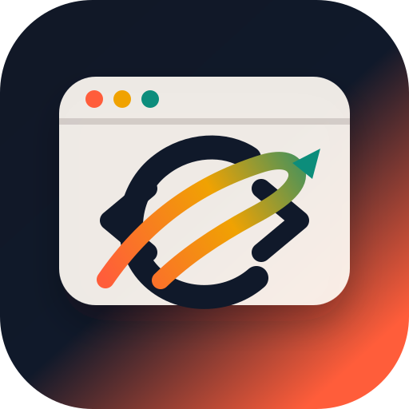
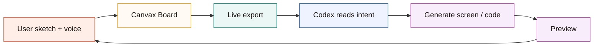
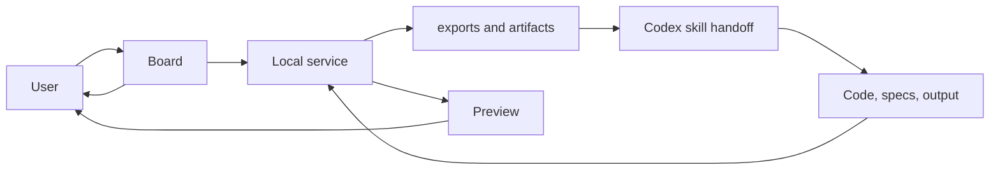
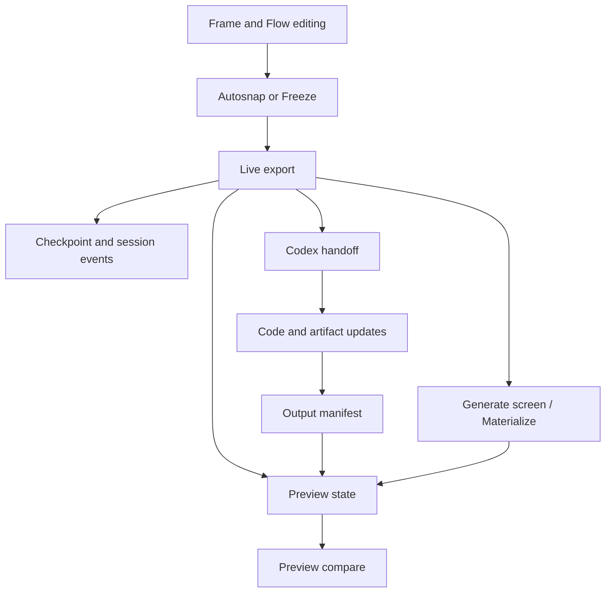

# Canvax



Canvax is a Mac-first sketch companion for Codex. It gives you a local canvas to draw rough UI, flows, motion ideas, Qt layouts, image directions, or raw visual notes, then keeps a live export in the workspace so Codex can work from the sketch instead of forcing you to translate everything into text first.

This project was created collaboratively with OpenAI Codex.

## What Canvax Is

Canvax has two surfaces:

- `./canvax`: the local command that starts or reuses the browser canvas service.
- `/canvax` or `$canvax`: the Codex skill entry that attaches the current chat to the live Canvax export.

That means Canvax is **a local command plus a Codex skill**. It is not currently a native first-party built-in Codex command.

When the Codex app has Browser Use / Atlas available, the preferred working mode is to open the local Canvax board inside Codex's in-app browser instead of a separate macOS browser. That keeps the sketch board, Preview, generated UI, and this chat in the same working loop while preserving the local service and file-based handoff.

## System Snapshot

```text
                   CURRENT CANVAX SHAPE

  user sketch/voice
         |
         v
  +------------------+        save/export         +-------------------+
  | Board            | -------------------------> | Local service     |
  | web/index.html   |                            | scripts/canvax.mjs|
  | web/app.js       | <------------------------- | preview-state/api |
  +------------------+        live state          +-------------------+
         |                                                   |
         | open Preview                                      | write files
         v                                                   v
  +------------------+                            +-------------------+
  | Preview          | <------------------------- | exports/          |
  | web/preview.*    |     manifests/artifacts    | artifacts/        |
  +------------------+                            +-------------------+
         |
         v
  +------------------+
  | Codex            |
  | /canvax or       |
  | $canvax skill    |
  +------------------+
```





## What It Does Today

- Opens a browser-based canvas optimized for Mac trackpad, mouse, or stylus use.
- Starts in `Workbench`, a simplified talk-and-draw mode that keeps sketch, surface choice, generated output, correction marks, voice, apply, and preview actions available without the full advanced UI.
- Adds a floating designer rail in `Focus canvas`, so tools, undo/redo, dictation, Make, and Apply stay available when the tray is intentionally hidden for canvas-first work.
- Keeps a compact frame/surface/action/focus summary visible when the Workbench tray is hidden, so canvas-first mode does not lose context.
- Adds a bottom Workbench command composer for typed/pasted dictation, Talk, Note, Make, and Apply while sketching.
- Keeps the focused Workbench rail as a bottom command dock with brush `-` / `+` controls and an `Image` action for spatial image-generation handoff.
- Keeps the main Workbench tray compact, with surface selection, action selection, host capability status, and design-context status visible without pushing the canvas below the fold.
- Adds Workbench quick-prompt chips for common refinement directions like font, drama, mobile variant, spacing, and image candidates.
- Adds designer surface presets for slides, book spreads, storyboards, and comic pages alongside UI, poster, square, and free-canvas presets.
- Adds a visible Advanced `Design kit` card with active rule sources, local kit presets for product apps, poster systems, book spreads, dashboards, and storyboards, plus `Extract tokens` for deriving palette, density, shape language, element mix, and placed/reference-image color samples from the current frame without an API. Applying a kit updates the board surface, mood, action mode, generation recipe, and empty frame notes without touching the sketch.
- Adds a file-based `design-kits/` gallery. JSON kits in that directory appear in the same searchable Design kit dropdown as built-in kits, so reusable product, poster, book, storyboard, or campaign rules can live in version control and flow into task/image/build/rewrite handoffs.
- Adds `npm run extract-tokens`, a local no-API extractor for public URLs, local HTML/CSS files, generated screen artifacts, pasted CSS/HTML text, or local raster screenshots via `--image`. It writes `exports/canvax-external-design-tokens-latest.{json,md}` with palette, CSS variable, typography, semantic HTML/JSX structure cues, Canvax node bindings, and screenshot color cues that can be imported into future Design kit flows.
- Adds `npm run validate-design-kits` to keep repository kit JSON files valid and no-API, plus `npm run validate-design-kits -- --query scythian` for quick kit discovery from the terminal.
- Adds `npm run package-design-kits`, which writes a shareable versioned no-API kit library at `exports/canvax-design-kit-library-latest.{json,md}` with source paths, full kit JSON, SHA-256 checksums, and install notes.
- Adds `npm run review-artifact`, a local no-API static HTML/CSS review for generated artifacts that checks semantic landmarks, heading structure, labels, links, image alts, form labels, responsive cues, focus styles, and Canvax source bindings before a production port.
- Adds `npm run review-snapshot`, a local no-API screenshot review that samples real browser snapshot pixels for dimensions, blankness risk, palette variety, dominant-color balance, and contrast spread.
- Adds `npm run review-jury`, a local no-API design jury that combines artifact review, screenshot review, and Canvax inspection context into a designer-facing verdict for hierarchy, accessibility, responsiveness, brand/system fit, tweak targeting, motion/readability, visual integrity, and production readiness.
- Adds `npm run review-dom`, a local no-API headless-browser DOM/layout review for the Preview surface that checks rendered structure, horizontal overflow, offscreen elements, target sizes, headings, landmarks, motion cues, and Canvax source bindings.
- Adds Preview `Mark tweak`, a local no-API region-targeting path: drag over generated output, enter the requested change, and Canvax writes a structured correction request for Codex under `exports/canvax-preview-tweak-latest.{json,md}` plus an archived tweak record. The rewrite executor consumes the matching latest tweak, maps it into affected regions/component targets, and writes `codex-patch-task.json` for the real implementation pass.
- Adds `npm run execute-patch -- --task <codex-patch-task.json>`, a local no-API proof path that applies a deterministic region tweak to Canvax-generated implementation bundles while preserving `data-canvax-node-id` bindings for future corrections.
- Adds `npm run verify-tokens`, a local no-API gate that checks a Canvax build contract's extracted palette is actually present in generated implementation CSS/HTML or in manifest-listed production files before treating the artifact as design-system aligned.
- Adds `npm run production-port-proof`, a local no-API proof fixture that creates a production-like route/component/CSS bundle, binds it to a Codex output manifest, verifies required token colors across the manifest-listed files, runs the static artifact review, and applies a production-like `codex-patch-task.json`.
- Adds `npm run project-link`, a local no-API code-folder link that binds existing app route/component/CSS files to a Canvax frame, writes `exports/canvax-project-link-latest.*`, and can publish a frame-bound Codex output manifest for real project work.
- Adds `npm run inspect`, a local no-API read-only bridge that returns the current frame, spatial workspace, active design kit, output bindings, and linked project files as stable JSON/Markdown for Codex or future MCP-style tools.
- Adds `npm run mcp`, a local no-API stdio MCP server exposing read-only Canvax tools for current frame, spatial workspace, design kit, output binding, project link, summary, and full inspection payloads.
- Uses a shared Workbench/Advanced mode guide so the default loop reads as sketch, talk, make/apply while Advanced reads as project rail, canvas deck, and handoff inspector.
- Keeps Advanced in the same product language with a solid command deck and bounded frame/map workspace that stay readable over long sessions.
- Supports freehand sketching, shapes, labels, selection, grouping, captures, and flow links between frames.
- Adds Workbench/Advanced Map background pan with momentum/coast, cursor-centered zoom, minimap navigation, and exported `spatialWorkspace.interaction` metadata.
- Exports Workbench Map group containment so Codex can read which frames, references, assets, generated outputs, artifacts, and changes belong to each exploration group.
- Keeps Workbench/Advanced Map inside a bounded scroll viewport and adds `Tidy map` so frame cards, generated-output references, and checkpoint history can be compacted after long sessions.
- Starts generated-output and checkpoint shelves compressed for new or migrated Map sessions, so older Materialize/Build/checkpoint cards stay available without becoming the first thing a designer sees.
- Adds a compact `Map timeline` strip for frames, branches, outputs, and checkpoints, with click-to-focus navigation and `spatialWorkspace.timeline` export for Codex.
- Exports nested Map group hierarchy through `spatialWorkspace.groupHierarchy`, so exploration boards can preserve parent/child group paths instead of only flat containment, and recursive nested group move/resize keeps geometry-contained boards together.
- Lets selected output/history Map cards move earlier or later inside their lane, preserving the designer's output/checkpoint sequence in the live export.
- Lets selected variant/output-edit branch cards move earlier or later in their source-frame branch sequence, and also updates branch order when dragged branch cards cross visible sibling drop targets, preserving branch order in `frame.variant.index` and `spatialWorkspace.variantBranches`.
- Lets a selected Map object carry editable `Prompt / Context` plus custom `key: value` properties, so generated outputs, image assets, notes, references, and groups can explain exactly what Codex or a host image tool should do with that object.
- Lets important Map objects be locked so generated outputs, references, and notes stay selectable/copyable but protected from accidental move, resize, reorder, duplicate, group, or delete actions; the lock state exports for Codex.
- Turns a generated output preview card into an editable `Output edit` frame, so a result can become a normal sketch/correction branch while task, rewrite, build, and executor payloads still point at the exact generated output target.
- Promotes an editable variant branch into the primary direction with `Use variant`, while keeping lineage visible for Codex through `spatialWorkspace.variantBranches`.
- Adds Preview `Play flow` so connected frames can be clicked through from the entry frame as a lightweight storyboard prototype, including generated hotspot overlays on sketch and output surfaces.
- Lets selected drawn elements become persistent prototype hotspots, so a button/image/region you sketch can navigate to a target frame in Preview Play.
- Autosaves the latest handoff under `exports/`.
- Generates a live Markdown prompt alongside the structured JSON export.
- Writes a Codex task pack and image prompt pack with normalized coordinates, selected action mode, active Design kit context, optional `DESIGN.md` context, plus an HTML/CSS placement scaffold, so ChatGPT/image generation can preserve rough composition without a Canvax API key.
- Adds a no-API style lock to image prompt and asset candidate packs so UI, poster, book-spread, comic, storyboard, and image-variant work can keep visual continuity across frames. When extracted sketch tokens exist, the style lock carries those sampled colors, density cues, and shape-language notes into host image prompts and Codex build context.
- Writes a consolidated no-API image generation brief that combines candidate prompts, style lock, pixel/CSS placement contracts, output slots, frame-grouped review queues, and copy-ready host prompts for ChatGPT/Codex image-generation hosts.
- Writes a no-API image host task that turns each candidate into a machine-readable hosted-image task with return-slot binding and acceptance criteria.
- Tracks attached asset candidate previews with one-candidate host-task copy, file/path import, select, and accept actions, plus placement-map/output-slot/review-summary metadata, so image-generation choices become explicit local handoff state with exact coordinates.
- Provides Workbench `Add image` / focused-rail `Import` controls for placing references, generated candidates, book/storyboard art, or UI assets as editable canvas elements without switching to Advanced mode.
- Creates a starter `DESIGN.md` from the current board in Advanced mode, without overwriting an existing design contract.
- Captures board-scoped or frame-scoped voice notes, using browser speech recognition when available and manual pasted dictation when it is not.
- Lets Codex forward submitted chat microphone transcripts into Canvax voice notes with `./canvax --transcript "..." --scope frame`.
- Supports a preview manifest that can bind a live implementation target, changed files, and generated artifacts to the current sketch workflow.
- Surfaces Codex output context directly in the Canvax inspector, including connected preview targets, generated artifacts, and changed files.
- Lets the board auto-publish current git workspace changes back into the Codex output manifest with `Publish changes`.
- Auto-publishes the current workspace change list whenever the board writes a fresh live export, so autosnap/freeze keeps the Codex output manifest closer to current state.
- Mirrors current git workspace changes into board and Preview polling even before a manual publish, so the changed-file list can keep following Codex edits while you keep sketching.
- Adds a live output activity feed in the board and Preview, so output-context changes are visible while you keep sketching.
- Adds frame-level output status badges in the board and Preview, so stale, synced, materialized, and global-target states stay visible across longer flows.
- Adds a rewrite queue in the board and Preview, so frames that need first output, a frame binding, a target, or a refresh are surfaced explicitly instead of being inferred from scattered badges.
- Writes `canvax-rewrite-request-latest.*` as a focused refinement handoff for queued frames, stale outputs, voice notes, and correction marks.
- Adds a rewrite `revisionGraph` so Codex can map frame revisions to output revisions before changing generated work.
- Stores output correction marks with normalized changed-region bounds, and makes output eraser gestures remove correction marks instead of exporting invisible eraser strokes.
- Includes `npm run execute-rewrite` as a deterministic no-API smoke path that turns the latest rewrite request into a refreshed frame-bound preview artifact and Codex output manifest.
- Workbench `Apply to Codex` now calls the same local rewrite executor after saving the checkpoint, so sketch/voice/output-correction passes can refresh the attached preview without a terminal step.
- Shows a Preview `Rewrite handoff` lane for request/export state, local executor artifacts, and manifest binding state.
- Reloads same-URL Preview targets with a digest-based revision key when connected implementation context changes, which keeps local app previews closer to live Codex edits.
- Adds preview compare modes and frame-aware highlighting when Codex output is tagged to specific frames.
- Adds Preview region tweak requests, so an output area can become a Codex-readable correction target without describing the coordinates by hand. `npm run execute-rewrite` now reads the matching latest tweak and includes it in the rewrite context.
- Lets you save preview compare snapshots into the workspace for later review.
- Adds a `Generate screen` mode with direction, style, and focus controls for richer local website/app screen generation from both box wireframes and rough stroke-first sketches.
- Adds `Build code` / `Build with Codex`, which writes a no-API frame-to-code request and immediately runs the local build executor so Workbench and Preview get a frame-bound preview, implementation starter bundle, React-ready `CanvaxScreen.jsx`/CSS pair, Vite/Next adapter stubs, `canvax-component-map.json` ownership map, `canvax-build-contract.json` integration contract, `codex-port-task.json`, and `ACCEPTANCE.md` before Codex replaces or ports it into real app/page files.
- Materializes the active frame into a styled local HTML preview artifact without changing the sketch board.
- Reuses a stable per-frame materialized preview target so repeated updates refresh the same output surface instead of spawning unrelated preview routes.
- Reuses that same per-frame target for richer generated-screen output, so Preview stays attached while the active frame is regenerated.
- Refreshes an existing materialized frame automatically after freeze/autosnap so the generated preview stays closer to the sketch without reopening Preview.
- Tracks Materialize refinements with changed-region metadata, so Preview can call out what shifted between sketch revisions instead of only showing a stale/synced badge.
- Reuses cached frame thumbnails/snapshots when rebuilding live preview/export payloads, which reduces repeated long-session render work.
- Writes that rewrite queue into the live handoff payloads, so Codex can read which frames currently need attention next.
- Installs a Codex skill so the canvas can be invoked from Codex as `/canvax` or `$canvax`.
- Requires no extra OpenAI API key for the core sketch-to-Codex workflow.
- Adds `npm run goal-audit`, which writes a strict prompt-to-artifact audit under `artifacts/canvax/goal-audit/latest/` and reports known remaining gaps instead of treating green tests as full parity.

## Current Baseline

This commit line now includes the following major layers working together:

- generic sketch board with Frame view and Flow view
- Workbench mode for the low-friction sketch + voice + generated-output loop
- Preview surface with compare modes and frame-aware output context
- Preview Play flow for linked frame storyboards
- selected-element prototype hotspots for precise click regions
- voice notes and dedicated voice handoff file
- checkpoints and session event log
- output manifests, workspace-follow, and output activity feed
- `Generate screen` with board-side recipe controls
- `Build with Codex` request export plus automatic local build-executor binding
- `Materialize` with stable per-frame targets and refinement deltas
- rewrite queue and frame-level output status badges
- rewrite request export plus local rewrite executor for frame-bound preview refresh
- rewrite revision graph for frame-to-output dependency tracking
- Preview rewrite handoff lane for request/executor/manifest progress
- runnable goal audit that maps the active Stitch-plus objective to concrete source/docs evidence while still reporting open gaps
- Workbench surface controls for desktop/mobile/tablet/free-canvas decisions without opening Advanced mode
- Workbench action modes for build, refinement, spec, image prompt, and variation workflows
- Workbench quick-prompt chips for common designer refinement moves
- task and image prompt packs for host-side code, spec, UI, and image-generation work without requiring `OPENAI_API_KEY`
- host capability and root `DESIGN.md` design-context reporting
- starter `DESIGN.md` generation from board mood, palette, labels, notes, frames, and generation direction
- transport contract for current `local-companion` mode vs future `app-server` mode



## Why It Ships This Way

The official Codex docs currently give us reliable support for skills, slash-command surfacing, scripting, and App Server based custom clients. They do not currently document a native embedded arbitrary drawing surface inside the first-party Codex app itself. Because of that, Canvax ships today as a local companion app plus a skill wrapper instead of pretending there is a hidden internal canvas API.

Relevant docs:

- [Codex app commands](https://developers.openai.com/codex/app/commands)
- [Codex CLI features](https://developers.openai.com/codex/cli/features)
- [Codex config reference](https://developers.openai.com/codex/config-reference)
- [Codex App Server](https://developers.openai.com/codex/app-server/)

## Quick Start

### 1. Start the board

```bash
./canvax
```

That ensures one Canvax service is running on `http://localhost:3210` by default.

If you are using Codex Desktop, invoke `/canvax` or `$canvax` after the service starts. The skill should open `http://localhost:3210` in Codex's in-app Browser Use / Atlas tab so the board stays in the same chat loop. Use `./canvax --open-external` only when you explicitly want the board in your default macOS browser, or `./canvax --chrome` when you explicitly want Google Chrome.

### 2. Install the Codex skill

```bash
node scripts/install-canvax-skill.mjs
```

This creates a symlink at `~/.codex/skills/canvax`.

Restart Codex if it is already open.

### 3. Use it from Codex

In Codex:

- invoke `/canvax` from the slash list if it appears there
- or invoke `$canvax`

Then sketch in the board opened through Codex Browser Use / Atlas, and continue the same chat with prompts like:

- `use my current Canvax`
- `read the latest Canvax`
- `implement this sketch`
- `turn this into a spec`

## Install Guides

- [Install guide](docs/INSTALL.md)
- [Usage guide](docs/USAGE.md)
- [Feature behavior guide](docs/FEATURES.md)
- [Designer walkthrough](docs/DESIGNER_WALKTHROUGH.md)
- [Architecture guide](docs/ARCHITECTURE.md)
- [Brand guide](docs/BRANDING.md)
- [Development guide](docs/DEVELOPMENT.md)
- [Codex Browser workflow](docs/CODEX_BROWSER_WORKFLOW.md)
- [ChatGPT App and Codex bridge](docs/CHATGPT_APP_BRIDGE.md)
- [Upstream proposal](docs/upstream-proposal.md)
- [Demo script](docs/canvax-demo-script.md)
- [Execution status](docs/EXECUTION_STATUS.md)
- [Stitch gap roadmap](docs/STITCH_GAP_ROADMAP.md)
- [Parity audit](docs/CANVAX_PARITY_AUDIT.md)
- [Live collaboration plan](canvax-live-collaboration-plan.md)

## Feature Matrix

| Area | Canvax today | Native Codex future |
| --- | --- | --- |
| Sketch input | Browser board served locally and preferably opened in Codex Browser Use / Atlas | Embedded canvas panel inside a richer Codex client |
| Live handoff | File exports under `exports/` | Thread-bound handoff items and live multimodal state |
| Output binding | Preview manifest plus Codex-output manifest | First-party artifact, preview, and event wiring |
| Live preview | Preview tab/window, ideally inside Codex Browser Use / Atlas | Same-thread split canvas + output surface |
| Transport | Local companion via files, manifests, and browser session mirroring | App Server or equivalent JSON-RPC transport |

The current repo is intentionally optimized for the first column while keeping the second column reachable instead of blocked by hardcoded assumptions.

## Repo Map

```text
Canvax/
|- canvax                         # launcher
|- web/
|  |- assets/canvax-logo.svg     # app logo
|  |- index.html                  # board shell
|  |- styles.css                  # board UI
|  |- app.js                      # board state, tools, exports
|  |- preview.html                # preview shell
|  |- preview.css                 # preview UI
|  `- preview.js                  # preview state and compare logic
|- scripts/
|  |- canvax.mjs                  # local service and API
|  |- install-canvax-skill.mjs    # skill installer
|  |- write-preview-manifest.mjs  # preview manifest helper
|  |- write-codex-output.mjs      # Codex output helper
|  |- link-project-target.mjs     # code-folder to frame linker
|  |- regression-check.mjs        # schema and runtime checks
|  `- browser-regression.mjs      # headless browser checks
|- codex-skill/canvax/            # skill wrapper
|- docs/                          # operator and maintainer docs
|  `- assets/canvax-logo.svg      # documentation logo copy
|- exports/                       # live handoff files
`- artifacts/                     # generated output and checkpoints
```

## Service Commands

```bash
./canvax
./canvax --open-external
./canvax --chrome
./canvax --status
./canvax --stop
./canvax --restart
```

Behavior:

- `./canvax` starts or reuses the existing service.
- `/canvax` or `$canvax` is the Codex-first path: it attaches the thread and should open the board in Codex Browser Use / Atlas.
- `./canvax --open-external` starts or reuses the service and opens the board in the default macOS browser.
- `./canvax --chrome` starts or reuses the service and opens the board in Google Chrome.
- `./canvax --open` remains a legacy alias for `--open-external`.
- `./canvax --transcript "..." --scope frame` queues Codex chat dictation text into Canvax voice notes.
- `./canvax --status` prints the current board URL and live export paths.
- `./canvax --stop` stops the running service.
- `./canvax --restart` restarts the service cleanly. Reopen the board through `/canvax` in Codex Browser Use / Atlas afterward.

Canvax is intentionally single-service. If one board is already running, it is reused instead of spawning another port by default.

## Verification

For local validation:

```bash
npm run check
npm run regression
npm run goal-audit
```

`npm run regression` now adds a headless browser pass against both the board and Preview self-test routes when a running Canvax service and local Chrome binary are available.

`npm run goal-audit` writes `artifacts/canvax/goal-audit/latest/result.json` and `.md`. It can pass the local evidence checklist while still reporting `overallComplete: false`, which is intentional until native host bridges and high-fidelity production generation are actually proven.

If you want that browser pass to fail hard instead of skipping on host-level Chrome timeouts, run:

```bash
CANVAX_BROWSER_STRICT=1 npm run browser-regression
```

When you only want the rendered Preview DOM/layout gate, run:

```bash
npm run review-dom
```

That writes `exports/canvax-dom-review-latest.json` and `.md`. It uses local headless Chrome only; it does not call a hosted model, image API, or paid API.

## Live Export Files

Canvax writes live handoff files under `exports/`:

- `exports/canvax-live-latest.json`
- `exports/canvax-live-latest.md`
- `exports/canvax-voice-latest.md`
- `exports/canvax-checkpoint-latest.json`
- `exports/canvax-session-events.jsonl`
- `exports/canvax-preview-manifest.json`
- `exports/canvax-project-link-latest.json`
- `exports/canvax-project-link-latest.md`
- `exports/canvax-preview-tweak-latest.json`
- `exports/canvax-preview-tweak-latest.md`
- `artifacts/canvax/codex-output.json`
- `artifacts/canvax/checkpoints/`
- `artifacts/preview/materialized/`
- `artifacts/preview/tweaks/`

Legacy compatibility files may also exist:

- `exports/canvax-storyboard-latest.json`
- `exports/canvax-storyboard-latest.md`

The JSON export is the main handoff file for Codex because it contains structured frame metadata plus image paths.

The preview manifest is the bridge for generated output. It can describe:

- the current implementation preview target
- generated artifacts like specs or exported HTML
- changed workspace files Codex wants to surface in the preview window

If the manifest contains a generated HTML artifact, Canvax can now use that as the implementation preview target automatically even when no explicit preview URL was attached.

Generate screen and Materialize use that same preview path. When you click either action in the board, Canvax writes a local HTML artifact plus a serialized frame payload under `artifacts/preview/materialized/...` and updates `exports/canvax-preview-manifest.json` so Preview can open it immediately.

When you rematerialize a frame, Canvax now also saves a refinement delta into the materialize metadata and manifest target. Preview uses that to render changed-region overlays and a refinement summary for the current frame.

The canonical Codex-written output file is:

- `artifacts/canvax/codex-output.json`

That file is merged automatically with the manual preview manifest so Canvax can show:

- generated screen targets
- changed files
- artifacts like specs, notes, or exported HTML

Canvax normalizes that merged manifest before rendering it: duplicate note paragraphs are collapsed, old targets/artifacts/changes are capped to recent unique entries, and Map output/history shelves start compressed so stale generated outputs do not overwhelm the first view.

For Codex-side publishing, the preferred helper is now:

```bash
node scripts/write-codex-output.mjs --from-git-status
```

Add `--preview-path` or `--url` when Codex also has a concrete implementation preview to bind.

Checkpoint mode now adds:

- `exports/canvax-checkpoint-latest.json` as the latest merged sketch + voice + output handoff
- `exports/canvax-session-events.jsonl` as the append-only checkpoint event log
- `artifacts/canvax/checkpoints/` as durable saved checkpoint records

## Current Workflow

1. Start Canvax with `./canvax`.
2. Install the skill once with `node scripts/install-canvax-skill.mjs`.
3. Invoke `/canvax` or `$canvax` in Codex.
4. Stay in `Workbench` for quick work: draw rough placement, start dictation or paste a spoken note, mark generated-output corrections if needed, then press `Apply to Codex` to save the checkpoint and refresh the local output binding.
5. Pick the Workbench action that matches the current intent: build UI, refine UI, write spec, image prompt, or variations.
6. Add a root `DESIGN.md` when the project needs reusable visual rules, brand constraints, or illustration direction.
7. Open `Preview` when you want to see the generated or implemented target beside the sketch.
8. Switch to `Advanced` only when you need frames, flow links, captures, generation recipes, manifests, changed files, or debugging detail.
9. In Advanced mode, use `Generate screen`, `Materialize`, `Push checkpoint`, or `Publish changes` for longer sessions.
10. Ask Codex to use the current Canvax.
11. Codex reads the latest live export or checkpoint and works from that visual handoff.

## Current Limits

- The board lives in a browser tab, not inside the native Codex composer.
- A first deterministic Materialize loop exists, but the richer live AI rewrite loop is still not finished.
- The core workflow does not depend on a separate paid OpenAI API key.
- Board-side voice notes now exist, but the richer voice+sketch checkpoint/event-log loop is still not finished.
- Headless board and Preview browser regression now pass when the local service and Chrome are available.

## Repo Layout

- `web/`: browser UI for the drawing board.
- `scripts/canvax.mjs`: local service launcher and export server.
- `scripts/install-canvax-skill.mjs`: skill installer.
- `codex-skill/canvax/`: Codex skill wrapper.
- `exports/`: live and archived handoff files.

## Publishing Intention

This repo is meant to be usable as-is by other Codex users, but it is also a reasonable prototype for future upstream work:

- a first-party canvas surface in Codex
- a richer App Server based Codex client with split chat + canvas
- or a more tightly integrated sketch-to-implementation workflow
