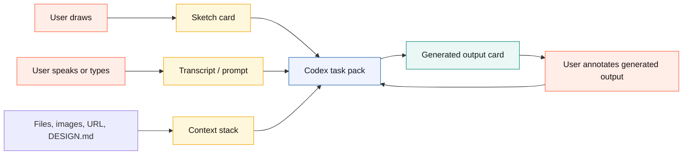

# Plan: Canvax Stitch-Like Workbench Redesign

**Generated**: 2026-05-15  
**Estimated Complexity**: High

## Overview

Canvax should move from "tool panel plus canvas plus technical preview" to a single Codex-first visual workbench.

The default experience should feel like:

```text
draw rough idea + speak intent + attach context
        -> Codex turns it into a real surface
        -> generated output appears beside the sketch
        -> user marks corrections directly on the workbench
        -> Codex refines the output
```

This is inspired by Google Stitch's AI-native canvas direction, but Canvax should not clone Stitch. The stronger Canvax position is Codex-native workspace awareness: sketches, voice/transcripts, generated files, previews, docs, and git changes all become one local collaboration state.

The current Advanced board is useful, but it is overwhelming as the default. Keep it as an inspector/debugging mode. Make the default mode a simpler `Workbench`.

## Product Decision

Canvax core must remain local-first and must not require an image-generation API key.

Image generation has three lanes:

- **Host lane**: Codex/ChatGPT can generate or edit images when the current host exposes that ability.
- **Prompt-pack lane**: Canvax always exports structured image/UI prompts without needing any paid API.
- **Optional adapter lane**: OpenAI API, Apps SDK, or other providers can be added later as opt-in bridges, not baseline requirements.

Official OpenAI docs currently confirm that `gpt-image-2` exists through the OpenAI Image API and through the Responses API image generation tool, but that path uses API authentication and cost. The Apps SDK path requires an MCP server and can optionally render a web component inside ChatGPT. Therefore, Canvax should design around host capability and prompt handoff first, with API adapters as optional.

Sources:

- OpenAI image generation guide: https://developers.openai.com/api/docs/guides/image-generation
- OpenAI Apps SDK quickstart: https://developers.openai.com/apps-sdk/quickstart
- OpenAI Apps SDK MCP server concepts: https://developers.openai.com/apps-sdk/concepts/mcp-server
- Google Stitch redesign reference: https://blog.google/innovation-and-ai/models-and-research/google-labs/stitch-ai-ui-design/

## Implementation Status

Current completed baseline:

- Workbench is the default simple mode.
- Generated output can appear beside the sketch as a compact correction/status card.
- Correction marks over generated output are saved into frame handoff data.
- Advanced mode remains the full inspector/debugging surface, but now shares the same dark dotted Canvax design language, tighter deck sizing, a solid sticky command header, mode explanation, mode guide, and deck labels so it reads as an advanced layer of the same product instead of a separate product. The guide maps Workbench to `Sketch` / `Talk` / `Make / Apply` and Advanced to `Project rail` / `Canvas deck` / `Handoff inspector`. The command deck stays readable over long frame/map scrolls because canvas content no longer blurs through the controls, and the Advanced shell collapses to a single-column inspector layout on narrower windows.
- Workbench now has `Sketch`, `Split`, `Output`, and `Map` focus modes so generated surfaces can become a large correction target and the frame/variant graph can become a spatial project canvas instead of staying trapped in Advanced Flow view.
- Workbench now includes a `Start here` strip for `1 Sketch`, `2 Talk`, `3 Make`, and `4 Map`, which gives first-time designers a short guided path before they need the deeper tray, rail, or Advanced controls.
- Workbench `Map` now includes a spatial object layer: editable generated variant branches export through `spatialWorkspace.variantBranches`; labeled group regions, manual notes, reference files/images, asset candidates, generated screen targets, generated artifacts, changed files, and recent checkpoints become draggable object cards and export through `spatialWorkspace.objects`; selected Map objects can be wrapped into a group region, ungrouped without deleting contents, selected from group contents, fit back into group bounds, locked against accidental transform/reorder/duplicate/delete, sent backward or brought forward, and export `locked`, `layerIndex` / `layerLabel`; generated screen/file/change cards are grouped in a collapsible `Output shelf` lane with an inline legend and `Output ref` badge so they read as implementation outputs instead of extra frames, with old raw manifest labels and legacy materialized/generated-target records canonicalized into `Generated screen`, `Generated file`, and `Code change`; selected output/history cards can move earlier or later inside their lane and export through `meta.laneIndex`, context Markdown, and ordered `spatialWorkspace.lanes[].memberObjectIds`; selected variant/output-edit branch cards can move earlier or later in their source-frame branch sequence, and dragging branch cards across sibling branch positions updates `frame.variant.index` plus ordered `spatialWorkspace.variantBranches`; the compact `Map timeline` lets designers jump between frames, branches, outputs, and checkpoints, and exports the same sequence through `spatialWorkspace.timeline`; generated output previews can become editable `Output edit` frames with a flow connection, output-target metadata on the matching variant Map object, and explicit `outputEditBinding` in task/rewrite/build handoffs so Codex knows which generated target to revise; output correction marks export normalized changed-region bounds and output eraser gestures delete marks instead of saving eraser strokes; group regions move contained frame cards/objects while skipping locked child objects and containment is exported through `spatialWorkspace.groups` and `groupIds`; dragging cards or objects into the left/top edge expands workspace room while trailing space keeps the map from feeling bounded; the minimap navigator provides click-to-pan orientation, `Fit map` recovers visible frames and Map objects after zoom/pan or long-session clutter, and `spatialWorkspace.viewport` exports the current/last viewed Map region for Codex.
- Workbench/Advanced `Map` now uses a bounded internal scroll viewport instead of letting large spatial surfaces expand the whole page. `Tidy map` reflows frame cards plus generated-output and checkpoint shelf objects into compact lanes when a long session or noisy manifest makes the canvas hard to read.
- Browser regression now has a `visualfixture=advanced-map` state that seeds a dense Map, switches to Advanced Flow view, scrolls under the sticky command deck, captures desktop/tablet screenshots, and asserts the Advanced deck remains opaque while generated-output cards use designer-readable labels.
- Workbench `Map` single-object selection includes a lightweight Title/Note/Status/Prompt property editor, custom `key: value` properties, safe type-detail override fields, and structured per-type inspector sections for generated outputs, asset placements, checkpoints, variants, groups, references, and changes, with manual overrides preserved when generated/asset/checkpoint objects resync from handoff files.
- Preview now has `Play flow` playback for connected frames, starting from the entry frame and stepping through outgoing transition labels, with generated clickable hotspots over the sketch/output viewport. Selected frame elements can also be linked to target frames, turning their actual drawn bounds into persistent Play-mode hotspots.
- Generated materialized outputs now open clean by default. Original sketch and free-note overlays are opt-in review aids instead of always-visible artifacts that can be mistaken for generated UI or eraser residue.
- The floating rail is now the primary bottom designer dock in `Focus canvas`, with brush `-` / `+`, undo/redo, Talk, Make, Image, and Apply.
- Workbench now has a bottom command composer in `Focus canvas` for typed/pasted dictation, Talk, Note, Make, and Apply so the user can keep sketching without returning to the top tray.
- The rail size controls are context-sensitive: they resize selected elements in Select mode and change the brush/eraser size otherwise.
- The Workbench tray is reduced to brief/context/voice/output; duplicate tray tool chips are hidden in simple mode so the canvas and dock carry the interaction.
- The Workbench tray now uses a compact three-column command strip so the active canvas is visible in the first viewport instead of being pushed below the fold.
- Workbench quick-prompt chips add common refinement intent such as font, drama, mobile variant, spacing, and image candidates without opening Advanced mode.
- Workbench secondary actions now sit behind a `More actions` disclosure so the default composer focuses on the everyday frame/free-canvas/build/preview loop instead of showing every power tool at once.
- Collapsed Workbench keeps a compact frame/surface/action/focus summary visible so canvas-first mode does not feel detached from the active task.
- Action mode selection is available in Workbench and is exported into task/image prompt packs.
- Surface presets now include slide, book spread, storyboard, and comic page in addition to UI/poster/free-canvas presets, so the same loop can support product screens, decks, illustration planning, and sequential art.
- `DESIGN.md` is detected when present and included as project design context in handoffs.
- Advanced mode can create a starter `DESIGN.md` from board mood, palette, labels, frames, and generation direction without overwriting an existing file.
- A host capability registry tells the UI/export whether the current path is local no-API handoff, Codex browser, host image generation, or native microphone bridge.
- `canvax-task-pack-latest.*` is exported for Codex/spec/build work.
- `canvax-rewrite-request-latest.*` is exported for live output refinement from queued frames, voice notes, correction marks, and connected output manifests.
- Rewrite requests include a `revisionGraph` so Codex can map frame revisions to output targets, artifacts, changed files, stale state, and queue reasons before rewriting.
- `execute-rewrite-request` can consume the latest rewrite request into a refreshed frame-bound local artifact and Codex output manifest, giving the live-refinement loop a no-API smoke path. Workbench `Apply to Codex` now invokes this path automatically after checkpoint save.
- `canvax-image-prompt-pack-latest.*` is exported for host-side image generation and includes normalized coordinates plus an HTML/CSS placement scaffold.
- `canvax-image-prompt-pack-latest.*` and `canvax-asset-candidates-latest.*` now include a no-API `canvax-style-lock` block so UI, poster, book-spread, comic, storyboard, and image-variant work can preserve palette, rendering language, continuity rules, and adaptation rules across frames.
- `canvax-asset-candidates-latest.*` is exported as a prompt-ready image/asset candidate format with source frame, bounds, prompts, placement maps, style-lock references, and output slots.
- Pasted or dropped image outputs now become editable image elements on the frame, so generated candidates can be moved, resized, labeled, exported, and materialized without becoming a background-only underlay.
- `Generate screen` can now produce the semantic generated surface from stroke-first sketches, arrows, ovals, image slots, and free labels instead of requiring rectangle-heavy wireframes.
- Workbench now shows saved asset candidates as compact cards; each candidate can place an editable image slot on its source frame/region, attach a generated image file or workspace image path back to that slot, preview attached candidates, select the placed image, and accept one as the chosen output while preserving `assetCandidateId`. Accepted choices now export through `reviewSummary.acceptedCandidates`; `reviewSummary.groups` keeps a frame-grouped pending/placed/attached/accepted queue; `reviewSummary.hostHandoff` lists the no-API files and workflow for Codex/ChatGPT image hosts; and each candidate includes a `placementMap` contract with normalized bounds, pixel bounds, CSS placement, target selector, and HTML slot scaffold for Codex/host image tools.
- Eraser strokes are isolated to the ink layer so they erase sketch marks without wiping the paper/grid layer, and they are excluded from materialized output geometry and image prompt composition.
- Static Canvax assets are served with no-store headers to prevent stale browser UI after local service updates.
- Self-test coverage includes tool rendering, drawing controls, select/move/resize, eraser layer behavior, Workbench/Advanced mode guide rendering, Workbench dock brush sizing, default compressed output/history shelves, Workbench spatial map rendering/export for frames, group regions, selection-created groups, selecting group contents, fitting group bounds, ungrouping, group containment, manual notes, single-object property editing and type details, Map object layer ordering, asset candidates, generated targets, artifacts, changed files, checkpoint history lanes with collapse/expand state, opt-in materialized review aids, stroke-first semantic screen generation, flow links, selected-element prototype hotspots, task/rewrite/image prompt packs, asset candidate packs, materialize, output activity, rewrite queue, and large-session export consistency.

Still open:

- automatic host image generation remains open. Multi-candidate review now has per-candidate prompt/placement copy, local attached-image thumbnails, workspace-path import, style-lock continuity metadata, select, and accept state in the candidate tray.
- true infinite spatial canvas beyond the Workbench Map frame/variant/context/generated-output/checkpoint object layer, especially fuller nested object modeling and richer schema-specific property panels beyond the current custom `key: value` layer. Generated output objects are now reconciled, grouped in the collapsible `Output shelf`, start compressed with checkpoint history for new/migrated sessions, can be cleared from Map, infer frame binding from current and legacy generated-output paths, canonicalize raw labels into designer-facing `Generated screen` / `Generated file` / `Code change` labels with an `Output ref` badge, and legacy stale/deleted-frame cards are cleaned up to reduce materialized-output clutter; the history lane can also be collapsed/expanded, Map objects can be focused by output/assets/notes/history, important objects can be pinned across those focus states, selected Map objects can be locked against accidental transform/reorder/delete, grouped/ungrouped, selected from group contents, fit into group bounds, recursively move/resize geometry-contained nested group contents, exported with parent/child group paths through `spatialWorkspace.groupHierarchy`, sent backward/brought forward, moved earlier/later inside output/history lanes, moved earlier/later inside branch sequences, drag-reordered by Map position with visible drop targets, edited with object-level Prompt / Context guidance and custom properties, navigated through frame/branch/output/checkpoint `Map timeline` tracks, and reflowed with `Tidy map`, and all of that exports for Codex.
- direct `Build with Codex` route/code generation and binding. Initial build-request and output-contract writer is shipped, and the board now executes the local no-API path immediately for manifest binding plus a context-themed implementation starter bundle, React-ready component/CSS handoff, Vite/Next adapter stubs, and frame-to-code ownership map; Codex still has to execute the real implementation pass for production route/component files.
- deterministic `execute-build-request` path is shipped and reachable from the board for turning the latest build request into a frame-bound local HTML preview plus implementation files. It now consumes `implementationContext` to choose a starter theme, render theme-specific atmosphere layers, and show a visible `Designer context` panel, including the portable React component/CSS pair and framework adapter notes; full Codex route/component implementation remains the real target.
- deterministic `execute-rewrite-request` smoke path, board-side Apply execution, optional autosnap/freeze `Live rewrite`, in-flight Live rewrite queueing, and Preview `Rewrite handoff` lane are shipped for turning the latest rewrite request into a refreshed frame-bound local HTML artifact; a continuous autonomous Codex rewrite loop with real app edits remains the real target.
- native Codex microphone/image-generation host bridge

## Target UX

```text
+--------------------------------------------------------------------------------+
| project title                         viewport   play   export   advanced       |
+--------------------+---------------------------------------------+-------------+
| Codex brief         |                                             | tool dock   |
| - current ask       |         infinite / spatial workbench         | select      |
| - voice transcript  |                                             | pen         |
| - context files     |   +----------------+   +----------------+   | shape       |
| - active task       |   | rough sketch   |   | generated UI   |   | text        |
|                    |   | user editable  |   | Codex output   |   | image       |
| suggestions         |   +----------------+   +----------------+   | palette     |
+--------------------+---------------------------------------------+-------------+
| quick prompt: "make this hero more cinematic"   attach   mic/transcript   send |
+--------------------------------------------------------------------------------+
```

The main surface should show three things together:

- **Sketch card**: what the user drew.
- **Generated card**: what Codex/Canvax made real.
- **Instruction composer**: what the user says or types next.

Advanced details such as manifests, changed files, captures, rewrite queues, raw JSON, and transport state should be available, but not visually central.

## Design System Direction

Use a distinct Canvax visual language:

- **Base**: deep charcoal dotted workspace, not pure black.
- **Sketch material**: warm aged paper surfaces.
- **Codex output material**: precise glass/metal frame with subtle blue-gray structure.
- **Action accent**: Canvax red-orange for primary actions, mint only for sync/ready states.
- **Typography**: expressive editorial serif only for brand/title, high-quality sans/mono for controls.
- **Motion**: tactile button press feedback, soft card arrival, output refresh pulse, no noisy continuous animation.

Token sketch:

```text
primitive
  charcoal-950  #171412
  paper-100     #fff8ec
  rust-500      #f25a32
  mint-600      #0c8d7b
  blue-650      #2364aa

semantic
  surface-workspace = charcoal-950
  surface-sketch    = paper-100
  surface-output    = blue-gray glass
  action-primary    = rust-500
  status-ready      = mint-600

component
  dock-button
  sketch-card
  output-card
  transcript-card
  command-composer
```

## Desired Interaction Model



The user should not need to think about `exports/`, manifests, or API keys during normal use. The UI should present:

- `Make real`: turn sketch + instruction into a generated UI/spec/prompt pack.
- `Try variations`: generate alternative directions.
- `Apply correction`: send sketch-over-output notes to Codex.
- `Open Advanced`: inspect raw data when something breaks.

## Sprint 1: Product Shell Simplification

**Goal**: Make `Workbench` the default and reduce first-screen cognitive load.

**Demo/Validation**:

- Run `./canvax`.
- Open `http://localhost:3210` in Codex Browser / Atlas.
- The first view should look like one creative workbench, not a form-heavy admin panel.

### Task 1.1: Rename the Default Mode

- **Status**: Shipped. `Workbench` is the default user-facing mode and Advanced remains available.
- **Location**: `web/index.html`, `web/app.js`, `web/styles.css`, `docs/FEATURES.md`, `docs/USAGE.md`
- **Description**: Rename user-facing `Focus Pad` to `Workbench`. Keep the internal mode id `simple` if that reduces migration risk.
- **Complexity**: 2/10
- **Dependencies**: None
- **Acceptance Criteria**:
  - Default mode label reads `Workbench`.
  - Advanced mode remains available.
  - Existing local storage does not break.
- **Validation**:
  - `npm run check`
  - Browser smoke test: switch Workbench/Advanced twice.

### Task 1.2: Collapse Project Form Into a Brief Card

- **Status**: Shipped in the current Workbench tray. Further visual simplification remains a polish task.
- **Location**: `web/index.html`, `web/styles.css`
- **Description**: Replace the large default intro copy with a compact Codex brief card: current ask, latest transcript, selected surface, and one status line.
- **Complexity**: 4/10
- **Dependencies**: Task 1.1
- **Acceptance Criteria**:
  - Workbench top area uses less vertical space.
  - User can still edit the current ask and surface.
  - Transcript visibility remains available.
- **Validation**:
  - Manual layout check at 1440px, 1024px, 768px width.

### Task 1.3: Add a Bottom Command Composer

- **Status**: Shipped initial version. The bottom composer reuses the existing voice-note/task-pack pipeline and sits above the designer rail in Workbench.
- **Location**: `web/index.html`, `web/styles.css`, `web/app.js`
- **Description**: Add a bottom composer with manual dictation input, attach action placeholder, `Make real`, `Apply correction`, and `Preview`.
- **Complexity**: 5/10
- **Dependencies**: Task 1.2
- **Acceptance Criteria**:
  - The user can type/paste dictation without opening Advanced. **Done through the fixed Workbench command composer.**
  - Primary action is obvious. **Done with Talk, Note, Make, and Apply controls.**
  - Buttons retain tactile feedback. **Done with the same rail-style press/hover language.**
- **Validation**:
  - Add manual note with Cmd/Ctrl+Enter.
  - Make screen from Workbench.
  - Apply checkpoint from Workbench.

## Sprint 2: Spatial Sketch + Output Workbench

**Goal**: Show sketch and generated output together as workbench objects.

**Demo/Validation**:

- Draw a hero sketch.
- Press `Make real`.
- Generated output appears as a sibling card beside the sketch without requiring the user to open a separate preview tab.

### Task 2.1: Create Workbench Two-Up Surface

- **Status**: Shipped initial version. The current frame stays primary and generated output appears as a compact sibling Workbench output card. This is useful for status and correction marks, but it is not yet large enough to be the main design surface.
- **Location**: `web/index.html`, `web/styles.css`
- **Description**: In Workbench mode, render the current canvas as a `Sketch` card and reserve a `Generated output` card next to it.
- **Complexity**: 6/10
- **Dependencies**: Sprint 1
- **Acceptance Criteria**:
  - Sketch card keeps correct viewport scale.
  - Output card has empty, loading, ready, stale, and error states.
  - No clipping or overlap at common viewport sizes.
- **Validation**:
  - Browser visual smoke test on desktop and narrow viewport.

### Task 2.2: Mirror Preview Target Into the Output Card

- **Status**: Shipped initial version. The Workbench output card mirrors connected preview/materialized/generated targets.
- **Location**: `web/app.js`, `web/styles.css`
- **Description**: When a generated HTML artifact or local preview URL exists, embed it in the Workbench output card using the same preview-state manifest logic.
- **Complexity**: 7/10
- **Dependencies**: Task 2.1
- **Acceptance Criteria**:
  - Output card shows current generated artifact.
  - Same-URL revision refresh still works.
  - `Open Preview` remains as a larger compare surface.
- **Validation**:
  - Run `npm run demo:hero`.
  - Confirm output card refreshes after a second generation.

### Task 2.3: Add Sketch-Over-Output Correction Layer

- **Status**: Shipped initial version. Output correction marks are saved as frame-level annotations with normalized changed-region bounds; erasing over output removes intersecting correction marks instead of exporting eraser strokes.
- **Location**: `web/app.js`, `web/styles.css`
- **Description**: Let the user draw annotation strokes over the output card without mutating the generated artifact. Save these as correction overlays linked to the active frame and output revision.
- **Complexity**: 8/10
- **Dependencies**: Task 2.2
- **Acceptance Criteria**:
  - User can mark "move this", "bigger", arrows, and labels over generated output.
  - Overlays export in live JSON/Markdown.
  - `Apply correction` includes overlay context.
- **Validation**:
  - Draw correction overlay.
  - Save checkpoint.
  - Inspect `exports/canvax-live-latest.json`.

### Task 2.4: Promote Output Into Focus And Split View

- **Status**: Shipped initial version. Workbench now has `Sketch`, `Split`, and `Output` focus modes; correction overlays work on the compact tray card and the large output stage.
- **Location**: `web/index.html`, `web/styles.css`, `web/app.js`
- **Description**: Keep the current small `Codex output` card as a thumbnail/status/correction target, but add a larger designer-first surface for real inspection and editing. The user should be able to switch between `Sketch focus`, `Output focus`, and `Split` without leaving Workbench.
- **Complexity**: 7/10
- **Dependencies**: Tasks 2.1-2.3
- **Acceptance Criteria**:
  - `Output focus` makes the generated surface the primary large stage.
  - `Split` shows sketch and output side by side with comparable usable sizes.
  - The small output card remains in the tray only as a compact status/quick-correction preview.
  - Correction marks work on both the compact card and the large output focus surface.
  - No overlap or clipping at 1440px, 1024px, 768px, and narrow Codex browser widths.
- **Validation**:
  - Generate or attach a preview target.
  - Toggle `Sketch`, `Split`, and `Output`.
  - Draw correction marks on the large output surface.
  - Run responsive screenshots/smoke checks.

## Sprint 3: Real Codex Task Pack

**Goal**: Make `Make real` create a clean Codex-readable work order.

**Demo/Validation**:

- Draw and dictate.
- Press `Make real`.
- Canvax writes a task pack that Codex can use to implement a real website/app/deck/image prompt without reading raw app internals.

### Task 3.1: Add `canvax-task-pack` Export

- **Status**: Shipped initial version with regression coverage for presence and no-API host-lane fields. Further schema cleanup remains open.
- **Location**: `web/app.js`, `scripts/canvax.mjs`, `docs/ARCHITECTURE.md`
- **Description**: Write a compact JSON and Markdown task pack containing sketch snapshot, geometry summary, labels, voice/transcript, surface type, output target, and requested action.
- **Complexity**: 6/10
- **Dependencies**: Sprint 2
- **Acceptance Criteria**:
  - `exports/canvax-task-pack-latest.json`
  - `exports/canvax-task-pack-latest.md`
  - Task pack is stable enough for Codex and other agents.
- **Validation**:
  - Regression check validates schema fields.

### Task 3.2: Add Action Modes

- **Status**: Shipped initial version. Workbench exposes the action chooser and exports the selected mode.
- **Location**: `web/index.html`, `web/app.js`, `docs/FEATURES.md`
- **Description**: Add explicit modes: `Build UI`, `Refine UI`, `Write spec`, `Make image prompt`, `Create variations`.
- **Complexity**: 4/10
- **Dependencies**: Task 3.1
- **Acceptance Criteria**:
  - The user chooses intent without opening Advanced.
  - Exports include `actionMode`.
  - No action implies paid API usage.
- **Validation**:
  - Create one task pack per action mode.

### Task 3.3: Add `DESIGN.md` Awareness

- **Status**: Shipped initial version. Canvax reads project `DESIGN.md`, includes it in handoffs, and can create a starter file from the current board without overwriting an existing one.
- **Location**: `web/app.js`, `scripts/canvax.mjs`, `docs/USAGE.md`
- **Description**: Allow project design rules to be imported/exported as `DESIGN.md`, then included in task packs.
- **Complexity**: 6/10
- **Dependencies**: Task 3.1
- **Acceptance Criteria**:
  - If `DESIGN.md` exists, Canvax surfaces it as project context.
  - Canvax can export a starter `DESIGN.md` from board mood, palette, labels, and generated output.
- **Validation**:
  - Write/read a sample `DESIGN.md`.
  - Verify prompt pack includes the design rules.

## Sprint 4: Optional Image And App Bridges

**Goal**: Support image workflows without making the baseline API-dependent.

**Demo/Validation**:

- In local-only mode, Canvax generates prompt packs and placement previews.
- If a host image tool exists in the current Codex/ChatGPT session, Codex can use the exported prompt pack to generate images.
- If an optional API adapter is explicitly configured later, Canvax can call it.

### Task 4.1: Add Image Prompt Pack Lane

- **Status**: Expanded initial version shipped with prompt text, normalized coordinates, safe zones, HTML/CSS placement scaffold, prompt-ready asset candidate records, manual paste/drop placement of generated image outputs as editable frame elements, and Workbench candidate cards that place slots, attach files, attach workspace paths, preview thumbnails, select placed assets, and accept the chosen candidate. Automatic host-side image generation and richer variant comparison remain open.
- **Location**: `web/app.js`, `scripts/canvax.mjs`, `docs/FEATURES.md`
- **Description**: Convert selected sketch regions, labels, references, and transcript into structured image prompts with negative prompts, aspect ratio, safe text zones, and style rules.
- **Complexity**: 6/10
- **Dependencies**: Sprint 3
- **Acceptance Criteria**:
  - Works without API key.
  - Exports prompt pack files.
  - Exports asset candidate files.
  - Pasted/dropped generated candidates become movable/resizable image elements.
  - Can target UI assets, posters, illustrations, book spreads, icons, and marketing images.
- **Validation**:
  - Generate prompt pack from a sketch with labeled asset regions.

### Task 4.2: Add Host Capability Registry

- **Status**: Shipped initial version. `/api/status` and `/api/preview-state` report local/Codex/image/mic capability boundaries without introducing an API-key field.
- **Location**: `web/app.js`, `scripts/canvax.mjs`, `docs/ARCHITECTURE.md`
- **Description**: Track whether the current host can provide Browser Use, image generation, ChatGPT App component embedding, or native transcript events.
- **Complexity**: 5/10
- **Dependencies**: Task 4.1
- **Acceptance Criteria**:
  - UI says `Prompt pack ready` when no host image tool is available.
  - UI says `Ask Codex to generate` when the current chat has image generation capability.
  - No OpenAI API key field appears in baseline UI.
- **Validation**:
  - Simulate host capabilities in self-test.

### Task 4.3: Plan ChatGPT Apps SDK / MCP Bridge

- **Status**: Shipped documentation baseline in `docs/CHATGPT_APP_BRIDGE.md`. Implementation remains future work.
- **Location**: `docs/upstream-proposal.md`, `docs/CHATGPT_APP_BRIDGE.md`
- **Description**: Document how Canvax could become a ChatGPT App: MCP server tools for `get_latest_frame`, `create_task_pack`, `attach_generated_asset`, and optional iframe UI.
- **Complexity**: 4/10
- **Dependencies**: Task 4.2
- **Acceptance Criteria**:
  - Clear boundary between Codex skill, Codex plugin, ChatGPT App, and local browser board. **Documented.**
  - No claim that a localhost page can directly control ChatGPT proprietary UI. **Documented.**
- **Validation**:
  - Docs review against official Apps SDK docs.

## Sprint 5: Infinite Canvas And Variations

**Goal**: Move from frame list to spatial project memory.

**Demo/Validation**:

- User can place a sketch, reference, generated output, and alternate direction on one zoomable workspace.

### Task 5.1: Promote Free Canvas Into Workbench Space

- **Status**: Expanded initial version shipped. Workbench now has a `Map` focus that exposes the frame/variant graph plus explicit editable variant branch exports, movable/resizable labeled group regions that move contained frame cards/spatial objects while skipping locked child objects, recursive nested group movement/resizing for geometry-contained groups, manual notes, reference files/images, asset candidates, generated screen targets, generated artifacts, and changed files as spatial project objects exported through `spatialWorkspace`. Generated output previews can be turned into editable `Output edit` frames that preserve source-frame lineage, generated target path, a flow connection, output-target metadata on the matching variant object, and `outputEditBinding` through task, rewrite, build, output-contract, and executor context payloads. The map supports object selection, Shift-click multi-selection, Shift-drag lasso selection, selected-set dragging and combined-box resizing, a visible selected-object/selection action strip with no-API context copying, selected/per-object context export, selected group contents inspection, structured per-type inspector sections, safe type-detail overrides, selection-created group regions, selecting group contents, fitting group bounds to current contents, ungrouping selected group regions without deleting contents, parent/child group path export through `spatialWorkspace.groupHierarchy`, lock/unlock protection against accidental object mutation, arrow-key nudging, `Cmd/Ctrl+D` duplication, group duplication with contained unlocked Map-object copies, `Delete`/`Backspace` removal, selected-object export, branch earlier/later ordering plus drag-position ordering and drop targets for variant/output-edit branch cards, a compact `Map timeline` for frames/branches/outputs/checkpoints, background drag-pan with momentum/coast, button zoom, cursor-centered pinch/ctrl-wheel zoom, minimap click-to-pan navigation, `Fit map` recovery, and export-time group containment. This is not yet a true arbitrary-object infinite canvas with arbitrary schema-specific property panels and a full nested object model.
- **Location**: `web/app.js`, `web/styles.css`
- **Description**: Add stable pan/zoom and spatial cards for sketches, outputs, references, text notes, and prompt packs.
- **Complexity**: 9/10
- **Dependencies**: Sprint 2
- **Acceptance Criteria**:
  - Trackpad pan/zoom feels stable on macOS. **Initial background drag-pan with momentum/coast, cursor-centered pinch/ctrl-wheel zoom, button zoom, minimap click-to-pan, and `Fit map` recovery shipped; richer arbitrary-object canvas behavior remains open.**
  - Cards can be moved without breaking frame snapshots. **Done for frame/variant cards through shared Flow positions.**
  - Workbench state exports spatial positions. **Done through `spatialWorkspace.cards`, `spatialWorkspace.variantBranches`, `spatialWorkspace.objects`, `spatialWorkspace.viewport`, `spatialWorkspace.selectedObjectId`, and `spatialWorkspace.groups`.**
- **Validation**:
  - Large-session browser regression with many cards.
  - Board self-test verifies Workbench Map renders, zooms, pans with momentum, renders the minimap navigator, click-pans from the navigator, fits visible Map content back into view, shows selected-object actions, edits type-detail overrides, renders structured inspector sections, creates and exports no-API selected-object/selection context blocks, selects/multi-selects/lasso-selects/groups/selects group contents/fits groups/ungroups/nudges/reorders/duplicates/deletes Map objects, locks selected Map objects against accidental mutation, moves output/history cards earlier/later inside lanes, drags and resizes selected Map objects as a set, exports selected group contents, duplicates group regions with contained unlocked Map-object copies, recursively moves/resizes nested group members, and exports frames, group regions, group containment, manual notes, lock state, layer order, lane order, asset candidates, generated targets, artifacts, changed-file spatial objects, and per-object inspector contracts.

### Task 5.2: Add Variants Lane

- **Status**: Expanded local semantic version shipped. Variant frames now render as branch cards with visible lineage, expose `Use variant` directly in Map, can be promoted to the primary branch without leaving the spatial workbench, and export as explicit editable spatial branch records. `Create variants` now attaches deterministic no-API semantic recipes to each branch: `Structure` focuses hierarchy and spacing, `Visual` focuses art direction, and `Adaptive` focuses breakpoint/platform/state translation. Those recipes export through `variant.recipeId`, `variant.thesis`, `variant.designMoves`, `variant.prompt`, `variant.styleProperties`, `variant.customProperties`, `spatialWorkspace.variantBranches[].semanticRecipe`, `spatialWorkspace.variantBranches[].styleProperties`, and the matching `variant-branch` Map object's Prompt / Context plus custom properties. Selecting a variant branch exposes editable style knobs for palette, typography, density, motion, and imagery/asset direction.
- **Location**: `web/app.js`, `web/index.html`
- **Description**: Let Canvax create multiple editable directions from one sketch and show them as connected Flow branches.
- **Complexity**: 7/10
- **Dependencies**: Task 5.1
- **Acceptance Criteria**:
  - Variants have labels, notes, and lineage. **Done for deterministic local branches and `spatialWorkspace.variantBranches`.**
  - Variants have explicit design intent. **Done through local semantic recipes, branch prompts, design-move lists, exported custom properties, and editable style knobs.**
  - User can choose one as primary. **Done with `Use variant` on the variant card and in the Workbench tray, which marks the selected variant as primary, makes it the entry frame, and renders it with primary branch styling.**
  - Chosen variant binds back to implementation/output manifest. **Possible through `Build with Codex` from the promoted variant; the request now carries `implementationContext` with variant recipe/style knobs and output-edit binding, while automatic route/component binding still depends on the Codex build pass.**
- **Validation**:
  - Generate three deterministic local variants. **Covered by board self-test, including visible branch cards, in-place Map `Use variant` action, spatial branch export, and primary promotion export.**

## Sprint 6: Polish, Responsiveness, And Regression

**Goal**: Make the new Workbench resilient enough for daily use.

**Demo/Validation**:

- Long session with many frames, outputs, transcripts, and artifacts remains usable.

### Task 6.1: Responsive Fit Audit

- **Status**: In progress. Current pass improves Workbench dock/tray layout, button feedback, readable generated-output map cards, bounded Map scrolling, `Tidy map`, Advanced inspector-header behavior, preview-manifest compaction, and headless responsive smoke checks for board and Preview. Broader visual screenshot review remains open.
- **Location**: `web/styles.css`, `web/preview.css`
- **Description**: Fix overlap/clipping across Workbench, Preview, help, rails, artifact cards, and narrow windows.
- **Complexity**: 5/10
- **Dependencies**: Sprints 1-5
- **Acceptance Criteria**:
  - No clipped labels like `1 fram e`.
  - Artifact chips wrap cleanly.
  - Buttons remain tactile and readable.
  - Advanced controls do not blur over canvas content while scrolling. **Shipped by making the Advanced command deck a solid sticky inspector header.**
- **Validation**:
  - Headless responsive smoke at 1440, 1024, 768, 430 widths. **Covered by `scripts/browser-regression.mjs`.**
  - Browser screenshots at 1440, 1024, 768, 430 widths. **Still manual/open for visual quality review.**

### Task 6.2: Browser Regression Matrix

- **Status**: Expanded browser and lifecycle matrix shipped. Board self-test now includes a long-session Map stress fixture with many captured frames, voice notes, asset candidates, generated screen targets, artifacts, changed files, and checkpoint cards; responsive board/Preview smoke runs at 1440, 1024, 768, and 430 widths; runtime status validation checks PID/workspace/runtime identity before reuse; isolated lifecycle regression covers start/reuse/port-mismatch/restart/stop on throwaway ports. Non-Canvax occupied-port recovery remains open.
- **Location**: `scripts/browser-regression.mjs`
- **Description**: Add deterministic tests for Workbench mode, generated output card, prompt pack export, and host capability states.
- **Complexity**: 6/10
- **Dependencies**: Sprint 6.1
- **Acceptance Criteria**:
  - Regression catches stale output cards and layout collapse. **Initial coverage shipped through board/Preview self-tests plus responsive smoke checks.**
  - Dense long-session Map state remains navigable and renders all expected object categories. **Covered by board browser self-test.**
  - CLI status identifies the live Canvax runtime before reuse. **Covered by regression status payload check.**
  - Service lifecycle validates start, reuse, restart, and stop without disrupting the default board. **Covered by `npm run service-lifecycle`.**
  - Tests skip cleanly only when no live service exists.
- **Validation**:
  - `npm run regression`

## Testing Strategy

- **Syntax**: `npm run check`
- **Regression**: `npm run regression`
- **Browser**: Codex Browser / Atlas should open `http://localhost:3210`
- **Manual smoke**:
  - draw hero sketch
  - dictate/paste instruction
  - make real
  - annotate output
  - apply correction
  - verify exports and checkpoint
- **Responsive smoke**:
  - 1440px desktop
  - 1024px laptop
  - 768px tablet
  - 430px mobile/narrow inspector

## Potential Risks And Gotchas

- **Risk**: Workbench becomes another cluttered mode.
  - **Mitigation**: default UI must expose only sketch, instruction, output, and primary actions.
- **Risk**: Users expect one-click perfect production apps.
  - **Mitigation**: label actions honestly: local preview, Codex task pack, generated output, real code binding.
- **Risk**: API key confusion returns.
  - **Mitigation**: no API key field in baseline UI; optional adapter docs only.
- **Risk**: Embedded output iframe creates stale-state confusion.
  - **Mitigation**: show output revision, source path, and stale badge directly on the output card.
- **Risk**: Infinite canvas breaks frame/export model.
  - **Mitigation**: spatial cards should reference frames rather than replacing frame data immediately.
- **Risk**: Direct Codex microphone reuse is not available from a local page.
  - **Mitigation**: keep transcript bridge and browser speech/manual note; native microphone bridge belongs to a first-party Codex/App integration.

## Rollback Plan

- Keep Advanced mode unchanged while Workbench evolves.
- Keep existing `simple` mode storage key and behavior until Workbench is proven.
- Gate new Workbench output-card features behind CSS/classes and capability checks.
- If iframe mirroring causes instability, fall back to the existing Preview tab.
- If task-pack schema causes compatibility issues, keep existing live export files as canonical fallback.

## Immediate Next Build

The Workbench baseline has moved past the first Stitch-like shell and now has large output focus/split modes. The next implementation should be:

```text
Build with Codex action + frame-to-code manifest contract
```

That means:

- create a Codex-readable task artifact for the active frame/checkpoint **done as `exports/canvax-build-real-latest.*` and `artifacts/canvax/build-requests/`**
- let Codex write actual app/page/component files from the frame, using the generated React-ready handoff and Vite/Next adapters as portable starters when useful
- bind the generated route/component back to the frame in the output manifest **contract exists; Codex execution still needed**
- keep Preview and the Workbench output stage synced to that generated route

After that is stable, continue into generated image candidates and true spatial/infinite canvas work. Do not add an API-key requirement. Canvax should keep exporting prompt packs and task packs locally, then let Codex/ChatGPT host capabilities use them when available.
