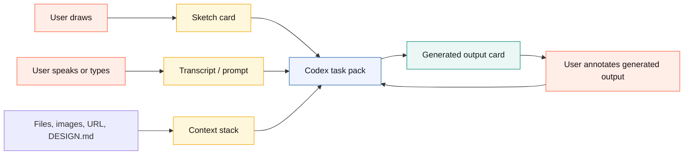

# Plan: Canvax Stitch-Like Workbench Redesign

**Generated**: 2026-05-15  
**Estimated Complexity**: High

## Overview

Canvax should move from "tool panel plus canvas plus technical preview" to a single Codex-first visual workbench.

The default experience should feel like:

```text
draw rough idea + speak intent + attach context
        -> Codex turns it into a real surface
        -> generated output appears beside the sketch
        -> user marks corrections directly on the workbench
        -> Codex refines the output
```

This is inspired by Google Stitch's AI-native canvas direction, but Canvax should not clone Stitch. The stronger Canvax position is Codex-native workspace awareness: sketches, voice/transcripts, generated files, previews, docs, and git changes all become one local collaboration state.

The current Advanced board is useful, but it is overwhelming as the default. Keep it as an inspector/debugging mode. Make the default mode a simpler `Workbench`.

## Product Decision

Canvax core must remain local-first and must not require an image-generation API key.

Image generation has three lanes:

- **Host lane**: Codex/ChatGPT can generate or edit images when the current host exposes that ability.
- **Prompt-pack lane**: Canvax always exports structured image/UI prompts without needing any paid API.
- **Optional adapter lane**: OpenAI API, Apps SDK, or other providers can be added later as opt-in bridges, not baseline requirements.

Official OpenAI docs currently confirm that `gpt-image-2` exists through the OpenAI Image API and through the Responses API image generation tool, but that path uses API authentication and cost. The Apps SDK path requires an MCP server and can optionally render a web component inside ChatGPT. Therefore, Canvax should design around host capability and prompt handoff first, with API adapters as optional.

Sources:

- OpenAI image generation guide: https://developers.openai.com/api/docs/guides/image-generation
- OpenAI Apps SDK quickstart: https://developers.openai.com/apps-sdk/quickstart
- OpenAI Apps SDK MCP server concepts: https://developers.openai.com/apps-sdk/concepts/mcp-server
- Google Stitch redesign reference: https://blog.google/innovation-and-ai/models-and-research/google-labs/stitch-ai-ui-design/

## Implementation Status

Current completed baseline:

- Workbench is the default simple mode.
- Generated output can appear beside the sketch as a compact correction/status card.
- Correction marks over generated output are saved into frame handoff data.
- Advanced mode remains the full inspector/debugging surface, but now shares the same dark dotted Canvax design language, tighter deck sizing, sticky command header, mode explanation, and deck labels so it reads as an advanced layer of the same product instead of a separate product. The sticky command deck now uses a more opaque surface so scrolled canvas content does not visually bleed through it.
- Workbench now has `Sketch`, `Split`, `Output`, and `Map` focus modes so generated surfaces can become a large correction target and the frame/variant graph can become a spatial project canvas instead of staying trapped in Advanced Flow view.
- Workbench `Map` now includes a spatial object layer: editable generated variant branches export through `spatialWorkspace.variantBranches`; labeled group regions, manual notes, reference files/images, asset candidates, generated preview targets, generated artifacts, changed files, and recent checkpoints become draggable object cards and export through `spatialWorkspace.objects`; group containment is exported through `spatialWorkspace.groups` and `groupIds`.
- Preview now has `Play flow` playback for connected frames, starting from the entry frame and stepping through outgoing transition labels, with generated clickable hotspots over the sketch/output viewport. Selected frame elements can also be linked to target frames, turning their actual drawn bounds into persistent Play-mode hotspots.
- Generated materialized outputs now open clean by default. Original sketch and free-note overlays are opt-in review aids instead of always-visible artifacts that can be mistaken for generated UI or eraser residue.
- The floating rail is now the primary bottom designer dock with brush `-` / `+`, undo/redo, Talk, Make, Image, and Apply.
- Workbench now has a bottom command composer for typed/pasted dictation, Talk, Note, Make, and Apply so the user can keep sketching without returning to the top tray.
- The rail size controls are context-sensitive: they resize selected elements in Select mode and change the brush/eraser size otherwise.
- The Workbench tray is reduced to brief/context/voice/output; duplicate tray tool chips are hidden in simple mode so the canvas and dock carry the interaction.
- The Workbench tray now uses a compact three-column command strip so the active canvas is visible in the first viewport instead of being pushed below the fold.
- Workbench quick-prompt chips add common refinement intent such as font, drama, mobile variant, spacing, and image candidates without opening Advanced mode.
- Action mode selection is available in Workbench and is exported into task/image prompt packs.
- Surface presets now include slide, book spread, storyboard, and comic page in addition to UI/poster/free-canvas presets, so the same loop can support product screens, decks, illustration planning, and sequential art.
- `DESIGN.md` is detected when present and included as project design context in handoffs.
- Advanced mode can create a starter `DESIGN.md` from board mood, palette, labels, frames, and generation direction without overwriting an existing file.
- A host capability registry tells the UI/export whether the current path is local no-API handoff, Codex browser, host image generation, or native microphone bridge.
- `canvax-task-pack-latest.*` is exported for Codex/spec/build work.
- `canvax-rewrite-request-latest.*` is exported for live output refinement from queued frames, voice notes, correction marks, and connected output manifests.
- Rewrite requests include a `revisionGraph` so Codex can map frame revisions to output targets, artifacts, changed files, stale state, and queue reasons before rewriting.
- `execute-rewrite-request` can consume the latest rewrite request into a refreshed frame-bound local artifact and Codex output manifest, giving the live-refinement loop a no-API smoke path. Workbench `Apply to Codex` now invokes this path automatically after checkpoint save.
- `canvax-image-prompt-pack-latest.*` is exported for host-side image generation and includes normalized coordinates plus an HTML/CSS placement scaffold.
- `canvax-asset-candidates-latest.*` is exported as a prompt-ready image/asset candidate format with source frame, bounds, prompts, and output slots.
- Pasted or dropped image outputs now become editable image elements on the frame, so generated candidates can be moved, resized, labeled, exported, and materialized without becoming a background-only underlay.
- Workbench now shows saved asset candidates as compact cards; each candidate can place an editable image slot on its source frame/region, attach a generated image file back to that slot, preview attached candidates, select the placed image, and accept one as the chosen output while preserving `assetCandidateId`. Accepted choices now export through `reviewSummary.acceptedCandidates`.
- Eraser strokes are isolated to the ink layer so they erase sketch marks without wiping the paper/grid layer, and they are excluded from materialized output geometry and image prompt composition.
- Static Canvax assets are served with no-store headers to prevent stale browser UI after local service updates.
- Self-test coverage includes tool rendering, drawing controls, select/move/resize, eraser layer behavior, Workbench dock brush sizing, Workbench spatial map rendering/export for frames, group regions, group containment, manual notes, asset candidates, generated targets, artifacts, and changed files, opt-in materialized review aids, flow links, selected-element prototype hotspots, task/rewrite/image prompt packs, asset candidate packs, materialize, output activity, rewrite queue, and large-session export consistency.

Still open:

- automatic host image generation remains open. Multi-candidate review now has local attached-image thumbnails, select, and accept state in the candidate tray.
- true infinite spatial canvas beyond the Workbench Map frame/variant/context/generated-output/checkpoint object layer, especially nested groups and richer object editing. Generated output objects are now reconciled, can be cleared from Map, and legacy stale cards are cleaned up to reduce materialized-output clutter, but full history lane editing remains open.
- direct `Build with Codex` route/code generation and binding. Initial build-request and output-contract writer is shipped, and the board now executes the local no-API path immediately for manifest binding plus an implementation starter bundle; Codex still has to execute the real implementation pass for production route/component files.
- deterministic `execute-build-request` path is shipped and reachable from the board for turning the latest build request into a frame-bound local HTML preview plus implementation files; full Codex route/component implementation remains the real target.
- deterministic `execute-rewrite-request` smoke path, board-side Apply execution, optional autosnap/freeze `Live rewrite`, and Preview `Rewrite handoff` lane are shipped for turning the latest rewrite request into a refreshed frame-bound local HTML artifact; a continuous autonomous Codex rewrite loop with real app edits remains the real target.
- native Codex microphone/image-generation host bridge

## Target UX

```text
+--------------------------------------------------------------------------------+
| project title                         viewport   play   export   advanced       |
+--------------------+---------------------------------------------+-------------+
| Codex brief         |                                             | tool dock   |
| - current ask       |         infinite / spatial workbench         | select      |
| - voice transcript  |                                             | pen         |
| - context files     |   +----------------+   +----------------+   | shape       |
| - active task       |   | rough sketch   |   | generated UI   |   | text        |
|                    |   | user editable  |   | Codex output   |   | image       |
| suggestions         |   +----------------+   +----------------+   | palette     |
+--------------------+---------------------------------------------+-------------+
| quick prompt: "make this hero more cinematic"   attach   mic/transcript   send |
+--------------------------------------------------------------------------------+
```

The main surface should show three things together:

- **Sketch card**: what the user drew.
- **Generated card**: what Codex/Canvax made real.
- **Instruction composer**: what the user says or types next.

Advanced details such as manifests, changed files, captures, rewrite queues, raw JSON, and transport state should be available, but not visually central.

## Design System Direction

Use a distinct Canvax visual language:

- **Base**: deep charcoal dotted workspace, not pure black.
- **Sketch material**: warm aged paper surfaces.
- **Codex output material**: precise glass/metal frame with subtle blue-gray structure.
- **Action accent**: Canvax red-orange for primary actions, mint only for sync/ready states.
- **Typography**: expressive editorial serif only for brand/title, high-quality sans/mono for controls.
- **Motion**: tactile button press feedback, soft card arrival, output refresh pulse, no noisy continuous animation.

Token sketch:

```text
primitive
  charcoal-950  #171412
  paper-100     #fff8ec
  rust-500      #f25a32
  mint-600      #0c8d7b
  blue-650      #2364aa

semantic
  surface-workspace = charcoal-950
  surface-sketch    = paper-100
  surface-output    = blue-gray glass
  action-primary    = rust-500
  status-ready      = mint-600

component
  dock-button
  sketch-card
  output-card
  transcript-card
  command-composer
```

## Desired Interaction Model



The user should not need to think about `exports/`, manifests, or API keys during normal use. The UI should present:

- `Make real`: turn sketch + instruction into a generated UI/spec/prompt pack.
- `Try variations`: generate alternative directions.
- `Apply correction`: send sketch-over-output notes to Codex.
- `Open Advanced`: inspect raw data when something breaks.

## Sprint 1: Product Shell Simplification

**Goal**: Make `Workbench` the default and reduce first-screen cognitive load.

**Demo/Validation**:

- Run `./canvax`.
- Open `http://localhost:3210` in Codex Browser / Atlas.
- The first view should look like one creative workbench, not a form-heavy admin panel.

### Task 1.1: Rename the Default Mode

- **Status**: Shipped. `Workbench` is the default user-facing mode and Advanced remains available.
- **Location**: `web/index.html`, `web/app.js`, `web/styles.css`, `docs/FEATURES.md`, `docs/USAGE.md`
- **Description**: Rename user-facing `Focus Pad` to `Workbench`. Keep the internal mode id `simple` if that reduces migration risk.
- **Complexity**: 2/10
- **Dependencies**: None
- **Acceptance Criteria**:
  - Default mode label reads `Workbench`.
  - Advanced mode remains available.
  - Existing local storage does not break.
- **Validation**:
  - `npm run check`
  - Browser smoke test: switch Workbench/Advanced twice.

### Task 1.2: Collapse Project Form Into a Brief Card

- **Status**: Shipped in the current Workbench tray. Further visual simplification remains a polish task.
- **Location**: `web/index.html`, `web/styles.css`
- **Description**: Replace the large default intro copy with a compact Codex brief card: current ask, latest transcript, selected surface, and one status line.
- **Complexity**: 4/10
- **Dependencies**: Task 1.1
- **Acceptance Criteria**:
  - Workbench top area uses less vertical space.
  - User can still edit the current ask and surface.
  - Transcript visibility remains available.
- **Validation**:
  - Manual layout check at 1440px, 1024px, 768px width.

### Task 1.3: Add a Bottom Command Composer

- **Status**: Shipped initial version. The bottom composer reuses the existing voice-note/task-pack pipeline and sits above the designer rail in Workbench.
- **Location**: `web/index.html`, `web/styles.css`, `web/app.js`
- **Description**: Add a bottom composer with manual dictation input, attach action placeholder, `Make real`, `Apply correction`, and `Preview`.
- **Complexity**: 5/10
- **Dependencies**: Task 1.2
- **Acceptance Criteria**:
  - The user can type/paste dictation without opening Advanced. **Done through the fixed Workbench command composer.**
  - Primary action is obvious. **Done with Talk, Note, Make, and Apply controls.**
  - Buttons retain tactile feedback. **Done with the same rail-style press/hover language.**
- **Validation**:
  - Add manual note with Cmd/Ctrl+Enter.
  - Make screen from Workbench.
  - Apply checkpoint from Workbench.

## Sprint 2: Spatial Sketch + Output Workbench

**Goal**: Show sketch and generated output together as workbench objects.

**Demo/Validation**:

- Draw a hero sketch.
- Press `Make real`.
- Generated output appears as a sibling card beside the sketch without requiring the user to open a separate preview tab.

### Task 2.1: Create Workbench Two-Up Surface

- **Status**: Shipped initial version. The current frame stays primary and generated output appears as a compact sibling Workbench output card. This is useful for status and correction marks, but it is not yet large enough to be the main design surface.
- **Location**: `web/index.html`, `web/styles.css`
- **Description**: In Workbench mode, render the current canvas as a `Sketch` card and reserve a `Generated output` card next to it.
- **Complexity**: 6/10
- **Dependencies**: Sprint 1
- **Acceptance Criteria**:
  - Sketch card keeps correct viewport scale.
  - Output card has empty, loading, ready, stale, and error states.
  - No clipping or overlap at common viewport sizes.
- **Validation**:
  - Browser visual smoke test on desktop and narrow viewport.

### Task 2.2: Mirror Preview Target Into the Output Card

- **Status**: Shipped initial version. The Workbench output card mirrors connected preview/materialized/generated targets.
- **Location**: `web/app.js`, `web/styles.css`
- **Description**: When a generated HTML artifact or local preview URL exists, embed it in the Workbench output card using the same preview-state manifest logic.
- **Complexity**: 7/10
- **Dependencies**: Task 2.1
- **Acceptance Criteria**:
  - Output card shows current generated artifact.
  - Same-URL revision refresh still works.
  - `Open Preview` remains as a larger compare surface.
- **Validation**:
  - Run `npm run demo:hero`.
  - Confirm output card refreshes after a second generation.

### Task 2.3: Add Sketch-Over-Output Correction Layer

- **Status**: Shipped initial version. Output correction marks are saved as frame-level annotations.
- **Location**: `web/app.js`, `web/styles.css`
- **Description**: Let the user draw annotation strokes over the output card without mutating the generated artifact. Save these as correction overlays linked to the active frame and output revision.
- **Complexity**: 8/10
- **Dependencies**: Task 2.2
- **Acceptance Criteria**:
  - User can mark "move this", "bigger", arrows, and labels over generated output.
  - Overlays export in live JSON/Markdown.
  - `Apply correction` includes overlay context.
- **Validation**:
  - Draw correction overlay.
  - Save checkpoint.
  - Inspect `exports/canvax-live-latest.json`.

### Task 2.4: Promote Output Into Focus And Split View

- **Status**: Shipped initial version. Workbench now has `Sketch`, `Split`, and `Output` focus modes; correction overlays work on the compact tray card and the large output stage.
- **Location**: `web/index.html`, `web/styles.css`, `web/app.js`
- **Description**: Keep the current small `Codex output` card as a thumbnail/status/correction target, but add a larger designer-first surface for real inspection and editing. The user should be able to switch between `Sketch focus`, `Output focus`, and `Split` without leaving Workbench.
- **Complexity**: 7/10
- **Dependencies**: Tasks 2.1-2.3
- **Acceptance Criteria**:
  - `Output focus` makes the generated surface the primary large stage.
  - `Split` shows sketch and output side by side with comparable usable sizes.
  - The small output card remains in the tray only as a compact status/quick-correction preview.
  - Correction marks work on both the compact card and the large output focus surface.
  - No overlap or clipping at 1440px, 1024px, 768px, and narrow Codex browser widths.
- **Validation**:
  - Generate or attach a preview target.
  - Toggle `Sketch`, `Split`, and `Output`.
  - Draw correction marks on the large output surface.
  - Run responsive screenshots/smoke checks.

## Sprint 3: Real Codex Task Pack

**Goal**: Make `Make real` create a clean Codex-readable work order.

**Demo/Validation**:

- Draw and dictate.
- Press `Make real`.
- Canvax writes a task pack that Codex can use to implement a real website/app/deck/image prompt without reading raw app internals.

### Task 3.1: Add `canvax-task-pack` Export

- **Status**: Shipped initial version with regression coverage for presence and no-API host-lane fields. Further schema cleanup remains open.
- **Location**: `web/app.js`, `scripts/canvax.mjs`, `docs/ARCHITECTURE.md`
- **Description**: Write a compact JSON and Markdown task pack containing sketch snapshot, geometry summary, labels, voice/transcript, surface type, output target, and requested action.
- **Complexity**: 6/10
- **Dependencies**: Sprint 2
- **Acceptance Criteria**:
  - `exports/canvax-task-pack-latest.json`
  - `exports/canvax-task-pack-latest.md`
  - Task pack is stable enough for Codex and other agents.
- **Validation**:
  - Regression check validates schema fields.

### Task 3.2: Add Action Modes

- **Status**: Shipped initial version. Workbench exposes the action chooser and exports the selected mode.
- **Location**: `web/index.html`, `web/app.js`, `docs/FEATURES.md`
- **Description**: Add explicit modes: `Build UI`, `Refine UI`, `Write spec`, `Make image prompt`, `Create variations`.
- **Complexity**: 4/10
- **Dependencies**: Task 3.1
- **Acceptance Criteria**:
  - The user chooses intent without opening Advanced.
  - Exports include `actionMode`.
  - No action implies paid API usage.
- **Validation**:
  - Create one task pack per action mode.

### Task 3.3: Add `DESIGN.md` Awareness

- **Status**: Shipped initial version. Canvax reads project `DESIGN.md`, includes it in handoffs, and can create a starter file from the current board without overwriting an existing one.
- **Location**: `web/app.js`, `scripts/canvax.mjs`, `docs/USAGE.md`
- **Description**: Allow project design rules to be imported/exported as `DESIGN.md`, then included in task packs.
- **Complexity**: 6/10
- **Dependencies**: Task 3.1
- **Acceptance Criteria**:
  - If `DESIGN.md` exists, Canvax surfaces it as project context.
  - Canvax can export a starter `DESIGN.md` from board mood, palette, labels, and generated output.
- **Validation**:
  - Write/read a sample `DESIGN.md`.
  - Verify prompt pack includes the design rules.

## Sprint 4: Optional Image And App Bridges

**Goal**: Support image workflows without making the baseline API-dependent.

**Demo/Validation**:

- In local-only mode, Canvax generates prompt packs and placement previews.
- If a host image tool exists in the current Codex/ChatGPT session, Codex can use the exported prompt pack to generate images.
- If an optional API adapter is explicitly configured later, Canvax can call it.

### Task 4.1: Add Image Prompt Pack Lane

- **Status**: Shipped initial version with prompt text, normalized coordinates, safe zones, HTML/CSS placement scaffold, prompt-ready asset candidate records, and manual paste/drop placement of generated image outputs as editable frame elements. A structured candidate picker/import UI remains open.
- **Location**: `web/app.js`, `scripts/canvax.mjs`, `docs/FEATURES.md`
- **Description**: Convert selected sketch regions, labels, references, and transcript into structured image prompts with negative prompts, aspect ratio, safe text zones, and style rules.
- **Complexity**: 6/10
- **Dependencies**: Sprint 3
- **Acceptance Criteria**:
  - Works without API key.
  - Exports prompt pack files.
  - Exports asset candidate files.
  - Pasted/dropped generated candidates become movable/resizable image elements.
  - Can target UI assets, posters, illustrations, book spreads, icons, and marketing images.
- **Validation**:
  - Generate prompt pack from a sketch with labeled asset regions.

### Task 4.2: Add Host Capability Registry

- **Status**: Shipped initial version. `/api/status` and `/api/preview-state` report local/Codex/image/mic capability boundaries without introducing an API-key field.
- **Location**: `web/app.js`, `scripts/canvax.mjs`, `docs/ARCHITECTURE.md`
- **Description**: Track whether the current host can provide Browser Use, image generation, ChatGPT App component embedding, or native transcript events.
- **Complexity**: 5/10
- **Dependencies**: Task 4.1
- **Acceptance Criteria**:
  - UI says `Prompt pack ready` when no host image tool is available.
  - UI says `Ask Codex to generate` when the current chat has image generation capability.
  - No OpenAI API key field appears in baseline UI.
- **Validation**:
  - Simulate host capabilities in self-test.

### Task 4.3: Plan ChatGPT Apps SDK / MCP Bridge

- **Status**: Open documentation task.
- **Location**: `docs/upstream-proposal.md`, new `docs/CHATGPT_APP_BRIDGE.md`
- **Description**: Document how Canvax could become a ChatGPT App: MCP server tools for `get_latest_frame`, `create_task_pack`, `attach_generated_asset`, and optional iframe UI.
- **Complexity**: 4/10
- **Dependencies**: Task 4.2
- **Acceptance Criteria**:
  - Clear boundary between Codex skill, Codex plugin, ChatGPT App, and local browser board.
  - No claim that a localhost page can directly control ChatGPT proprietary UI.
- **Validation**:
  - Docs review against official Apps SDK docs.

## Sprint 5: Infinite Canvas And Variations

**Goal**: Move from frame list to spatial project memory.

**Demo/Validation**:

- User can place a sketch, reference, generated output, and alternate direction on one zoomable workspace.

### Task 5.1: Promote Free Canvas Into Workbench Space

- **Status**: Expanded initial version shipped. Workbench now has a `Map` focus that exposes the frame/variant graph plus explicit editable variant branch exports, movable/resizable labeled group regions, manual notes, reference files/images, asset candidates, generated preview targets, generated artifacts, and changed files as spatial project objects exported through `spatialWorkspace`. The map supports background drag-pan, button zoom, cursor-centered pinch/ctrl-wheel zoom, and export-time group containment. This is not yet a true arbitrary-object infinite canvas with richer nested object editing.
- **Location**: `web/app.js`, `web/styles.css`
- **Description**: Add stable pan/zoom and spatial cards for sketches, outputs, references, text notes, and prompt packs.
- **Complexity**: 9/10
- **Dependencies**: Sprint 2
- **Acceptance Criteria**:
  - Trackpad pan/zoom feels stable on macOS. **Initial background drag-pan plus cursor-centered pinch/ctrl-wheel zoom shipped; advanced inertial/grouped canvas behavior remains open.**
  - Cards can be moved without breaking frame snapshots. **Done for frame/variant cards through shared Flow positions.**
  - Workbench state exports spatial positions. **Done through `spatialWorkspace.cards`, `spatialWorkspace.variantBranches`, `spatialWorkspace.objects`, and `spatialWorkspace.groups`.**
- **Validation**:
  - Large-session browser regression with many cards.
  - Board self-test verifies Workbench Map renders, zooms, and exports frames, group regions, group containment, manual notes, asset candidates, generated targets, artifacts, and changed-file spatial objects.

### Task 5.2: Add Variants Lane

- **Status**: Expanded initial local version shipped. Variant frames now render as branch cards with visible lineage, can be promoted to the primary branch, and export as explicit editable spatial branch records.
- **Location**: `web/app.js`, `web/index.html`
- **Description**: Let Canvax create multiple editable directions from one sketch and show them as connected Flow branches.
- **Complexity**: 7/10
- **Dependencies**: Task 5.1
- **Acceptance Criteria**:
  - Variants have labels, notes, and lineage. **Done for deterministic local branches and `spatialWorkspace.variantBranches`.**
  - User can choose one as primary. **Done with `Use variant`, which marks the selected variant as primary, makes it the entry frame, and renders it with primary branch styling.**
  - Chosen variant binds back to implementation/output manifest. **Possible through `Build with Codex` from the promoted variant; automatic route/component binding still depends on the Codex build pass.**
- **Validation**:
  - Generate three deterministic local variants. **Covered by board self-test, including visible branch cards, spatial branch export, and primary promotion export.**

## Sprint 6: Polish, Responsiveness, And Regression

**Goal**: Make the new Workbench resilient enough for daily use.

**Demo/Validation**:

- Long session with many frames, outputs, transcripts, and artifacts remains usable.

### Task 6.1: Responsive Fit Audit

- **Status**: In progress. Current pass improves Workbench dock/tray layout, button feedback, readable generated-output map cards, and Advanced sticky-deck opacity; broader Preview/device matrix remains open.
- **Location**: `web/styles.css`, `web/preview.css`
- **Description**: Fix overlap/clipping across Workbench, Preview, help, rails, artifact cards, and narrow windows.
- **Complexity**: 5/10
- **Dependencies**: Sprints 1-5
- **Acceptance Criteria**:
  - No clipped labels like `1 fram e`.
  - Artifact chips wrap cleanly.
  - Buttons remain tactile and readable.
  - Advanced sticky controls do not blur canvas content into the inspector header. **Initial opaque-header pass shipped.**
- **Validation**:
  - Browser screenshots at 1440, 1024, 768, 430 widths.

### Task 6.2: Browser Regression Matrix

- **Status**: Partially shipped through in-browser self-test and regression helpers. Reliable host-level browser automation still needs hardening.
- **Location**: `scripts/browser-regression.mjs`
- **Description**: Add deterministic tests for Workbench mode, generated output card, prompt pack export, and host capability states.
- **Complexity**: 6/10
- **Dependencies**: Sprint 6.1
- **Acceptance Criteria**:
  - Regression catches stale output cards and layout collapse.
  - Tests skip cleanly only when no live service exists.
- **Validation**:
  - `npm run regression`

## Testing Strategy

- **Syntax**: `npm run check`
- **Regression**: `npm run regression`
- **Browser**: Codex Browser / Atlas should open `http://localhost:3210`
- **Manual smoke**:
  - draw hero sketch
  - dictate/paste instruction
  - make real
  - annotate output
  - apply correction
  - verify exports and checkpoint
- **Responsive smoke**:
  - 1440px desktop
  - 1024px laptop
  - 768px tablet
  - 430px mobile/narrow inspector

## Potential Risks And Gotchas

- **Risk**: Workbench becomes another cluttered mode.
  - **Mitigation**: default UI must expose only sketch, instruction, output, and primary actions.
- **Risk**: Users expect one-click perfect production apps.
  - **Mitigation**: label actions honestly: local preview, Codex task pack, generated output, real code binding.
- **Risk**: API key confusion returns.
  - **Mitigation**: no API key field in baseline UI; optional adapter docs only.
- **Risk**: Embedded output iframe creates stale-state confusion.
  - **Mitigation**: show output revision, source path, and stale badge directly on the output card.
- **Risk**: Infinite canvas breaks frame/export model.
  - **Mitigation**: spatial cards should reference frames rather than replacing frame data immediately.
- **Risk**: Direct Codex microphone reuse is not available from a local page.
  - **Mitigation**: keep transcript bridge and browser speech/manual note; native microphone bridge belongs to a first-party Codex/App integration.

## Rollback Plan

- Keep Advanced mode unchanged while Workbench evolves.
- Keep existing `simple` mode storage key and behavior until Workbench is proven.
- Gate new Workbench output-card features behind CSS/classes and capability checks.
- If iframe mirroring causes instability, fall back to the existing Preview tab.
- If task-pack schema causes compatibility issues, keep existing live export files as canonical fallback.

## Immediate Next Build

The Workbench baseline has moved past the first Stitch-like shell and now has large output focus/split modes. The next implementation should be:

```text
Build with Codex action + frame-to-code manifest contract
```

That means:

- create a Codex-readable task artifact for the active frame/checkpoint **done as `exports/canvax-build-real-latest.*` and `artifacts/canvax/build-requests/`**
- let Codex write actual app/page/component files from the frame
- bind the generated route/component back to the frame in the output manifest **contract exists; Codex execution still needed**
- keep Preview and the Workbench output stage synced to that generated route

After that is stable, continue into generated image candidates and true spatial/infinite canvas work. Do not add an API-key requirement. Canvax should keep exporting prompt packs and task packs locally, then let Codex/ChatGPT host capabilities use them when available.
