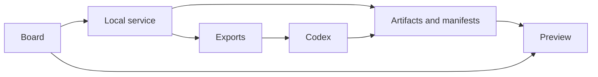
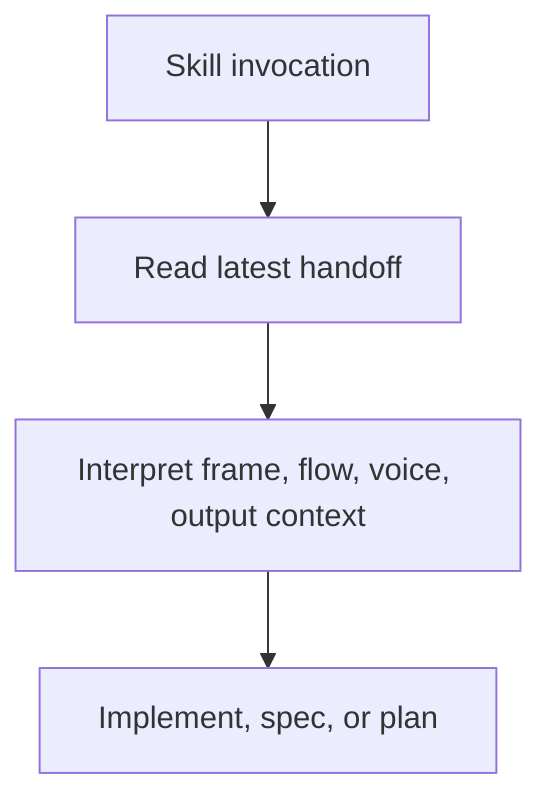
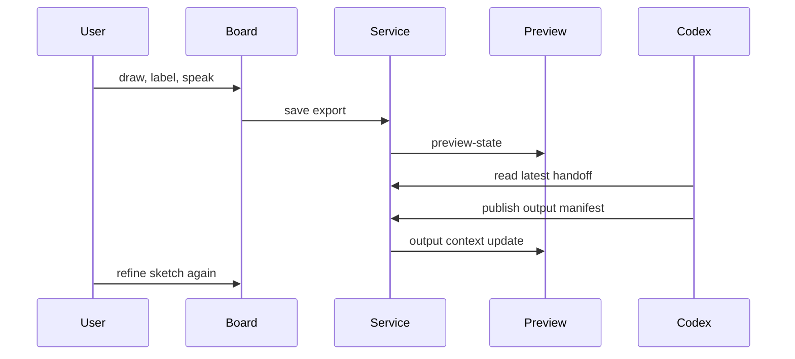
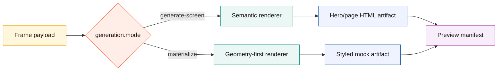
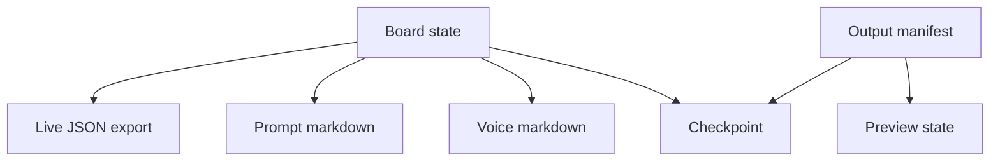

# Canvax Architecture

## Architecture Snapshot

```text
               +-------------------+
               | Codex skill       |
               | /canvax, $canvax  |
               +---------+---------+
                         |
                         v
 +-------------------+   file handoff    +----------------------+
 | Browser board     | ----------------> | exports/             |
 | web/index.html    |                   | checkpoints          |
 | web/app.js        | <---------------- | preview manifest     |
 +---------+---------+   preview-state   +----------+-----------+
           |                                           |
           v                                           v
 +-------------------+                         +------------------+
 | Preview           | <---------------------- | Local service    |
 | web/preview.*     |   APIs and artifacts    | scripts/canvax   |
 +-------------------+                         +------------------+
```



## Purpose

Canvax is a local sketch-to-Codex handoff system.

The system has three parts:

- a browser board for drawing and annotating
- a local Node service that persists exports and serves the app
- a Codex skill that tells Codex how to attach to the live canvas

## High-Level Structure

### Browser UI

Files:

- `web/index.html`
- `web/styles.css`
- `web/app.js`

Responsibilities:

- render the drawing board
- manage frame state, flow state, and tool state
- autosnap and manual freeze captures
- write the latest live export to the local service

ASCII shape:

```text
web/index.html + web/styles.css + web/app.js
    |
    +--> tools and drawing
    +--> editable image assets
    +--> frame and flow state
    +--> Workbench spatial map state
    +--> voice notes
    +--> live export payloads
    +--> task/image prompt packs
```

### Local Service

Files:

- `canvax`
- `scripts/canvax.mjs`

Responsibilities:

- start or reuse a single Canvax service
- serve the browser app on `http://localhost:3210` by default
- persist live exports under `exports/`
- install the local Codex skill through the service endpoint

ASCII shape:

```text
scripts/canvax.mjs
    |
    +--> serve board and Preview
    +--> save exports
    +--> merge preview-state
    +--> write checkpoints
    +--> materialize frames
```

### Codex Skill

Files:

- `codex-skill/canvax/SKILL.md`

Responsibilities:

- define how Codex should interpret the live canvas
- attach a chat thread to the latest export
- default Codex to the current Canvax handoff without asking the user to repeat file paths



## Runtime Flow

1. `./canvax` starts or reuses the local service.
2. `/canvax` or `$canvax` opens the board from that local service inside Codex Browser Use / Atlas at `http://localhost:3210`.
3. The user draws, annotates, or links frames.
4. Canvax autosnaps after idle or stores a manual freeze.
5. `web/app.js` sends the latest export package to `/api/save-export`.
6. `scripts/canvax.mjs` writes the JSON and Markdown exports under `exports/`.
7. The board also refreshes the Codex output manifest with current workspace changes during live export sync.
8. Codex uses the skill to read the latest export and continue from the sketch.
9. Preview-state polling also overlays a transient live workspace-follow manifest from current git status so board and Preview can keep tracking file changes between explicit publish steps.
10. When Codex changes files itself, it should publish those changes back into Canvax with `node scripts/write-codex-output.mjs --from-git-status` when it wants a durable manifest update with richer metadata.
11. The service now also computes a stable output digest from targets, artifacts, changes, and workspace-follow metadata so clients can detect meaningful output-context changes without treating every poll as a rewrite.
12. Recent checkpoint/session events are also fed back through preview-state so clients can rebuild durable output activity after a refresh instead of relying only on in-memory polling state.
13. When a frame is materialized again, the service computes a refinement delta, writes it into the materialize metadata, and exposes it through the preview manifest so Preview can show changed-region overlays.
14. The board can now send a richer generation recipe into that same endpoint, which lets the local service produce a `generated-screen-preview` target instead of only the quicker materialized preview.
15. The service exposes host capabilities and optional root `DESIGN.md` context through status and preview-state, so the board can describe what the current Codex/browser host can and cannot do.
16. Codex Browser Use / Atlas is the preferred inspection surface for the board, Preview, and generated app routes while Codex edits and validates workspace files.



## Transport Layers

Canvax now treats transport as an explicit contract instead of an accidental side effect of local files.

### 1. Live session mirror transport

Current mechanism:

- browser `localStorage`
- browser `BroadcastChannel`
- live Preview polling

Purpose:

- keep the board and Preview aligned immediately inside one local browser session
- avoid waiting for file writes just to update the Preview surface

### 2. Durable handoff transport

Current mechanism:

- `exports/canvax-live-latest.json`
- `exports/canvax-live-latest.md`
- `exports/canvax-voice-latest.md`
- `exports/canvax-task-pack-latest.json`
- `exports/canvax-task-pack-latest.md`
- `exports/canvax-image-prompt-pack-latest.json`
- `exports/canvax-image-prompt-pack-latest.md`
- `exports/canvax-checkpoint-latest.json`

Purpose:

- give Codex a stable, path-based handoff surface
- preserve collaboration moments outside volatile browser memory
- include `spatialWorkspace` so Codex can read frame/variant map positions, active/entry frames, and links as project memory
- include `spatialWorkspace.variantBranches` so Codex can separate editable generated variant branches from normal navigation/prototype links
- include `spatialWorkspace.lanes` so checkpoint history can be read as a named spatial timeline instead of only a flat session list

### 3. Output binding transport

Current mechanism:

- `exports/canvax-preview-manifest.json`
- `artifacts/canvax/codex-output.json`
- transient git-status workspace follow merged into `/api/preview-state`

Purpose:

- attach implementation previews, generated artifacts, changed files, and rewrite state back to the sketch workflow

### 4. Future richer-client transport

Planned mechanism:

- App Server style JSON-RPC transport
- thread-bound event/state transport instead of file-path handoff

Purpose:

- replace the local companion split with a true same-thread Codex client later

### 5. Host capability and design-context transport

Current mechanism:

- `/api/status`
- `/api/preview-state`
- optional project-root `DESIGN.md`

Purpose:

- tell the board whether it is running as a local no-API handoff, inside Codex Browser Use / Atlas, or a future richer host
- avoid implying direct ChatGPT image-generation or Codex microphone access when the local page does not have that bridge
- include reusable design rules in task/image prompt packs without manually pasting them into every sketch
- write a starter `DESIGN.md` from board state through `/api/write-design-context` without overwriting an existing design contract

```text
project DESIGN.md
      |
      v
local service status/preview-state
      |
      v
board exports -> task pack + image prompt pack + Codex prompt
```

## Current Transport Contract

The runtime now emits a `transport` object through:

- `/api/status`
- `/api/preview-state`
- live preview payloads
- saved exports
- checkpoints
- materialize payloads

That contract declares:

- current mode: `local-companion`
- durable handoff: file export paths
- output binding: manifest-based transport
- live mirror: browser storage/channel transport
- host task packs: local files for Codex/image-generation handoff without API calls
- future mode: `app-server`

The service also emits:

- `hostCapabilities`: current browser/workspace/image/mic capability truth table
- `designContext`: root `DESIGN.md` metadata and truncated content when present

The service can write:

- `DESIGN.md`: starter design direction generated from board mood, palette, frame notes, labels, and generation direction

This is the main guardrail against accidentally hardcoding the current local-companion implementation as if it were the only possible runtime.

## Current File Map

```text
Canvax/
|- canvax
|- web/
|  |- assets/canvax-logo.svg
|  |- index.html
|  |- styles.css
|  |- app.js
|  |- preview.html
|  |- preview.css
|  `- preview.js
|- scripts/
|  |- canvax.mjs
|  |- install-canvax-skill.mjs
|  |- write-preview-manifest.mjs
|  |- write-codex-output.mjs
|  |- regression-check.mjs
|  `- browser-regression.mjs
|- codex-skill/canvax/
|- docs/
|  |- assets/canvax-logo.svg
|  `- BRANDING.md
|- exports/
`- artifacts/
```

### Entry points

- `canvax`: shell launcher for the Node service
- `scripts/canvax.mjs`: main service runtime

### Generation engine

`scripts/canvax.mjs` owns both local generation paths:

- `Materialize`: a geometry-preserving styled preview
- `Generate screen`: a semantic renderer path for richer screen output from both box wireframes and stroke-first sketches
- `Build with Codex`: a real-code handoff path that writes a build request and output contract for Codex to execute, then runs the local no-API executor so Workbench/Preview get an immediate frame-bound preview plus implementation starter bundle
- `scripts/execute-build-request.mjs`: a deterministic local executor that turns the latest build request into a frame-bound preview artifact, `implementation/` bundle, `canvax-component-map.json` ownership map, and published `artifacts/canvax/codex-output.json`
- `scripts/execute-rewrite-request.mjs`: a deterministic local smoke executor that turns the latest rewrite request into a refreshed frame-bound preview artifact, maps correction regions to generated component selectors when a frame-to-code map is attached, and publishes `artifacts/canvax/codex-output.json`
- Workbench `Apply to Codex`: saves the checkpoint and calls `/api/execute-rewrite-request` so the deterministic rewrite artifact can refresh the attached output without a terminal command

```text
same endpoint
  /api/materialize-frame
      |
      +-- mode: materialize
      |       `-> geometry-first styled artifact
      `-- mode: generate-screen
              `-> semantic screen renderer
                  reads boxes, loose strokes, arrows, ovals,
                  image slots, labels, notes, and voice

separate endpoint
  /api/save-build-request         -> Codex-readable real implementation request
  /api/execute-build-request      -> local no-API build preview, implementation bundle, and output manifest binding
  /api/execute-rewrite-request    -> local no-API rewrite preview and output manifest binding

rewrite request executor
  exports/canvax-rewrite-request-latest.json
      |
      `-> artifacts/preview/codex-rewrite/frames/<frame-id>/
```



### Browser app

- `web/index.html`: layout and app shell
- `web/styles.css`: board UI styling
- `web/app.js`: state, rendering, interactions, export generation

### Codex integration

- `codex-skill/canvax/SKILL.md`: skill instructions
- `scripts/install-canvax-skill.mjs`: symlink installer for `~/.codex/skills/canvax`

### Docs

- `README.md`: public project overview
- `docs/INSTALL.md`: installation and setup
- `docs/USAGE.md`: operator-facing usage guide
- `canvax-live-collaboration-plan.md`: roadmap and future collaboration design

## State Model

The browser app keeps the working session in local browser storage and in memory.

Workspace mode is part of the state model:

```text
workspaceMode: simple
  -> Workbench UI
  -> active frame only
  -> compact command strip
  -> action mode
  -> host capability/design context chips
  -> sketch + voice + generated-output correction marks + Apply checkpoint

workspaceMode: advanced
  -> full board UI
  -> frames, flow, captures, manifests, diagnostics
```

Core state areas include:

- board metadata
- frames
- per-frame elements
- per-frame captures
- flow connections
- active frame and view mode
- workspace mode
- Workbench action mode
- tool selection, color, size, grid, autosnap
- current host capabilities
- current design context

`web/app.js` is currently the main state owner.

Browser storage uses `version` for persistence migrations. Live exports, checkpoints, voice payloads, and live preview payloads now also carry explicit `schemaVersion` metadata so saved handoff files can evolve independently from the browser-storage format.

```text
browser state
   |
   +--> board metadata
   +--> frames and elements
   +--> flow links
   +--> captures
   +--> voice notes
   +--> output activity
   +--> rewrite queue
```

## Export Model

Primary outputs:

- `exports/canvax-live-latest.json`
- `exports/canvax-live-latest.md`

The JSON export currently contains:

- schema metadata
- board metadata
- frame metadata
- capture counts
- saved snapshot paths
- flow connections
- generated prompt text
- task pack, rewrite request, and image prompt pack summaries

The dedicated task, rewrite, and image prompt pack files are narrower than the full live export:

- `canvax-task-pack-latest.*` is for Codex build/spec/app work.
- `canvax-rewrite-request-latest.*` is for live refinement of queued frames, stale outputs, voice notes, correction marks, and frame-bound output targets.
- `canvax-image-prompt-pack-latest.*` is for host-side image generation and includes normalized coordinates plus an HTML/CSS placement scaffold.

```text
full live export
  |
  +--> task pack: build/spec/action summary
  |
  +--> rewrite request: queued output refinement
  |
  `--> image prompt pack: prompt + coordinates + scaffold
```

The Markdown export contains the readable handoff prompt for Codex.



## Key Interaction Areas In Code

### Drawing and selection

Look in `web/app.js` for:

- pointer handlers
- tool definitions
- selection and grouping helpers
- label creation and attachment logic
- image-element placement through paste/drop

Pasted or dropped images become `type: "image"` elements with `start`, `end`, `imageDataUrl`, `sourceName`, and optional `assetCandidateId`. They use the same selection, movement, resizing, duplication, layering, export, and materialize paths as other bounded elements.

Asset candidates also become `type: "image"` elements when the user chooses `Place slot` or `Attach image` in the Workbench candidate tray. Empty slots have no `imageDataUrl` yet, but they still preserve `assetCandidateId`, bounds, source name, placement contract, and output-slot status so generated assets can be traced back to their prompt record and exact frame coordinates.

### Flow view

Look in `web/app.js` for:

- flow board rendering
- connection creation
- entry frame handling
- auto layout logic

### Workbench spatial map

The Workbench `Map` focus uses the same Flow graph data instead of creating a second spatial model.

```text
frame.flowPosition
  -> Flow view cards
  -> Workbench Map cards
  -> live export spatialWorkspace.cards

asset candidate pack
  -> state.spatialObjects
  -> Workbench Map object cards
  -> live export spatialWorkspace.objects

preview / Codex output manifest
  -> targets, artifacts, changes
  -> state.spatialObjects
  -> Workbench Map implementation object cards
  -> deduped latest frame-bound generated output cards
  -> live export spatialWorkspace.objects

checkpoint history
  -> state.spatialObjects checkpoint cards
  -> Workbench Map history lane
  -> live export spatialWorkspace.lanes

manual Map controls
  -> labeled group regions, note cards, and reference file/image cards
  -> state.spatialObjects
  -> state.spatialObjects order for front/back layer order
  -> selection-created group regions from selected object bounds
  -> single-object Title/Note/Status editor with manual override metadata
  -> per-type read-only inspector rows for paths, placement, checkpoints, groups, and variants
  -> state.selectedSpatialObjectId for the currently pointed-at Map object
  -> Workbench Map context object cards
  -> live export spatialWorkspace.objects
  -> live export spatialWorkspace.selectedObjectId
  -> live export spatialWorkspace.groups with member card/object ids
```

The persisted `flowZoom` controls the spatial map zoom. Pointer math divides map coordinates by that zoom before dragging cards, moving/resizing spatial objects, panning the background, lasso-selecting spatial objects, or drawing connection drafts, so saved positions and sizes remain stable regardless of the current zoom level. Pinch / `Ctrl` / `Cmd` wheel zoom is cursor-centered by adjusting the scroll offset after each zoom step. The persisted `mapObjectFilter` controls which non-group spatial object classes are visible in the current Map focus: all, output, assets, notes, or history. Filtering is non-destructive; all objects remain in `spatialWorkspace.objects`, while `spatialWorkspace.objectFilter` records the active focus and visible object ids for Codex. Objects with `meta.pinned` stay visible across focus filters and collapsed lanes, and each exported spatial object includes `pinned`. Generated preview/file/code-change objects carry `meta.laneId = output-lane` and render/export inside a collapsible `Output shelf` lane so manifest objects are visually grouped as implementation outputs rather than being mistaken for extra frames. Selected spatial objects are edited through the same model: Shift-click builds a multi-selection, Shift-dragging empty Map space draws a lasso selection rectangle, dragging one selected spatial object moves the selected set, the combined transform box scales the selected set from corner handles, arrow keys nudge the saved `x/y`, `Shift` increases the nudge step, `Cmd/Ctrl+G` creates a `map-group` region around the selected object bounds, `Shift+Cmd/Ctrl+G` removes selected group regions while keeping their contents, group buttons can select contained Map objects or fit group bounds around current contents, `Cmd/Ctrl+D` creates offset manual copies, `Cmd/Ctrl+[` and `Cmd/Ctrl+]` reorder the selected objects within their Map layer, and `Delete`/`Backspace` removes the selected object set. A single selected object exposes Title, Note, and Status fields plus read-only type details; editable values set `meta.manualFields` so generated, asset, and checkpoint objects keep designer overrides when they resync from manifests or checkpoint history, while `meta.pinned` is preserved across generated/checkpoint resyncs. Layer order is stored by `state.spatialObjects` ordering and exported as `layerIndex` / `layerLabel` on each `spatialWorkspace.objects[]` record, so Codex can distinguish "this correction card sits above that generated output" without relying on DOM order. Grouping is still geometry-based: a group region contains cards/objects whose centers fall inside its bounds, and a selection-created group records `meta.groupedObjectIds` as provenance for Codex. `Select contents` computes member spatial objects from the same geometry, while `Fit group` unions contained frame-card and spatial-object bounds with padding. Group-aware transforms avoid double-moving an object when both a group region and a contained child object are selected. The selected-object action strip also builds a local Markdown context block from object metadata, prompt text, target paths, position, size, pinned state, and layer state for Codex or image-generation handoff without calling an API. The same context is exported as `spatialWorkspace.selectedObject.contextMarkdown`, `spatialWorkspace.selectedObjects[].contextMarkdown`, and each `spatialWorkspace.objects[].contextMarkdown`. When a selected object is a group region, duplication also clones contained spatial objects into the offset group copy; frame cards remain references and are not duplicated.

When the selected object is a group region, the context builder also computes a lightweight group inspector from the current map geometry. It lists contained frames, nested groups, and contained spatial objects in the selected group's `contextMarkdown`, so Codex can understand exploration boards without inferring membership only from raw coordinates.

Group containment is computed at export time from each group region's bounds and the center point of cards/objects. The live export adds:

- `spatialWorkspace.groups[].memberCardIds`
- `spatialWorkspace.groups[].memberObjectIds`
- `spatialWorkspace.groups[].memberGroupIds`
- `spatialWorkspace.cards[].groupIds`
- `spatialWorkspace.objects[].groupIds`

Spatial lanes are derived at export/render time from object classes. The `Output shelf` lane groups generated preview targets, output files, and changed-file cards from the output manifest. The rendered lane includes an inline legend that maps those classes to designer-facing language: `Output preview`, `Output file`, and `Code update`. Output preview objects can be promoted into an editable `Output edit` frame: Canvax clones the source frame into a normal variant frame, adds an `output edit` flow connection, writes the generated target path into frame notes/assets, annotates the matching `variant-branch` Map object with `meta.outputObjectId`, `meta.outputTarget`, and `meta.outputHref`, and exports the same binding as `spatialWorkspace.variantBranches[].outputBinding`. The checkpoint history lane groups recent checkpoint objects. Lanes are visual and semantic groupings, not destructive containers: lane members can still be selected, moved, copied as context, or grouped with other Map objects. Collapsing the output or history lane hides those lane cards from the Map surface without deleting them, while pinned objects remain visible. `spatialWorkspace.lanes[]` records each lane plus its `collapsed` state so Codex can distinguish compressed output/history from missing output/history.

Selected frame elements can also carry `element.prototype` metadata. That metadata is exported through frame composition, and Preview Play converts the selected element bounds into clickable prototype hotspots.

### Export and persistence

Look in:

- `web/app.js` for export package creation
- `scripts/canvax.mjs` for file writing and service endpoints
- `scripts/write-codex-output.mjs` for Codex-side output publishing from git status or explicit artifacts

Real-code handoff files:

- `exports/canvax-build-real-latest.json`
- `exports/canvax-build-real-latest.md`
- `artifacts/canvax/build-requests/...`

Variant branches are stored as normal frames with `frame.variant` lineage metadata. They remain editable and are connected to their source frame in the same Flow graph as ordinary screen transitions.

The spatial export also derives `spatialWorkspace.variantBranches` from those frames and connections:

```text
frame.variant + source connection
  -> spatialWorkspace.variantBranches[]
  -> editable branch metadata for Codex
```

Each branch record includes source frame, variant frame, direction, connection id/label, editable status, position, size, matching `variant-branch` Map object id, and primary-promotion state. The matching Map object is also exported through `spatialWorkspace.objects` so Codex can treat a generated direction like any other selectable spatial object.

Image/asset handoff files:

- `exports/canvax-image-prompt-pack-latest.json`
- `exports/canvax-asset-candidates-latest.json`
- `artifacts/canvax/asset-candidates/...`

Asset candidates are prompt-ready records with a `placementMap` and empty output slots. The placement map includes normalized bounds, source-viewport pixel bounds, CSS placement, a `data-asset-candidate-id` target selector, and a minimal HTML scaffold. The Workbench candidate tray lets users place those records as editable frame slots or attach generated images back to those slots. Canvax still does not generate the image itself unless a future host bridge provides that capability.

```text
asset candidate pack
  -> candidate.placementMap
  -> candidate.outputSlots[]
  -> Workbench asset tray
  -> Map asset object contextMarkdown
  -> Codex / host image tool can preserve placement
```

## Current Design Boundary

Today, Canvax is a local browser companion for Codex. When Browser Use / Atlas is available, that local browser surface should be the Codex in-app browser. `./canvax --open-external`, `./canvax --open`, and `./canvax --chrome` are explicit escape hatches for users who want an external browser.

It is not yet:

- a native embedded canvas inside the Codex composer
- a finished live preview/artifact feedback loop
- a finished multimodal sketch + voice collaboration surface

Those are intentional future layers, not hidden shipped features.

## Migration Path To A Richer Codex Client

The clean migration path is:

1. keep the board semantics, export schema, manifest schema, and rewrite queue logic
2. replace file-path transport with thread/artifact/event transport
3. replace Browser Use/local Preview wiring with a richer Codex client surface
4. preserve `Materialize`, checkpoints, and output binding semantics across the transport swap

That is why the transport object exists now: the repo can describe what is transport-specific versus what is core Canvax behavior.

## Safe Extension Points

```text
safe places to extend
  1. web/app.js tool and export logic
  2. web/preview.js compare and display logic
  3. scripts/canvax.mjs service endpoints
  4. manifest helper CLIs
  5. skill/docs interpretation layer
```

If you want to extend the project, the clean places to start are:

- new tools and interaction behavior in `web/app.js`
- layout and visual treatment in `web/styles.css`
- new endpoints or export files in `scripts/canvax.mjs`
- new Codex workflow guidance in `codex-skill/canvax/SKILL.md`

## Change Risk Areas

The highest-risk files are:

- `web/app.js` because it currently owns most state and interaction logic
- `scripts/canvax.mjs` because it controls service lifecycle and export persistence

Changes in these files should be validated carefully with `npm run check` and a manual browser smoke test.
