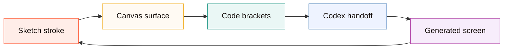

# Canvax Brand

Canvax now has an original mark for the local Codex canvas companion.


## Identity Rule

The logo is intentionally **not** the ChatGPT, OpenAI, or Codex logo.

It uses a new Canvax mark built from shared workflow ideas:

- browser window: Canvax runs as a local visual surface
- pen stroke: the user sketches intent directly
- code brackets: Codex turns the sketch into implementation work
- central C: Canvax is the bridge between canvas and Codex

```text
Canvax mark

  +-----------------------------+
  | browser chrome              |
  |                             |
  |   <      C + stroke      >  |
  |          canvas -> code     |
  +-----------------------------+
```

## Brand Flow



## Assets

```text
web/assets/canvax-logo.svg   -> app and Preview UI
docs/assets/canvax-logo.svg  -> documentation rendering
```

Use the SVG directly when possible. If a raster icon is needed later, export from the SVG rather than redrawing it.
