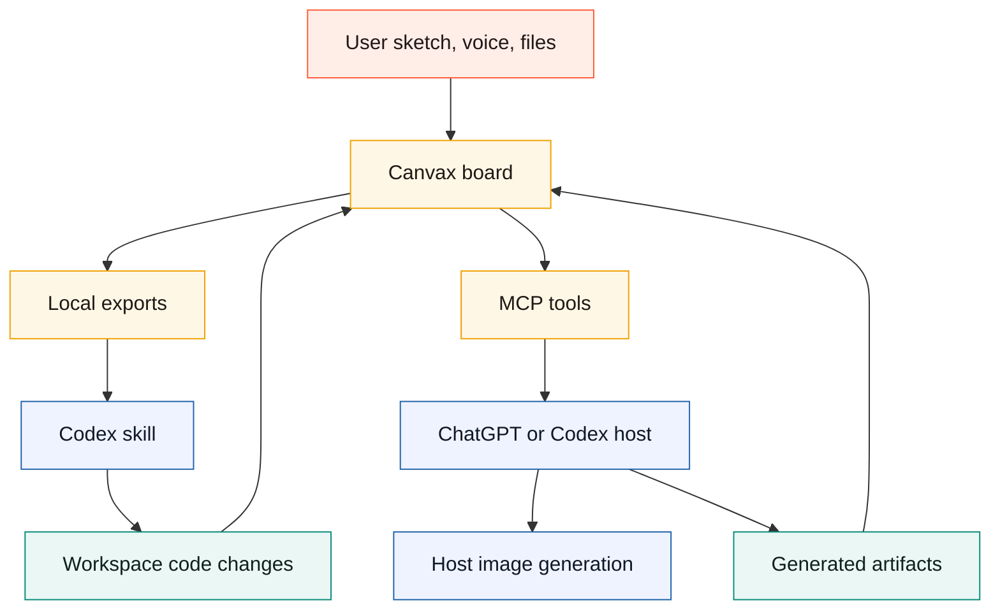

# ChatGPT App And Codex Bridge

This document defines the future bridge from the current local Canvax companion to richer ChatGPT/Codex-hosted surfaces.

The important rule stays the same:

```text
Canvax core workflow must not require an OpenAI API key.
```

The current repo already works as a local Codex companion through:

- `./canvax` local service
- Codex Browser / Atlas at `http://localhost:3210`
- `/canvax` or `$canvax` skill handoff
- files under `exports/` and `artifacts/`

The bridge described here is the next host-integration path, not a replacement for the local workflow.

## Why This Bridge Exists

Canvax wants the Stitch-like interaction loop, but closer to Codex:

```text
draw + speak + attach references
        -> Codex reads exact sketch/voice/context state
        -> generated UI, app route, image prompt, or artifact appears
        -> user marks corrections on the same design surface
        -> Codex applies the next rewrite
```

The local board can already export the state. A ChatGPT App or richer Codex client would make that state callable as tools and renderable as a first-party component.

## Current Boundary

Canvax cannot directly control private ChatGPT or Codex UI from a localhost page.

Current possible paths:

- Codex can open Canvax in the in-app browser and inspect it visually.
- Codex can read `exports/canvax-live-latest.json`, task packs, image prompt packs, image host tasks, checkpoints, and output manifests.
- Codex can forward submitted chat transcript text into Canvax with `./canvax --transcript`.
- Canvax can prepare prompts, placement maps, image slots, and style locks for a host image tool.

Current unavailable paths:

- a localhost page cannot directly reuse the Codex chat microphone stream
- a localhost page cannot directly invoke ChatGPT Images without a host bridge
- a localhost page cannot silently control a user's ChatGPT app/browser session

## Integration Layers

```text
L0: Local companion
    Canvax service + browser board + file exports

L1: Codex skill
    /canvax tells Codex which local files and URLs to read

L2: Codex Browser / Atlas
    Board, Preview, and generated artifacts stay inside Codex visual inspection

L3: MCP/App bridge
    ChatGPT/Codex host calls Canvax tools and can render a Canvax component

L4: Native client surface
    first-party canvas, microphone, image generation, and artifacts share one session
```



## Proposed MCP Tools

These tools should be thin wrappers over the files and APIs Canvax already has.

Local status: `npm run mcp` now exposes a read-only stdio MCP server over the
existing inspection bridge. The shipped tools are `get_canvax_summary`,
`get_current_frame`, `get_spatial_workspace`, `get_design_kit`,
`get_output_binding`, and `get_canvax_all`. The tools below remain the future
write/host-capability layer for task creation and generated asset attachment.

### `get_latest_frame`

Purpose: return the active frame, latest sketch snapshot, voice notes, labels, surface preset, and generated-output binding.

Inputs:

- optional `frameId`
- optional `includeImageData`
- optional `includeSpatialContext`

Outputs:

- frame metadata
- normalized elements and image slots
- snapshot path or host-safe image payload
- voice/transcript summary
- current output target, if any

### `create_task_pack`

Purpose: return the same no-API task pack that Codex already reads from `exports/canvax-task-pack-latest.json`.

Inputs:

- action mode: `build-ui`, `refine-ui`, `write-spec`, `image-prompt`, `variations`
- optional selected object ids
- optional prompt override

Outputs:

- compact JSON task
- Markdown handoff
- source file paths
- checkpoint id

### `create_image_prompt_pack`

Purpose: prepare an image-generation handoff without calling a paid API from Canvax.

Inputs:

- frame id
- candidate region ids
- target medium: `book-spread`, `comic-page`, `poster`, `ui-asset`, `character`, `background`, `icon`
- style-lock preference

Outputs:

- prompt text
- negative prompt
- normalized placement map
- safe text zones
- continuity/style lock
- output slot ids

### `attach_generated_asset`

Purpose: let a host image tool or user attach a generated asset back to the board.

Inputs:

- `assetCandidateId`
- generated image path or host file reference
- optional chosen/accepted state

Outputs:

- updated frame image element
- updated asset candidate review state
- latest export paths

### `publish_codex_output`

Purpose: bind a Codex-generated route, HTML artifact, spec, or changed file back into Canvax.

Inputs:

- preview URL or workspace path
- artifact paths
- changed files
- frame ids
- component map path, if available

Outputs:

- updated `artifacts/canvax/codex-output.json`
- preview manifest summary
- frame output status

### `append_transcript`

Purpose: receive host transcript text from a native Codex/ChatGPT client.

Inputs:

- transcript text
- scope: `frame` or `session`
- source label
- optional frame id

Outputs:

- updated voice note entry
- latest voice Markdown path
- checkpoint path

## Host Image Generation Boundary

Canvax should not add a baseline `OPENAI_API_KEY` field.

Instead:

```text
Canvax prepares:
  sketch snapshot
  prompt pack
  placement map
  safe zones
  style lock
  output slot ids
  image host task

Host provides, when available:
  image generation
  image editing
  generated file reference

Canvax receives:
  generated asset
  chosen candidate state
  exact placement on the frame
```

This lets ChatGPT Images, a future Codex host image tool, or an optional API adapter use the same Canvax payload without making API usage mandatory.

## First-Party Client Requirements

For Canvax to become truly native inside Codex or ChatGPT, the host would need:

- a thread-bound canvas component
- live sketch snapshot access
- host transcript events from the chat microphone
- host image-generation result attachment
- artifact preview embedding
- frame/output manifest binding
- workspace file write notifications
- per-thread persistence for frames, flow, checkpoints, and rewrite queue

## Mobile ChatGPT Path

Mobile ChatGPT can only participate cleanly if Canvax becomes a host-supported app/tool or if the user sends images/text that Codex can import later.

Practical future model:

```text
mobile rough sketch / voice
        -> ChatGPT host tool creates Canvax task pack
        -> desktop Codex opens same Canvax session
        -> Codex implements or refines workspace output
```

Until a first-party bridge exists, the reliable desktop path is still:

```text
Codex app -> in-app Browser / Atlas -> http://localhost:3210
```

## Implementation Sequence

1. Keep local file exports canonical.
2. Add an MCP server wrapper around the existing Canvax service endpoints. **Local read-only stdio wrapper exists through `npm run mcp`.**
3. Implement `get_latest_frame`, `create_task_pack`, `create_image_prompt_pack`, and `attach_generated_asset` as host-registered tools when first-party write/asset permissions are available.
4. Add a small app component that renders the Workbench frame/Preview in a host iframe.
5. Add host transcript forwarding when the client exposes it.
6. Add host image result attachment when the client exposes it. **Local no-API result import now exists through `npm run import-image-results`; native host attachment remains future work.**
7. Preserve `local-companion` mode as the fallback for all users.

## Source References

- OpenAI Codex in-app browser documentation: https://developers.openai.com/codex/app/browser
- OpenAI Apps SDK quickstart: https://developers.openai.com/apps-sdk/quickstart
- OpenAI Apps SDK MCP server concepts: https://developers.openai.com/apps-sdk/concepts/mcp-server
- OpenAI image generation guide: https://developers.openai.com/api/docs/guides/image-generation
