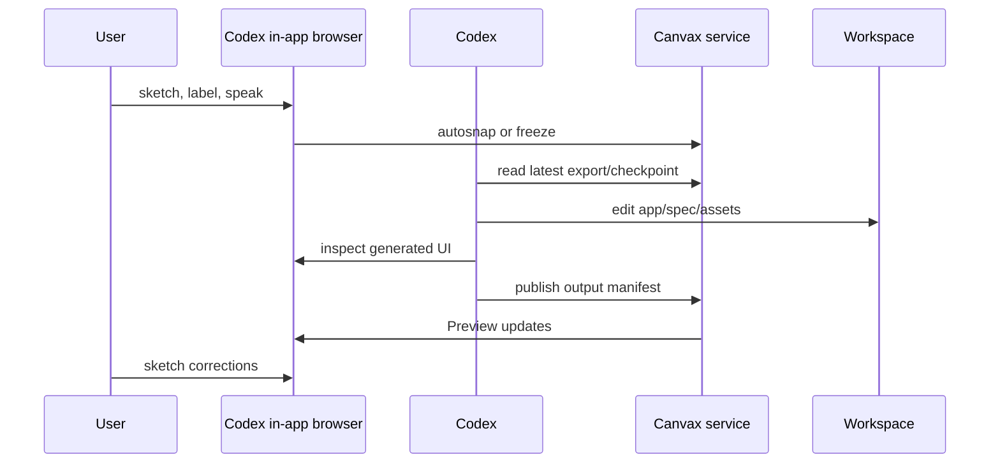
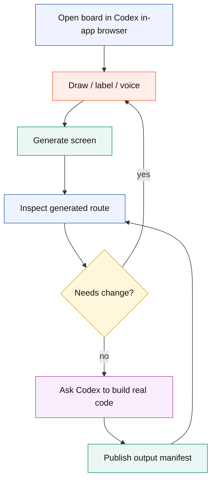

# Codex Browser Workflow

This document describes the preferred near-term Canvax workflow inside Codex Desktop.

Canvax still runs as a local service. The difference is where the board is viewed and inspected:

```text
preferred today
  ./canvax service
      |
      v
  /canvax targets localhost:3210/?host=codex-sidecar in the right-side Codex in-app browser
      |
      +--> user sketches
      +--> Codex inspects board and Preview
      +--> Codex edits workspace files
      `--> Canvax shows output context
```

## Why This Is The Default

Using the Codex in-app browser keeps the collaboration loop in one place:

- the user sketches in Canvax
- Codex reads the live export
- Codex can read the task pack or image prompt pack when the request is build/spec/image-placement work
- Codex can forward chat microphone transcripts into Canvax voice notes with `./canvax --transcript "..." --scope frame`
- Codex uses the in-app browser to inspect the board, Preview, and generated app
- Codex changes real files in the workspace
- Codex publishes output context back to Canvax
- the user keeps sketching corrections

This is closer to the intended Canvax product than bouncing between Codex and a separate external browser.

## Startup

Invoke `/canvax` so the Canvax skill starts or reuses the local service and targets this URL in the right-side in-app browser. Use `$canvax` only as the explicit skill fallback if the slash entry is unavailable:

```text
http://localhost:3210/?host=codex-sidecar
```

Use the full board only when you need more room:

```text
http://localhost:3210
```

Use these only when you explicitly want a separate browser window:

```bash
./canvax --open-external
./canvax --chrome
```

## Working Loop





## What Codex Should Inspect

In the in-app browser, Codex should inspect:

- the board at `http://localhost:3210`
- the Preview window opened from the board
- any generated local app or HTML artifact bound through the output manifest
- layout clipping, broken controls, stale output, and generated UI mismatches
- `exports/canvax-image-prompt-pack-latest.md` when the user wants image generation or composition-preserving prompt guidance

## Image Prompt Pack Flow

```text
draw rough layout
    -> press Image / Image pack
    -> Canvax writes prompt + coordinates + HTML/CSS scaffold
    -> Codex/ChatGPT host image generation can use that pack
```

This remains local-first. Canvax does not need `OPENAI_API_KEY` for this path; it prepares the spatial handoff and lets the current Codex/ChatGPT host capability do the generation when available.

## What Codex Should Publish

After changing workspace files, Codex should run:

```bash
node scripts/write-codex-output.mjs --from-git-status
```

If there is a concrete preview target:

```bash
node scripts/write-codex-output.mjs --from-git-status --url http://localhost:3000
```

Or for a workspace HTML artifact:

```bash
node scripts/write-codex-output.mjs --from-git-status --preview-path artifacts/preview/home.html
```

## Skill Vs Plugin Direction

The current repo is a local command plus a skill:

```text
./canvax  -> local service
/canvax   -> preferred command-style skill entry in Codex; targets ?host=codex-sidecar
$canvax   -> explicit skill fallback; same handoff instructions
```

The next packaging step should be a Canvax plugin that bundles:

- the existing skill instructions
- MCP-style tools for reading the current frame/checkpoint
- a tool to target the sidecar editor in the Codex in-app browser
- a tool to create or read a `Build with Codex` real implementation request
- a tool to publish output manifests after Codex changes files

The skill should remain as the lightweight fallback. The plugin should become the richer installable Codex integration.
