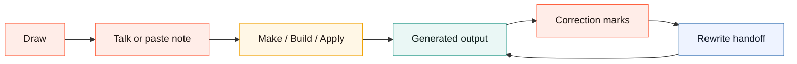

# Designer Walkthrough

This is the short path for using Canvax as a designer-first Codex workbench.

Use this when you want to move from a rough sketch to a generated surface, then keep correcting it with drawing, voice, and local artifacts without adding an API key.

## Mental Model

```text
sketch the intent
  + say or paste the design note
  + attach reference/image context if needed
        |
        v
press Make / Build / Apply
        |
        v
generated output appears as a local preview/reference
        |
        v
draw correction marks or edit the frame
        |
        v
Codex reads the latest handoff and refines the result
```



## Start

Run:

```bash
./canvax
```

Preferred viewing path:

```text
Codex app -> in-app browser -> http://localhost:3210
```

Use an external browser only when you explicitly want it:

```bash
./canvax --open-external
```

## Everyday Workbench Loop

Use the `Start here` strip when the Workbench feels busy:

- `1 Sketch` hides the tray and puts the pen on the canvas.
- `2 Talk` focuses the note/dictation path for the current frame.
- `3 Make` switches to split focus and generates a local preview.
- `4 Map` opens the spatial project map for frames, variants, outputs, and references.

Then use the full loop when you need more control:

1. Keep `Workbench` selected.
2. Pick `Surface` such as desktop, mobile, free canvas, book spread, storyboard, comic page, poster, or slide.
3. Pick `Action` such as Build UI, Refine UI, Write spec, Image prompt, or Variations.
4. Draw rough placement on the current frame.
5. Use `Talk` or paste a manual voice note.
6. Press `Make` for a local generated surface.
7. Press `Build` when you want a Codex-readable real implementation request and local starter output.
8. Press `Apply` when the generated output should refresh from your latest sketch, voice note, and correction marks.
9. Use `Open sketch pad` when the tray feels too busy; use `Show brief` to bring it back.

## Output Correction Loop

```text
generated output exists
        |
        v
switch to Split or Output focus
        |
        v
choose Sketch pad or Generated output, then draw arrows / notes / correction marks
        |
        v
Apply to Codex
        |
        v
local rewrite preview updates
```

## Live Edit In Plain Words

- `Pick target`: click or drag the exact area to change.
- `Sketch pad / Generated output`: appears only while picking; it chooses where the next pick happens.
- Yellow outline: the picked area for Live Edit, not a new design object.
- On scratchpad or generated output, drag the yellow outline border to move the picked area. Drag a corner dot to resize it before `Go` or `Accept`.
- Yellow target pill: a small label for the picked area. It should never paint over or become part of the scratchpad.
- `Go`: preview three different directions in place.
- Variant controller: after `Go`, a small control appears on the picked output target so you can cycle `1/3`, `2/3`, `3/3`, then Accept or Discard right where you are looking.
- `Accept`: keep the chosen direction with the current screen and save it for Codex.
- `Discard` or `Escape`: remove the picked target and temporary variants. If you moved or resized a scratchpad target before accepting, it returns to its original position.
- `Undo`, `Erase`, or `Clear marks`: remove strokes you actually drew on the sketch or output.
- Action chips: `Freeform` follows your note, `Layout` changes placement, `Typeset` improves type, `Colorize` changes color, and `Clarify` / `Bolder` / `Quieter` / `Animate` steer the mood.

When `Live rewrite` is enabled, autosnap/freeze can run the local rewrite executor automatically. If another autosnap/freeze happens while a rewrite is already running, Canvax queues the newest handoff and runs it after the current rewrite finishes.

## Image And Book/Illustration Loop

Use this for children-book spreads, posters, comic panels, UI image slots, icons, or reference-art directions.

1. Choose a surface such as `Book spread`, `Storyboard`, `Comic page`, `Poster`, or `Free canvas`.
2. Draw regions for characters, backgrounds, props, panels, or image slots.
3. Add labels or notes describing style, continuity, mood, and safe text areas.
4. Press `Image` / `Image pack`.
5. Use `exports/canvax-image-generation-brief-latest.md` when you want one copy-ready brief for ChatGPT/Codex image-generation hosts.
6. In the `Asset candidates` tray, use `Copy prompt` for one slot when you want to paste only that candidate's prompt and placement contract.
7. Attach the generated file back to that candidate with `Attach image` or `Attach path`.
8. Use `Accept` to mark the chosen image candidate.

The image path stays local-first:

```text
Canvax exports prompt + placement + style lock + image brief
        |
        v
host image tool generates an image when available
        |
        v
user/Codex attaches image back to Canvax
        |
        v
Canvax preserves chosen candidate and placement
```

Canvax itself does not require `OPENAI_API_KEY`.

## Map Mode

Use `Map` when one frame is not enough.

Map is the spatial project memory:

- frame cards
- variant branches
- generated output references
- asset candidate cards
- reference files/images
- notes
- checkpoint history
- output shelf

Generated output cards in Map:

```text
Frame card                 = an editable sketch/design surface
Generated screen card      = a local output/reference produced by Make, Build, or Materialize
Generated file card        = a spec, HTML, prompt, image note, or other output file
Code change card           = a workspace file changed by Codex
Output shelf               = the lane that groups generated screens/files/changes
```

Those output cards are references, not extra frames. Use `Open output` to inspect one, `Edit as frame` when it should become an editable correction branch, `Pin` when it should stay visible, or `Clear outputs` when stale generated references are crowding the map.

Designer actions:

- drag cards and objects
- pan the background
- pinch or Ctrl/Cmd-wheel to zoom
- Shift-drag to lasso objects
- group related context
- lock important references
- use `Tidy map` when the board gets noisy
- use `Fit map` when you lose the visible project area

## Visual Review Path

Run the regression snapshot pass:

```bash
npm run regression
npm run goal-audit
```

`npm run goal-audit` writes the current prompt-to-artifact checklist under
`artifacts/canvax/goal-audit/latest/`. Use it before claiming that the
designer workflow has reached the full Stitch-plus objective; it will still
report open host-bridge and production-generation gaps until those are real.

Then inspect:

```text
artifacts/canvax/browser-snapshots/latest/index.json
artifacts/canvax/browser-snapshots/latest/board-desktop-1440x1024.png
artifacts/canvax/browser-snapshots/latest/board-laptop-1024x820.png
artifacts/canvax/browser-snapshots/latest/board-tablet-768x900.png
artifacts/canvax/browser-snapshots/latest/board-narrow-430x840.png
artifacts/canvax/browser-snapshots/latest/board-advanced-map-desktop-1440x1024.png
artifacts/canvax/browser-snapshots/latest/board-advanced-map-tablet-768x900.png
artifacts/canvax/browser-snapshots/latest/preview-desktop-1440x1024.png
artifacts/canvax/browser-snapshots/latest/preview-laptop-1024x820.png
artifacts/canvax/browser-snapshots/latest/preview-tablet-768x900.png
artifacts/canvax/browser-snapshots/latest/preview-narrow-430x840.png
exports/canvax-dom-review-latest.md
```

Use those screenshots to review:

- first-view complexity
- clipped labels
- overlapping controls
- whether `Open sketch pad` meaning is clear
- whether Workbench and Advanced feel like the same product
- whether generated output references look like references, not extra sketch frames
- whether the Advanced command deck remains solid while inspecting long frame/map content

## What To Ask Codex

```text
use my current Canvax
read the latest Canvax checkpoint
build this frame into the app
turn this Canvax into a UI spec
use the Image pack for image generation prompts
refine the generated output from my correction marks
```

Codex should read:

```text
exports/canvax-checkpoint-latest.json
exports/canvax-live-latest.json
exports/canvax-task-pack-latest.json
exports/canvax-rewrite-request-latest.json
exports/canvax-image-prompt-pack-latest.json
exports/canvax-asset-candidates-latest.json
artifacts/canvax/codex-output.json
```

## Current Limits

Canvax is not yet:

- a first-party embedded Codex canvas
- a direct reader of the Codex chat microphone stream
- a direct caller of ChatGPT Images from localhost
- a full Figma/Canva replacement
- a guaranteed one-click production app generator

The current strength is the local, no-API collaboration loop: draw, speak, save, generate local previews, attach outputs, and let Codex read precise visual handoff files.
