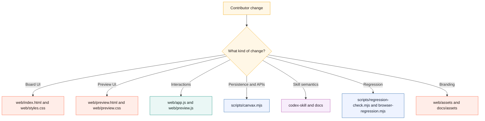
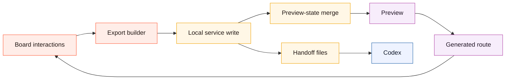
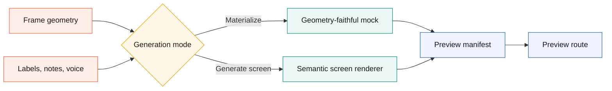
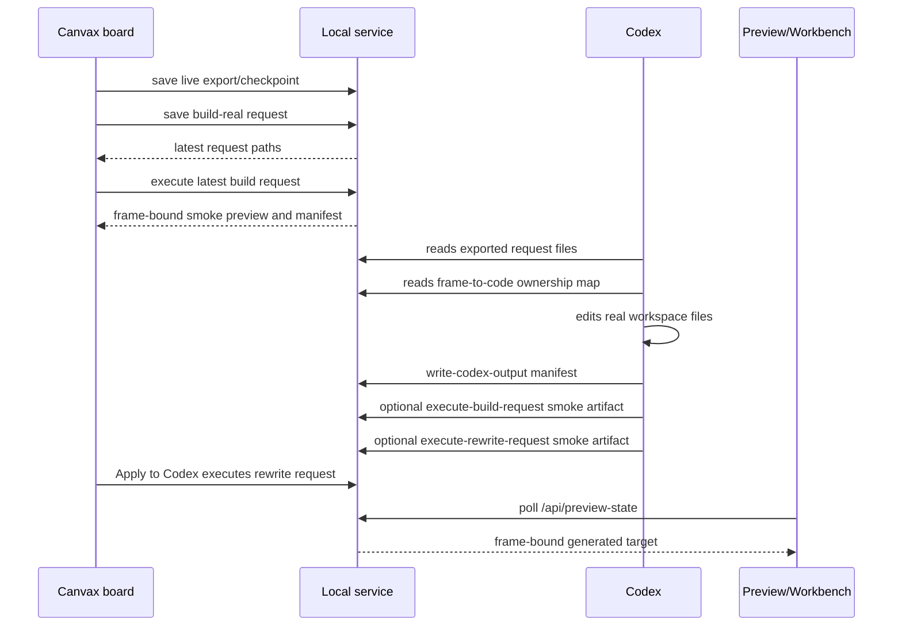
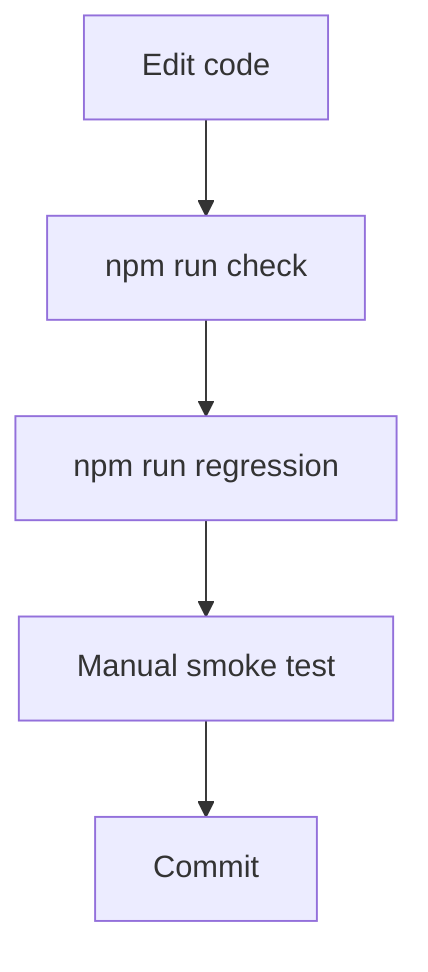

# Develop Canvax

## Contributor Map

```text
change UI?          -> web/index.html, web/styles.css, web/preview.css
change interactions?-> web/app.js, web/preview.js
change persistence? -> web/app.js, scripts/canvax.mjs
change handoff?     -> scripts/canvax.mjs, docs, skill
change validation?  -> scripts/regression-check.mjs, scripts/browser-regression.mjs
```



## Goal Of These Docs

This file is for contributors and future maintainers.

Use it to understand:

- how to run the project locally
- where to make changes
- how to avoid breaking the sketch loop
- how to extend the current architecture safely

## Local Development

Start or reuse the service:

```bash
./canvax
```

For manual UI work, invoke `/canvax` so `http://localhost:3210` opens in Codex Browser Use / Atlas when available. Use `./canvax --open-external` or `./canvax --chrome` only when you intentionally want an external browser.

Basic syntax check:

```bash
npm run check
```

Broader safe regression pass:

```bash
npm run regression
```

If the Canvax service is already running, that regression pass now also validates the live `/api/preview-state` payload shape, including workspace-follow metadata, and then runs a headless browser pass against both:

- `/?selftest=1`
- `/preview.html?selftest=1`

Run only the browser layer directly with:

```bash
npm run browser-regression
```

The browser pass expects:

- a running Canvax service
- a local Chrome binary, or `CANVAX_BROWSER` pointing to one
- the board route `/?selftest=1` and Preview route `/preview.html?selftest=1` to both report passing self-test payloads

By default, browser timeouts are reported as `skip` so the main regression loop stays usable on hosts where headless Chrome does not stabilize cleanly under Codex. On a stable host, the browser pass should report `ok` for both board and Preview. If you want strict failure semantics, run:

```bash
CANVAX_BROWSER_STRICT=1 npm run browser-regression
```

When browser regression runs successfully, it writes visual review snapshots for board and Preview at desktop, laptop, tablet, and narrow widths:

```text
artifacts/canvax/browser-snapshots/latest/index.json
```

In-browser self-test:

```bash
http://localhost:3210/?selftest=1
```

The board self-test covers drawing tools, select/move/resize, eraser ink-layer behavior, Workbench dock brush sizing, Workbench action modes, host/design-context handoff fields, flow link creation/deletion, task/image prompt packs, materialize, output activity, rewrite queue state, board-side rewrite execution, and large-session export consistency.

The browser regression also includes a deterministic `visualfixture=advanced-map` route. It seeds a dense Map session, switches into Advanced Flow view, captures desktop and tablet screenshots from a scrolled session state, and asserts that the Advanced deck has no backdrop blur, uses an opaque background, renders the Output shelf, renders the compact Map timeline, and does not show raw `generated-target` labels.

End-to-end no-API workflow proof:

```bash
npm run e2e-workflow
```

That script synthesizes a rough frame with labels, voice, correction marks, an image prompt pack, asset candidates, and an image host task. It then runs the deterministic build executor, dry-runs Codex output manifest binding, verifies the frame-to-code map, verifies the React-ready component and Vite/Next framework adapter handoffs, runs the rewrite executor from correction context, verifies correction-to-component targeting, and writes a proof manifest at `artifacts/canvax/e2e-workflow/latest/result.json`.

Strict goal audit:

```bash
npm run goal-audit
```

That script writes `artifacts/canvax/goal-audit/latest/result.json` and `.md`. It maps the active Stitch-plus objective to concrete source/docs evidence, then keeps `overallComplete: false` while first-party host bridges and high-fidelity autonomous production generation remain open. Treat it as a completion guard, not as a celebration gate.

Useful service commands:

```bash
./canvax --status
./canvax --stop
./canvax --restart
npm run service-lifecycle
```

`npm run service-lifecycle` uses isolated runtime files and throwaway ports. It covers normal start/reuse/restart/stop behavior, recovery from matching live `/api/status` data, and the non-Canvax occupied-port failure path.

```text
edit code
  -> run npm run check
  -> run npm run regression
  -> run npm run goal-audit
  -> refresh board and Preview
  -> smoke test the affected workflow
```

## Development Principles

- Keep the sketch loop fast.
- Avoid adding friction to the board startup flow.
- Preserve the difference between Frame view and Flow view.
- Prefer generic canvas behavior over screen-specific assumptions.
- Keep Codex integration path-based and explicit.
- Keep transport-specific assumptions isolated so local companion mode can later migrate to an App Server client without rewriting the core canvas model.

## Codebase Working Model



## Generation Working Model

Canvax now has two local generation paths:

```text
Materialize
  sketch geometry -> styled HTML mock -> Preview

Generate screen
  sketch intent + labels + notes + loose strokes -> semantic screen renderer -> polished HTML route -> Preview
```



Use `Generate screen` for hero-like website/app screens where Canvax should infer sections, hierarchy, calls to action, and visual tone. It now works from both rectangle-heavy wireframes and stroke-first sketches with arrows, ovals, image slots, and free labels. Use `Materialize` when you want a quicker mock that stays closer to raw canvas geometry.

## Build With Codex Development Path

`Build with Codex` is primarily a handoff contract for a real Codex implementation pass. A deterministic local executor also exists for validating the contract and publishing a frame-bound preview plus starter implementation bundle when no app route has been built yet. That bundle includes a standalone HTML/CSS/JS target, a portable `CanvaxScreen.jsx` plus `CanvaxScreen.css` pair, Vite/Next adapter stubs, `FRAMEWORK_ADAPTERS.md`, `canvax-component-map.json`, `canvax-build-contract.json`, `codex-port-task.json`, `INTEGRATION.md`, and `ACCEPTANCE.md`. The component map links source sketch elements to generated selectors and files; the build contract gives Codex machine-readable adapter paths, selector preservation rules, publish guidance, the designer implementation context summary, and the explicit no-API boundary. The acceptance checklist gives Codex and designers one human-readable production-readiness gate before publishing the real implementation back into Canvax.

Use `npm run verify-tokens` after a generated starter or real Codex port when
the build contract includes extracted design tokens. Without `--manifest`, it
checks the local implementation bundle next to the contract. With
`--manifest artifacts/canvax/codex-output.json --frame <frame-id>`, it checks
the real changed files and artifacts published back to Canvax for that frame.

The build request now includes `implementationContext`, which is intentionally smaller than the full live export. It carries Workbench mode/focus, action mode, generation recipe, selected Map prompts/custom properties, variant semantic recipe and style knobs, image style lock, and output-edit binding so Codex can code from designer intent instead of raw canvas geometry alone.

The board calls that executor through `POST /api/execute-build-request` immediately after `POST /api/save-build-request` succeeds. This keeps the designer loop one-click: the request is archived, the latest request is exported, a preview plus implementation starter files are written, and `artifacts/canvax/codex-output.json` is published for Workbench/Preview binding.

When a generated output preview is converted with `Make editable`, the new branch frame carries `frame.variant.outputObjectId`, `outputTarget`, and `outputHref`. Export builders derive `outputEditBinding` from those fields and include it in the live export, task pack, rewrite request, build request, output contract, and executor context JSON. Regression self-test verifies that the editable output branch stays connected to the exact generated target through both the rewrite and build handoff paths.

Runtime path:

```text
web/app.js
  buildRealScreenWithCodex()
  buildBuildRealRequest()
  buildImplementationContext()
  buildBuildRealRequestMarkdown()

scripts/canvax.mjs
  POST /api/save-build-request
  POST /api/execute-build-request
  artifacts/canvax/build-requests/<request>/request.json
  artifacts/canvax/build-requests/<request>/request.md
  exports/canvax-build-real-latest.json
  exports/canvax-build-real-latest.md
  artifacts/preview/codex-build/frames/<frame-id>/index.html
  artifacts/preview/codex-build/frames/<frame-id>/context.json
  artifacts/preview/codex-build/frames/<frame-id>/implementation/index.html
  artifacts/preview/codex-build/frames/<frame-id>/implementation/styles.css
  artifacts/preview/codex-build/frames/<frame-id>/implementation/app.js
  artifacts/preview/codex-build/frames/<frame-id>/implementation/CanvaxScreen.jsx
  artifacts/preview/codex-build/frames/<frame-id>/implementation/CanvaxScreen.css
  artifacts/preview/codex-build/frames/<frame-id>/implementation/ViteApp.jsx
  artifacts/preview/codex-build/frames/<frame-id>/implementation/NextAppPage.jsx
  artifacts/preview/codex-build/frames/<frame-id>/implementation/FRAMEWORK_ADAPTERS.md
  artifacts/preview/codex-build/frames/<frame-id>/implementation/canvax-component-map.json
  artifacts/preview/codex-build/frames/<frame-id>/implementation/canvax-build-contract.json
  artifacts/preview/codex-build/frames/<frame-id>/implementation/codex-port-task.json
  artifacts/preview/codex-build/frames/<frame-id>/implementation/INTEGRATION.md
  artifacts/preview/codex-build/frames/<frame-id>/implementation/ACCEPTANCE.md
  artifacts/preview/codex-build/frames/<frame-id>/implementation/README.md
  artifacts/canvax/codex-output.json

Codex implementation pass
  edits app/page/component files
  node scripts/write-codex-output.mjs --from-git-status --frame <frame-id> ...
  artifacts/canvax/codex-output.json

Optional local executor
  node scripts/execute-build-request.mjs
  artifacts/preview/codex-build/frames/<frame-id>/index.html
  artifacts/preview/codex-build/frames/<frame-id>/context.json
  artifacts/preview/codex-build/frames/<frame-id>/implementation/
  artifacts/canvax/codex-output.json

Rewrite local executor
  node scripts/execute-rewrite-request.mjs
  POST /api/execute-rewrite-request
  artifacts/preview/codex-rewrite/frames/<frame-id>/index.html
  artifacts/preview/codex-rewrite/frames/<frame-id>/context.json
  artifacts/canvax/codex-output.json
```



Regression coverage:

- `scripts/execute-build-request.mjs --no-publish --json` can read the latest request and produce a local preview/context artifact plus implementation starter bundle, React-ready component/CSS pair, Vite/Next adapter stubs, framework adapter notes, `canvax-component-map.json`, `canvax-build-contract.json`, and `INTEGRATION.md`
- Board self-test verifies the UI/server path executes and binds that artifact through the output manifest.
- `scripts/execute-rewrite-request.mjs --no-publish --json` can read the latest rewrite request and produce a refreshed preview/context artifact, including component-target context when a frame-to-code map is attached
- Board self-test verifies `POST /api/execute-rewrite-request` binds a refreshed preview artifact through the output manifest.

- `scripts/regression-check.mjs` validates the latest build request schema when present.
- `scripts/regression-check.mjs` validates the latest rewrite request schema when present.
- Board self-test creates a synthetic build request, verifies the no-API frame-to-code contract, and verifies the automatic execution/binding path.

## Variant Branch Implementation

`Create variants` lives in `web/app.js` and is intentionally local:

```text
createVariantFramesFromCurrent()
  -> clone active frame sketch elements with fresh ids
  -> add a visible variant label
  -> attach frame.variant lineage metadata
  -> insert three frames after the source frame
  -> connect all variants from the source in Flow view
  -> create matching variant-branch Map objects
  -> sync the live export/checkpoint
```

The current recipes are:

- `Structure`
- `Visual`
- `Adaptive`

The important behavior is that each variant remains a normal editable frame. Do not turn variants into read-only images or one-off prompt text.
The matching `variant-branch` Map object is a spatial handle for that frame, not a duplicate source of truth. It lets designers select, move, resize, group, copy context, or promote the branch from the Map while the frame remains editable.
When designers select branch Map objects from the same source frame, `Branch earlier` / `Branch later` reorders that branch sequence by updating `frame.variant.index` and resyncing the matching Map objects. Dragging branch cards across sibling branch positions also recomputes the sequence from Map position. Do not reorder unrelated frames or navigation links when only the branch sequence changes.

Self-test coverage verifies:

- three variant frames are created
- each has lineage pointing to the source frame
- each has a visible label element
- each is connected as a branch in Flow view
- each has a matching exported/rendered `variant-branch` Map object
- branch objects can move earlier/later and the ordered `spatialWorkspace.variantBranches` export changes accordingly
- branch objects can be drag-positioned across sibling branches and update the exported branch order
- primary promotion syncs to both `spatialWorkspace.variantBranches` and the Map object

## Asset Candidate Implementation

`Image pack` now builds an asset candidate pack from the image prompt pack.

Runtime path:

```text
buildImagePromptPack()
  -> buildAssetCandidatePack()
  -> POST /api/save-asset-candidates
  -> exports/canvax-asset-candidates-latest.json
  -> exports/canvax-asset-candidates-latest.md
  -> exports/canvax-image-generation-brief-latest.json
  -> exports/canvax-image-generation-brief-latest.md
  -> artifacts/canvax/asset-candidates/<request>/
```

Candidate types:

- `frame-composite`: full-frame image direction
- `region`: a prompt-ready image/avatar/visual region from the composition map

The pack is intentionally no-API. The service also writes a consolidated `canvax-image-generation-brief` with copy-ready host prompts, style lock, placement contracts, output-slot status, and the same `canvax-asset-candidate-review` summary. That review summary groups candidates by frame, lists pending/placed/attached/accepted IDs, and includes a `hostHandoff` workflow so a future bridge or manual ChatGPT image workflow can consume the right files without requiring an API key.

The Workbench candidate tray reads the latest saved pack from board state after `Image pack` succeeds. Tray actions create ordinary `type: "image"` elements:

```text
Place slot
  -> image element without imageDataUrl
  -> preserves assetCandidateId + candidate bounds

Attach image
  -> image element with imageDataUrl
  -> preserves assetCandidateId + candidate bounds
```

This keeps the image workflow local-first while making the prompt candidates visible and editable inside the canvas.

Regression coverage:

- export package contains a no-API asset candidate pack
- browser self-test saves the candidate pack through the service
- browser self-test places a candidate tray slot as an editable image element
- `scripts/regression-check.mjs` validates `exports/canvax-asset-candidates-latest.json` when present
- `scripts/regression-check.mjs` validates `exports/canvax-image-generation-brief-latest.json` when present and verifies the save endpoint returns a no-API brief

## Where To Change What

### Add or change a drawing tool

Edit:

- `web/app.js`

Likely areas:

- tool definitions
- pointer event handling
- render logic
- selection behavior

### Change layout or visual design

Edit:

- `web/index.html`
- `web/styles.css`

### Change export structure or save behavior

Edit:

- `web/app.js`
- `scripts/canvax.mjs`

Be careful to keep backward compatibility where possible because older live export files may still exist.

When you add new fields to live exports or checkpoints, keep the explicit handoff `schemaVersion` in sync and update the regression checks.

```text
schema-sensitive files
  - web/app.js
  - scripts/canvax.mjs
  - scripts/regression-check.mjs
  - docs/USAGE.md
  - docs/ARCHITECTURE.md
```

### Change how Codex should interpret the canvas

Edit:

- `codex-skill/canvax/SKILL.md`
- `README.md`
- `docs/USAGE.md`

## Manual Smoke Test Checklist

After interaction changes, check these manually:

- board opens at the expected local URL
- board opens cleanly inside Codex Browser Use / Atlas
- tools still switch correctly
- brush size updates correctly
- labels can be placed and edited
- selection, grouping, and deletion still work
- captures can be created and removed
- Flow view can create and remove links
- live export still writes to `exports/`
- materialized previews silently refresh after freeze when a frame already has a generated target
- generated-screen previews produce semantic, polished routes for hero-like frames from both wireframe boxes and loose stroke-first sketches instead of only absolute-positioned sketch geometry
- brand assets still load from `web/assets/canvax-logo.svg` in both the board and Preview
- Codex output manifest can be refreshed from git status with `node scripts/write-codex-output.mjs --from-git-status`
- board and Preview show live workspace-follow status while git changes are present
- board and Preview show the current transport as local companion with an App Server future path
- Workbench action mode changes are visible in the UI and included in task/image prompt packs
- root `DESIGN.md` is detected through `/api/status` and included in handoff packs when present
- `Create DESIGN.md` writes a starter file only when no existing design contract is present
- host capability chips stay honest about no direct native mic or image-generation bridge in local companion mode
- board and Preview record live output activity when the connected output context changes
- board and Preview frame cards show sensible output-status badges for stale/synced/materialized/global-target states
- board and Preview rewrite queues show the right frames when output is stale, missing, or only globally bound
- same-URL connected previews reload when implementation-relevant changes land
- output-context digest changes create `Output update` checkpoints without forcing a fresh export write
- Preview shows refinement summaries and changed-region overlays after rematerialize
- `?selftest=1` now covers both the small interaction path and a synthetic large-session fixture
- Preview and any generated app target can be inspected inside Codex Browser Use / Atlas

## Current Test Layers

```text
1. node --check          -> syntax
2. regression-check      -> manifests, exports, docs, live preview-state
3. browser-regression    -> board and Preview self-test routes
4. manual smoke test     -> real interaction loop
```



## Current Known Architectural Constraint

`web/app.js` currently carries most of the state and interaction logic in one file. That is acceptable for this stage of the project, but contributors should expect future refactoring into smaller modules as the collaboration loop grows.

## Planned Next Layers

The current roadmap is tracked in:

- `canvax-live-collaboration-plan.md`

The main next layers are:

- richer live collaboration state
- voice attached to canvas checkpoints
- preview/artifact feedback loop
- Codex Browser Use / Atlas first validation for board, Preview, and generated routes
- better thread-to-canvas coordination with Codex

```text
current maintainer focus
  -> keep long sessions stable
  -> tighten preview/live rewrite loop
  -> preserve migration path to richer Codex client
```

## Attribution

This project is documented here as having been created collaboratively with OpenAI Codex. Keep that wording accurate in future docs unless the project owner wants a different attribution line.
