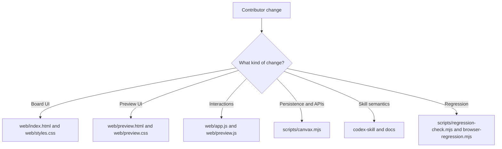
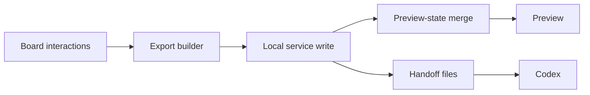
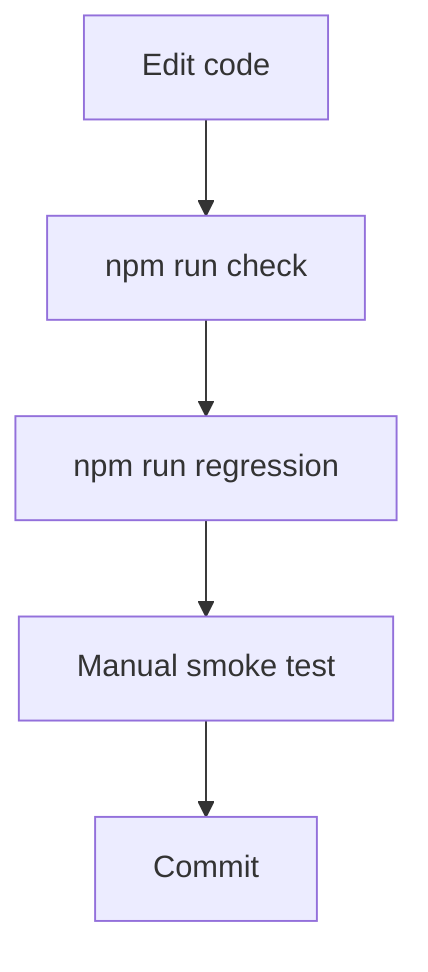

# Develop Canvax

## Contributor Map

```text
change UI?          -> web/index.html, web/styles.css, web/preview.css
change interactions?-> web/app.js, web/preview.js
change persistence? -> web/app.js, scripts/canvax.mjs
change handoff?     -> scripts/canvax.mjs, docs, skill
change validation?  -> scripts/regression-check.mjs, scripts/browser-regression.mjs
```



## Goal Of These Docs

This file is for contributors and future maintainers.

Use it to understand:

- how to run the project locally
- where to make changes
- how to avoid breaking the sketch loop
- how to extend the current architecture safely

## Local Development

Start or reuse the service:

```bash
./canvax --open
```

Basic syntax check:

```bash
npm run check
```

Broader safe regression pass:

```bash
npm run regression
```

If the Canvax service is already running, that regression pass now also validates the live `/api/preview-state` payload shape, including workspace-follow metadata, and then runs a headless browser pass against both:

- `/?selftest=1`
- `/preview.html?selftest=1`

Run only the browser layer directly with:

```bash
npm run browser-regression
```

The browser pass expects:

- a running Canvax service
- a local Chrome binary, or `CANVAX_BROWSER` pointing to one

By default, browser timeouts are reported as `skip` so the main regression loop stays usable on hosts where headless Chrome does not stabilize cleanly under Codex. If you want strict failure semantics, run:

```bash
CANVAX_BROWSER_STRICT=1 npm run browser-regression
```

In-browser self-test:

```bash
http://localhost:3210/?selftest=1
```

Useful service commands:

```bash
./canvax --status
./canvax --stop
./canvax --restart --open
```

```text
edit code
  -> run npm run check
  -> run npm run regression
  -> refresh board and Preview
  -> smoke test the affected workflow
```

## Development Principles

- Keep the sketch loop fast.
- Avoid adding friction to the board startup flow.
- Preserve the difference between Frame view and Flow view.
- Prefer generic canvas behavior over screen-specific assumptions.
- Keep Codex integration path-based and explicit.
- Keep transport-specific assumptions isolated so local companion mode can later migrate to an App Server client without rewriting the core canvas model.

## Codebase Working Model



## Where To Change What

### Add or change a drawing tool

Edit:

- `web/app.js`

Likely areas:

- tool definitions
- pointer event handling
- render logic
- selection behavior

### Change layout or visual design

Edit:

- `web/index.html`
- `web/styles.css`

### Change export structure or save behavior

Edit:

- `web/app.js`
- `scripts/canvax.mjs`

Be careful to keep backward compatibility where possible because older live export files may still exist.

When you add new fields to live exports or checkpoints, keep the explicit handoff `schemaVersion` in sync and update the regression checks.

```text
schema-sensitive files
  - web/app.js
  - scripts/canvax.mjs
  - scripts/regression-check.mjs
  - docs/USAGE.md
  - docs/ARCHITECTURE.md
```

### Change how Codex should interpret the canvas

Edit:

- `codex-skill/canvax/SKILL.md`
- `README.md`
- `docs/USAGE.md`

## Manual Smoke Test Checklist

After interaction changes, check these manually:

- board opens at the expected local URL
- tools still switch correctly
- brush size updates correctly
- labels can be placed and edited
- selection, grouping, and deletion still work
- captures can be created and removed
- Flow view can create and remove links
- live export still writes to `exports/`
- materialized previews silently refresh after freeze when a frame already has a generated target
- Codex output manifest can be refreshed from git status with `node scripts/write-codex-output.mjs --from-git-status`
- board and Preview show live workspace-follow status while git changes are present
- board and Preview show the current transport as local companion with an App Server future path
- board and Preview record live output activity when the connected output context changes
- board and Preview frame cards show sensible output-status badges for stale/synced/materialized/global-target states
- board and Preview rewrite queues show the right frames when output is stale, missing, or only globally bound
- same-URL connected previews reload when implementation-relevant changes land
- output-context digest changes create `Output update` checkpoints without forcing a fresh export write
- Preview shows refinement summaries and changed-region overlays after rematerialize
- `?selftest=1` now covers both the small interaction path and a synthetic large-session fixture

## Current Test Layers

```text
1. node --check          -> syntax
2. regression-check      -> manifests, exports, docs, live preview-state
3. browser-regression    -> board and Preview self-test routes
4. manual smoke test     -> real interaction loop
```



## Current Known Architectural Constraint

`web/app.js` currently carries most of the state and interaction logic in one file. That is acceptable for this stage of the project, but contributors should expect future refactoring into smaller modules as the collaboration loop grows.

## Planned Next Layers

The current roadmap is tracked in:

- `canvax-live-collaboration-plan.md`

The main next layers are:

- richer live collaboration state
- voice attached to canvas checkpoints
- preview/artifact feedback loop
- better thread-to-canvas coordination with Codex

```text
current maintainer focus
  -> keep long sessions stable
  -> tighten preview/live rewrite loop
  -> preserve migration path to richer Codex client
```

## Attribution

This project is documented here as having been created collaboratively with OpenAI Codex. Keep that wording accurate in future docs unless the project owner wants a different attribution line.
