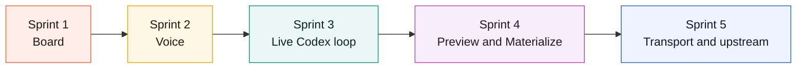
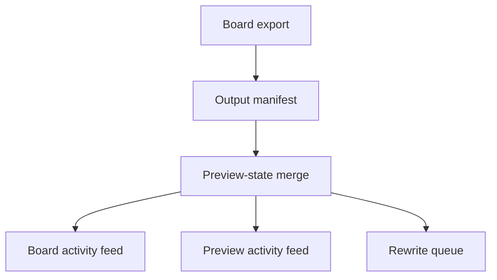
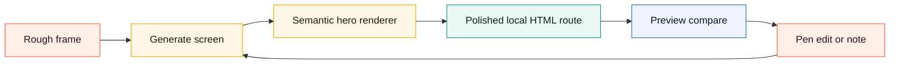
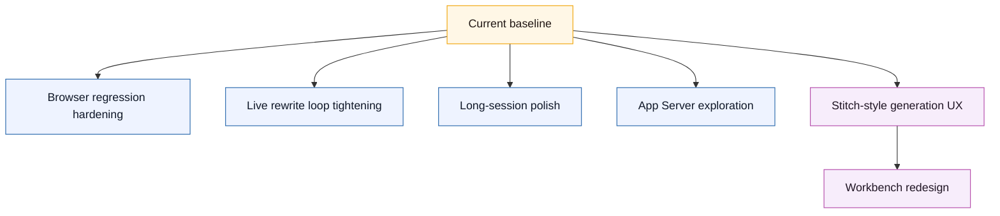
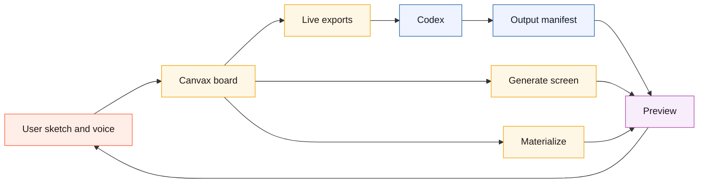

# Canvax Execution Status

Updated: May 15, 2026

This file tracks what is actually implemented from `canvax-live-collaboration-plan.md` so work does not drift between chat turns.

## Sprint Map

```text
Sprint 1 -> board surface and interaction stability
Sprint 2 -> voice as native input
Sprint 3 -> live Codex collaboration loop
Sprint 4 -> preview and materialize surface
Sprint 5 -> future transport and upstream readiness
```



## Sprint Status

### Sprint 1: Stabilize the collaboration surface

Status: In progress

- [x] Generic canvas direction instead of hero-section-specific framing
- [x] Workbench simple mode for sketch + voice + generated-output correction marks without advanced panels
- [x] Frame view and Flow view both exist
- [x] Core drawing tools, labels, grouping, flow links, captures, help
- [x] Separate preview button in the main board
- [x] Visible single-selection delete action
- [x] Preview follows the active frame viewport more closely
- [x] Formal versioned session schema for live exports/checkpoints/live preview payloads
- [x] Cached frame render pipeline for live preview/export generation to reduce repeated long-session re-encoding
- [ ] Full interaction regression pass with browser validation
- [ ] Remaining rough edges in large-session behavior

```text
done now:
  focus pad, board, tools, selection, flow, preview button, cached frame renders
still open:
  stricter browser validation and long-session polish
```

### Sprint 2: Add voice as a native Canvax input

Status: In progress

- [x] Dictation UI in Canvax
- [x] Transcript capture pipeline
- [x] Transcript-to-handoff structuring
- [x] Checkpoint rules for sketch + voice handoff

```text
voice path:
  board dictation/manual note
      -> voice export
      -> checkpoint
      -> Codex handoff
```

### Sprint 3: Build the live Codex collaboration loop

Status: In progress

- [x] Live exports under `exports/`
- [x] Preview window route and preview-state endpoint
- [x] Live board-to-preview session mirroring path
- [x] Preview manifest save/load path
- [x] Preview manifest now supports richer targets, artifacts, and changed-file metadata
- [x] Canonical Codex-output manifest path and writer CLI
- [x] Session event log
- [x] Artifact manifest can now be written automatically by the Codex workflow via `write-codex-output --from-git-status`
- [x] Board-side auto-publish of current workspace changes into the Codex output manifest
- [x] Artifact inbox in the main board
- [x] Automatic preview target binding from Codex-written artifacts
- [x] Live workspace-follow now mirrors current git changes into board and Preview without requiring a manual publish step
- [x] Board and Preview now maintain a live output-activity feed keyed from a stable output digest
- [x] Output-digest changes now write `Output update` checkpoints so Codex-side implementation progress lands in the Canvax timeline too
- [x] Output activity now rebuilds from recent session events, so refreshes do not wipe the visible collaboration history
- [x] Board/checkpoint/live export now surface a rewrite queue that tells Codex which frames need first output, a frame binding, a target, or a refresh



### Sprint 4: Add a preview surface for what Codex builds

Status: In progress

- [x] `Preview` button opens a separate window/tab
- [x] Preview shows sketch and generated surface in a viewport-matched compare layout
- [x] Preview can follow the active frame
- [x] Manual local preview URL attachment
- [x] Persisted generated preview binding through the preview manifest
- [x] Preview now surfaces connected target details, generated artifacts, and changed files
- [x] Automatic generated preview resolution from Codex-produced HTML artifact entries
- [x] Live compare affordances for generated files, compare modes, and frame-aware manifest highlighting
- [x] Preview snapshot workflows
- [x] First `Materialize` action that writes a styled local HTML preview artifact from the active frame
- [x] `Generate screen` mode above quick Materialize, with board-side recipe controls and generated-screen target labeling
- [x] `Generate screen` now has a semantic hero/page renderer for polished website-style output instead of only literal sketch geometry
- [x] Rematerialize now reuses a stable per-frame artifact path and refreshes preview via versioned URLs
- [x] Preview target resolution now prefers the currently selected frame when multiple generated targets exist
- [x] Freeze/autosnap now silently rematerialize a frame that already has a generated target
- [x] Materialize refinement metadata now tracks changed regions and powers Preview overlays/summary
- [x] Preview now forces safe same-target reloads with a digest-based revision key when the connected output context changes
- [x] Board and Preview now surface frame-level output status badges so stale/synced/materialized states are visible while sketching continues

```text
Preview today:
  sketch side
  output side
  compare modes
  artifacts
  changes
  rewrite queue
  refinement overlays
  semantic generated screens
```



### Sprint 5: Prepare for a richer Codex client future

Status: Completed

- [x] Transport abstraction for current local mode vs future App Server mode
- [x] Upstream proposal assets
- [x] Demo script and feature matrix
- [x] Browser Use / Atlas first operating docs for running the board, Preview, and generated app inside Codex

```text
future seam:
  current transport  -> local-companion
  future transport   -> app-server
  preserved semantics-> frames, flow, checkpoints, rewrite queue
```

## Current Priority Tasks

These are now follow-on tasks, not blockers for the current repo-level prototype:

1. Stabilize the headless browser regression path so strict mode can fail hard reliably on this host instead of timing out.
2. Tighten the live “Codex rewrites generated output while sketching continues” loop beyond git-status mirroring, digest-based preview reloads, rewrite queues, and rematerialize refresh.
3. Keep reducing rough edges in larger sessions and long-running boards.
4. Explore the richer App Server client path without discarding the local companion workflow that already works today.
5. Use `docs/STITCH_GAP_ROADMAP.md` as the current product gap list for Stitch-style UX, Codex-built screens, image assets, prototype play, infinite canvas, and `DESIGN.md` work.
6. Use `docs/CODEX_BROWSER_WORKFLOW.md` as the preferred operator path for testing Canvax inside Codex Browser Use / Atlas before building native embedding.
7. Keep `docs/BRANDING.md` and the SVG assets aligned when changing the project identity.
8. Treat Workbench as the working baseline: sketch, voice/manual notes, generated output, visual correction marks, and a floating designer rail before opening Advanced mode.
9. Keep the core Canvax workflow local-first and Codex-first. Image generation should be exposed as host capability or optional adapter, not as a required API-key path.



## May 15 Checkpoint

This checkpoint captures the current local prototype before the deeper designer-facing Workbench redesign begins.

```text
current baseline
  + local Codex companion server
  + Codex Browser / Atlas first workflow
  + Workbench simple mode
  + floating designer rail
  + generated-output correction marks
  + Advanced board and inspector
  + voice/manual dictation bridge
  + transcript forwarding bridge
  + Generate screen and Materialize
  + Preview compare surface
  + live manifests, checkpoints, rewrite queue, output activity
  + documentation for install, usage, architecture, development, and upstream proposal
```



The next work should not add more exposed controls to the current UI. It should make the default surface feel like a designer's live workbench:

```text
sketch card + generated output card + transcript/command composer
        -> Codex task pack
        -> generated surface
        -> draw corrections over output
        -> Codex refines
```

Advanced mode remains valuable for manifests, captures, frame/flow diagnostics, and debugging. It should not be the first experience.

## Notes

- Today the preview is no longer only export-driven, preview targets can persist through the manifest with richer artifact/change metadata, HTML preview artifacts can auto-resolve as generated targets, Codex-written output manifests can bind preview targets automatically, the preview has frame-aware compare modes for generated files, compare checkpoints can now be saved into the workspace, a first deterministic Materialize loop can now generate a styled local preview artifact from the active frame, board-side voice notes now flow into the live JSON export, prompt markdown, and a dedicated `exports/canvax-voice-latest.md` handoff file, Canvax now writes durable handoff checkpoints plus a checkpoint-oriented session event log, the board can auto-publish current workspace changes back into the Codex output manifest, the Codex workflow now has a matching `write-codex-output --from-git-status` helper for automatic manifest publishing after implementation work, preview-state polling overlays a transient live workspace-follow manifest from current git status, and board/Preview now keep a live output-activity feed keyed from a stable output digest that can be rebuilt from recent session events after refresh.
- The current Materialize loop is intentionally local and deterministic. It now reuses a stable per-frame artifact path, silently refreshes existing materialized targets after freeze/autosnap, exposes refinement summaries plus changed-region metadata, lets Preview draw those changed regions directly over both the sketch and the generated output, forces same-target preview reloads when connected implementation context changes, surfaces frame-level stale/synced/materialized badges in both the board and Preview so long flows are easier to read, and writes an explicit rewrite queue into the live handoff/checkpoint state so Codex can see which frames need attention next. Browser self-test coverage includes a synthetic large-session fixture, the Preview window now has its own self-test path, and the regression scripts validate live `/api/preview-state` payload structure. There is now an explicit transport contract covering current local companion mode versus a future App Server client, plus upstream/demo docs that explain the migration path. There is still an experimental headless browser harness for the board and Preview, but it times out on this host often enough that strict browser validation is not marked complete yet. The richer “Codex rewrites the generated surface live while you keep sketching” loop is still the next layer, not the current state.
- The preferred manual validation path is now Codex Browser Use / Atlas rather than a separate external browser: start `./canvax`, invoke `/canvax` to open `http://localhost:3210` in the in-app browser, open Preview, inspect generated routes, and publish output context back through the Codex output manifest. External browser use is explicit through `./canvax --open-external` or `./canvax --chrome`.
- Workbench now surfaces the core choices that were previously too hidden: viewport/surface selection, new frame creation, connected section creation, free-canvas mode, local screen generation, generated-output correction marks, and a floating designer rail. This is still not a true AI-native infinite canvas. It still cannot directly consume raw Codex chat microphone audio from the local web board, but Codex can now forward submitted chat transcripts through the local transcript bridge.
