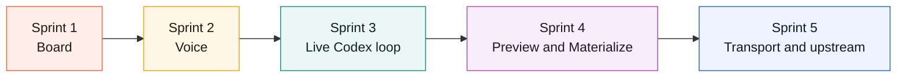
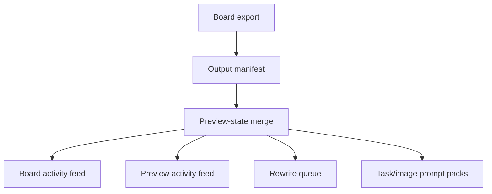
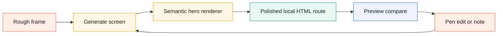
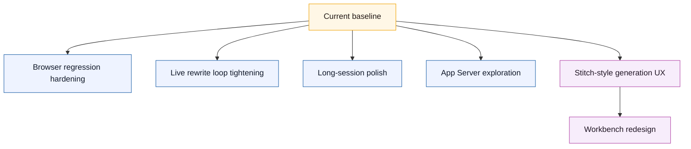
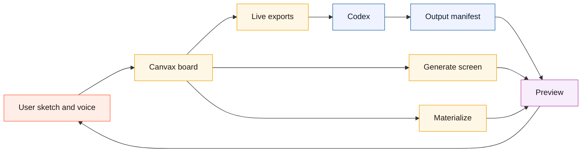

# Canvax Execution Status

Updated: May 18, 2026

This file tracks what is actually implemented from `canvax-live-collaboration-plan.md` so work does not drift between chat turns. For the stricter objective-to-evidence audit, see `docs/CANVAX_PARITY_AUDIT.md`.

## Sprint Map

```text
Sprint 1 -> board surface and interaction stability
Sprint 2 -> voice as native input
Sprint 3 -> live Codex collaboration loop
Sprint 4 -> preview and materialize surface
Sprint 5 -> future transport and upstream readiness
```



## Sprint Status

### Sprint 1: Stabilize the collaboration surface

Status: In progress

- [x] Generic canvas direction instead of hero-section-specific framing
- [x] Workbench simple mode for sketch + voice + generated-output correction marks without advanced panels
- [x] Frame view and Flow view both exist
- [x] Core drawing tools, labels, grouping, flow links, captures, help
- [x] Separate preview button in the main board
- [x] Visible single-selection delete action
- [x] Preview follows the active frame viewport more closely
- [x] Formal versioned session schema for live exports/checkpoints/live preview payloads
- [x] Cached frame render pipeline for live preview/export generation to reduce repeated long-session re-encoding
- [x] Workbench `Focus canvas` bottom designer dock with brush `-` / `+`, Image handoff, and tactile primary actions
- [x] Workbench quick-prompt chips add common refinement intent without opening Advanced mode
- [x] Workbench now has a `Start here` strip for `1 Sketch`, `2 Talk`, `3 Make`, and `4 Map`, giving first-time designers a short path before exposing all controls
- [x] Workbench secondary actions are tucked behind a `More actions` disclosure so default use focuses on frame/free-canvas/build/preview instead of exposing every power tool at once
- [x] Eraser rendering is isolated to the ink layer so paper/grid/background do not get erased in thumbnails or exports
- [x] Workbench `Map` focus exposes the frame/variant graph as a zoomable spatial project map
- [x] Workbench `Map` styles generated variants as branch cards with visible lineage and primary state
- [x] Workbench `Map` variant cards expose `Use variant` so generated directions can be promoted in-place without leaving the spatial workbench
- [x] Workbench `Map` now mirrors generated variants as selectable/resizable/movable `variant-branch` Map objects with object-level context and `Use variant`
- [x] Workbench `Map` supports manual note cards and reference file/image cards as draggable/removable spatial context
- [x] Workbench `Map` supports movable/resizable labeled group regions for explorations/reference boards
- [x] Workbench `Map` can create a group region from the current selected Map objects and ungroup selected group regions without deleting their contents
- [x] Workbench `Map` selected group regions can select their contained Map objects or resize to fit current contents
- [x] Workbench `Map` group regions move contained frame cards and spatial objects together
- [x] Workbench `Map` exports group containment so cards/objects include `groupIds`, `spatialWorkspace.groups` records member frames/objects, and selected group context includes a contents inspector
- [x] Workbench `Map` supports background drag-pan with momentum/coast, left/top edge expansion for cards and Map objects, trailing workspace room, cursor-centered pinch/ctrl-wheel zoom, a minimap navigator with click-to-pan, and `Fit map` recovery for visible frames/objects
- [x] Workbench/Advanced `Map` uses a fixed internal scroll viewport instead of letting the spatial surface expand the whole page, and `Tidy map` reflows generated-output/checkpoint shelf objects into compact lanes
- [x] Browser regression now captures Advanced Map screenshots on desktop and tablet through `visualfixture=advanced-map`, and asserts the command deck stays opaque with no raw `generated-target` output labels
- [x] Workbench `Map` spatial objects can be selected, Shift-click multi-selected, Shift-drag lasso-selected, moved as a selected set, resized as a selected set from a combined transform box, edited through a visible Copy context/Pin/Lock/Group/Ungroup/Select contents/Fit group/Send back/Bring front/Duplicate/Delete/Clear action strip, copied as no-API Markdown context, keyboard-nudged, grouped with `Cmd/Ctrl+G`, ungrouped with `Shift+Cmd/Ctrl+G`, reordered with `Cmd/Ctrl+[` and `Cmd/Ctrl+]`, duplicated with `Cmd/Ctrl+D`, deleted with `Delete`/`Backspace`, locked against accidental move/resize/group/reorder/duplicate/delete, group-duplicated with contained unlocked Map objects, and exported as active `spatialWorkspace.selectedObjectId` / `selectedObjectIds` plus selected/per-object `locked`, `layerIndex`, `layerLabel`, and `contextMarkdown`
- [x] Workbench `Map` single-object selection exposes a lightweight property editor for Title, Note, Status, Prompt / Context, custom `key: value` properties, and safe type-detail overrides plus structured per-type inspector sections for generated outputs, asset candidates, checkpoints, variants, groups, references, and changes; manual overrides persist across generated/asset/checkpoint object resyncs
- [x] Workbench `Map` can clear generated screen/artifact/change cards without deleting manual notes, groups, frames, or assets
- [x] Workbench `Map` groups generated screen/file/code-change cards inside a named `Output shelf` lane so generated targets are readable as output references, not extra frames, and older raw manifest labels render as `Generated screen`, `Generated file`, or `Code change` with an `Output ref` badge
- [x] Workbench `Map` hides internal Materialize support artifacts such as context JSON, meta JSON, and sketch-overlay files so designer-facing output cards stay readable
- [x] Output correction marks now export normalized changed-region bounds, and Erase on the generated-output overlay deletes intersecting correction marks instead of saving invisible eraser strokes into handoff data
- [x] Workbench `Map` can collapse or expand the generated `Output shelf` lane, and that lane state exports through `spatialWorkspace.lanes[].collapsed`
- [x] New and migrated sessions now start with generated-output and checkpoint shelves compressed, so old Materialize/Build/checkpoint history stays available through `Show outputs` / `Show history` without flooding the designer's first Map view
- [x] Workbench `Map` can move selected output/history cards earlier or later inside their lane, and that lane order exports through `meta.laneIndex`, object context, and `spatialWorkspace.lanes[].memberObjectIds`
- [x] Workbench `Map` can move selected variant/output-edit branch cards earlier or later inside their source-frame branch sequence, and that branch order exports through `frame.variant.index`, the branch timeline track, and ordered `spatialWorkspace.variantBranches`
- [x] Workbench `Map` can also update source-frame branch sequence from branch card drag position when a branch crosses sibling branch cards, and Map object context now exposes `Branch order`
- [x] Workbench `Map` renders visible branch drop targets while a branch card is being dragged, so branch reordering is discoverable
- [x] Workbench `Map` can turn a generated output preview card into an editable `Output edit` frame with source-frame lineage, generated target path, a flow connection, output-target metadata on the matching variant branch object, `spatialWorkspace.variantBranches[].outputBinding`, and task/rewrite/build `outputEditBinding`
- [x] Workbench `Map` renders recent checkpoints inside a visible spatial history lane for longer collaboration sessions, exported through `spatialWorkspace.lanes`
- [x] Workbench `Map` can collapse or expand the checkpoint history lane, and that lane state exports through `spatialWorkspace.lanes[].collapsed`
- [x] Workbench `Map` now includes a compact timeline strip for frames, branches, generated outputs, and checkpoints; clicking an item focuses/scrolls the Map and the same sequence exports through `spatialWorkspace.timeline`
- [x] Workbench `Map` exports nested group hierarchy through `spatialWorkspace.groupHierarchy`, including parent/child group paths surfaced in the group inspector
- [x] Workbench `Map` now recursively moves and resizes geometry-contained nested group contents, while still skipping locked child objects
- [x] Workbench `Map` includes an object focus filter for all objects, outputs, assets, notes, or history, and exports the active focus through `spatialWorkspace.objectFilter`
- [x] Workbench `Map` includes text search for generated outputs, assets, notes, paths, prompts, frame labels, and statuses, and exports the active query through `spatialWorkspace.objectFilter.searchQuery`
- [x] Workbench `Map` can pin selected objects so important outputs, assets, notes, or checkpoints remain visible across focus filters and collapsed history
- [x] Live exports include `spatialWorkspace` with map zoom, interaction metadata, frame card positions, spatial object positions, active/entry frame ids, and links
- [x] Advanced command deck is a solid inspector header using the same Workbench visual language, so frame/map content does not blur through the controls during long sessions
- [x] Advanced mode collapses to a single-column inspector layout on narrower windows so the Workbench/Advanced switch and deck controls do not clip off-screen
- [x] Spatial generated-output cards use designer-readable labels/body text instead of raw manifest jargon, including legacy materialized/generated-target records
- [x] Collapsed Workbench keeps a compact frame/surface/action/focus summary visible while the tray is hidden
- [x] Preview manifest normalization deduplicates/caps old notes, targets, artifacts, and change entries before the board renders output context
- [x] Browser regression includes headless board/Preview responsive smoke at 1440, 1024, 768, and 430 pixel widths
- [x] Browser regression writes visual review snapshots for board and Preview at those responsive widths
- [x] Browser self-test includes a dense long-session Map fixture with captured frames, voice notes, generated outputs, artifacts, changed files, checkpoints, and asset candidates
- [x] No-API end-to-end workflow regression proves rough frame + voice + image prompt assets + build request + rewrite request + manifest binding as one chain
- [x] Build with Codex local executor consumes designer implementation context to theme the generated preview/starter bundle, add theme-specific atmosphere layers, and expose a visible `Designer context` panel in the generated surface
- [x] Build with Codex local executor writes `implementation/codex-port-task.json`, a machine-readable task that tells Codex how to port the starter into real React/Vite/Next app files while preserving Canvax bindings
- [x] Build with Codex local executor writes `implementation/ACCEPTANCE.md`, a human-readable production-readiness checklist with selector binding, responsive/accessibility, no-API, and publish-back gates
- [x] `npm run verify-tokens` can verify extracted design-token palettes against both local implementation artifacts and production files listed in `artifacts/canvax/codex-output.json`
- [x] `npm run production-port-proof` creates a no-API production-like route/component/CSS fixture, binds it to a Codex output manifest, verifies token colors in the manifest-listed files, and runs the static artifact review
- [x] `npm run inspect` exposes a no-API read-only inspection bridge for current frame, spatial workspace, design kit, and output bindings as the local precursor to future MCP/native host tools
- [x] `npm run mcp` exposes those read-only inspection payloads through local stdio MCP tools for hosts that can register a local command
- [x] Repository design kits under `design-kits/*.json` load into the searchable Design kit dropdown and validate/discover with `npm run validate-design-kits` plus `npm run validate-design-kits -- --query <term>`
- [x] `npm run package-design-kits` writes a shareable no-API kit-library artifact with full kit JSON, local versions, source paths, SHA-256 checksums, and install notes
- [x] `npm run extract-tokens -- --image <local-screenshot>` samples local raster screenshots/images into the same importable external token pack without an API key
- [x] `npm run extract-tokens` emits a no-API `semanticStructure` block for HTML/JSX artifacts, including landmarks, component signals, actions, forms, headings, class signals, and Canvax node bindings
- [x] `npm run review-artifact` emits a no-API static design-readiness review for generated HTML/CSS artifacts before production porting
- [x] `npm run review-snapshot` emits a no-API pixel-level visual snapshot review for browser screenshots, covering dimensions, palette variety, dominant color balance, blankness risk, and contrast spread
- [x] `npm run review-jury` emits a no-API design-jury verdict that combines artifact review, screenshot review, and Canvax inspection context into hierarchy/accessibility/responsiveness/brand/tweak/motion/visual/production categories
- [x] CLI/runtime status validates the live Canvax PID, workspace root, runtime path, local transport, and no-API host capability before reusing an existing service
- [x] Isolated service lifecycle regression covers start, reuse, port mismatch, restart, status, and stop on throwaway ports without disrupting the default board
- [x] CLI can recover a matching Canvax service from `/api/status` when runtime files are stale or missing
- [x] CLI reports a structured `portOccupied` failure when a non-Canvax process owns the requested port
- [x] Optional `Live rewrite` mode runs the local no-API rewrite executor after autosnap/freeze handoff saves
- [x] Live rewrite queues the newest autosnap/freeze handoff when a rewrite is already in flight, so rapid sketching does not silently drop the latest local refresh request
- [x] Pasted/dropped images become editable frame elements instead of only background underlays
- [x] Asset candidate tray can copy a single candidate prompt plus exact pixel/CSS placement contract for a ChatGPT/Codex image-generation host
- [ ] Remaining rough edges in true infinite-canvas object editing

```text
done now:
  focus pad, board, tools, selection, editable image assets, flow, collapsed Workbench context summary, Workbench Map with momentum pan, movable group containers, selected/multi-selected/lasso-selected/nudged/duplicated/deleted/pinned/locked Map objects, selected-set Map dragging/resizing, structured Map object inspectors with custom properties and type-detail overrides, no-API selected-object/selection context copy, group duplication with contained unlocked Map object copies, manual context objects, readable generated output reference objects, generated-output shelf lane with collapse/expand, collapsible checkpoint history lane, Map object focus filter, optional live rewrite, preview button, cached frame renders, responsive smoke, visual snapshot artifacts, long-session browser stress, no-API e2e workflow proof with context-themed build output, runtime health validation, stale-runtime recovery, occupied-port diagnostics, isolated lifecycle regression
still open:
  arbitrary schema-specific property panels and full arbitrary-object infinite canvas behavior
```

### Sprint 2: Add voice as a native Canvax input

Status: In progress

- [x] Dictation UI in Canvax
- [x] Transcript capture pipeline
- [x] Transcript-to-handoff structuring
- [x] Checkpoint rules for sketch + voice handoff

```text
voice path:
  board dictation/manual note
      -> voice export
      -> checkpoint
      -> Codex handoff
```

### Sprint 3: Build the live Codex collaboration loop

Status: In progress

- [x] Live exports under `exports/`
- [x] Preview window route and preview-state endpoint
- [x] Live board-to-preview session mirroring path
- [x] Preview manifest save/load path
- [x] Preview manifest now supports richer targets, artifacts, and changed-file metadata
- [x] Canonical Codex-output manifest path and writer CLI
- [x] Session event log
- [x] Artifact manifest can now be written automatically by the Codex workflow via `write-codex-output --from-git-status`
- [x] Board-side auto-publish of current workspace changes into the Codex output manifest
- [x] Artifact inbox in the main board
- [x] Automatic preview target binding from Codex-written artifacts
- [x] Live workspace-follow now mirrors current git changes into board and Preview without requiring a manual publish step
- [x] Board and Preview now maintain a live output-activity feed keyed from a stable output digest
- [x] Output-digest changes now write `Output update` checkpoints so Codex-side implementation progress lands in the Canvax timeline too
- [x] Output activity now rebuilds from recent session events, so refreshes do not wipe the visible collaboration history
- [x] Board/checkpoint/live export now surface a rewrite queue that tells Codex which frames need first output, a frame binding, a target, or a refresh
- [x] Board saves `canvax-rewrite-request-latest.*` so Codex gets one focused refinement handoff for sketch, voice, correction marks, queued frames, and connected outputs
- [x] Rewrite requests include a `revisionGraph` mapping frame revisions to output targets, artifacts, changed files, stale state, and queue reasons
- [x] Workbench `Apply to Codex` now calls the local no-API rewrite executor after saving the checkpoint, so a refreshed frame-bound preview artifact can be attached without a terminal command
- [x] Rewrite executor preserves generated build `visualDirection` from attached build contracts, so refinement previews keep the same theme and atmosphere as the generated surface
- [x] Rewrite executor preserves attached `codex-port-task.json` context, so refinement passes keep production-port destinations, required bindings, acceptance criteria, and publish commands
- [x] Board exports now include task and image prompt packs with normalized coordinates, an HTML/CSS placement scaffold, and a no-API style lock for host-side image generation
- [x] Task, image prompt, rewrite, and build handoffs now include compact selected-Map-object spatial context with prompts and context Markdown
- [x] Board exports now include a spatial workspace summary for Workbench Map positions and links
- [x] Canvas image elements now carry pasted/generated assets through selection, composition summaries, Materialize payloads, and live exports



### Sprint 4: Add a preview surface for what Codex builds

Status: In progress

- [x] `Preview` button opens a separate window/tab
- [x] Preview shows sketch and generated surface in a viewport-matched compare layout
- [x] Preview can follow the active frame
- [x] Manual local preview URL attachment
- [x] Persisted generated preview binding through the preview manifest
- [x] Preview now surfaces connected target details, generated artifacts, and changed files
- [x] Automatic generated preview resolution from Codex-produced HTML artifact entries
- [x] Live compare affordances for generated files, compare modes, and frame-aware manifest highlighting
- [x] Preview snapshot workflows
- [x] First `Materialize` action that writes a styled local HTML preview artifact from the active frame
- [x] `Generate screen` mode above quick Materialize, with board-side recipe controls and generated-screen target labeling
- [x] `Generate screen` now has a semantic hero/page renderer for polished website-style output instead of only literal sketch geometry
- [x] `Generate screen` now also handles stroke-first sketches, arrows, ovals, image slots, and free labels instead of falling back to a raw geometry dump when there are few or no rectangles
- [x] `Build with Codex` writes a no-API real implementation request plus frame-to-code output contract for Codex to execute
- [x] Build executor now writes `implementation/canvax-build-contract.json` and `implementation/INTEGRATION.md` so the starter bundle has both machine-readable and human-readable real-app porting instructions
- [x] Build requests now include a first-class `implementationContext` designer brief with Workbench path/focus, selected Map guidance, variant recipe/style knobs, image style lock, and output-edit binding
- [x] `canvax-rewrite-request-latest.*` writes the live output-refinement request alongside the task pack and image prompt pack
- [x] `Build with Codex` now calls the deterministic local `execute-build-request` path from the board, creating a frame-bound preview artifact and Codex output manifest without a terminal step
- [x] `execute-build-request` remains available as a CLI deterministic local path from latest build request to frame-bound preview artifact, implementation starter bundle, React-ready component/CSS handoff, Vite/Next adapter stubs, frame-to-code ownership map, and Codex output manifest
- [x] `execute-rewrite-request` provides a deterministic local smoke path from latest rewrite request to refreshed frame-bound preview artifact, affected-region/component-target context, and Codex output manifest
- [x] `Apply to Codex` now triggers that rewrite executor from the board after saving the latest Workbench checkpoint
- [x] Preview includes a `Rewrite handoff` lane showing request export, local executor artifact, and manifest binding state
- [x] `Create variants` creates three editable Flow-connected branch frames with lineage metadata
- [x] `Create variants` now attaches deterministic no-API semantic recipes to Structure, Visual, and Adaptive branches, including thesis, design moves, prompt/context, and custom properties for Codex handoff
- [x] Variant branch Map objects now expose editable style knobs for palette, typography, density, motion, and imagery/asset direction, and those values sync back to the variant frame
- [x] Variant branches export through `spatialWorkspace.variantBranches` as editable generated-direction objects with source/target/primary metadata
- [x] Variant branches export `semanticRecipe`, `prompt`, `designMoves`, `styleProperties`, and custom `key: value` recipe properties so branches are meaningful design directions instead of generic copies
- [x] Variant branch Map objects export through `spatialWorkspace.objects` with object-level status/context and primary-state sync
- [x] `Image pack` writes prompt-ready asset candidate records alongside the image prompt pack
- [x] Asset candidate packs include placement contracts, style-lock references, output slots, and a `canvax-asset-candidate-review` summary with frame-grouped pending/placed/attached/accepted queues, accepted candidate IDs, image element bindings, and no-API host handoff files
- [x] Asset candidate saves now also write `exports/canvax-image-generation-brief-latest.*` with copy-ready host prompts, style-lock context, placement contracts, output-slot status, and the same frame-grouped review queue
- [x] Asset candidate saves now also write `exports/canvax-image-host-task-latest.*` with one no-API hosted-image task per candidate, return-slot binding, and acceptance criteria
- [x] Asset candidate tray now exposes `Copy host task`, so designers can send one exact candidate task to the current image host without opening JSON
- [x] Workbench exposes image import from both the primary controls and the focused floating rail, placing references/generated candidates as editable canvas objects
- [x] Workbench `Map` can add manual note cards and reference file/image cards, including removable cards and lightweight image thumbnails
- [x] Workbench `Map` renders asset candidates as draggable spatial objects and exports them through `spatialWorkspace.objects` with placement-ready context markdown
- [x] Asset candidate tray now shows attached thumbnails, select, and accept review state for generated image choices without calling an image API
- [x] Workbench `Map` renders generated screen targets, generated artifacts, and changed files from the Codex output manifest as draggable spatial objects and exports them through `spatialWorkspace.objects`
- [x] Workbench bottom command composer now lets users type/paste dictation, Talk, Note, Make, and Apply in focused canvas mode without reopening the top tray
- [x] Workbench primary command row now includes `Add image`, placing uploaded references or generated candidates as editable canvas elements without switching to Advanced mode
- [x] Variant branches can now be promoted to primary, which sets the variant as the entry frame and preserves lineage for Codex handoff
- [x] Rematerialize now reuses a stable per-frame artifact path and refreshes preview via versioned URLs
- [x] Preview target resolution now prefers the currently selected frame when multiple generated targets exist
- [x] Freeze/autosnap now silently rematerialize a frame that already has a generated target
- [x] Materialize refinement metadata now tracks changed regions and powers Preview overlays/summary
- [x] Preview now forces safe same-target reloads with a digest-based revision key when the connected output context changes
- [x] Board and Preview now surface frame-level output status badges so stale/synced/materialized states are visible while sketching continues
- [x] Preview includes initial `Play flow` frame-link playback from the entry frame through outgoing transitions
- [x] Preview Play mode now overlays generated clickable hotspots on sketch/output viewports from outgoing Flow links
- [x] Selected frame elements can now become persistent prototype hotspots that Preview Play uses as real click regions
- [x] Preview `Mark tweak` lets a designer drag over generated output and save a no-API region correction request for Codex under `exports/canvax-preview-tweak-latest.*`
- [x] Workbench/Advanced Map now reconciles generated output/artifact spatial cards, including legacy stale-card cleanup, frame-path binding inference, deleted-frame filtering, and latest per-frame/per-kind output grouping so old materialized targets do not flood the canvas
- [x] Workbench/Advanced Map now infers frame binding from legacy materialized paths like `artifacts/preview/materialized/<frame-id>/...`, so deleted-frame output cards are filtered instead of reappearing as global/unknown outputs
- [x] Workbench/Advanced Map now wraps generated output/artifact/change cards in a designer-readable collapsible `Output shelf` lane and uses friendlier generated screen titles
- [x] Workbench/Advanced Map output preview cards now expose `Edit as frame`, creating a normal editable frame branch from the generated target instead of leaving the output as a passive reference only; the generated target binding now travels through task packs, rewrite requests, build requests, output contracts, and executor context JSON
- [x] Workbench/Advanced Map selected objects can now be sent backward or brought forward, and live export/context Markdown includes the resulting layer order
- [x] Advanced command deck is solid/readable, so grid/canvas texture does not bleed through the controls during long frame/map sessions
- [x] Advanced command deck behavior is now covered by scrolled browser visual smoke snapshots instead of only manual review

```text
Preview today:
  sketch side
  output side
  compare modes
  play flow
  artifacts
  changes
  rewrite queue
  refinement overlays
  semantic generated screens from both wireframe boxes and loose strokes
```



### Sprint 5: Prepare for a richer Codex client future

Status: Completed

- [x] Transport abstraction for current local mode vs future App Server mode
- [x] Upstream proposal assets
- [x] Demo script and feature matrix
- [x] Browser Use / Atlas first operating docs for running the board, Preview, and generated app inside Codex

```text
future seam:
  current transport  -> local-companion
  future transport   -> app-server
  preserved semantics-> frames, flow, checkpoints, rewrite queue
```

## Current Priority Tasks

These are now follow-on tasks, not blockers for the current repo-level prototype:

1. Tighten the live “Codex rewrites generated output while sketching continues” loop beyond git-status mirroring, digest-based preview reloads, rewrite queues, and rematerialize refresh.
2. Keep reducing rough edges in larger sessions and long-running boards.
3. Explore the richer App Server client path without discarding the local companion workflow that already works today.
4. Use `docs/STITCH_GAP_ROADMAP.md` as the current product gap list for Stitch-style UX, Codex-built screens, image assets, prototype play, infinite canvas, and `DESIGN.md` work.
5. Use `docs/CANVAX_PARITY_AUDIT.md` before claiming that Canvax has reached the active better-than-Stitch goal.
6. Use `docs/CODEX_BROWSER_WORKFLOW.md` as the preferred operator path for testing Canvax inside Codex Browser Use / Atlas before building native embedding.
7. Use `docs/DESIGNER_WALKTHROUGH.md` as the short everyday designer path and screenshot-review checklist.
8. Use `docs/CHATGPT_APP_BRIDGE.md` as the host-integration boundary for future MCP/App tools, native transcript events, and ChatGPT/Codex image-result attachment.
9. Keep `docs/BRANDING.md` and the SVG assets aligned when changing the project identity.
10. Treat Workbench as the working baseline: sketch, voice/manual notes, generated output, visual correction marks, and a `Focus canvas` designer rail before opening Advanced mode.
11. Keep the core Canvax workflow local-first and Codex-first. Image generation should be exposed as host capability or optional adapter, not as a required API-key path.
12. Run `npm run goal-audit` before claiming Stitch-plus completion. It writes `artifacts/canvax/goal-audit/latest/result.{json,md}` and currently reports `overallComplete: false` until the remaining host-bridge and production-generation gaps are closed.



## May 15 Checkpoint

This checkpoint captures the current local prototype before the deeper designer-facing Workbench redesign begins.

```text
current baseline
  + local Codex companion server
  + Codex Browser / Atlas first workflow
  + Workbench simple mode
  + focus-canvas floating designer rail
  + generated-output correction marks
  + Advanced board and inspector
  + voice/manual dictation bridge
  + transcript forwarding bridge
  + Generate screen and Materialize
  + Preview compare surface
  + live manifests, checkpoints, rewrite queue, output activity
  + documentation for install, usage, architecture, development, and upstream proposal
```



The next work should not add more exposed controls to the current UI. It should make the default surface feel like a designer's live workbench:

```text
sketch card + generated output card + transcript/command composer
        -> Codex task pack
        -> generated surface
        -> draw corrections over output
        -> Codex refines
```

Advanced mode remains valuable for manifests, captures, frame/flow diagnostics, and debugging. It should not be the first experience.

## Notes

- Today the preview is no longer only export-driven, preview targets can persist through the manifest with richer artifact/change metadata, HTML preview artifacts can auto-resolve as generated targets, Codex-written output manifests can bind preview targets automatically, the preview has frame-aware compare modes for generated files, compare checkpoints can now be saved into the workspace, a first deterministic Materialize loop can now generate a styled local preview artifact from the active frame, `Build with Codex` can now write a real implementation request under `exports/canvax-build-real-latest.*` and `artifacts/canvax/build-requests/`, `execute-build-request` can smoke-test that request into a frame-bound HTML artifact plus Codex output manifest, `Create variants` can now branch a sketch into editable Structure/Visual/Adaptive frames, `Image pack` can now write prompt-ready asset candidate records under `exports/canvax-asset-candidates-latest.*`, `exports/canvax-image-generation-brief-latest.*`, and `exports/canvax-image-host-task-latest.*`, Workbench now renders those saved candidates as placeable/attachable image slots with file attach, workspace-path attach, thumbnail review, selection, and accept state, board-side voice notes now flow into the live JSON export, prompt markdown, and a dedicated `exports/canvax-voice-latest.md` handoff file, Canvax now writes durable handoff checkpoints plus a checkpoint-oriented session event log, the board can auto-publish current workspace changes back into the Codex output manifest, the Codex workflow now has a matching `write-codex-output --from-git-status` helper for automatic manifest publishing after implementation work, preview-state polling overlays a transient live workspace-follow manifest from current git status, and board/Preview now keep a live output-activity feed keyed from a stable output digest that can be rebuilt from recent session events after refresh.
- The current Materialize loop is intentionally local and deterministic. It now reuses a stable per-frame artifact path, silently refreshes existing materialized targets after freeze/autosnap, exposes refinement summaries plus changed-region metadata, lets Preview draw those changed regions directly over both the sketch and the generated output, forces same-target preview reloads when connected implementation context changes, surfaces frame-level stale/synced/materialized badges in both the board and Preview so long flows are easier to read, and writes an explicit rewrite queue into the live handoff/checkpoint state so Codex can see which frames need attention next. Browser self-test coverage includes a dense long-session Map fixture with captured frames, voice notes, asset candidates, generated screen targets, artifacts, changed files, and checkpoint cards; the Preview window now has its own self-test path, and the regression scripts validate live `/api/preview-state` payload structure plus board/Preview responsive smoke at 1440, 1024, 768, and 430 pixel widths. The headless board and Preview browser harness now passes on this host when the local service and Chrome are available. There is now an explicit transport contract covering current local companion mode versus a future App Server client, plus upstream/demo docs that explain the migration path. The richer “Codex rewrites the generated surface live while you keep sketching” loop is still the next layer, not the current state.
- The preferred manual validation path is now Codex Browser Use / Atlas rather than a separate external browser: start `./canvax`, invoke `/canvax` to open `http://localhost:3210` in the in-app browser, open Preview, inspect generated routes, and publish output context back through the Codex output manifest. External browser use is explicit through `./canvax --open-external` or `./canvax --chrome`.
- Workbench now surfaces the core choices that were previously too hidden: viewport/surface selection, new frame creation, connected section creation, free-canvas mode, local screen generation, generated-output correction marks, and a Focus canvas rail/composer when the tray is intentionally collapsed. This is still not a true AI-native infinite canvas. It still cannot directly consume raw Codex chat microphone audio from the local web board, but Codex can now forward submitted chat transcripts through the local transcript bridge.
