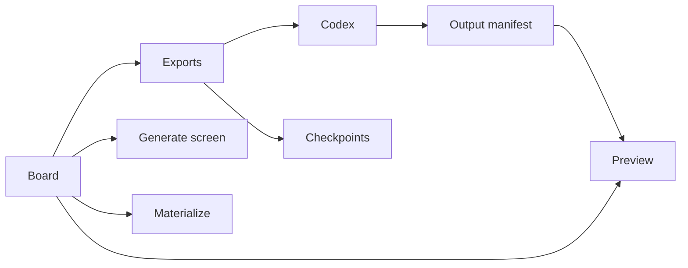
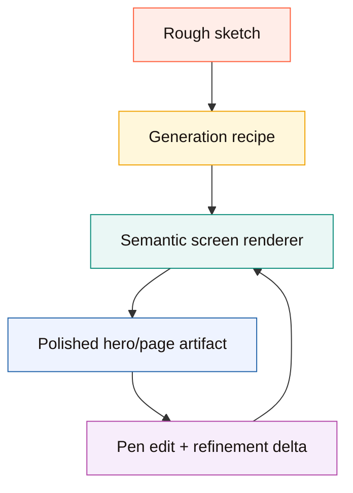
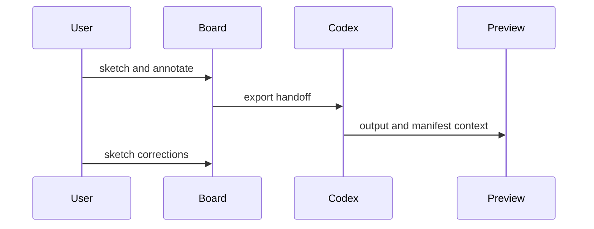
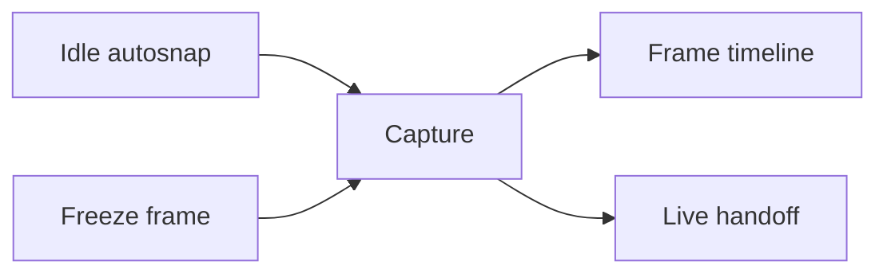
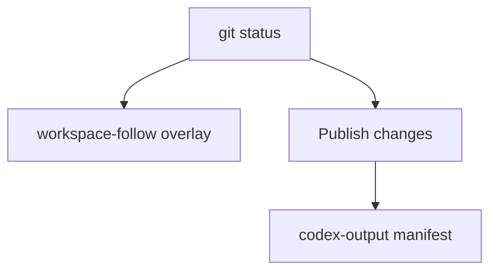
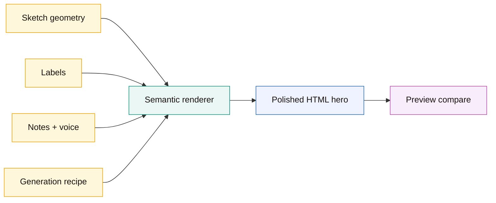
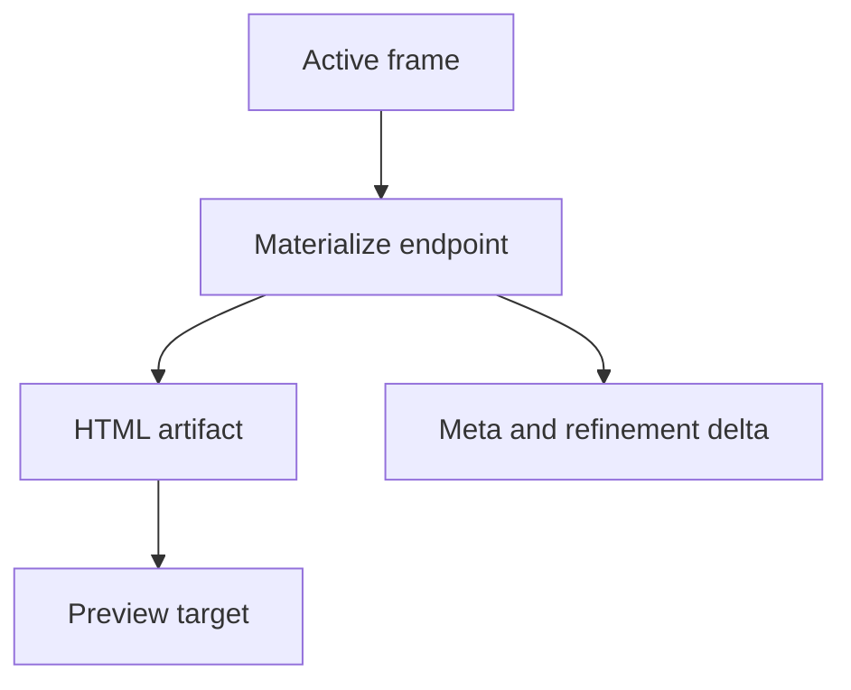

# Canvax Features And Behavior

This document explains what each major Canvax surface and feature does today, how it behaves, and where the current boundaries are.

## Feature Map

```text
Board        -> draw, label, connect, speak, freeze
Preview      -> compare sketch vs output
Generate     -> richer local screen generation
Materialize  -> local "make it feel real" pass
Checkpoints  -> preserve collaboration moments
Manifests    -> connect Codex output back into Canvax
Rewrite queue-> tell Codex what needs attention next
```





## Surfaces

### Board

Files:

- `web/index.html`
- `web/styles.css`
- `web/app.js`

Purpose:

- collect rough visual thinking
- preserve frame structure, labels, notes, flow, and voice context
- keep a live handoff that Codex can read

What the board is for:

- sketching screens
- drawing raw UI ideas
- describing motion and flow
- capturing intent while you are still thinking

What the board is not:

- a production design tool
- a semantic Figma replacement
- the final rendered implementation surface

```text
Board = scratchpad + structure + handoff
```

### Preview

Files:

- `web/preview.html`
- `web/preview.css`
- `web/preview.js`

Purpose:

- show the sketch next to the generated or connected output
- compare what you drew against what Canvax or Codex produced
- surface output activity, changed files, artifacts, and refinement state

Preview is the bridge between:

- your rough sketch input
- a generated or code-backed output surface

```text
Preview = comparison, not the primary sketch input
```

### Local service

Files:

- `canvax`
- `scripts/canvax.mjs`

Purpose:

- serve the board and Preview
- persist exports and manifests
- materialize frames into local HTML artifacts
- keep Canvax single-instance by default

```text
Local service = router + persistence + materialize engine
```

## Main Workflow

The intended daily loop is:

1. run `./canvax`
2. draw in the board
3. add labels, notes, flow links, and voice notes if useful
4. pause for autosnap or press `Freeze frame`
5. ask Codex to use the current Canvax
6. inspect the result in `Preview`
7. sketch corrections or additions
8. repeat

There are two implementation paths:

- `Generate screen`: richer local screen generation from the current frame using the board recipe
- `Materialize`: quick local styled preview from the current frame
- `Codex implementation`: actual code, specs, artifacts, and changed files in the workspace

When Codex Browser Use is available, open `http://localhost:3210` there and keep both the board and Preview inside Codex. That lets Codex inspect the same UI surfaces the user is steering.



## Board Features

### Frame View

Use this when working on one screen or one freeform visual sheet.

Behavior:

- each frame has its own canvas, notes, captures, and viewport
- active frame changes drive what Preview follows by default
- autosnap and freeze operate on the current frame context

Best for:

- single screen sketches
- state exploration
- markup over one concept

### Flow View

Use this when working on multiple connected screens.

Behavior:

- frames become cards on a flow map
- you can connect frames with links and transition labels
- the flow graph is exported with the sketch handoff

Best for:

- app navigation
- onboarding flow
- branching interaction maps

### Drawing Tools

Current core tools:

- `Select`
- `Pen`
- `Marker`
- `Line`
- `Rect`
- `Oval`
- `Arrow`
- `Label`
- `Erase`

Current behavior:

- freehand tools create sketch strokes
- shape tools create structured elements
- labels can be free annotations or attached to elements
- `Select` supports single-select, shift multi-select, grouping, moving, resizing, deleting, and lasso selection

Current limits:

- not every advanced vector-editing affordance exists
- this is optimized for sketching and handoff, not precision illustration

```text
tool classes
  freehand: Pen, Marker
  shapes:   Line, Rect, Oval, Arrow
  semantic: Label
  edit:     Select, Erase
```

### Labels

Labels are meant to explain meaning, not just add text.

Behavior:

- click empty canvas to place a free note
- click on a shape to attach the label to that element
- attached labels follow move and resize operations
- text is entered inline on canvas

Good uses:

- explain what a region is
- mark component names
- note motion or interaction rules
- leave prompt cues for Codex

### Selection And Grouping

Behavior:

- click to select one element
- `Shift` + click to build a multi-selection
- `Group` binds selected items together for move/select behavior
- grouped items can be selected and moved as a set
- layer order can be adjusted
- duplication works from the current selection

Current limit:

- group behavior is useful, but this is not yet a full design-tool transform system

```text
Select
  -> single pick
  -> shift multi-pick
  -> group
  -> move/resize/delete
```

### Captures

Captures are frame-level saved snapshots.

Behavior:

- autosnap creates a fresh saved handoff after idle
- `Freeze frame` forces a capture immediately
- captures are associated with the current frame
- captures can be removed from the UI

Use captures when:

- you want a stable snapshot before a change
- you want to preserve a sketch moment
- you want Canvax to keep a visual trail within the frame



## Voice Features

### Voice Notes

Voice notes preserve spoken intent alongside the sketch.

Modes:

- `Current frame`
- `Whole board`

Behavior:

- browser speech recognition is used when available
- manual voice notes are the fallback when live speech recognition is unavailable
- voice segments are exported into JSON, Markdown prompt output, and `exports/canvax-voice-latest.md`

Use voice notes when:

- you are thinking aloud while drawing
- the sketch alone is ambiguous
- you want Codex to preserve rationale, sequencing, or nuance

Current boundary:

- this is Canvax-native voice capture, not a direct tap into the Codex chat mic stream

```text
voice note sources
  - browser speech recognition
  - manual pasted note
```

## Output And Collaboration Features

### Live Export

Primary files:

- `exports/canvax-live-latest.json`
- `exports/canvax-live-latest.md`

Behavior:

- board sync writes the latest sketch handoff to disk
- exports include frame, flow, notes, voice, and transport metadata
- Codex should read these files by default when using Canvax

```text
live export = rolling latest handoff
checkpoint  = pinned collaboration moment
```

### Checkpoints

Primary files:

- `exports/canvax-checkpoint-latest.json`
- `exports/canvax-session-events.jsonl`
- `artifacts/canvax/checkpoints/...`

Behavior:

- Canvax can create durable collaboration moments
- checkpoints are created on freeze, autosnap, voice events, materialize, and output updates
- session events let the board and Preview rebuild recent collaboration activity

Use checkpoints when:

- you want to preserve the exact collaboration moment
- you want Codex to read a more exact merged handoff than the rolling live export

### Publish Changes

Behavior:

- reads current git workspace changes
- filters out generated Canvax output files
- writes the change list into the Codex output manifest

Why it exists:

- lets the board reflect what Codex has changed in the workspace

Important nuance:

- the board also mirrors current git changes live during preview-state polling, even before a manual publish
- `Publish changes` is the explicit persisted push



### Rewrite Queue

Behavior:

- highlights frames that need output attention
- shows missing target, missing frame binding, missing first output, or stale output conditions
- appears in both the board and Preview
- is also exported in handoff/checkpoint payloads

Why it exists:

- it tells Codex which frames need work next instead of forcing that to be inferred visually

```text
rewrite reasons
  - no output yet
  - no frame binding
  - no target
  - sketch newer than output
```

## Preview Features

### Compare Modes

Modes:

- `Split`
- `Sketch`
- `Output`

Behavior:

- `Split` shows sketch and output together
- `Sketch` focuses on the sketch side
- `Output` focuses on the generated or connected implementation side

```text
Split  = sketch + output
Sketch = sketch only
Output = implementation only
```

### Connected Output

Preview can display:

- a manually attached preview URL
- a generated HTML artifact from `Generate screen`
- a generated HTML artifact from Materialize
- a Codex-provided preview artifact or URL from the output manifest

Behavior:

- same-target outputs reload using a digest-based revision key
- frame-aware manifest bindings help Preview focus on the right frame
- frame cards show output status so you can see stale vs synced states quickly

```text
output sources
  - manual URL
  - materialized html
  - Codex manifest artifact
```

### Artifacts And Changed Files

Preview surfaces:

- generated artifacts
- changed files
- current target summary
- output activity

This is how Canvax starts to feel collaborative instead of acting like a dead export file.

### Preview Snapshots

Files:

- `artifacts/preview/preview-snapshots.json`
- `artifacts/preview/snapshots/...`

Behavior:

- save a compare state from Preview
- preserve current frame, mode, target, and context

Use these when:

- you want review checkpoints
- you want to compare multiple output moments over time

```text
snapshot contents
  - frame
  - compare mode
  - target
  - artifacts/changes
  - sketch image
```

## Generate Screen

Generate screen is the richer local generation path above quick Materialize.

Behavior:

- uses the active frame plus the board generation recipe
- recipe controls:
  - direction
  - output style
  - focus
- uses a semantic hero renderer for hero-like website frames, so the output is no longer just a literal absolute-positioned wireframe
- infers brand, nav, headline, body copy, CTAs, proof chips, preview card, and edit/refinement note from labels and frame notes
- writes back into the same Preview loop as Materialize
- reuses the same per-frame target so Preview stays attached across refreshes

What Generate screen is for:

- turning a sketch into something that feels more like a real website or app screen
- trying stronger design directions without leaving the Canvax loop

```text
Generate screen
  sketch geometry  -> placement hints
  labels           -> semantic meaning
  notes/voice      -> copy and behavior
  recipe           -> visual direction
  refinement delta -> what changed after the edit
```



## Materialize

Materialize is the quick “make this sketch feel real” path.

Behavior:

- reads the active frame
- writes a styled local HTML artifact
- binds that artifact back into Preview
- reuses a stable per-frame target path
- tracks refinement metadata and changed regions on rematerialize

What Materialize is good for:

- early visual iteration before real app code exists
- fast sketch-to-mockup feedback

What Materialize is not:

- a production implementation generator
- a full semantic interpretation engine



## What Is Real Today

Canvax can already help turn rough sketch input into:

- a real webpage direction
- a web app screen or flow
- a product UI/UX spec
- a local interactive preview
- a code-backed implementation workflow

The practical collaboration loop is real:

- you sketch
- Canvax preserves the handoff
- Generate screen or Codex reads it
- output appears in Preview
- you sketch corrections
- Codex updates again

```text
real today:
  rough sketch -> handoff -> preview/code/spec -> sketch refinement
```

## What Is Not Finished

Canvax is still not:

- a one-click production app generator from arbitrary rough sketches
- a full Figma replacement
- a true single-surface co-editing system where edits on the generated UI become semantic implementation edits automatically
- a native embedded canvas inside the Codex composer

The current model is:

- a strong linked sketch-to-output workflow

The future model would be:

- a richer same-thread shared editing surface

```text
not finished yet:
  direct semantic editing on generated UI
  native in-composer canvas
  perfect sketch-to-production automation
```

## Best Docs To Read Next

- `README.md` for project overview
- `docs/USAGE.md` for operator workflow
- `docs/ARCHITECTURE.md` for system design
- `docs/EXECUTION_STATUS.md` for implementation status
- `canvax-live-collaboration-plan.md` for future roadmap
