# Canvax Features And Behavior

This document explains what each major Canvax surface and feature does today, how it behaves, and where the current boundaries are. For the shortest designer-facing operating path, read `docs/DESIGNER_WALKTHROUGH.md`.

## Feature Map

```text
Board        -> draw, label, connect, speak, freeze
Preview      -> compare sketch vs output
Generate     -> richer local screen generation
Materialize  -> local "make it feel real" pass
Checkpoints  -> preserve collaboration moments
Manifests    -> connect Codex output back into Canvax
Rewrite queue-> tell Codex what needs attention next
```

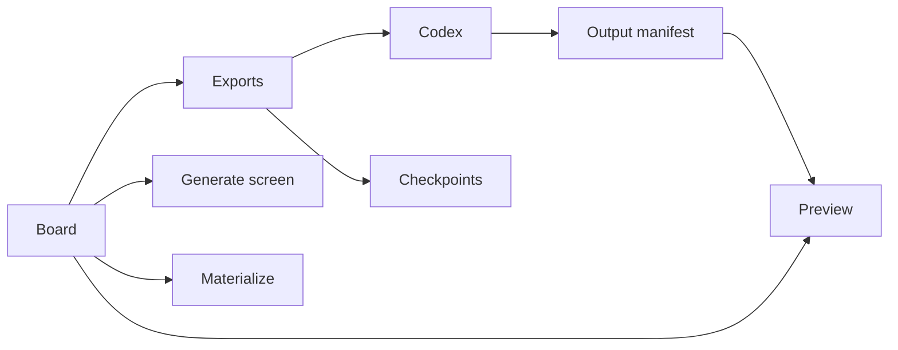

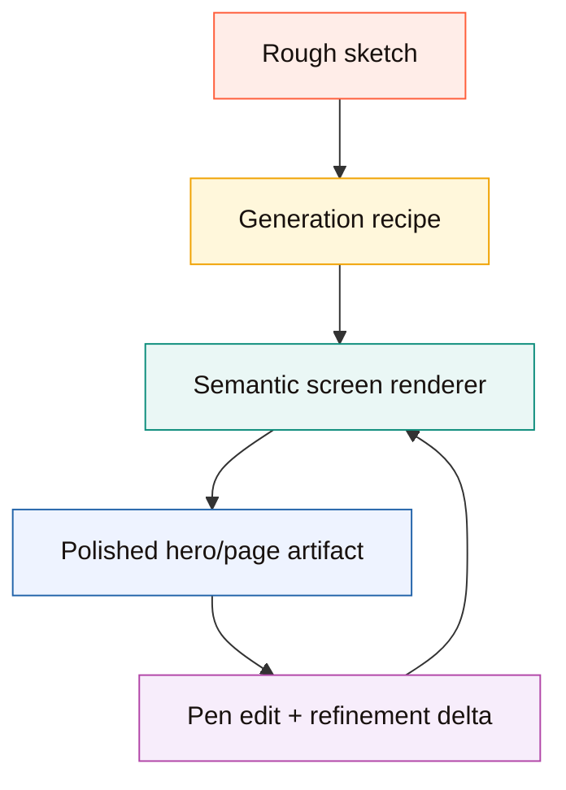

## Surfaces

### Board

Files:

- `web/index.html`
- `web/styles.css`
- `web/app.js`

Purpose:

- collect rough visual thinking
- preserve frame structure, labels, notes, flow, and voice context
- keep a live handoff that Codex can read

What the board is for:

- sketching screens
- drawing raw UI ideas
- describing motion and flow
- capturing intent while you are still thinking

What the board is not:

- a production design tool
- a semantic Figma replacement
- the final rendered implementation surface

```text
Board = scratchpad + structure + handoff
```

### Preview

Files:

- `web/preview.html`
- `web/preview.css`
- `web/preview.js`

Purpose:

- show the sketch next to the generated or connected output
- compare what you drew against what Canvax or Codex produced
- surface output activity, changed files, artifacts, and refinement state

Preview is the bridge between:

- your rough sketch input
- a generated or code-backed output surface

```text
Preview = comparison, not the primary sketch input
```

### Local service

Files:

- `canvax`
- `scripts/canvax.mjs`

Purpose:

- serve the board and Preview
- persist exports and manifests
- materialize frames into local HTML artifacts
- keep Canvax single-instance by default

```text
Local service = router + persistence + materialize engine
```

Runtime reuse is guarded by `/api/status`. The CLI only trusts an existing runtime file when the PID is alive and the status endpoint matches the same workspace root, runtime path, and local transport contract.

`npm run service-lifecycle` validates the local companion without touching the default board: it starts a temporary service on a throwaway port, checks reuse and port mismatch behavior, restarts on another throwaway port, and stops it.

## Main Workflow

The intended daily loop is:

1. run `./canvax`
2. use `Workbench` for quick sketch + voice + generated-output work
3. switch to `Advanced` only when you need frames, flow, captures, manifests, or generation controls
4. ask Codex to use the current Canvax
5. inspect the result in `Preview`
6. sketch corrections or additions
7. repeat

There are two implementation paths:

- `Generate screen`: richer local screen generation from the current frame using the board recipe
- `Materialize`: quick local styled preview from the current frame
- `Codex implementation`: actual code, specs, artifacts, and changed files in the workspace

When Codex Browser Use / Atlas is available, `/canvax` should open `http://localhost:3210` there and keep both the board and Preview inside Codex. That lets Codex inspect the same UI surfaces the user is steering. External browsers are fallback surfaces, not the primary Canvax experience.

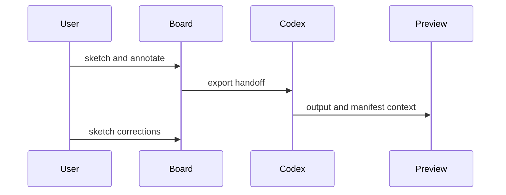

## Board Features

### Workbench

Workbench is the simple default workspace mode.

Behavior:

- hides the timeline, inspector, advanced toolbar, artifacts, rewrite queue, and transport details
- keeps the active frame canvas as the main surface
- shows a mode guide that explains the default loop as `Sketch`, `Talk`, and `Make / Apply`, while Advanced uses the same component to explain `Project rail`, `Canvas deck`, and `Handoff inspector`
- shows a surface selector so mobile, tablet, desktop, poster, slide, book spread, storyboard, comic page, square, or free canvas can be chosen without opening Advanced mode
- shows an action selector for `Build UI`, `Refine UI`, `Write spec`, `Image prompt`, and `Variations`
- shows a `Start here` strip for `1 Sketch`, `2 Talk`, `3 Make`, and `4 Map`, giving first-time designers a short path before they need to understand every control
- exposes `New frame` and `New section`, where section creation also creates a continuation link in the flow graph
- exposes only four drawing tools: pen, rectangle, arrow, erase
- exposes one voice action and one manual spoken-note field
- exposes quick-prompt chips for common refinements such as `Try another font`, `Make it more dramatic`, `Show mobile variant`, `Tighten spacing`, and `Add image candidates`
- exposes `Make real` for the local generated-screen pass
- exposes `Import` in the primary controls and focused floating rail so a designer can place an image without reopening panels
- exposes `Image pack` for a no-API image-generation handoff with coordinates and an HTML/CSS scaffold
- turns pasted or dropped images into editable frame elements for generated candidates, reference crops, storyboards, posters, or UI assets
- exposes `Add image` as the primary Workbench file-picker path for editable references, generated candidates, book/storyboard art, and UI assets
- shows the connected generated output inside the Workbench tray when one exists
- provides `Sketch`, `Split`, `Output`, and `Map` focus modes so the user can either draw on the sketch, inspect sketch and output together, make generated output the primary correction surface, or arrange the project spatially
- exposes the Flow graph as a Workbench `Map` with background drag-pan plus momentum/coast, scroll/pinch or `Ctrl`/`Cmd` wheel zoom, zoom controls, a minimap navigator for click-to-pan orientation, `Fit map` recovery, draggable frame/variant cards, and link handles
- provides `Tidy map` to reflow frame cards plus generated-output and checkpoint shelf objects into compact readable lanes when a long session starts to sprawl
- exposes a `visualfixture=advanced-map` browser-regression fixture so the dense Advanced Map state, output shelf, generated-output labels, and scrolled Advanced command deck can be verified with screenshots
- styles generated variant cards as branch objects with lineage chips and primary-variant state, so generated directions do not look like ordinary duplicate frames
- adds `Use variant` directly to variant cards and matching variant Map objects, so a designer can promote a generated direction as primary without leaving the spatial workbench
- exports editable generated variant branches through `spatialWorkspace.variantBranches` and `spatialWorkspace.objects`, including source frame, target frame, direction, connection, editable state, primary-promotion state, and object-level context
- adds labeled group regions, manual note cards, and reference file/image cards directly to `Map`, including removable/resizable spatial cards and small image thumbnails for lightweight reference boards
- lets Map group regions move contained frame cards and spatial objects together, so grouped explorations can be repositioned without rebuilding the board
- exports group containment and hierarchy from `Map`, so frames and spatial objects carry `groupIds`, `spatialWorkspace.groups` lists member frames/objects, `spatialWorkspace.groupHierarchy` records parent/child group paths, recursive nested group move/resize keeps geometry-contained boards together, and selected group context includes a lightweight contents inspector for Codex-readable exploration boards
- lets designers select Map objects, Shift-click multi-select them, Shift-drag empty Map space to lasso-select them, drag a selected set together, resize the selected set from a combined transform box, see a visible Copy context/Pin/Lock/Group/Ungroup/Select contents/Fit group/Lane earlier/Lane later/Send back/Bring front/Duplicate/Delete/Clear action strip, copy a no-API Markdown object or selection handoff for Codex or image-generation prompting, nudge objects with arrow keys, group them with `Cmd/Ctrl+G`, ungroup selected group regions with `Shift+Cmd/Ctrl+G`, select group contents, fit group regions around their current contents, duplicate them with `Cmd/Ctrl+D`, reorder layers with `Cmd/Ctrl+[` and `Cmd/Ctrl+]`, move selected output/history cards earlier or later inside their lane, move selected variant/output-edit branch cards earlier or later in their source-frame branch sequence, drag branch cards across sibling branch positions to update branch sequence, delete them with `Delete`/`Backspace`, duplicate a group region with its contained Map objects, lock important references/outputs to block accidental move, resize, reorder, duplicate, group, ungroup, lane-order, branch-order, or delete actions, and export the current pointed-at object/selection through `spatialWorkspace.selectedObjectId`, `spatialWorkspace.selectedObjectIds`, `spatialWorkspace.selectedObject`, `spatialWorkspace.selectedObjects`, per-object `prompt`, per-object `locked`, per-object `layerIndex` / `layerLabel`, lane order metadata, branch order metadata, and per-object `contextMarkdown`
- exposes Title, Note, Status, Prompt / Context, custom `key: value` properties, and safe type-detail override fields for a single selected Map object, plus structured per-type inspector sections such as generated target path, asset placement bounds, checkpoint contents, variant state, group contents, or reference file metadata, so designers can inspect and clarify objects without editing raw manifests
- uses the selected Map object's Prompt / Context and custom properties as the explicit instruction handoff for Codex or a host image tool, so generated outputs, image assets, references, notes, and groups can say what they should become without editing raw JSON
- renders image/asset candidates as draggable spatial object cards in `Map`, so prompts and generated-asset slots can sit beside frames instead of only living in exports or side panels
- renders generated screen targets, generated artifacts, and changed files from the Codex output manifest as draggable spatial object cards in `Map`, so implementation outputs sit in the same project space as sketches and asset candidates
- labels generated output cards as `Generated screen`, `Generated file`, or `Code change`, adds an `Output ref` badge, canonicalizes older raw source labels, infers frame binding from current and legacy generated-output paths, and the Map help text plus inline Output shelf legend explain that those cards are prior Materialize/Build outputs rather than extra frames
- provides `Clear outputs` in `Map` to hide generated screen/artifact/change cards when the exploration board gets cluttered
- groups generated screen/file/code-change cards inside a collapsible `Output shelf` lane so Make/Build results read as generated references, not new frames; the lane legend defines `Generated screen`, `Generated file`, and `Code change` directly on the spatial map
- hides internal Materialize support artifacts such as context JSON, meta JSON, and sketch-overlay files from the designer Map while keeping those files in manifests for Codex/debugging
- starts new and migrated Maps with the output and history shelves compressed unless the designer is already focused on those shelves, so old generated screens, artifacts, changed files, and checkpoints remain reachable without overwhelming the first view
- lets designers turn an output preview card into an editable `Output edit` frame, preserving the source frame, generated target path, flow connection, variant branch object, `spatialWorkspace.variantBranches[].outputBinding`, and task/rewrite/build `outputEditBinding` so corrections can happen on a normal sketch frame while Codex still knows the exact generated output being revised
- saves output correction marks with normalized changed-region bounds, and treats Erase on the output surface as deletion of intersecting correction marks instead of a new exported eraser stroke
- renders recent checkpoints inside a named spatial history lane in `Map`, so collaboration moments sit beside frames, variants, references, and generated outputs while still reading like a timeline
- adds a compact `Map timeline` strip above the spatial board for frames, branches, outputs, and checkpoints; clicking an item focuses/scrolls the Map, and the same sequence exports as `spatialWorkspace.timeline`
- lets selected output/history cards move earlier or later inside their lane, preserving the lane order in `meta.laneIndex`, the object inspector, context Markdown, and `spatialWorkspace.lanes[].memberObjectIds`
- lets selected variant/output-edit branch cards move earlier or later in their source-frame branch sequence, or drag across visible sibling branch drop targets to update that sequence, preserving `frame.variant.index`, the branch track, and ordered `spatialWorkspace.variantBranches`
- provides `Hide history` / `Show history` in `Map` to collapse checkpoint cards without deleting them, and exports the lane state as `spatialWorkspace.lanes[].collapsed`
- provides Map focus chips for `All`, `Output`, `Assets`, `Notes`, and `History`, so designers can reduce spatial clutter without deleting cards; the active focus exports as `spatialWorkspace.objectFilter`
- lets designers pin important Map objects so they stay visible across focus filters and collapsed history, with pinned state exported on each `spatialWorkspace.objects[]` record
- lets designers lock important Map objects so reference images, generated outputs, and notes can stay selectable/copyable but protected from accidental move, resize, grouping, reordering, duplication, or deletion; locked state exports on each `spatialWorkspace.objects[]` record and in copied context Markdown
- exports the current or last rendered Map viewport as `spatialWorkspace.viewport`, including zoom, scroll offset, visible bounds, and normalized center, so Codex can understand which part of a large board the designer is looking at
- saves pen/marker correction marks drawn over the generated output as frame-level handoff data
- provides a bottom floating designer rail for select, pen, rect, arrow, erase, brush `-` / `+`, undo, redo, voice, Make, Image, and Apply when `Focus canvas` is active
- provides a bottom command composer for typed/pasted dictation, Talk, Note, Make, and Apply while sketching in focused canvas mode
- makes rail/slider size controls context-sensitive: they resize the selected element in Select mode, otherwise they change the active brush/eraser size
- treats erase as an ink-layer operation, so erasing sketch strokes does not wipe the paper/grid base and does not become black geometry in prompt packs or materialized output
- `Focus canvas` collapses the context tray so the canvas becomes the primary design surface while a compact frame/surface/action/focus summary stays visible; `Show brief` brings the context tray back
- `Apply to Codex` freezes the frame, writes the live export, saves a Workbench checkpoint, and runs the local no-API rewrite executor when an output can be refreshed
- `Live rewrite` is an opt-in mode that runs the same local no-API rewrite executor after autosnap/freeze saves the latest handoff
- if a new autosnap/freeze happens while Live rewrite is already refreshing output, Canvax queues the newest handoff and runs it as soon as the in-flight rewrite finishes
- `Preview` remains available without exposing the rest of Advanced mode

```text
Workbench
  rough sketch
  + voice note
  + generated output
  + visual correction marks
  + Apply to Codex / Live rewrite
      -> live export
      -> checkpoint
      -> rewrite request
      -> local refreshed output target
      -> Codex reads one clear handoff
```

Boundary:

- Workbench is intentionally simple, but it must not hide core decisions like mobile vs desktop or "add another screen".
- `Free canvas` is a large board preset. `Map` is the first persistent spatial project layer for frame/variant cards, labeled group regions, manual notes, reference file/image cards, asset candidate objects, generated output targets, artifacts, changed files, checkpoint history lane objects, and a compact timeline strip exported through `spatialWorkspace.timeline`, including branch tracks for variant/output-edit lineage, the collapsible `Output shelf` lane for generated Make/Build results, and whether each lane is collapsed. The Map focus filter can show all objects or focus only output, assets, notes, or history without deleting anything, and the `Find` field narrows large Maps by generated-output title, asset prompt, note text, path, frame label, or status while exporting `spatialWorkspace.objectFilter.searchQuery`. Generated outputs are now labeled as designer-facing output references, frame binding is inferred from generated artifact paths when possible, outputs bound only to deleted frames are hidden, repeated outputs collapse to the latest useful per-frame/per-kind card, background flicks can coast with pan momentum, the minimap navigator gives orientation plus click-to-pan movement, `Fit map` recovers visible frames/objects after zooming or panning, and `Tidy map` compacts output/history shelves back into readable lanes. Spatial objects can be selected, Shift-click or lasso multi-selected, moved as a selected set, resized individually or as a combined selected set, grouped into a region wrapper, ungrouped without deleting contents, selected from group contents, fit back into a group region, reordered front/back, moved earlier/later inside output/history lanes, moved earlier/later or drag-positioned inside branch sequences, renamed/clarified through a lightweight property editor, given custom properties and type-specific detail overrides, inspected through structured per-type sections, nudged, duplicated, deleted, group-duplicated with contained Map objects, and exported as the active selected object with layer order, lane order, branch order, timeline order, group hierarchy path, custom properties, and an `inspector` contract, but Map is not yet a finished infinite canvas with advanced nested object editing.
- Preview manifests are normalized before the board reads them: duplicate note paragraphs are collapsed, long note history is capped, and old target/artifact/change arrays are pruned to recent unique entries so generated output context does not overwhelm the designer surface.
- Pasted/dropped image assets are editable canvas elements. `Reference underlay` remains the explicit path for a non-editable tracing/background image.
- Native Codex microphone reuse is not available from the local web board; use browser speech recognition, paste Codex/macOS dictation into the note field, or let Codex forward submitted chat transcripts through `./canvax --transcript "..." --scope frame`.
- ChatGPT/image generation integration is host-driven. Canvax exports the composition, coordinates, prompt, scaffold, and style lock; it does not directly invoke a paid image API or require an API key.
- The host capability chip is explicit about what Canvax can do locally today: Codex workspace/browser handoff is available, direct host image generation and native Codex microphone access require a future first-party bridge.
- If `DESIGN.md` exists at the project root, Canvax includes it as design context in task packs and image prompt packs.
- The Advanced `Design kit` card shows the active rule stack, can apply local presets for product apps, poster systems, book spreads, dashboards, and storyboards, and can extract current-frame sketch/reference tokens locally. The selected kit and extracted tokens export as `designKit` in task packs, image prompt packs, and Build-with-Codex requests.
- Image prompt packs include a `canvax-style-lock` block with palette, continuity rules, adaptation rules, negative rules, design-context summary, frame signals, and extracted sketch-token cues so image/book/comic/poster candidates can stay consistent across frames.
- In Advanced mode, `Create DESIGN.md` writes a starter project design file from the current board without overwriting an existing file.

### Responsive Regression

The browser regression harness validates the board and Preview at the widths designers have been testing manually:

```text
1440 desktop
1024 laptop
 768 tablet
 430 narrow Codex/browser panel
```

The smoke check is structural, not a replacement for visual taste review. It verifies that the shell, toolbar, canvas/stage, Preview header, and compare surfaces remain visible and do not collapse at those sizes. The browser regression harness also captures board and Preview PNGs for each viewport and writes an index under `artifacts/canvax/browser-snapshots/latest/`.

The board browser self-test also includes a dense long-session Map fixture. It renders 18 captured frames with voice notes, generated screen targets, generated artifacts, changed files, checkpoints, and asset candidates in the same spatial workspace so regressions in large project boards fail before manual use. The same test asserts that the default Workbench brief keeps the fixed rail/composer hidden, while `Focus canvas` makes those controls visible.

`npm run e2e-workflow` is the explicit rough-sketch-to-real-output proof. It creates a synthetic sketch frame with voice, correction marks, image prompt data, and asset candidates, then verifies the no-API build executor, dry-run Codex manifest binding, and rewrite executor as one chain. The proof manifest is written to `artifacts/canvax/e2e-workflow/latest/result.json`.

`npm run goal-audit` is the strict completion guard. It maps the current Stitch-plus objective to concrete source/docs evidence and writes `artifacts/canvax/goal-audit/latest/result.{json,md}`. A passing evidence checklist is not the same as completed parity; the audit keeps `overallComplete: false` while native host bridges and high-fidelity production generation remain unproven.

The CLI now has explicit port recovery behavior: matching Canvax services can be recovered from `/api/status` when runtime files are stale or missing, while non-Canvax listeners produce a structured `portOccupied` response instead of a silent timeout.

### Advanced

Advanced is the full inspector/debugging surface for frames, flow links, notes,
captures, manifests, generated artifacts, and long-session diagnostics. It uses
the same dark dotted Canvax visual language as Workbench, but keeps the denser
left timeline, central stage, and right inspector because those controls are for
technical handoff rather than quick sketching. The mode switch describes the
active role, and Advanced labels its frame stack, frame workspace/flow map, and
handoff inspector so the density reads as an inspector deck instead of a
different app. The Advanced command deck is intentionally solid and non-glass,
so canvas/grid content does not visually bleed through the controls while long
frame or Map sessions are inspected. On narrower windows, Advanced collapses into a
single-column inspector deck instead of preserving the desktop three-rail shell,
so the mode switch and command controls remain usable.

### Task, Rewrite, And Image Prompt Packs

Files:

- `exports/canvax-task-pack-latest.json`
- `exports/canvax-task-pack-latest.md`
- `exports/canvax-rewrite-request-latest.json`
- `exports/canvax-rewrite-request-latest.md`
- `exports/canvax-image-prompt-pack-latest.json`
- `exports/canvax-image-prompt-pack-latest.md`

Purpose:

- give Codex a compact build/spec work order
- give Codex a focused rewrite request for connected outputs, queued frames, correction marks, and voice notes
- give image-generation hosts a composition-preserving prompt pack
- keep sketch, labels, notes, voice, output annotations, viewport, safe zones, and normalized coordinates together
- carry the selected Map object prompt/context into task, rewrite, build, and image prompt handoffs
- include a rewrite `revisionGraph` that maps frame revisions to frame-bound output targets, artifacts, changed files, stale status, and queue reasons

```text
frame elements -> normalized bounds -> role inference -> prompt + scaffold
```

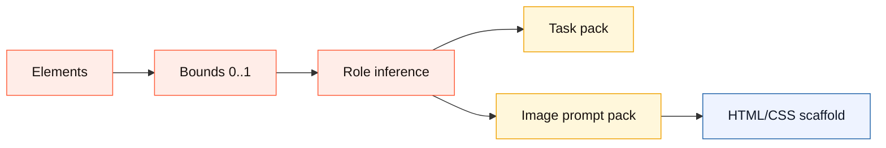

The HTML/CSS scaffold is intentionally simple. It is a placement contract for another model or host capability, not production UI code.

### Frame View

Use this when working on one screen or one freeform visual sheet.

Behavior:

- each frame has its own canvas, notes, captures, and viewport
- active frame changes drive what Preview follows by default
- autosnap and freeze operate on the current frame context

Best for:

- single screen sketches
- state exploration
- markup over one concept

### Flow View

Use this when working on multiple connected screens.

Behavior:

- frames become cards on a flow map
- you can connect frames with links and transition labels
- the flow graph is exported with the sketch handoff

Best for:

- app navigation
- onboarding flow
- branching interaction maps

### Drawing Tools

Current core tools:

- `Select`
- `Pen`
- `Marker`
- `Line`
- `Rect`
- `Oval`
- `Arrow`
- `Label`
- `Erase`

Current behavior:

- freehand tools create sketch strokes
- shape tools create structured elements
- labels can be free annotations or attached to elements
- `Select` supports single-select, shift multi-select, grouping, moving, resizing, deleting, and lasso selection

Current limits:

- not every advanced vector-editing affordance exists
- this is optimized for sketching and handoff, not precision illustration

```text
tool classes
  freehand: Pen, Marker
  shapes:   Line, Rect, Oval, Arrow
  semantic: Label
  edit:     Select, Erase
```

### Labels

Labels are meant to explain meaning, not just add text.

Behavior:

- click empty canvas to place a free note
- click on a shape to attach the label to that element
- attached labels follow move and resize operations
- text is entered inline on canvas

Good uses:

- explain what a region is
- mark component names
- note motion or interaction rules
- leave prompt cues for Codex

### Selection And Grouping

Behavior:

- click to select one element
- `Shift` + click to build a multi-selection
- `Group` binds selected items together for move/select behavior
- grouped items can be selected and moved as a set
- layer order can be adjusted
- duplication works from the current selection

Current limit:

- group behavior is useful, but this is not yet a full design-tool transform system

```text
Select
  -> single pick
  -> shift multi-pick
  -> group
  -> move/resize/delete
```

### Captures

Captures are frame-level saved snapshots.

Behavior:

- autosnap creates a fresh saved handoff after idle
- `Freeze frame` forces a capture immediately
- captures are associated with the current frame
- captures can be removed from the UI

Use captures when:

- you want a stable snapshot before a change
- you want to preserve a sketch moment
- you want Canvax to keep a visual trail within the frame

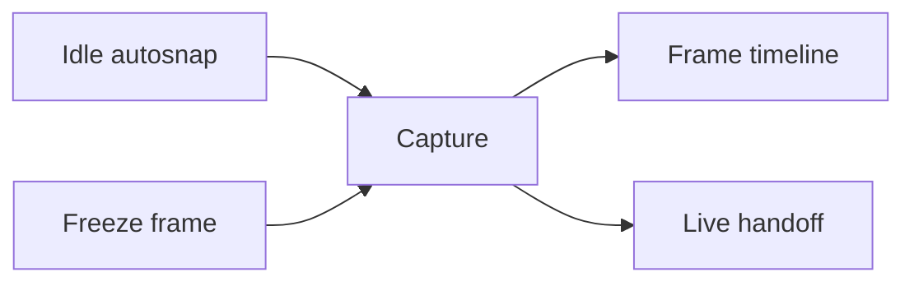

## Voice Features

### Voice Notes

Voice notes preserve spoken intent alongside the sketch.

Modes:

- `Current frame`
- `Whole board`

Behavior:

- browser speech recognition is used when available
- manual voice notes are the fallback when live speech recognition is unavailable
- Codex chat transcript forwarding is available through `./canvax --transcript "..." --scope frame|session`
- voice segments are exported into JSON, Markdown prompt output, and `exports/canvax-voice-latest.md`

Use voice notes when:

- you are thinking aloud while drawing
- the sketch alone is ambiguous
- you want Codex to preserve rationale, sequencing, or nuance

Current boundary:

- this is Canvax-native voice capture plus a transcript bridge, not a direct tap into raw Codex chat mic audio

```text
voice note sources
  - browser speech recognition
  - manual pasted note
  - Codex chat transcript bridge
```

## Output And Collaboration Features

### Live Export

Primary files:

- `exports/canvax-live-latest.json`
- `exports/canvax-live-latest.md`

Behavior:

- board sync writes the latest sketch handoff to disk
- exports include frame, flow, notes, voice, and transport metadata
- Codex should read these files by default when using Canvax

```text
live export = rolling latest handoff
checkpoint  = pinned collaboration moment
```

### Checkpoints

Primary files:

- `exports/canvax-checkpoint-latest.json`
- `exports/canvax-session-events.jsonl`
- `artifacts/canvax/checkpoints/...`

Behavior:

- Canvax can create durable collaboration moments
- checkpoints are created on freeze, autosnap, voice events, materialize, and output updates
- session events let the board and Preview rebuild recent collaboration activity

Use checkpoints when:

- you want to preserve the exact collaboration moment
- you want Codex to read a more exact merged handoff than the rolling live export

### Publish Changes

Behavior:

- reads current git workspace changes
- filters out generated Canvax output files
- writes the change list into the Codex output manifest

Why it exists:

- lets the board reflect what Codex has changed in the workspace

Important nuance:

- the board also mirrors current git changes live during preview-state polling, even before a manual publish
- `Publish changes` is the explicit persisted push

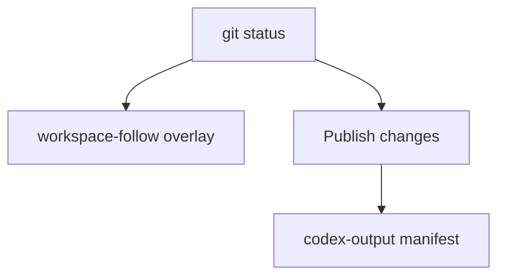

### Rewrite Queue

Behavior:

- highlights frames that need output attention
- shows missing target, missing frame binding, missing first output, or stale output conditions
- appears in both the board and Preview
- is also exported in handoff/checkpoint payloads

Why it exists:

- it tells Codex which frames need work next instead of forcing that to be inferred visually

```text
rewrite reasons
  - no output yet
  - no frame binding
  - no target
  - sketch newer than output
```

## Preview Features

### Compare Modes

Modes:

- `Split`
- `Sketch`
- `Output`

Behavior:

- `Split` shows sketch and output together
- `Sketch` focuses on the sketch side
- `Output` focuses on the generated or connected implementation side
- `Play flow` starts from the entry frame and lets connected frames be clicked through as a lightweight storyboard prototype
- In Play mode, outgoing Flow links become clickable hotspot overlays on both the sketch preview and connected output viewport
- In Frame view, select a drawn element and assign a target frame in the Prototype flow inspector to make that exact element bounds a persistent clickable hotspot in Preview Play.

```text
Split  = sketch + output
Sketch = sketch only
Output = implementation only
Play   = clickable storyboard hotspots from Flow links and selected elements
```

### Connected Output

Preview can display:

- a manually attached preview URL
- a generated HTML artifact from `Generate screen`
- a generated HTML artifact from Materialize
- a Codex-provided preview artifact or URL from the output manifest

Behavior:

- same-target outputs reload using a digest-based revision key
- frame-aware manifest bindings help Preview focus on the right frame
- frame cards show output status so you can see stale vs synced states quickly

```text
output sources
  - manual URL
  - materialized html
  - Codex manifest artifact
```

### Artifacts And Changed Files

Preview surfaces:

- generated artifacts
- changed files
- current target summary
- output activity

This is how Canvax starts to feel collaborative instead of acting like a dead export file.

### Preview Snapshots

Files:

- `artifacts/preview/preview-snapshots.json`
- `artifacts/preview/snapshots/...`

Behavior:

- save a compare state from Preview
- preserve current frame, mode, target, and context

Use these when:

- you want review checkpoints
- you want to compare multiple output moments over time

```text
snapshot contents
  - frame
  - compare mode
  - target
  - artifacts/changes
  - sketch image
```

## Generate Screen

Generate screen is the richer local generation path above quick Materialize.

Behavior:

- uses the active frame plus the board generation recipe
- recipe controls:
  - direction
  - output style
  - focus
- uses a semantic hero renderer for hero-like website frames, so the output is no longer just a literal absolute-positioned wireframe
- reads loose strokes, arrows, ovals, image slots, and free labels as semantic source material when the sketch is not a clean box wireframe
- infers brand, nav, headline, body copy, CTAs, proof chips, preview card, and edit/refinement note from labels and frame notes
- keeps original sketch and free-note overlays hidden by default in generated outputs; `Show sketch overlay` and `Show note overlay` are explicit optional review overlays, not generated product UI
- writes back into the same Preview loop as Materialize
- reuses the same per-frame target so Preview stays attached across refreshes

What Generate screen is for:

- turning a sketch into something that feels more like a real website or app screen
- starting from rough designer scratchpad marks before the layout is clean enough to be a formal wireframe
- trying stronger design directions without leaving the Canvax loop

## Build With Codex

Build with Codex is the first real-code bridge.

It writes a task artifact that Codex can execute in the current workspace. The board now also calls the local `execute-build-request` path after saving the request, so designers immediately get a frame-bound preview artifact, implementation starter files, and output manifest without opening a terminal or using a paid API.

That automatic artifact is a local starter target. Codex should replace or port it into real app/page/component files when the user asks for production implementation. The bundle includes a React-ready `CanvaxScreen.jsx`/`CanvaxScreen.css` pair, Vite/Next adapter stubs, `FRAMEWORK_ADAPTERS.md`, `canvax-component-map.json`, `canvax-build-contract.json`, `codex-port-task.json`, `INTEGRATION.md`, and `ACCEPTANCE.md` so Codex can map sketch element ids to generated selectors, preserve that relationship during the port, know the no-API boundaries, and review production readiness from one checklist.

The request and executor context now include `implementationContext`. This is the compact designer brief Codex should read before coding: Workbench path, focus mode, action mode, generation recipe, active Design kit, extracted sketch tokens when present, selected Map prompts/custom properties, variant semantic recipe/style knobs, image style lock, and output-edit binding.

The local executor also consumes that context and the active Design kit. It chooses a deterministic visual theme from the kit preset, variant/style/Map guidance, and extracted sketch tokens, writes `data-canvax-theme` and `data-canvax-atmosphere` onto the generated preview and starter screen, adds theme-specific atmosphere layers, and adds a visible `Designer context` panel to the generated artifact. This keeps the no-API starter output aligned with directions such as poster/archive, book/storyboard, dashboard/ops, midnight/cinematic, or quiet/editorial before Codex ports the result into real app files.

The bundle also includes `implementation/codex-port-task.json`, a machine-readable task for Codex. It lists source artifacts, suggested React/Vite/Next destinations, required `data-canvax-*` bindings, port steps, acceptance criteria, and publish commands so the generated screen can become real workspace code without inventing the handoff each time.

Outputs:

- `exports/canvax-build-real-latest.json`
- `exports/canvax-build-real-latest.md`
- archived copies under `artifacts/canvax/build-requests/`
- optional local build artifacts under `artifacts/preview/codex-build/frames/...`
- implementation starter files under `artifacts/preview/codex-build/frames/<frame-id>/implementation/`
- `implementation/CanvaxScreen.jsx` and `implementation/CanvaxScreen.css` for a portable React handoff
- `implementation/ViteApp.jsx`, `implementation/NextAppPage.jsx`, and `implementation/FRAMEWORK_ADAPTERS.md` for framework porting
- `implementation/canvax-component-map.json` for frame-to-code ownership
- `implementation/canvax-build-contract.json` for machine-readable integration boundaries, adapter paths, and no-API requirements
- `implementation/codex-port-task.json` for a machine-readable Codex production-port task
- `implementation/INTEGRATION.md` for the human-readable Vite/React/Next porting path
- `implementation/ACCEPTANCE.md` for the production-readiness checklist and publish-back commands

What the request includes:

- frame-to-code binding target
- active frame composition and notes
- voice/manual notes
- `DESIGN.md` context when present
- `implementationContext` with Workbench state, selected Map guidance, variant direction, and output target binding
- live export, task pack, checkpoint, and image prompt pack paths
- `artifacts/canvax/codex-output.json` as the binding manifest
- suggested `write-codex-output` commands

```text
Generate screen:
  local renderer -> HTML preview artifact

Build with Codex:
  frame request -> implementationContext -> themed local preview + implementation bundle + Codex port task -> output manifest
  frame request -> Codex writes real files -> output manifest -> Preview binding

Local smoke executor:
  latest request -> HTML artifact + React/framework handoff + component map -> output manifest -> Preview binding
```

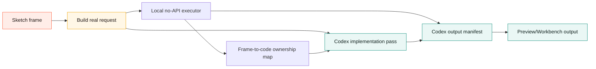

The Canvax handoff remains local-first: no `OPENAI_API_KEY` is required to create the request.

## Rewrite Request Executor

`execute-rewrite-request` is the deterministic local smoke path for the live refinement loop. Workbench `Apply to Codex` now invokes this path through the local server after saving the latest checkpoint, while the CLI remains useful for repeatable debugging.

It reads:

- `exports/canvax-rewrite-request-latest.json`
- `exports/canvax-task-pack-latest.json`
- frame-to-code ownership maps from `canvax-component-map.json` artifacts when the connected output includes one
- build integration contracts from `canvax-build-contract.json` artifacts when the connected output includes one
- Codex port tasks from `codex-port-task.json` artifacts when the connected output includes one

It writes:

- `artifacts/preview/codex-rewrite/frames/<frame-id>/index.html`
- `artifacts/preview/codex-rewrite/frames/<frame-id>/context.json`
- `artifacts/canvax/codex-output.json` unless `--no-publish` is used

```text
latest sketch / voice / correction marks
  -> rewrite request
  -> affected regions map to generated selectors when available
  -> local refreshed preview artifact
  -> output manifest
  -> Workbench and Preview reload the frame-bound output
```

The generated context includes the selected rewrite queue item, affected regions, affected generated component targets, connected output targets, and the original request. This keeps the rough-sketch-to-refined-output path testable without an API key while leaving real app/code rewrites to Codex.

When a build contract is attached, the rewrite executor also preserves `visualDirection`: theme id, atmosphere id, atmosphere label, and designer brief. When a port task is attached, the rewrite context preserves suggested destinations, required bindings, acceptance criteria, and publish commands. That keeps a refined preview visually aligned with the generated build surface and keeps future correction passes connected to the production-port task instead of falling back to a generic rewrite skin.

Preview now has a `Rewrite handoff` lane beside the rewrite queue. It shows whether the latest request exists, whether a local executor artifact has been published, the frame-bound manifest state, and quick links to the request/output/context files.

## Editable Variant Branches

`Create variants` turns the active frame into three editable semantic branch frames:

- `Structure`
- `Visual`
- `Adaptive`

These are not static thumbnails. They are normal Canvax frames with copied sketch elements, a visible variant label, lineage metadata, and Flow connections back to the source frame.

Each branch also carries a deterministic no-API design recipe:

- `Structure` clarifies layout, hierarchy, alignment, spacing, and component grouping.
- `Visual` pushes palette, typography, imagery, contrast, and atmosphere while preserving the same intent.
- `Adaptive` translates the same sketch into another breakpoint, platform, or interaction state.

The recipe is exported as `variant.recipeId`, `variant.thesis`, `variant.designMoves`, `variant.prompt`, `variant.styleProperties`, and `variant.customProperties`. The matching Map object exposes the same recipe as Prompt / Context plus custom `key: value` properties such as `variant-recipe`, `variant-purpose`, `variant-thesis`, `design-moves`, and `style-*` values. This gives Codex a readable design brief for each branch without calling a paid image or model API.

When a `variant-branch` Map object is selected, the inspector shows focused `Variant style knobs` for:

- palette
- typography
- density
- motion
- imagery / asset direction

Those fields update the variant frame and the Map object together, then export through `spatialWorkspace.variantBranches[].styleProperties`, `spatialWorkspace.variantBranches[].semanticRecipe.styleProperties`, object metadata, and copied Map context. This is still local deterministic metadata, but it gives designers a real per-branch style control surface instead of only a generic note field.

They also export as `spatialWorkspace.variantBranches` and as `variant-branch` Map objects, so Codex can distinguish alternate generated directions from ordinary navigation links and from general notes/references.

Select a variant and use `Use variant` when that branch should become the primary direction. Canvax marks the frame as a primary variant, makes it the entry frame, updates the matching variant Map object, and preserves the lineage metadata for Codex handoff.

In Map, select one or more branch cards from the same source frame and use `Branch earlier` / `Branch later` to reorder that branch sequence without changing unrelated screen order. Dragging a branch card across visible sibling drop targets also updates the branch sequence from Map position. The order is stored in `frame.variant.index`, reflected in the branch timeline track, shown as `Branch n of m` on the card/context, and exported through `spatialWorkspace.variantBranches`.

```text
active frame
  -> clone editable sketch
  -> add variant label and semantic recipe
  -> attach lineage metadata, prompt, and custom properties
  -> connect branch in Flow view
```

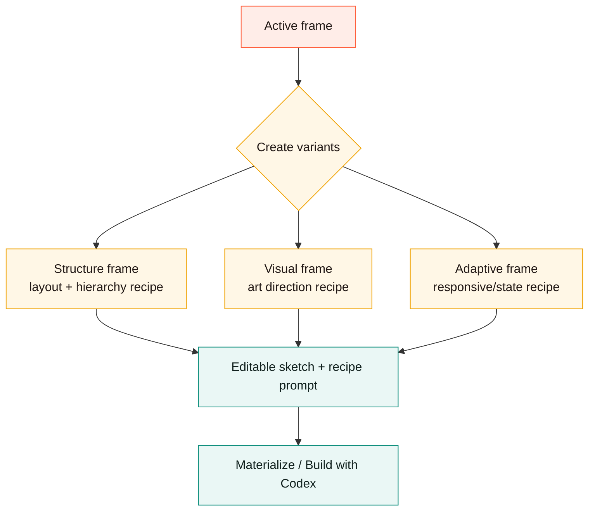

The implementation is deterministic and local. It creates branchable design surfaces that Codex can later build from. Host-level AI variant generation can still be layered on top later, but the core Canvax variant workflow does not require an API key.

## Asset Candidate Records

`Image pack` now writes two related local handoffs:

- image prompt pack
- asset candidate pack

The asset candidate pack is stored at:

- `exports/canvax-asset-candidates-latest.json`
- `exports/canvax-asset-candidates-latest.md`
- `exports/canvax-image-generation-brief-latest.json`
- `exports/canvax-image-generation-brief-latest.md`
- `exports/canvax-image-host-task-latest.json`
- `exports/canvax-image-host-task-latest.md`
- `artifacts/canvax/asset-candidates/...`

Each candidate is a prompt-ready asset slot:

- source frame
- optional source region
- prompt and negative prompt
- style-lock reference for visual continuity
- normalized bounds
- pixel bounds for the source viewport
- CSS placement values
- generated-code target selector
- aspect ratio
- HTML/CSS slot scaffold
- output slot for a generated image path later
- frame-grouped review queue for pending, placed, attached, and accepted state
- no-API host handoff files and workflow
- image host task records for hosted image generation, return instructions, and slot binding

Every candidate now carries a `placementMap`:

```text
placementMap
  slotId        stable local slot id
  surface       desktop / mobile / free canvas viewport
  bounds        normalized + pixel coordinates
  cssPlacement  left/top/width/height/aspect-ratio
  selector      data-asset-candidate-id target
  scaffold      minimal HTML slot for host image/code tools
```

The image generation brief is the copy-ready host handoff. It combines:

- candidate prompts and negative prompts
- style-lock summary and continuity rules
- normalized, pixel, and CSS placement contracts
- output-slot status for reattaching generated images
- a `canvax-asset-candidate-review` summary grouped by frame
- a `hostPrompt` block per candidate for ChatGPT/Codex image-generation hosts

The image host task is the machine-readable execution handoff. It combines:

- one task per image candidate
- the same host prompt and negative prompt
- placement contract and output-slot id
- return instructions for workspace files, pasted images, or frame references
- acceptance criteria for review before the candidate is accepted
- an explicit `requiresOpenAiApiKey: false` and `noApiBoundary` declaration

Workbench now reads the latest candidate pack and renders a compact `Asset candidates` tray after `Image pack` succeeds. Each card can:

- copy the candidate prompt plus pixel/CSS placement contract for ChatGPT/Codex image-generation hosts
- copy a single-candidate image host task with prompt, output-slot binding, return instructions, and no-API boundary
- place an editable image placeholder on the source frame or candidate bounds
- attach a generated image file into that same region
- attach a generated image from a workspace-relative path, `/workspace/...` URL, absolute path inside the Canvax project root, or data image URL
- show attached image previews and prompt-ready / attached / accepted review status
- select the placed image element on its source frame
- accept an attached generated image as the chosen candidate for that frame or region
- preserve the candidate id on the image element for later export, materialize, and Codex handoff
- export a `reviewSummary` with grouped pending/placed/attached/accepted queues, accepted candidate IDs, host handoff files, and image element bindings so Codex can identify the chosen visual without reading the tray UI
- export placement-ready Map object context so a selected image prompt can be copied or read by Codex without coordinate guessing

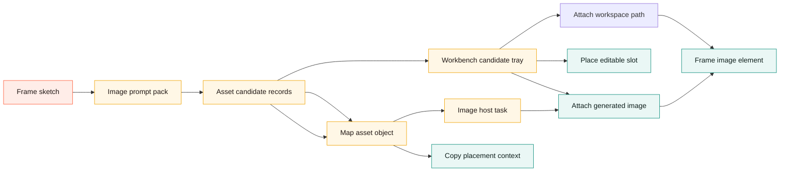

This keeps image workflows local-first while giving future ChatGPT/Codex image-generation bridges a concrete target format.

```text
Generate screen
  sketch geometry  -> placement hints
  loose strokes    -> energy, direction, and visual anchors
  labels           -> semantic meaning
  notes/voice      -> copy and behavior
  recipe           -> visual direction
  refinement delta -> what changed after the edit
```

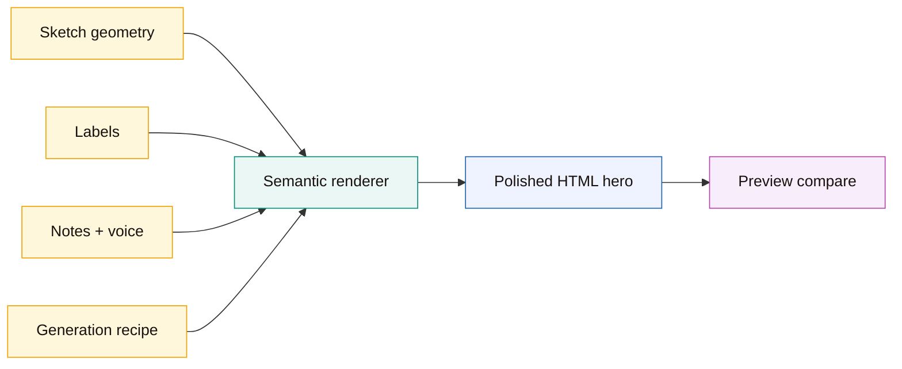

## Materialize

Materialize is the quick “make this sketch feel real” path.

Behavior:

- reads the active frame
- writes a styled local HTML artifact
- binds that artifact back into Preview
- reuses a stable per-frame target path
- tracks refinement metadata and changed regions on rematerialize

What Materialize is good for:

- early visual iteration before real app code exists
- fast sketch-to-mockup feedback

What Materialize is not:

- a production implementation generator
- a full semantic interpretation engine

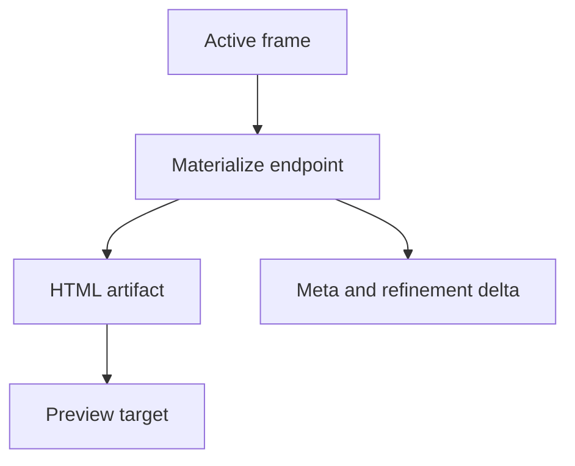

## What Is Real Today

Canvax can already help turn rough sketch input into:

- a real webpage direction
- a web app screen or flow
- a product UI/UX spec
- a local interactive preview
- a code-backed implementation workflow

The practical collaboration loop is real:

- you sketch
- Canvax preserves the handoff
- Generate screen or Codex reads it
- output appears in Preview
- you sketch corrections
- Codex updates again

```text
real today:
  rough sketch -> handoff -> preview/code/spec -> sketch refinement
```

## What Is Not Finished

Canvax is still not:

- a one-click production app generator from arbitrary rough sketches
- a full Figma replacement
- a true single-surface co-editing system where edits on the generated UI become semantic implementation edits automatically
- a native embedded canvas inside the Codex composer

The current model is:

- a strong linked sketch-to-output workflow

The future model would be:

- a richer same-thread shared editing surface

```text
not finished yet:
  direct semantic editing on generated UI
  native in-composer canvas
  perfect sketch-to-production automation
```

## Best Docs To Read Next

- `README.md` for project overview
- `docs/USAGE.md` for operator workflow
- `docs/ARCHITECTURE.md` for system design
- `docs/EXECUTION_STATUS.md` for implementation status
- `docs/CANVAX_PARITY_AUDIT.md` for objective-to-evidence parity tracking
- `canvax-live-collaboration-plan.md` for future roadmap
