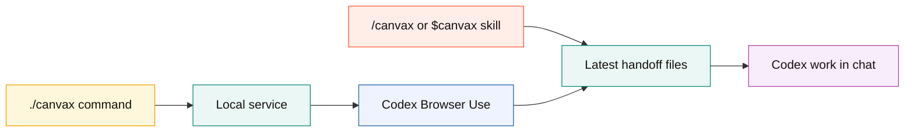
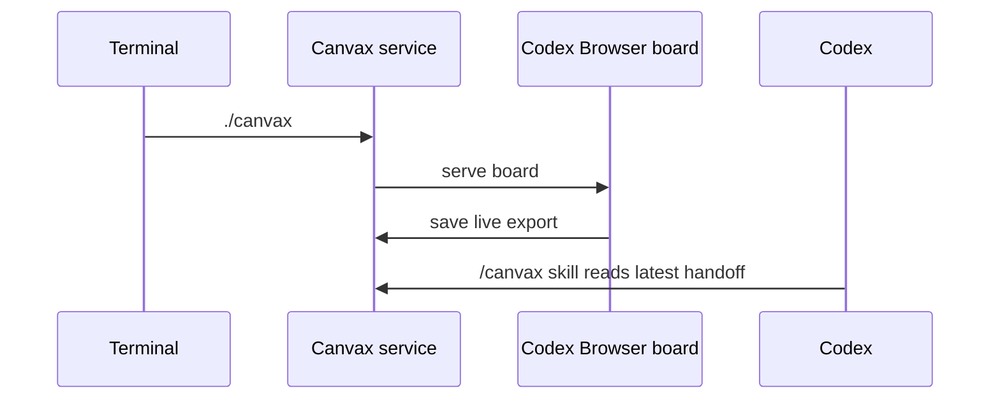

# Install Canvax

## Install Flow

```text
clone repo
   |
   v
run ./canvax
   |
   +--> starts or reuses local service
   `--> serves board at localhost:3210
   |
   v
run node scripts/install-canvax-skill.mjs
   |
   v
restart Codex once
   |
   v
use /canvax or $canvax
```

```mermaid
flowchart TD
    A[Project root] --> B[./canvax]
    B --> C[Local service on localhost:3210]
    C --> D[Open board in Codex Browser Use]
    A --> E[node scripts/install-canvax-skill.mjs]
    E --> F[Symlink into ~/.codex/skills/canvax]
    F --> G[Restart Codex]
    G --> H[/canvax or $canvax]
```

## Prerequisites

- macOS as the primary supported platform
- Node.js installed
- Codex desktop app or Codex CLI already working

Canvax does not require a separate OpenAI API key for the core sketch-to-Codex workflow.

## Local Setup

From the project root:

```bash
./canvax
```

This starts or reuses the local Canvax service.

By default the board runs at:

```text
http://localhost:3210
```

### Preferred Codex Desktop Setup

If Codex Desktop has the Browser Use plugin available, open `http://localhost:3210` inside the Codex in-app browser.

That is the preferred mode because:

- the sketch board stays next to the Codex chat
- Codex can inspect the board, Preview, and generated app with Browser Use
- the workflow avoids bouncing between Codex and a separate macOS browser
- the local service and export files still work exactly the same

Use this only when you explicitly want the board in your default macOS browser:

```text
./canvax --open
```

## Install the Codex Skill

Run:

```bash
node scripts/install-canvax-skill.mjs
```

This creates a symlink from:

```text
codex-skill/canvax
```

to:

```text
~/.codex/skills/canvax
```

If Codex is already open, restart it once after installing the skill.

## Verify the Install

Check service status:

```bash
./canvax --status
```

You should see:

- the board URL
- the live JSON export path
- the live Markdown export path

Then open Codex and check that one of these works:

- `/canvax`
- `$canvax`

## Command vs Skill

This is the most important distinction:

- `./canvax` is the local command that runs the browser board.
- `/canvax` is the skill-backed slash entry inside Codex.
- `$canvax` is the direct skill invocation form.

So Canvax is not only a browser app and not only a skill. It is both.



## Daily Startup

Typical startup flow:

```bash
./canvax
```

Then in Codex:

```text
/canvax
```

or:

```text
$canvax
```

Then open `http://localhost:3210` with Codex Browser Use when available, draw in the board, and continue the same Codex thread.

## Startup Model

```text
terminal                Codex browser           Codex
   |                       |                      |
   | ./canvax              |                      |
   |---------------------->| service boots        |
   |                       | board loads          |
   |                       |                      |
   |                       | draw and freeze      |
   |                       |--------------------->| /canvax
   |                       |                      | reads latest handoff
```



## Service Management

```bash
./canvax
./canvax --open
./canvax --status
./canvax --stop
./canvax --restart
```

Notes:

- Canvax uses one running service at a time by default.
- If Canvax is already running, it reuses the existing board instead of starting another copy.
- `--restart` is the explicit way to move or recover the service.

## Common Install Problems

### The skill does not show up in Codex

- restart Codex after installing the skill
- verify the symlink exists at `~/.codex/skills/canvax`

### The board is not opening

- run `./canvax --status`
- confirm `http://localhost:3210` is reachable in Codex Browser Use or your browser
- if needed, run `./canvax --restart`
- use `./canvax --open` only if you want the default macOS browser opened automatically

### I see an older board state

The browser may still have old local state loaded. Refresh the board and let the current Canvax export resync.

## Installed Pieces

```text
1. local launcher      -> ./canvax
2. local service       -> scripts/canvax.mjs
3. browser board       -> web/index.html + web/app.js
4. browser Preview     -> web/preview.html + web/preview.js
5. Codex skill         -> ~/.codex/skills/canvax symlink
```
