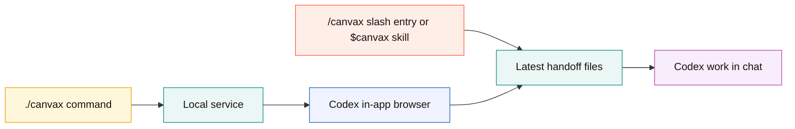
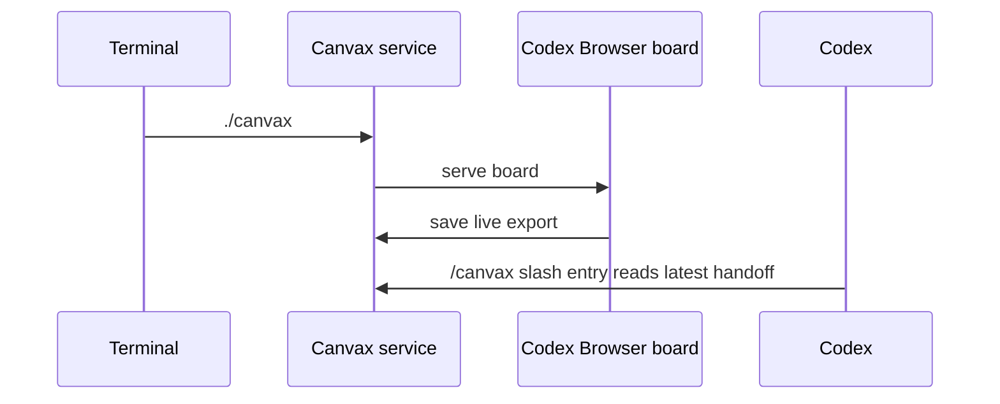

# Install Canvax

## Install Flow

```text
clone repo
   |
   v
run node scripts/install-canvax-skill.mjs
   |
   v
restart Codex once
   |
   v
use /canvax
   |
   +--> starts or reuses local service
   `--> targets compact editor in Codex right-side in-app browser
```

```mermaid
flowchart TD
    A[Project root] --> B[node scripts/install-canvax-skill.mjs]
    B --> C[Symlink into ~/.codex/skills/canvax]
    C --> D[Restart Codex]
    D --> E[/canvax preferred, $canvax fallback]
    E --> F[Start or reuse local service]
    F --> G[Target compact editor in Codex right-side in-app browser]
```

## Prerequisites

- Node.js installed
- Codex desktop app or Codex CLI already working
- Codex Desktop in-app browser for the editor workflow

Canvax does not require a separate OpenAI API key for the core sketch-to-Codex workflow.

## Install the Codex Skill

From the project root:

```bash
node scripts/install-canvax-skill.mjs
```

This creates a symlink from:

```text
codex-skill/canvax
```

to:

```text
~/.codex/skills/canvax
```

If Codex is already open, restart it once after installing the skill.

## Open From Codex

Invoke `/canvax` in Codex. It is the preferred command-style skill entry for designers. It starts or reuses the local Canvax service and should navigate Codex's right-side in-app browser to the compact editor. Use `$canvax` only as the explicit skill fallback when the slash entry is unavailable.

The intended `/canvax` editor URL is:

```text
http://localhost:3210/?host=codex-sidecar
```

The larger full-board URL remains available when you need more canvas space:

```text
http://localhost:3210
```

The in-app path is preferred because:

- the sketch board stays next to the Codex chat
- Codex can inspect the board, Preview, and generated app in the in-app browser
- the workflow avoids bouncing between Codex and a separate browser
- the local service and export files still work exactly the same

## Local Setup Fallback

Run the service manually when you want to start or inspect it outside slash-command flow:

```bash
./canvax
```

Use these only when you explicitly want the board outside Codex:

```bash
./canvax --open-external
./canvax --chrome
```

## Verify the Install

Check service status:

```bash
./canvax --status
```

You should see:

- the board URL
- the live JSON export path
- the live Markdown export path

Then open Codex and check that one of these works:

- `/canvax` from the slash list
- `$canvax` as the explicit skill fallback

## Command vs Skill

This is the most important distinction:

- `./canvax` is the local command that runs the board service.
- `/canvax` is the preferred command-style skill entry inside Codex and should navigate the right-side in-app browser to `http://localhost:3210/?host=codex-sidecar`.
- `$canvax` is the direct skill invocation fallback for the same handoff.

So Canvax is not only a browser app and not only a skill. It is both.



## Daily Startup

Typical startup flow:

```text
/canvax
```

Fallback:

```text
$canvax
```

Then use `/canvax` so Codex targets `http://localhost:3210/?host=codex-sidecar` in the in-app browser when available. Draw in the right-side editor and continue the same Codex thread. Use `$canvax` only when the slash entry is unavailable.

Run `./canvax` manually only when you want to inspect or manage the service outside the slash-command flow.

## Startup Model

```text
terminal                Codex browser           Codex
   |                       |                      |
   | optional ./canvax     |                      |
   |---------------------->| service boots/reuses |
   |                       | sidecar editor loads |
   |                       |                      |
   |                       | draw and freeze      |
   |                       |--------------------->| /canvax
   |                       |                      | reads latest handoff
```



## Service Management

```bash
./canvax
./canvax --open-external
./canvax --chrome
./canvax --status
./canvax --stop
./canvax --restart
```

Notes:

- Canvax uses one running service at a time by default.
- If Canvax is already running, it reuses the existing board instead of starting another copy.
- `--restart` is the explicit way to move or recover the service.
- `--open-external` opens the default system browser.
- `--chrome` opens Google Chrome explicitly.
- `--open` is kept as a legacy alias for `--open-external`.

## Common Install Problems

### The skill does not show up in Codex

- restart Codex after installing the skill
- verify the symlink exists at `~/.codex/skills/canvax`

### The board is not opening

- run `./canvax --status`
- confirm `http://localhost:3210/?host=codex-sidecar` is reachable in the Codex in-app browser, or `http://localhost:3210` is reachable in a regular browser
- if needed, run `./canvax --restart`
- use `./canvax --open-external` or `./canvax --chrome` only if you want an external browser opened automatically

### I see an older board state

The browser may still have old local state loaded. Refresh the board and let the current Canvax export resync.

## Installed Pieces

```text
1. local launcher      -> ./canvax
2. local service       -> scripts/canvax.mjs
3. browser board       -> web/index.html + web/app.js
4. browser Preview     -> web/preview.html + web/preview.js
5. Codex skill         -> ~/.codex/skills/canvax symlink
```
