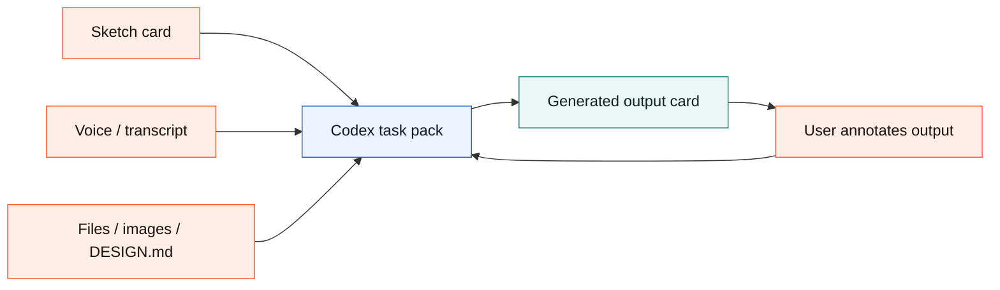
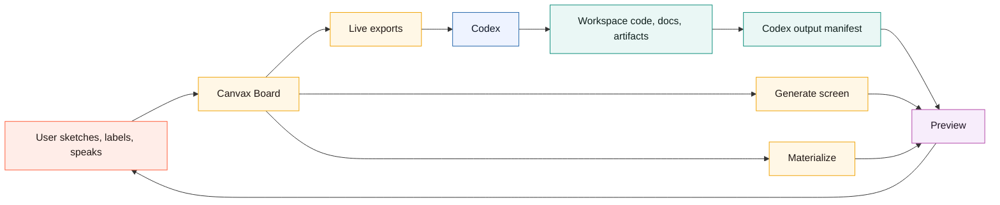
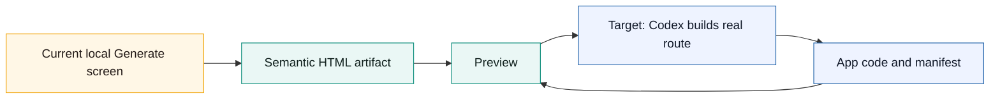
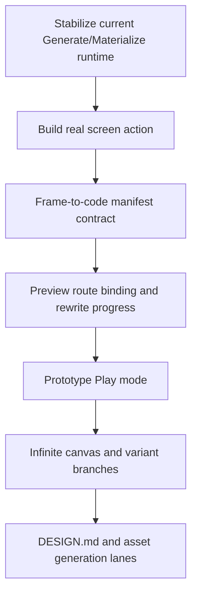

# Canvax Stitch Gap Roadmap

Updated: May 19, 2026

This document compares the current Canvax repo against the Stitch-style design workflow and records what is done, what is missing, and what should improve next. For a stricter requirement-by-requirement audit with evidence and remaining gaps, see `docs/CANVAX_PARITY_AUDIT.md`. For the short designer workflow and screenshot review path, see `docs/DESIGNER_WALKTHROUGH.md`.

Canvax should not clone Stitch feature-for-feature. The stronger direction is:

```text
Stitch-like creative canvas
        +
Codex workspace awareness
        +
local-first handoff, preview, code, docs, and artifacts
        =
Canvax as the visual collaboration layer for building real surfaces
```

## Current Design Decision: Workbench First

As of May 15, 2026, the next Canvax UI direction is **Workbench first**.

The existing Advanced board is useful, but it is too dense as the default experience. The default surface should be a single creative workspace where the user can draw, speak/type, see generated output, and annotate corrections without opening several panels.

```text
before
  left timeline + top toolbar + canvas + right inspector + separate preview

after
  Codex brief + sketch card + generated output card + Focus canvas command composer
  Advanced remains available for frames, flow, manifests, captures, and debugging.
```



Product rules:

- Canvax core stays local-first and must not require `OPENAI_API_KEY`.
- Image generation is a host capability or optional adapter, not a baseline dependency.
- The baseline UI exports prompt packs, task packs, sketches, transcripts, coordinates, and previews that Codex can use in the current chat.
- Direct ChatGPT/Codex microphone reuse requires a first-party bridge; the local board keeps browser speech, manual dictation, and transcript forwarding as the current bridge.
- The repo-level plan for this redesign is `canvax-stitch-like-workbench-plan.md`.

## External Reference Points

Current Stitch references show these major product ideas:

- AI-native canvas for high-fidelity UI creation from natural language.
- Infinite canvas that accepts images, text, and code as context.
- A design agent that reasons over the project evolution.
- Agent manager for parallel design directions.
- `DESIGN.md` import/export for design system rules.
- Interactive prototypes where screens can be connected and played.
- Voice-driven canvas collaboration and real-time design updates.
- MCP, SDK, skills, and exports to bridge into developer tools.

Sources:

- Google Labs Stitch UI design update: https://blog.google/innovation-and-ai/models-and-research/google-labs/stitch-ai-ui-design/
- Google Labs Stitch Gemini 3 prototype update: https://blog.google/innovation-and-ai/models-and-research/google-labs/stitch-gemini-3/
- OpenAI ChatGPT Images 2.0 announcement: https://openai.com/index/introducing-chatgpt-images-2-0/
- Open Design site: https://open-design.ai/
- Open Design repository: https://github.com/nexu-io/open-design

### Open Design Reference

Open Design is closer to Canvax than Stitch in one important way: it is an
open-source developer-tool surface rather than a closed hosted canvas. Its
public positioning focuses on prompt-to-design artifacts, code export,
design-system/skill libraries, BYOK or local model support, and adapters for
agent tools such as Claude Code and Cursor CLI.

The GitHub README also shows a concrete product pattern worth tracking:
file-based `SKILL.md` bundles, a large `DESIGN.md` design-system catalog,
agent/CLI adapters, sandboxed preview artifacts, export formats, and media
prompt galleries live together instead of being separate products. Canvax should
not copy that exact architecture, but it should match the user-facing benefit:
the designer picks a reusable system, sketches or speaks intent, sees a preview
artifact, and keeps every prompt/spec/output as a local file Codex can edit.

The useful lesson for Canvax:

- Treat reusable design knowledge as first-class. Canvax should continue
  expanding `DESIGN.md`, style locks, image packs, and semantic recipes so rough
  sketches inherit a durable design system instead of becoming one-off prompts.
- Preserve the artifact loop as files. Open Design reinforces that prompts,
  skills, design systems, previews, and exports should be inspectable artifacts,
  not hidden state; Canvax should keep writing readable JSON/Markdown/HTML
  handoffs that Codex can edit and users can review.
- Make design rules enforceable, not decorative. The current local loop now has
  extraction (`Extract tokens`, `npm run extract-tokens`), import (`Import
  external`), contract recording (`Build with Codex`), and implementation
  verification (`npm run verify-tokens`). The verifier can now also read
  `artifacts/canvax/codex-output.json` to check the real files Codex published
  for a frame, so production-port token enforcement has a concrete gate. The
  remaining gap is proving that gate against real user project ports and adding
  deeper rendered-app critique. Basic local screenshot palette extraction now
  exists through `npm run extract-tokens -- --image <path>`, and static HTML/JSX
  artifact semantics now export through `semanticStructure`.
- Keep agent/tool adapters optional. Canvax should stay local-first and no-API by
  default, then bridge to Codex, ChatGPT, Browser, image generation, or future MCP
  hosts when those capabilities are present.
- Do not collapse into a prompt-only artifact generator. Canvax's stronger lane
  is the live visual workbench: sketch, voice, generated output, correction
  marks, frames, assets, code, and checkpoints all remain editable in one board.
- Make output cards understandable to designers. Generated implementation
  references should read as `Generated screen`, `Generated file`, and
  `Code change`, never as raw manifest labels like `generated-target`.
- Keep the reusable kit layer file-based and simple. Canvax now reads
  `design-kits/*.json` as repository design kits, exposes them through the same
  searchable `Design kit` dropdown, validates and searches them with
  `npm run validate-design-kits -- --query <term>`, and exports the selected kit
  source path through the normal `designKit` handoff. The remaining opportunity
  is packaging, versioning, and team sharing for larger kit libraries without
  making the default Workbench feel like a prompt console.

## Current Canvax Shape



```text
Canvax today
|- Board: rough sketch, frames, flow, notes, tools, voice
|- Preview: compare sketch vs output, artifacts, changed files, rewrite queue
|- Service: local exports, manifests, checkpoints, materialized/generated HTML
|- Codex Browser Use / Atlas: preferred way to view/inspect board, Preview, and generated apps
|- Codex skill: tells Codex to read the live handoff files
`- Docs: install, usage, architecture, development, proposal, status
```

## What Is Done

### Board And Sketch Input

- Frame view exists for single-screen sketching.
- Flow view exists for linking multiple frames.
- Drawing tools exist: select, pen, marker, line, rectangle, oval, arrow, label, erase.
- Selection supports moving, resizing, deleting, duplication, layering, grouping, and lasso selection.
- Labels can act as semantic notes for Codex, not just visible text.
- Reference image underlays are supported through the explicit `Reference underlay` upload.
- Pasted or dropped images can now become editable image elements, so generated candidates or reference crops can be placed back on a frame instead of only sitting behind the sketch.
- Saved asset candidates now appear in a compact Workbench tray. Designers can place a candidate as an editable image slot on its source frame/region or attach a generated file back into that slot while preserving `assetCandidateId`.
- Each asset candidate card can copy its prompt plus exact pixel/CSS placement contract or a complete one-candidate image host task for a ChatGPT/Codex image-generation host without opening raw JSON.
- Asset candidate cards now show attached-image thumbnails, review status, selection, and an accept action so generated image choices become explicit no-API handoff state. Accepted choices also export through `reviewSummary.acceptedCandidates`, giving Codex a direct list of chosen image/illustration candidates.
- Asset candidates now normalize into a `placementMap` contract with slot id, normalized bounds, source-viewport pixel bounds, CSS placement, a target selector, HTML slot scaffold, and output-slot records. The companion `canvax-asset-candidate-review` summary groups candidates by frame and exposes pending, placed, attached, and accepted queues plus no-API host handoff files. Canvax now also writes `exports/canvax-image-host-task-latest.*`, a machine-readable host execution contract with one task per candidate, return-slot binding, and acceptance criteria. This gives Codex or a host image tool exact placement and review data for UI image regions, poster art, book spreads, and illustration candidates without requiring Canvax to call a paid API.
- Autosnap and manual freeze write live handoff files.
- Captures and checkpoints preserve collaboration moments.
- Workbench now exposes viewport choice, new frame creation, connected section creation, free-canvas mode, local screen generation, generated-output correction marks, and the `Focus canvas` designer rail without requiring the user to open Advanced mode.
- Workbench surface presets now cover UI, poster, slide, book-spread, storyboard, comic-page, square, and free-canvas work so Canvax can support broader design/illustration planning, not only app screens.
- Workbench now exposes action modes for `Build UI`, `Refine UI`, `Write spec`, `Image prompt`, and `Variations`.
- Workbench now has a `Start here` strip for `1 Sketch`, `2 Talk`, `3 Make`, and `4 Map`, giving first-time designers a short guided path before they need every control.
- Workbench now has a bottom command composer for typed/pasted dictation, Talk, Note, Make, and Apply in `Focus canvas`, so the main sketch loop can stay canvas-first without crowding the default brief.
- The Workbench rail now behaves like the primary bottom designer dock in `Focus canvas`, with tactile actions, undo/redo, brush `-` / `+`, and Image handoff.
- The rail and slider size controls now resize selected elements in Select mode and only act globally when no element is selected.
- The Workbench tray no longer duplicates the dock with a second tool grid in simple mode; it is a compact command strip focused on brief, surface/action context, voice, and generated output.
- The generated output card remains a compact thumbnail/status/correction target, and Workbench adds a larger output stage through `Split` and `Output` focus modes for comfortable inspection and correction marks.
- Advanced mode keeps the full frame, flow, manifest, capture, and inspector surface, but now uses the same dark dotted Canvax visual system as Workbench. The mode switch, mode guide, and deck labels make it read as a technical inspector layer for the same workbench rather than a different app: Workbench explains `Sketch` / `Talk` / `Make / Apply`, while Advanced explains `Project rail` / `Canvas deck` / `Handoff inspector`. Its command deck is now solid and non-glass so canvas/grid content does not blur through the controls during long frame/map sessions, and the Advanced shell collapses to one column on narrower windows so the mode switch and controls do not clip.
- Workbench now supports `Sketch`, `Split`, `Output`, and `Map` focus modes. The compact output card remains a status/quick-correction target, the large output stage can become the primary correction surface, and Map exposes the frame/variant graph as a zoomable spatial workbench without opening Advanced.
- Live exports now include a `spatialWorkspace` object with map zoom, current/last viewport bounds, card positions, editable variant branches, group containment, entry/active frame ids, links, manual note/reference objects, asset candidate objects, generated screen targets, generated artifacts, changed-file objects, checkpoint history cards, selected-object layer order, a named output shelf lane, a named checkpoint history lane, and a compact `spatialWorkspace.timeline`, so Codex can treat frame layout, the viewed map region, grouped references, implementation outputs, visual stacking, collaboration history, and lane/timeline sequence as project memory rather than just a linear list. Map rendering now reconciles generated screen/artifact objects, removes legacy stale cards, infers frame binding from current and legacy materialized output paths, groups implementation artifacts under the collapsible `Output shelf`, hides internal Materialize support files like context JSON, meta JSON, and sketch overlays from the designer Map, canonicalizes older raw manifest labels and legacy materialized/generated-target records into designer-facing `Generated screen` / `Generated file` / `Code change` copy with an `Output ref` badge, and provides `Clear outputs` plus `Fit map` so old materialized outputs do not flood or strand the spatial canvas. `Lane earlier` / `Lane later` now move selected output/history cards within their lane and export that order through `meta.laneIndex`, context Markdown, and `spatialWorkspace.lanes[].memberObjectIds`; the same controls become `Branch earlier` / `Branch later` when selected branch cards share one source frame, and branch card drag position also updates sibling branch order, preserving `frame.variant.index` and ordered `spatialWorkspace.variantBranches`. The visible `Map timeline` lets designers jump to frames, branches, outputs, and checkpoints without hunting across the spatial board. `Edit as frame` output branches now also carry `outputEditBinding` through task, rewrite, build, output-contract, and executor context payloads so Codex can target the generated output that the designer is correcting. Output correction marks now export normalized bounds for changed-region targeting, while output eraser gestures delete intersecting marks instead of persisting eraser strokes as new change requests.
- Workbench/Advanced `Map` now has a bounded internal scroll viewport and a `Tidy map` action that compacts frame cards, generated output references, and checkpoint history into readable lanes when a long session becomes visually noisy.
- Browser regression now includes a deterministic `visualfixture=advanced-map` state that screenshots Advanced Map at desktop and tablet sizes, and checks that the command deck stays opaque while generated-output cards remain designer-readable.
- Single selected Map objects now expose a lightweight property editor for Title, Note, Status, and Prompt / Context plus per-type read-only details for generated output paths, asset placement bounds, checkpoint contents, variants, groups, references, and changes. Manual overrides, including object-level prompt guidance, are preserved when generated/asset/checkpoint cards resync from handoff files.
- Variant branches now render as visible branch cards with lineage in Map and expose `Use variant` directly on the card, which marks the selected branch as primary and makes it the entry frame while preserving lineage through `spatialWorkspace.variantBranches`. `Create variants` now also attaches deterministic no-API semantic recipes: `Structure` clarifies hierarchy/spacing, `Visual` pushes palette/typography/imagery, and `Adaptive` translates the sketch into another breakpoint/platform/state. Those recipes export through `spatialWorkspace.variantBranches[].semanticRecipe`, branch prompts, design-move lists, `styleProperties`, and custom `key: value` properties on the matching Map objects. Selecting a variant branch exposes editable style knobs for palette, typography, density, motion, and imagery/asset direction.
- Eraser strokes now render on an isolated ink layer so they remove drawn ink without wiping the paper/grid layer, and they are excluded from materialized output geometry and image prompt composition maps.
- Frame thumbnail rendering is cache-versioned and static board assets are served with no-store headers, reducing stale UI/thumbnail confusion after local updates.

### Voice And Intent

- Canvax has board-side voice notes.
- Voice notes can be scoped to the current frame or the whole board.
- Browser speech recognition is used when available.
- Manual voice notes are available as a fallback.
- Codex chat transcript forwarding exists through `./canvax --transcript "..." --scope frame|session`.
- Voice is written into JSON, Markdown prompt output, and `exports/canvax-voice-latest.md`.

### Preview And Output Binding

- Preview opens as a separate window/tab.
- Preview supports compare modes for sketch, output, and split view.
- Preview can follow active frame context.
- Preview reads generated artifacts, changed files, output status, and rewrite queue state.
- Output digest changes can trigger preview refreshes for same-URL targets.
- Compare snapshots can be saved for review.

### Generate Screen And Materialize

- `Generate screen` exists as a richer local generated-screen pass.
- `Generate screen` now has a semantic hero/page renderer for polished website-like output.
- `Materialize` exists as a quicker deterministic local preview pass.
- Both write HTML artifacts under `artifacts/preview/materialized/`.
- Both update the preview manifest so Preview can open the output immediately.
- Per-frame generated targets are stable, so repeated generation refreshes the same route.
- Refinement metadata records changed regions between generated revisions.

### Codex Workspace Loop

- `/canvax` or `$canvax` can attach Codex to the live handoff.
- Live JSON and Markdown exports exist under `exports/`.
- `canvax-task-pack-latest.*` and `canvax-image-prompt-pack-latest.*` exist for Codex and host-side image generation.
- The image prompt pack includes normalized coordinates and an HTML/CSS placement scaffold so ChatGPT/image generation can preserve layout intent without Canvax calling an API.
- `canvax-asset-candidates-latest.*` feeds the Workbench candidate tray so prompt-ready image regions can become editable board objects before or after host generation.
- Image prompt and asset candidate packs now include a no-API `canvax-style-lock` block for consistent palette, rendering language, character/object identity, text-safe zones, and frame-to-frame continuity across UI, poster, book, comic, storyboard, and image-variant work.
- A host capability registry now reports local no-API handoff, Codex browser/workspace availability, host image generation boundary, and native microphone bridge boundary.
- If a project `DESIGN.md` exists, Canvax includes it as design context in task and image prompt packs.
- Advanced mode can write a starter `DESIGN.md` from the current board without overwriting an existing design contract.
- Self-test coverage now checks task-pack export, no-API image prompt pack export, Workbench dock brush sizing, and eraser rendering against black-mark/grid-damage regressions.
- `artifacts/canvax/codex-output.json` is the canonical Codex output manifest.
- The board can publish current git workspace changes into the output manifest.
- Live workspace-follow lets board and Preview see Codex edits without constant manual publishing.
- Rewrite queue tells Codex which frames need first output, a target, binding, or refresh.
- `canvax-rewrite-request-latest.*` packages queued frames, stale output context, correction marks, voice notes, and output manifest bindings into one Codex-readable refinement handoff.
- `execute-rewrite-request` consumes that handoff into a refreshed frame-bound local artifact plus Codex output manifest, proving the no-API rewrite binding path before a full autonomous Codex rewrite loop exists. Workbench `Apply to Codex` and optional `Live rewrite` now call the same path after checkpoint save, newer autosnap/freeze handoffs queue behind an in-flight local rewrite instead of being silently skipped, attached build contracts carry `visualDirection` forward so rewrite previews preserve the generated theme/atmosphere, and attached Codex port tasks keep production-port instructions in the rewrite context.
- Codex Browser Use / Atlas can keep the local board, Preview, and generated app inside Codex's visual inspection loop instead of requiring an external browser.

## What Is Still Missing

### 1. True Codex-Built Screen Generation

Current `Generate screen` is local and deterministic. It improves the preview, but it does not by itself create real app/page code.

Update: `Build with Codex` now creates the first real-code bridge. It writes a Codex-readable build request, designer `implementationContext`, and frame-to-code output contract, then the board runs the local no-API executor to bind an immediate frame preview plus implementation starter bundle. That bundle now includes standalone HTML/CSS/JS, a React-ready `CanvaxScreen.jsx`/CSS pair, Vite/Next adapter stubs, framework adapter notes, a component ownership map, a machine-readable `canvax-build-contract.json`, a machine-readable `codex-port-task.json`, a human-readable `INTEGRATION.md`, and a human-readable `ACCEPTANCE.md` production-readiness checklist. The executor now also consumes the designer context to pick a deterministic starter theme, render theme-specific atmosphere layers, and show a visible `Designer context` panel in the preview/React handoff, so variant/style/Map guidance affects the first generated surface instead of only being stored for later. Codex can still execute that same request in the chat/session and replace or port the local artifact into a real route or component through `write-codex-output`.

Target behavior:

```text
draw frame -> Generate with Codex -> app/page files change -> preview updates -> sketch corrections -> Codex refines changed regions
```

Needed:

- A board action that creates a Codex-ready generation task from the current frame/checkpoint. **Initial version shipped as `Build with Codex`.**
- A standard output contract for generated app/page/screen code. **Initial version shipped through `exports/canvax-build-real-latest.*`, `artifacts/canvax/codex-output.json`, and the per-bundle `implementation/canvax-build-contract.json`.**
- A compact designer implementation brief for Codex. **Shipped as `implementationContext`, carrying Workbench path/focus, selected Map guidance, variant semantic recipe/style knobs, image style lock, and output-edit binding.**
- Automatic preview binding to the generated route or artifact. **Shipped for the local no-API build executor and its implementation bundle; still open for autonomous Codex-edited app routes/components.**
- Frame-aware code ownership so one frame maps to the files/components Codex generated. **Initial local version shipped through `implementation/canvax-component-map.json`, `implementation/canvax-build-contract.json`, React-ready component/CSS, Vite/Next adapter handoffs, and `INTEGRATION.md`; still open for richer production route/component ownership once Codex edits real files.**

Current stepping stone:

```text
done
  rough frame -> local Generate screen -> polished HTML artifact -> Preview
  rough frame -> Build with Codex request -> themed local bound preview + implementation bundle + React/framework handoff + component map + Codex port task

next
  rough frame -> Build with Codex request -> Codex edits app/page files -> live app preview
```



### 2. Live Two-Way Rewrite Loop

Today Canvax can detect stale output and changed regions. It also writes a focused `canvax-rewrite-request-latest.*` handoff for Codex rewrite passes, and `execute-rewrite-request` can turn that handoff into a refreshed frame-bound local preview artifact. Workbench `Apply to Codex` and optional `Live rewrite` invoke that local executor after saving the latest checkpoint, so a sketch/voice/correction pass can refresh the attached preview without a terminal step. When a `canvax-component-map.json` artifact is attached, the rewrite executor now maps correction regions to generated selectors/components. If the user keeps sketching while a local Live rewrite is running, Canvax queues the newest handoff and runs it after the in-flight refresh completes. It does not yet run a continuous loop where Codex rewrites real app files while the user keeps drawing.

Needed:

- A live task queue for frames needing rewrite attention.
- A focused rewrite request artifact. **Initial `canvax-rewrite-request-latest.*` shipped.**
- A deterministic local executor for that request. **Initial `execute-rewrite-request` shipped and is now called by Workbench Apply plus optional autosnap/freeze Live rewrite; newer handoffs queue behind an in-flight local rewrite instead of being silently skipped.**
- A frame revision to output revision dependency graph. **Initial `revisionGraph` in rewrite requests shipped.**
- A "changed sketch region -> affected generated component" map. **Initial local version shipped through rewrite executor component targeting from `canvax-component-map.json`; still open for continuous production app rewrites.**
- A visible rewrite progress lane in Preview. **Initial `Rewrite handoff` lane shipped for request/executor/manifest state.**
- Conflict handling when the user sketches while Codex is still rewriting. **Initial local conflict handling shipped for Live rewrite queueing; production Codex-file rewrite conflicts remain open.**

### 3. Infinite Canvas And Spatial Project Memory

Canvax has frames, Flow view, a large `Free canvas` viewport preset, Workbench `Map`, selectable/lasso-selectable/nudgeable/duplicable/deletable/pinnable/lockable/reorderable spatial objects, selected-set dragging and resizing through a combined transform box, selection-created group regions, group contents selection, group fitting, single-object Title/Note/Status/Prompt editing with custom `key: value` properties, structured per-type inspector sections, and safe type-detail overrides, group duplication with contained unlocked Map-object copies, movable/resizable labeled group regions with lightweight contents inspection, recursive nested group movement/resizing for geometry-contained groups, explicit `spatialWorkspace.groupHierarchy` parent/child paths for nested group readability, manual note/reference cards, asset candidate spatial objects, generated output/artifact/change spatial objects inside a named collapsible `Output shelf` that starts compressed for new/migrated sessions, checkpoint history cards inside a named collapsible history lane that also starts compressed, a compact `Map timeline` for frames/branches/outputs/checkpoints, lane earlier/later controls for output/history card sequence, branch earlier/later controls plus drag-position ordering and visible drop targets for source-frame branch sequence, object focus filters for output/assets/notes/history, text search across Map object titles/prompts/paths/status, background drag-pan with momentum/coast, cursor-centered wheel/pinch zoom, a minimap navigator with click-to-pan orientation, a `Fit map` recovery control, and cleaner generated-output review aids. Map is the first persistent spatial project layer, but Canvax is not yet an infinite design canvas with fully arbitrary schema-specific property panels, full nested object modeling, and code artifacts.

Needed:

- Zoomable infinite workspace.
- Pan/zoom controls that feel stable on Mac trackpads. **Initial background drag-pan with momentum/coast, button zoom, cursor-centered pinch/ctrl-wheel zoom, minimap click-to-pan, and `Fit map` recovery are shipped; richer arbitrary-object canvas behavior remains open.**
- Spatial groups for explorations, branches, reference boards, and generated variants. **Initial variant branches now exist as editable Flow-connected frames and as `variant-branch` Map objects exported through `spatialWorkspace.variantBranches` and `spatialWorkspace.objects`; labeled group regions, manual notes, reference files/images, asset candidates, generated output targets, generated artifacts, and changed files now appear as draggable/selectable/multi-selectable/lasso-selectable Map objects; selected Map objects expose visible Copy context/Pin/Lock/Group/Ungroup/Select contents/Fit group/Send back/Bring front/Duplicate/Delete/Clear actions plus Title/Note/Status/Prompt editing, structured per-type inspector sections, and safe type-detail overrides, can copy a no-API Markdown handoff, can be dragged and resized as a selected set, grouped into a region wrapper, ungrouped without deleting contents, selected from group contents, fit back into group bounds, nudged, reordered, duplicated, deleted, locked against accidental transform/reorder/duplicate/delete, and exported as `spatialWorkspace.selectedObjectId` / `selectedObjectIds` plus selected/per-object `locked`, `layerIndex`, `layerLabel`, `contextMarkdown`, and `inspector`; duplicating a group region duplicates contained unlocked Map objects; group regions move and resize contained frame cards/spatial objects recursively through nested group regions while skipping locked child objects, and export containment, `spatialWorkspace.groupHierarchy`, group path metadata, plus selected group contents for Codex.**
- Multiple generated directions visible at once.
- Better timeline/history navigation for long sessions. **Initial output shelf and checkpoint history lanes now ship as visible Map lanes; both have Hide/Show controls, selected output/history cards can move earlier/later inside the lane, selected branch cards can move earlier/later in their source-frame branch sequence, branch cards can update that sequence when dragged across sibling branch positions, visible drop targets appear while branch cards are dragged, object focus filters can isolate history from output/assets/notes, Map search can narrow visible objects by text, pinned objects stay visible across focus/collapse, selected objects can be reordered front/back unless locked, and exported state includes `spatialWorkspace.lanes[]`, `spatialWorkspace.lanes[].collapsed`, ordered `memberObjectIds`, ordered `spatialWorkspace.variantBranches`, `spatialWorkspace.timeline`, `spatialWorkspace.objectFilter`, `spatialWorkspace.objectFilter.searchQuery`, per-object `pinned`, per-object `locked`, per-object layer order, per-object lane order, and branch order. The visible `Map timeline` adds click-to-focus navigation for frames, branches, outputs, and checkpoints.**

Current stepping stone:

```text
done
  Workbench -> Free canvas preset -> large sketch surface
  Focus canvas -> bottom rail and composer for canvas-first controls without reopening the tray
  generated output overlay -> saved correction marks for Codex
  generated preview review aids -> opt-in original sketch and design notes
  Workbench Map -> zoomable frame/variant project graph exported as spatialWorkspace
  Map Add group -> labeled exploration regions
  Map Add note/Add file -> manual context objects
  Map object selection -> Shift-click and Shift-drag lasso + no-API context copy + selected-set drag/resize + nudge/duplicate/delete + group-contained object copies + selectedObjectId export
  Map navigator -> minimap orientation and click-to-pan movement
  Map pan momentum -> background flick/coast and exported interaction metadata
  Fit map -> recover visible frames and objects after zoom/pan or long-session clutter
  Image pack -> asset candidate spatial objects in Map
  Codex output manifest -> generated target/artifact/change spatial objects in Map

next
  true infinite canvas -> schema-specific property panels + full nested object model
```

### 4. Prototype Play Mode

Flow links exist, and Preview now has `Play flow` mode that starts from the entry frame, lets the user click outgoing transition labels, and overlays clickable hotspots directly on the sketch/output viewport. Users can also select a drawn element and assign it a target frame, which turns that exact region into a persistent prototype hotspot. It is still not a full prototype authoring system because automatic next-screen suggestions and component-level state mapping are open.

Needed:

- Play button for connected frames. **Initial Preview `Play flow` shipped.**
- Click targets or hotspot regions on the frame canvas. **Initial generated hotspots from Flow links shipped, and selected drawn elements can now become persistent prototype hotspots.**
- Transition labels that become interactive prototype behavior. **Initial transition labels now drive side-panel steps and viewport hotspot labels.**
- Automatic next-screen suggestions when a user links or clicks a component.
- Preview playback that can switch between sketch prototype and generated implementation. **Initial hotspots render on both sketch and connected output surfaces.**

### 5. Design System Extraction And `DESIGN.md`

Canvax records mood, notes, color, and generated direction, and it can now create a starter reusable design-system document.

Update: Canvax now exposes a first-class local `Design kit` in the UI and
handoffs. The Workbench chip shows whether the active rules come from
`DESIGN.md` or board-local rules, and the Advanced generation panel lists the
active sources before a designer presses Generate, Build, Image pack, or Apply.
The exported task pack, image prompt pack, and Build-with-Codex request now
carry the same `designKit` object so Codex can see the active design-system
source, generation recipe, action mode, board mood, surface, frame notes, and
variant style knobs without guessing. The kit card also includes a compact
preset gallery for common designer surfaces such as product apps, poster
systems, book spreads, dashboards, and storyboards; applying a preset updates
the board surface, mood, action mode, generation recipe, and empty frame notes
without touching the sketch. `Extract tokens` now adds a local current-frame
token pass that samples non-eraser sketch elements plus locally readable
reference underlays, pasted screenshots, dropped images, and generated
candidates for palette, density, shape language, text cues, and asset-slot cues,
then exports those tokens through the Design kit and style lock.
The Build-with-Codex executor now applies the extracted token palette to the
local preview/starter CSS variables and carries the token block into the
integration contract and Codex port task.
`npm run extract-tokens` now adds a no-API external-source pass for public URLs,
local HTML/CSS files, generated screen artifacts, or pasted CSS/HTML text,
writing `canvax-external-design-tokens` JSON/Markdown for future Design kit
import. Advanced `Import external` imports the latest token pack into the active
board Design kit. The Design kit dropdown now has `Find kit` search across
built-in and repository kits, and the validator exposes the same discovery path
through `npm run validate-design-kits -- --query <term>`. The external token
pack now also includes static `semanticStructure` extraction for HTML/JSX
artifacts: landmarks, component signals, headings, actions, forms, class
signals, and Canvax node bindings.

Needed:

- Richer `DESIGN.md` import controls inside the board UI beyond the current
  active-source summary, local preset gallery, current-frame token pass, and
  latest external-token import.
- Extract visual tokens from a URL, screenshot, or existing app. **Current-frame
  sketch token extraction and locally readable placed/reference-image sampling
  shipped; text/CSS token extraction from URLs, files, generated artifacts, and
  inline snippets shipped; static HTML/JSX semantic extraction shipped; live DOM
  inspection and rendered-app critique remain open.**
- Enforce those tokens when Codex generates or refines UI.
  **Initial deterministic executor enforcement shipped for generated CSS
  variables and port contracts; stricter production-code enforcement remains
  open.**

### 6. Image Model And Asset Workflow

Canvax can describe image directions, hold reference underlays, export an image prompt pack with coordinates and an HTML/CSS placement scaffold, write prompt-ready asset candidate records with placement maps/output slots, write a consolidated image generation brief with copy-ready host prompts, write a no-API image host task with return-slot binding, and place pasted/dropped image outputs back onto a frame as editable image elements. It still does not directly generate final images by itself.

Target behavior:

```text
sketch asset region -> describe asset -> generate image candidates -> place candidate into frame -> Codex uses it in app/spec
```

Current stepping stone:

```text
done
  rough sketch -> labels/voice -> image prompt pack -> coordinates + scaffold
  image prompt pack -> asset candidate records with placementMap + output slots
  asset candidate records -> image generation brief with copy-ready host prompts
  image generation brief -> image host task with return-slot contract
  asset candidate records -> Workbench candidate tray -> editable slots
  generated/reference image -> paste/drop -> editable image element on frame
  generated file/path -> candidate tray attach -> editable image element with candidate id

next
  prompt pack -> host image generation -> multiple candidate images -> compare/select/accept UI
```

Needed:

- Asset regions on canvas.
- Image candidate import and placement back into the board. **Initial candidate tray placement, attach-image import, and workspace-path import are shipped.**
- Variant comparison for image generations.
- Style-lock packs for books, comics, posters, decks, and brand systems. **Initial no-API `canvax-style-lock` block now ships inside image prompt and asset candidate packs.**
- A local artifact format for generated image candidates. **Initial prompt-ready asset candidate format, consolidated image generation brief, and no-API image host task shipped.**
- Drag/attach generated image candidates back onto frames. **Initial paste/drop and tray attach workflows are shipped.**
- Optional Codex-mediated image generation where the current Codex environment supports it, without making the core Canvax workflow depend on a separate user-provided API key.

### 7. Multisurface Output

The current preview path is strongest for web-like screens. The Canvax goal is broader: app UI, websites, decks, images, Qt layouts, and other visual surfaces.

Needed:

- Surface-specific generation modes:
  - Web page/app screen
  - Mobile app screen
  - Desktop/Qt screen
  - Slide/PPT layout
  - Image/poster/infographic
  - Spec/wireframe only
- Surface-specific preview renderers and export contracts.
- Shared frame semantics so Codex can interpret all of them from the same board model.

### 8. Stronger Regression And Long-Session Stability

Syntax checks, schema checks, and headless browser checks exist, but long-session validation still needs to become broader before Canvax can be treated as a continuously running design surface.

Current coverage:

- `npm run check` catches syntax/parser failures.
- `npm run regression` validates export schema, server payload shape, isolated service lifecycle behavior, the no-API e2e workflow proof, and the board/Preview browser self-test routes when the local service and Chrome are available.
- `/api/status` and CLI `--status --json` now identify the live service PID, workspace root, runtime file path, local transport, and no-API host capability so stale runtime files are not trusted blindly. If the runtime file is stale or missing but the requested port is a matching Canvax service, the CLI recovers from `/api/status`; if a non-Canvax process owns the port, the CLI returns a structured `portOccupied` failure.
- `npm run service-lifecycle` starts Canvax on a throwaway port with an isolated runtime root, verifies non-Canvax occupied-port diagnostics, reuse and port-mismatch behavior, restarts on a second port, and stops the service without disrupting the default board.
- `npm run e2e-workflow` synthesizes a rough sketch, voice note, correction mark, image prompt pack, asset candidates, build request, rewrite request, build preview, rewrite preview, and dry-run Codex manifest bindings as one no-API proof chain.
- `npm run goal-audit` writes a prompt-to-artifact objective audit under `artifacts/canvax/goal-audit/latest/`, proving local evidence while still listing the gaps that block full Stitch-plus parity.
- In-browser self-test covers drawing tools, selection, eraser layer behavior, default-hidden / Focus-visible rail and composer behavior, rail sizing, the Workbench/Advanced mode guide, Workbench focus modes, Workbench spatial map rendering/export, flow link creation/deletion, task/image prompt packs, materialize, output activity, rewrite queue, and a long-session Map stress fixture with many captured frames, voice notes, asset candidates, generated screen targets, artifacts, changed files, and checkpoint cards.
- In-browser self-test also covers `Generate screen` from a stroke-first frame, proving that loose paths, arrows, ovals, and labels can enter the semantic renderer without requiring a rectangle-heavy wireframe.
- Headless responsive smoke now opens the board and Preview at 1440, 1024, 768, and 430 pixel widths to catch collapsed core panels before manual review, and it writes viewport screenshots plus an index under `artifacts/canvax/browser-snapshots/latest/` for visual review.

Needed:
- Automated visual comparison against approved baselines if/when the product stabilizes enough to make pixel diffs useful.

## Improvement Backlog

### P0: Make Current Baseline Trustworthy

- Keep runtime bugs in `Generate screen`, `Materialize`, and preview manifest paths at zero-regression through self-test and `npm run check`.
- Keep `Generate screen` semantic for both box-based wireframes and stroke-first sketches so rough designer input does not degrade into raw geometry output.
- Keep Workbench `Sketch`, `Split`, and `Output` focus modes stable while adding real Codex build actions.
- Keep button feedback consistent across board, Workbench dock, and Preview.
- Continue responsive clipping fixes for compact side panels and dense metadata rows.
- Preserve eraser isolation so erase operations never appear as black output geometry or wipe the paper/grid base layer.
- Keep browser regression reliable enough to fail hard in CI.
- Add service lifecycle diagnostics for stale ports.

### P1: Reach Stitch-Style Core UX

- Infinite canvas with pan/zoom. **Initial Workbench Map drag-pan with momentum/coast, Shift-drag lasso selection, selected-set dragging/resizing, selection-created group regions, group contents selection/fitting, front/back layer ordering, cursor-centered pinch/ctrl-wheel zoom, minimap click-to-pan, Fit map recovery, edge expansion when cards/objects are dragged into the left/top boundary, persistent trailing workspace room, movable/resizable labeled group regions that can move contained cards/objects with exported containment, and manual note/reference, asset-candidate, output-preview, output-file, and code-change spatial objects are shipped; generated output cards now infer frame binding from artifact paths, hide outputs bound only to deleted frames, collapse repeated outputs to the latest useful per-frame/per-kind card, sit inside the output shelf lane with an inline legend explaining that they are references not frames, and can be promoted into editable `Output edit` frames. Richer nested editing remains open.**
- Prototype Play mode. **Preview frame-link playback plus selected-element hotspot playback shipped.**
- Multiple generated variants visible side by side. **Deterministic variants now appear as connected editable Flow frames plus selectable/resizable/movable `variant-branch` Map objects, expose in-place `Use variant` actions in Map, and export as explicit editable spatial branch/object records with semantic recipes, branch prompts, design moves, style knobs, and custom properties. Hosted AI-generated variants remain a future host bridge.**
- Voice-driven critique/refinement lane.
- Branchable design explorations with a clear agent/output history.
- Prompt chips for common refinements like "try another font", "make it more dramatic", "show mobile variant". **Initial Workbench quick-prompt chips shipped.**
- Brand polish across board, Preview, generated routes, and docs.

### P2: Make Codex The Differentiator

- One board action: `Build with Codex`. **Initial task/request writer plus local execution/binding path shipped.**
- Codex reads the latest frame/checkpoint and writes actual app/page/component code.
- Codex writes a manifest that binds the generated code route back to the frame.
- Preview reloads and highlights changed code/artifact context.
- Sketch corrections become targeted rewrite tasks instead of generic prompts. **Initial rewrite request plus local executor shipped, Workbench Apply/Live rewrite now run the executor, and local component-target mapping is available from `canvax-component-map.json`; continuous production component rewrites remain open.**
- Browser Use / Atlas opens and inspects the board, Preview, and generated app so Codex can fix visual issues from the same workspace loop.

### P3: Add Design System And Asset Intelligence

- Import/export richer `DESIGN.md` revisions beyond the starter generator.
- Extract design tokens from screenshots, URLs, existing repo CSS, or generated screens.
- Add image asset lanes powered by Codex-accessible image generation when available.
- Preserve image prompts, generated candidates, source sketches, and chosen assets as artifacts.

### P4: Prepare For Native Codex Integration

- Keep the local companion working.
- Preserve the file/manifest transport as a fallback.
- Add an App Server style transport layer for richer Codex clients.
- Document the minimum upstream API Canvax needs. **Baseline shipped in `docs/CHATGPT_APP_BRIDGE.md`:**
  - open a thread-bound canvas
  - receive live image/sketch snapshots
  - send generated artifacts/previews back into the same thread
  - preserve voice, frame, flow, and rewrite queue state

## Product Principles

1. Canvax must stay generic. It should not become only a landing-page generator.
2. Canvax must stay close to Codex. The best advantage is building real workspace code from visual intent.
3. The core loop should not require the user to bring a paid API key. Optional provider integrations can exist, but the default path should use the current Codex/chat environment and local artifacts.
4. Sketch, voice, generated output, source files, and docs should all become one collaboration state.
5. Preview must show what changed and why, not just a static before/after.
6. A rough sketch should be enough to start, but every generated result must remain editable through sketch, text, voice, and code.

## Recommended Next Build Order



Concrete next steps:

- Add `Build with Codex` beside `Generate screen`. **Done for Workbench, rail, toolbar, and Advanced generation panel.**
- Add explicit action modes for `Build UI`, `Refine UI`, `Write spec`, `Make image prompt`, and `Create variations`.
- Add generated image candidate import/placement as first-class board assets. **Initial Workbench candidate tray, editable image-slot placement, file attach, and workspace-path attach shipped.**
- Add a Browser Use / Atlas first workflow to the Canvax skill/plugin path: start service, open board in Codex browser, open Preview, inspect generated app, publish manifest.
- Implement a task artifact under `artifacts/canvax/build-requests/` that Codex can read and execute. **Initial JSON/Markdown request archive and deterministic local executor shipped.**
- Extend `write-codex-output.mjs` so Codex can bind generated routes/components to frame ids in one command.
- Add Preview UI for "Codex is building/refining this frame" state.
- Add prototype Play mode before attempting a full infinite canvas, because the current frame/flow model can support Play sooner.
