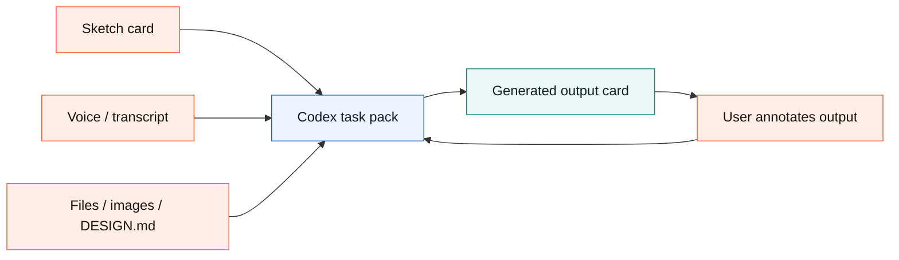
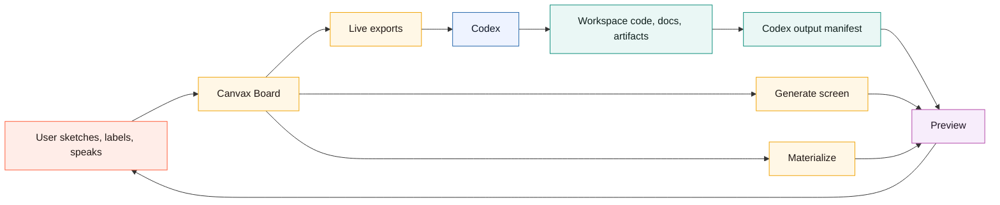
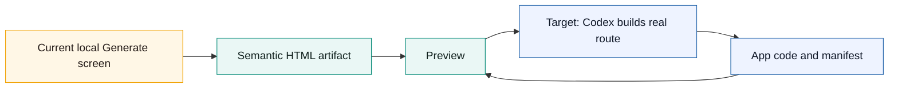
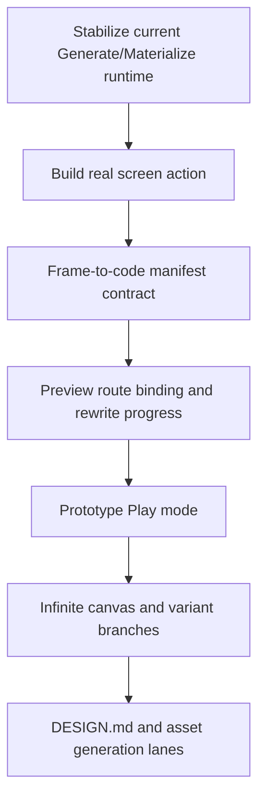

# Canvax Stitch Gap Roadmap

Updated: May 15, 2026

This document compares the current Canvax repo against the Stitch-style design workflow and records what is done, what is missing, and what should improve next.

Canvax should not clone Stitch feature-for-feature. The stronger direction is:

```text
Stitch-like creative canvas
        +
Codex workspace awareness
        +
local-first handoff, preview, code, docs, and artifacts
        =
Canvax as the visual collaboration layer for building real surfaces
```

## Current Design Decision: Workbench First

As of May 15, 2026, the next Canvax UI direction is **Workbench first**.

The existing Advanced board is useful, but it is too dense as the default experience. The default surface should be a single creative workspace where the user can draw, speak/type, see generated output, and annotate corrections without opening several panels.

```text
before
  left timeline + top toolbar + canvas + right inspector + separate preview

after
  Codex brief + sketch card + generated output card + bottom command composer
  Advanced remains available for frames, flow, manifests, captures, and debugging.
```



Product rules:

- Canvax core stays local-first and must not require `OPENAI_API_KEY`.
- Image generation is a host capability or optional adapter, not a baseline dependency.
- The baseline UI exports prompt packs, task packs, sketches, transcripts, coordinates, and previews that Codex can use in the current chat.
- Direct ChatGPT/Codex microphone reuse requires a first-party bridge; the local board keeps browser speech, manual dictation, and transcript forwarding as the current bridge.
- The repo-level plan for this redesign is `canvax-stitch-like-workbench-plan.md`.

## External Reference Points

Current Stitch references show these major product ideas:

- AI-native canvas for high-fidelity UI creation from natural language.
- Infinite canvas that accepts images, text, and code as context.
- A design agent that reasons over the project evolution.
- Agent manager for parallel design directions.
- `DESIGN.md` import/export for design system rules.
- Interactive prototypes where screens can be connected and played.
- Voice-driven canvas collaboration and real-time design updates.
- MCP, SDK, skills, and exports to bridge into developer tools.

Sources:

- Google Labs Stitch UI design update: https://blog.google/innovation-and-ai/models-and-research/google-labs/stitch-ai-ui-design/
- Google Labs Stitch Gemini 3 prototype update: https://blog.google/innovation-and-ai/models-and-research/google-labs/stitch-gemini-3/
- OpenAI ChatGPT Images 2.0 announcement: https://openai.com/index/introducing-chatgpt-images-2-0/

## Current Canvax Shape



```text
Canvax today
|- Board: rough sketch, frames, flow, notes, tools, voice
|- Preview: compare sketch vs output, artifacts, changed files, rewrite queue
|- Service: local exports, manifests, checkpoints, materialized/generated HTML
|- Codex Browser Use / Atlas: preferred way to view/inspect board, Preview, and generated apps
|- Codex skill: tells Codex to read the live handoff files
`- Docs: install, usage, architecture, development, proposal, status
```

## What Is Done

### Board And Sketch Input

- Frame view exists for single-screen sketching.
- Flow view exists for linking multiple frames.
- Drawing tools exist: select, pen, marker, line, rectangle, oval, arrow, label, erase.
- Selection supports moving, resizing, deleting, duplication, layering, grouping, and lasso selection.
- Labels can act as semantic notes for Codex, not just visible text.
- Reference image underlays are supported through the explicit `Reference underlay` upload.
- Pasted or dropped images can now become editable image elements, so generated candidates or reference crops can be placed back on a frame instead of only sitting behind the sketch.
- Saved asset candidates now appear in a compact Workbench tray. Designers can place a candidate as an editable image slot on its source frame/region or attach a generated file back into that slot while preserving `assetCandidateId`.
- Asset candidate cards now show attached-image thumbnails, review status, selection, and an accept action so generated image choices become explicit no-API handoff state.
- Autosnap and manual freeze write live handoff files.
- Captures and checkpoints preserve collaboration moments.
- Workbench now exposes viewport choice, new frame creation, connected section creation, free-canvas mode, local screen generation, generated-output correction marks, and the floating designer rail without requiring the user to open Advanced mode.
- Workbench surface presets now cover UI, poster, slide, book-spread, storyboard, comic-page, square, and free-canvas work so Canvax can support broader design/illustration planning, not only app screens.
- Workbench now exposes action modes for `Build UI`, `Refine UI`, `Write spec`, `Image prompt`, and `Variations`.
- Workbench now has a bottom command composer for typed/pasted dictation, Talk, Note, Make, and Apply, so the main sketch loop can stay canvas-first.
- The Workbench rail now behaves like the primary bottom designer dock with tactile actions, undo/redo, brush `-` / `+`, and Image handoff.
- The rail and slider size controls now resize selected elements in Select mode and only act globally when no element is selected.
- The Workbench tray no longer duplicates the dock with a second tool grid in simple mode; it is a compact command strip focused on brief, surface/action context, voice, and generated output.
- The generated output card remains a compact thumbnail/status/correction target, and Workbench adds a larger output stage through `Split` and `Output` focus modes for comfortable inspection and correction marks.
- Advanced mode keeps the full frame, flow, manifest, capture, and inspector surface, but now uses the same dark dotted Canvax visual system as Workbench. The mode switch and deck labels make it read as a technical inspector layer for the same workbench rather than a different app, and its sticky command deck is now more opaque so scroll content does not blur through the controls.
- Workbench now supports `Sketch`, `Split`, `Output`, and `Map` focus modes. The compact output card remains a status/quick-correction target, the large output stage can become the primary correction surface, and Map exposes the frame/variant graph as a zoomable spatial workbench without opening Advanced.
- Live exports now include a `spatialWorkspace` object with map zoom, card positions, editable variant branches, group containment, entry/active frame ids, links, manual note/reference objects, asset candidate objects, generated preview targets, generated artifacts, changed-file objects, and checkpoint history cards, so Codex can treat frame layout, grouped references, implementation outputs, and collaboration history as project memory rather than just a linear list. Map rendering now reconciles generated preview/artifact objects, removes legacy stale cards, and provides `Clear outputs` so old materialized outputs do not flood the spatial canvas.
- Variant branches now render as visible branch cards with lineage in Map and can be promoted with `Use variant`, which marks the selected branch as primary and makes it the entry frame while preserving lineage through `spatialWorkspace.variantBranches`.
- Eraser strokes now render on an isolated ink layer so they remove drawn ink without wiping the paper/grid layer, and they are excluded from materialized output geometry and image prompt composition maps.
- Frame thumbnail rendering is cache-versioned and static board assets are served with no-store headers, reducing stale UI/thumbnail confusion after local updates.

### Voice And Intent

- Canvax has board-side voice notes.
- Voice notes can be scoped to the current frame or the whole board.
- Browser speech recognition is used when available.
- Manual voice notes are available as a fallback.
- Codex chat transcript forwarding exists through `./canvax --transcript "..." --scope frame|session`.
- Voice is written into JSON, Markdown prompt output, and `exports/canvax-voice-latest.md`.

### Preview And Output Binding

- Preview opens as a separate window/tab.
- Preview supports compare modes for sketch, output, and split view.
- Preview can follow active frame context.
- Preview reads generated artifacts, changed files, output status, and rewrite queue state.
- Output digest changes can trigger preview refreshes for same-URL targets.
- Compare snapshots can be saved for review.

### Generate Screen And Materialize

- `Generate screen` exists as a richer local generated-screen pass.
- `Generate screen` now has a semantic hero/page renderer for polished website-like output.
- `Materialize` exists as a quicker deterministic local preview pass.
- Both write HTML artifacts under `artifacts/preview/materialized/`.
- Both update the preview manifest so Preview can open the output immediately.
- Per-frame generated targets are stable, so repeated generation refreshes the same route.
- Refinement metadata records changed regions between generated revisions.

### Codex Workspace Loop

- `/canvax` or `$canvax` can attach Codex to the live handoff.
- Live JSON and Markdown exports exist under `exports/`.
- `canvax-task-pack-latest.*` and `canvax-image-prompt-pack-latest.*` exist for Codex and host-side image generation.
- The image prompt pack includes normalized coordinates and an HTML/CSS placement scaffold so ChatGPT/image generation can preserve layout intent without Canvax calling an API.
- `canvax-asset-candidates-latest.*` feeds the Workbench candidate tray so prompt-ready image regions can become editable board objects before or after host generation.
- A host capability registry now reports local no-API handoff, Codex browser/workspace availability, host image generation boundary, and native microphone bridge boundary.
- If a project `DESIGN.md` exists, Canvax includes it as design context in task and image prompt packs.
- Advanced mode can write a starter `DESIGN.md` from the current board without overwriting an existing design contract.
- Self-test coverage now checks task-pack export, no-API image prompt pack export, Workbench dock brush sizing, and eraser rendering against black-mark/grid-damage regressions.
- `artifacts/canvax/codex-output.json` is the canonical Codex output manifest.
- The board can publish current git workspace changes into the output manifest.
- Live workspace-follow lets board and Preview see Codex edits without constant manual publishing.
- Rewrite queue tells Codex which frames need first output, a target, binding, or refresh.
- `canvax-rewrite-request-latest.*` packages queued frames, stale output context, correction marks, voice notes, and output manifest bindings into one Codex-readable refinement handoff.
- `execute-rewrite-request` consumes that handoff into a refreshed frame-bound local artifact plus Codex output manifest, proving the no-API rewrite binding path before a full autonomous Codex rewrite loop exists. Workbench `Apply to Codex` and optional `Live rewrite` now call the same path after checkpoint save.
- Codex Browser Use / Atlas can keep the local board, Preview, and generated app inside Codex's visual inspection loop instead of requiring an external browser.

## What Is Still Missing

### 1. True Codex-Built Screen Generation

Current `Generate screen` is local and deterministic. It improves the preview, but it does not by itself create real app/page code.

Update: `Build with Codex` now creates the first real-code bridge. It writes a Codex-readable build request and frame-to-code output contract, then the board runs the local no-API executor to bind an immediate frame preview plus implementation starter bundle. Codex can still execute that same request in the chat/session and replace or port the local artifact into a real route or component through `write-codex-output`.

Target behavior:

```text
draw frame -> Generate with Codex -> app/page files change -> preview updates -> sketch corrections -> Codex refines changed regions
```

Needed:

- A board action that creates a Codex-ready generation task from the current frame/checkpoint. **Initial version shipped as `Build with Codex`.**
- A standard output contract for generated app/page/screen code. **Initial version shipped through `exports/canvax-build-real-latest.*` plus `artifacts/canvax/codex-output.json`.**
- Automatic preview binding to the generated route or artifact. **Shipped for the local no-API build executor and its implementation bundle; still open for autonomous Codex-edited app routes/components.**
- Frame-aware code ownership so one frame maps to the files/components Codex generated.

Current stepping stone:

```text
done
  rough frame -> local Generate screen -> polished HTML artifact -> Preview

next
  rough frame -> Build with Codex request -> local bound preview + implementation bundle
  rough frame -> Build with Codex request -> Codex edits app/page files -> live app preview
```



### 2. Live Two-Way Rewrite Loop

Today Canvax can detect stale output and changed regions. It also writes a focused `canvax-rewrite-request-latest.*` handoff for Codex rewrite passes, and `execute-rewrite-request` can turn that handoff into a refreshed frame-bound local preview artifact. Workbench `Apply to Codex` and optional `Live rewrite` invoke that local executor after saving the latest checkpoint, so a sketch/voice/correction pass can refresh the attached preview without a terminal step. It does not yet run a continuous loop where Codex rewrites real app files while the user keeps drawing.

Needed:

- A live task queue for frames needing rewrite attention.
- A focused rewrite request artifact. **Initial `canvax-rewrite-request-latest.*` shipped.**
- A deterministic local executor for that request. **Initial `execute-rewrite-request` shipped and is now called by Workbench Apply plus optional autosnap/freeze Live rewrite.**
- A frame revision to output revision dependency graph. **Initial `revisionGraph` in rewrite requests shipped.**
- A "changed sketch region -> affected generated component" map.
- A visible rewrite progress lane in Preview. **Initial `Rewrite handoff` lane shipped for request/executor/manifest state.**
- Conflict handling when the user sketches while Codex is still rewriting.

### 3. Infinite Canvas And Spatial Project Memory

Canvax has frames, Flow view, a large `Free canvas` viewport preset, Workbench `Map`, movable/resizable labeled group regions, manual note/reference cards, asset candidate spatial objects, generated output/artifact/change spatial objects, checkpoint history cards, background drag-pan, cursor-centered wheel/pinch zoom, and cleaner generated-output review aids. Map is the first persistent spatial project layer, but Canvax is not yet an infinite design canvas with nested groups, branches, prompts, and code artifacts.

Needed:

- Zoomable infinite workspace.
- Pan/zoom controls that feel stable on Mac trackpads. **Initial background drag-pan, button zoom, and cursor-centered pinch/ctrl-wheel zoom are shipped; advanced inertial/grouped canvas behavior remains open.**
- Spatial groups for explorations, branches, reference boards, and generated variants. **Initial variant branches now exist as editable Flow-connected frames and export through `spatialWorkspace.variantBranches`; labeled group regions, manual notes, reference files/images, asset candidates, generated output targets, generated artifacts, and changed files now appear as draggable Map objects, and group containment is exported for Codex.**
- Multiple generated directions visible at once.
- Better timeline/history navigation for long sessions.

Current stepping stone:

```text
done
  Workbench -> Free canvas preset -> large sketch surface
  Workbench rail -> canvas-first controls without reopening the tray
  generated output overlay -> saved correction marks for Codex
  generated preview review aids -> opt-in original sketch and design notes
  Workbench Map -> zoomable frame/variant project graph exported as spatialWorkspace
  Map Add group -> labeled exploration regions
  Map Add note/Add file -> manual context objects
  Image pack -> asset candidate spatial objects in Map
  Codex output manifest -> generated target/artifact/change spatial objects in Map

next
  true infinite canvas -> nested groups + richer object editing + history lanes
```

### 4. Prototype Play Mode

Flow links exist, and Preview now has `Play flow` mode that starts from the entry frame, lets the user click outgoing transition labels, and overlays clickable hotspots directly on the sketch/output viewport. Users can also select a drawn element and assign it a target frame, which turns that exact region into a persistent prototype hotspot. It is still not a full prototype authoring system because automatic next-screen suggestions and component-level state mapping are open.

Needed:

- Play button for connected frames. **Initial Preview `Play flow` shipped.**
- Click targets or hotspot regions on the frame canvas. **Initial generated hotspots from Flow links shipped, and selected drawn elements can now become persistent prototype hotspots.**
- Transition labels that become interactive prototype behavior. **Initial transition labels now drive side-panel steps and viewport hotspot labels.**
- Automatic next-screen suggestions when a user links or clicks a component.
- Preview playback that can switch between sketch prototype and generated implementation. **Initial hotspots render on both sketch and connected output surfaces.**

### 5. Design System Extraction And `DESIGN.md`

Canvax records mood, notes, color, and generated direction, and it can now create a starter reusable design-system document.

Needed:

- Richer `DESIGN.md` import controls inside the board UI.
- Extract visual tokens from a URL, screenshot, or existing app.
- Enforce those tokens when Codex generates or refines UI.

### 6. Image Model And Asset Workflow

Canvax can describe image directions, hold reference underlays, export an image prompt pack with coordinates and an HTML/CSS placement scaffold, write prompt-ready asset candidate records, and place pasted/dropped image outputs back onto a frame as editable image elements. It still does not directly generate final images by itself.

Target behavior:

```text
sketch asset region -> describe asset -> generate image candidates -> place candidate into frame -> Codex uses it in app/spec
```

Current stepping stone:

```text
done
  rough sketch -> labels/voice -> image prompt pack -> coordinates + scaffold
  image prompt pack -> asset candidate records with output slots
  asset candidate records -> Workbench candidate tray -> editable slots
  generated/reference image -> paste/drop -> editable image element on frame
  generated file -> candidate tray attach -> editable image element with candidate id

next
  prompt pack -> host image generation -> multiple candidate images -> compare/select/accept UI
```

Needed:

- Asset regions on canvas.
- Image candidate import and placement back into the board. **Initial candidate tray placement and attach-image import are shipped.**
- Variant comparison for image generations.
- Style-lock packs for books, comics, posters, decks, and brand systems.
- A local artifact format for generated image candidates. **Initial prompt-ready asset candidate format shipped.**
- Drag/attach generated image candidates back onto frames. **Initial paste/drop and tray attach workflows are shipped.**
- Optional Codex-mediated image generation where the current Codex environment supports it, without making the core Canvax workflow depend on a separate user-provided API key.

### 7. Multisurface Output

The current preview path is strongest for web-like screens. The Canvax goal is broader: app UI, websites, decks, images, Qt layouts, and other visual surfaces.

Needed:

- Surface-specific generation modes:
  - Web page/app screen
  - Mobile app screen
  - Desktop/Qt screen
  - Slide/PPT layout
  - Image/poster/infographic
  - Spec/wireframe only
- Surface-specific preview renderers and export contracts.
- Shared frame semantics so Codex can interpret all of them from the same board model.

### 8. Stronger Regression And Long-Session Stability

Syntax checks, schema checks, and headless browser checks exist, but long-session validation still needs to become broader before Canvax can be treated as a continuously running design surface.

Current coverage:

- `npm run check` catches syntax/parser failures.
- `npm run regression` validates export schema, server payload shape, and the board/Preview browser self-test routes when the local service and Chrome are available.
- In-browser self-test covers drawing tools, selection, eraser layer behavior, rail sizing, Workbench focus modes, Workbench spatial map rendering/export, flow link creation/deletion, task/image prompt packs, materialize, output activity, rewrite queue, and large-session export consistency.

Needed:

- Large-session tests with many frames, captures, voice notes, and generated artifacts.
- Visual layout checks for board and Preview at multiple viewport sizes.
- Service lifecycle tests for stop/restart/reuse behavior.
- Stale-port recovery when a listener exists but runtime files disagree.

## Improvement Backlog

### P0: Make Current Baseline Trustworthy

- Keep runtime bugs in `Generate screen`, `Materialize`, and preview manifest paths at zero-regression through self-test and `npm run check`.
- Keep Workbench `Sketch`, `Split`, and `Output` focus modes stable while adding real Codex build actions.
- Keep button feedback consistent across board, Workbench dock, and Preview.
- Continue responsive clipping fixes for compact side panels and dense metadata rows.
- Preserve eraser isolation so erase operations never appear as black output geometry or wipe the paper/grid base layer.
- Keep browser regression reliable enough to fail hard in CI.
- Add service lifecycle diagnostics for stale ports.

### P1: Reach Stitch-Style Core UX

- Infinite canvas with pan/zoom. **Initial Workbench Map drag-pan, cursor-centered pinch/ctrl-wheel zoom, movable/resizable labeled group regions with exported containment, and manual note/reference, asset-candidate, generated-output, generated-artifact, and changed-file spatial objects are shipped; richer nested editing remains open.**
- Prototype Play mode. **Preview frame-link playback plus selected-element hotspot playback shipped.**
- Multiple generated variants visible side by side. **Initial deterministic variants now appear as connected editable Flow frames and export as explicit editable spatial branch records.**
- Voice-driven critique/refinement lane.
- Branchable design explorations with a clear agent/output history.
- Prompt chips for common refinements like "try another font", "make it more dramatic", "show mobile variant". **Initial Workbench quick-prompt chips shipped.**
- Brand polish across board, Preview, generated routes, and docs.

### P2: Make Codex The Differentiator

- One board action: `Build with Codex`. **Initial task/request writer plus local execution/binding path shipped.**
- Codex reads the latest frame/checkpoint and writes actual app/page/component code.
- Codex writes a manifest that binds the generated code route back to the frame.
- Preview reloads and highlights changed code/artifact context.
- Sketch corrections become targeted rewrite tasks instead of generic prompts. **Initial rewrite request plus local executor shipped, and Workbench Apply/Live rewrite now run the executor; component-level targeting remains open.**
- Browser Use / Atlas opens and inspects the board, Preview, and generated app so Codex can fix visual issues from the same workspace loop.

### P3: Add Design System And Asset Intelligence

- Import/export richer `DESIGN.md` revisions beyond the starter generator.
- Extract design tokens from screenshots, URLs, existing repo CSS, or generated screens.
- Add image asset lanes powered by Codex-accessible image generation when available.
- Preserve image prompts, generated candidates, source sketches, and chosen assets as artifacts.

### P4: Prepare For Native Codex Integration

- Keep the local companion working.
- Preserve the file/manifest transport as a fallback.
- Add an App Server style transport layer for richer Codex clients.
- Document the minimum upstream API Canvax needs:
  - open a thread-bound canvas
  - receive live image/sketch snapshots
  - send generated artifacts/previews back into the same thread
  - preserve voice, frame, flow, and rewrite queue state

## Product Principles

1. Canvax must stay generic. It should not become only a landing-page generator.
2. Canvax must stay close to Codex. The best advantage is building real workspace code from visual intent.
3. The core loop should not require the user to bring a paid API key. Optional provider integrations can exist, but the default path should use the current Codex/chat environment and local artifacts.
4. Sketch, voice, generated output, source files, and docs should all become one collaboration state.
5. Preview must show what changed and why, not just a static before/after.
6. A rough sketch should be enough to start, but every generated result must remain editable through sketch, text, voice, and code.

## Recommended Next Build Order



Concrete next steps:

- Add `Build with Codex` beside `Generate screen`. **Done for Workbench, rail, toolbar, and Advanced generation panel.**
- Add explicit action modes for `Build UI`, `Refine UI`, `Write spec`, `Make image prompt`, and `Create variations`.
- Add generated image candidate import/placement as first-class board assets. **Initial Workbench candidate tray and editable image-slot placement shipped.**
- Add a Browser Use / Atlas first workflow to the Canvax skill/plugin path: start service, open board in Codex browser, open Preview, inspect generated app, publish manifest.
- Implement a task artifact under `artifacts/canvax/build-requests/` that Codex can read and execute. **Initial JSON/Markdown request archive and deterministic local executor shipped.**
- Extend `write-codex-output.mjs` so Codex can bind generated routes/components to frame ids in one command.
- Add Preview UI for "Codex is building/refining this frame" state.
- Add prototype Play mode before attempting a full infinite canvas, because the current frame/flow model can support Play sooner.
