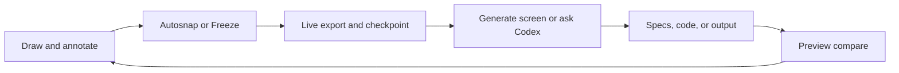
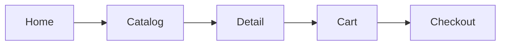
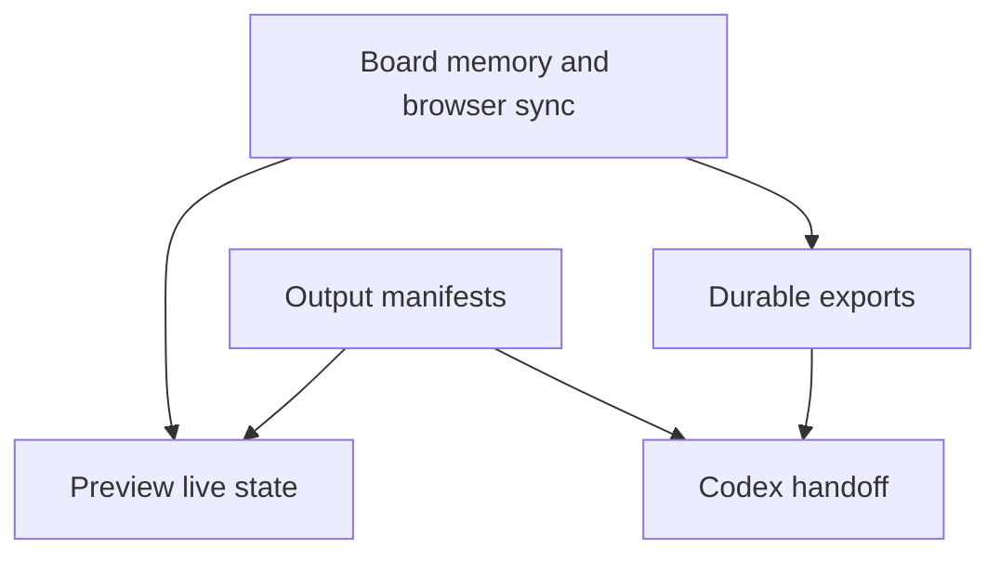
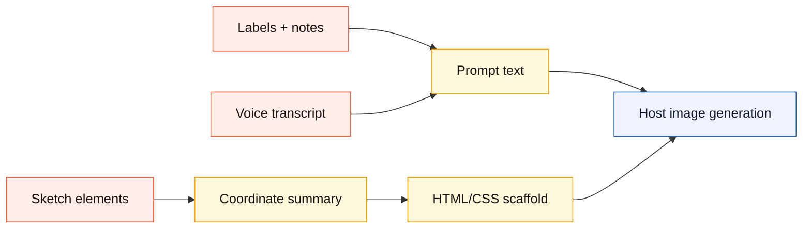
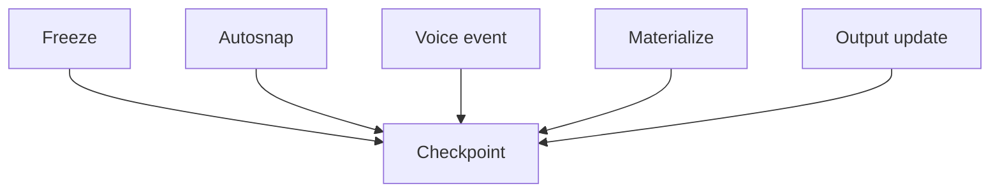
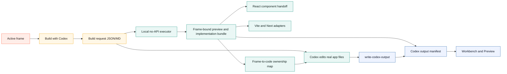
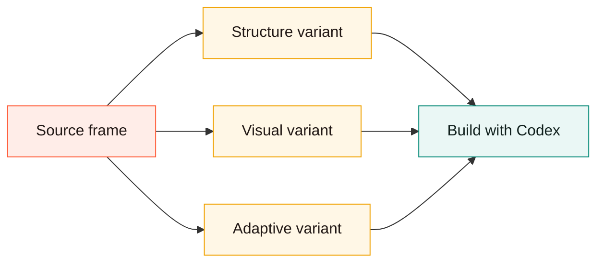
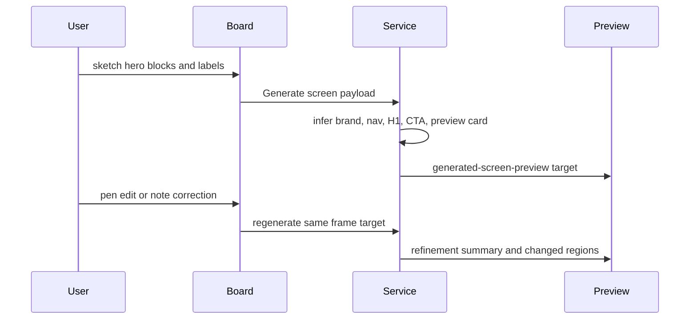
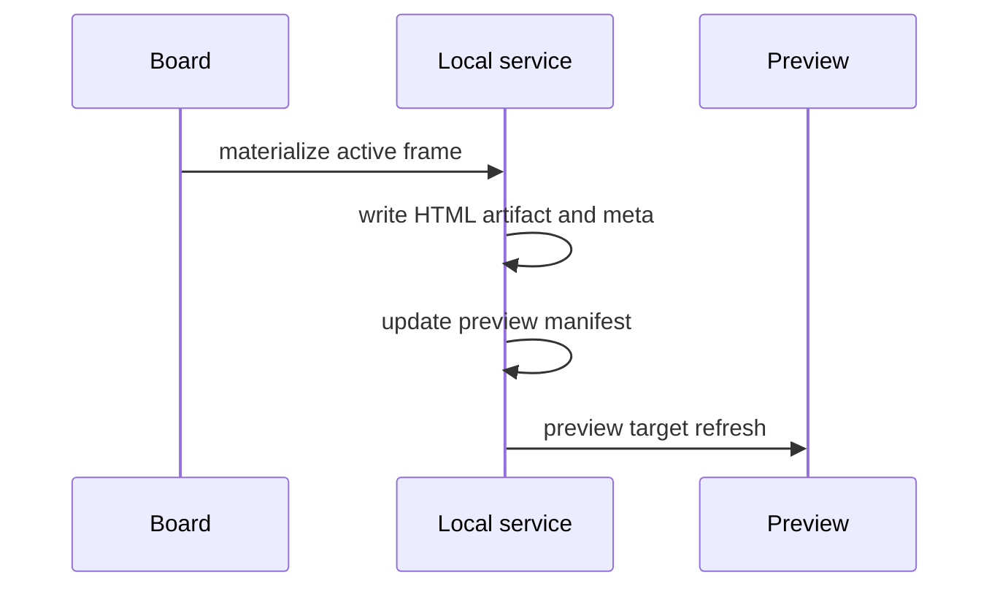

# Use Canvax With Codex

If you want the feature-by-feature behavior map first, read `docs/FEATURES.md` before this guide. If you want the shortest designer-facing path, read `docs/DESIGNER_WALKTHROUGH.md`.

## Operator Loop

```text
draw -> annotate -> freeze/autosnap -> ask Codex -> inspect Preview
  ^                                                       |
  |                                                       v
  +---------------- sketch corrections <------------------+
```



## Core Mental Model

Canvax is a visual handoff surface for Codex.

The intended loop is:

1. open the board
2. stay in `Workbench` when you only need a quick sketch + spoken instruction
3. optionally use `Make real` and draw correction marks over the generated output
4. press `Apply to Codex` to save the sketch, voice note, correction marks, latest export, and checkpoint
5. switch to `Advanced` only when you need frames, flows, captures, or manifest detail
6. tell Codex to use the current Canvax

Everyday Workbench actions stay visible first. Less common actions such as
connected sections, variants, image packs, and Live rewrite sit under
`More actions` so the default surface stays closer to draw, talk, make, and
apply.

When Codex Desktop has Browser Use / Atlas available, open the board and Preview in the in-app browser. That is the lowest-friction mode because Codex can inspect the same visual surfaces you are using while it edits code, runs checks, and publishes output context back into Canvax.

```text
Codex chat
   |
   +--> Browser Use / Atlas: Canvax board at localhost:3210
   |
   +--> Browser Use / Atlas: Canvax Preview / generated app
   |
   `--> workspace edits + manifest publishing
```

The intended open behavior is:

- `/canvax` or `$canvax`: Codex-first path, open the board in the in-app browser.
- `./canvax`: local service only, no external browser.
- `./canvax --open-external`: default macOS browser fallback.
- `./canvax --chrome`: Google Chrome fallback.

## Local Projects

The `Project` block is available in Workbench and in the Advanced left rail.
Both controls use the same browser-local project picker, and the `Browse`
button opens a larger Project Browser overlay when the dropdown is too small.

Use it when you want separate Canvax boards for separate products, book spreads,
UI explorations, or design directions:

- `New` creates a blank local Canvax project.
- `Duplicate` copies the current project into a new local board.
- `Delete` removes the current project only when another project exists.
- `Open project` switches the active browser-local board.
- `Browse` shows searchable project cards with active status, frame counts, the
  active frame title, and Open / Duplicate / Delete actions.

```text
localStorage project registry
    |
    +--> Project A snapshot
    +--> Project B snapshot
    `--> active project -> exports/canvax-live-latest.*
```

Only the active project writes the shared live Codex handoff files. This keeps
Codex behavior simple: `/canvax` still means "read the current active Canvax",
while the picker gives designers a Stitch-like way to keep multiple local boards
without opening multiple repo copies. Workbench exposes the same project switcher
so quick sketch/talk/make sessions do not have to detour into Advanced mode just
to change projects.

Every save also writes a project-scoped latest handoff:

- `exports/canvax-project-registry-latest.json`
- `exports/canvax-project-registry-latest.md`
- `exports/projects/<project-id>/canvax-live-latest.json`
- `exports/projects/<project-id>/canvax-live-latest.md`
- `exports/projects/<project-id>/canvax-task-pack-latest.json`
- `exports/projects/<project-id>/canvax-rewrite-request-latest.json`
- `exports/projects/<project-id>/canvax-image-prompt-pack-latest.json`
- `exports/projects/<project-id>/canvax-asset-candidates-latest.json`
- `exports/projects/<project-id>/canvax-image-generation-brief-latest.json`
- `exports/projects/<project-id>/canvax-image-host-task-latest.json`
- `exports/projects/<project-id>/canvax-image-results-latest.json`
- `exports/projects/<project-id>/canvax-build-real-latest.json`
- `exports/projects/<project-id>/canvax-checkpoint-latest.json`
- `exports/projects/<project-id>/canvax-checkpoints.json`
- `exports/projects/<project-id>/assets/...`

Use the shared `exports/canvax-live-latest.json` for the normal attached chat.
Use a project-scoped path when you need to compare or recover a specific local
project's latest handoff.

Project-scoped files are latest mirrors, not separate cloud workspaces. The
active project still writes the shared compatibility files so Codex can keep one
simple default, while the project folder prevents build requests, image
candidates, image-host tasks, and checkpoints from becoming ambiguous after a
designer switches projects.

The local service also scopes the live board state it sends back to the browser.
`/api/preview-state` reads checkpoint history from the active project's
`exports/projects/<project-id>/canvax-checkpoints.json` and filters generated
output manifests to the active project or active project frame ids. That keeps
old generated cards and checkpoint trails from another local project from
appearing on the current Map after a project switch.

When Codex publishes implementation output with `scripts/write-codex-output.mjs`,
Canvax now records the active project on the manifest and mirrors the output to:

- `artifacts/canvax/codex-output.json`
- `exports/projects/<project-id>/canvax-codex-output-latest.json`
- `exports/projects/<project-id>/canvax-codex-output-latest.md`

## What To Draw

Canvax is intentionally generic. Use it for:

- websites
- web apps
- mobile screens
- Qt layouts
- desktop UI ideas
- image prompt composition
- product flow maps
- rough interaction sequences

It is not limited to a hero section or landing page flow.

## Workbench

Use Workbench when Canvax should feel like a scratchpad beside this chat.

It hides advanced panels and keeps only:

- visible surface selection for desktop, mobile, tablet, poster, slide, book spread, storyboard, comic page, square, or free canvas
- action selection for `Build UI`, `Refine UI`, `Write spec`, `Image prompt`, or `Variations`
- `New frame` for another screen/state
- `New section` for a connected continuation below the current section
- `Pen`, `Rect`, `Arrow`, and `Erase`
- `Start talking` / `Stop talking`
- a quick manual voice note field
- a `Voice intent queue` that turns recent spoken/manual notes into local refinement cards for placement, scale, visual style, flow, asset, copy, or general intent
- quick-prompt chips for common refinements like `Try another font`, `Make it more dramatic`, `Show mobile variant`, `Tighten spacing`, and `Add image candidates`
- `Make real` for a local generated-screen preview
- generated output beside the sketch when a preview target exists
- a lower-left `Agent log` that summarizes recent Make/Apply/Review, rewrite, output, checkpoint, and voice-intent activity without opening Advanced
- `Sketch`, `Split`, `Output`, and `Map` focus modes for choosing whether the rough canvas, side-by-side comparison, generated surface, or spatial project map is primary
- a floating `Add to canvas` dock in `Map` for creating frames, notes, file/reference cards, groups, variants, generated screens, or Codex build requests without returning to side panels
- correction marks drawn directly over generated output
- pasted or dropped images as movable/resizable image assets on the frame
- `Add image` as the visible Workbench file-picker path for editable reference images, generated candidates, book/storyboard art, or UI assets
- a bottom floating designer rail for the main tools, undo/redo, brush `-` / `+`, `Talk`, `Pin`, `Make`, `Image`, and `Apply` when `Open scratchpad` is active
- a bottom command composer for typed or pasted dictation with `Talk`, `Note`, `Pin`, `Make`, and `Apply` in focused canvas mode; `Pin` leaves the current instruction as a visible Map note and voice-context entry
- scratchpad quick refinement chips above the composer for common changes like font, drama, mobile variant, spacing, and image candidates
- context-sensitive size controls: `-` / `+` resize selected elements in Select mode and otherwise update the current brush/eraser size
- eraser behavior that only removes drawn ink, not the paper/grid base, and does not export as black prompt/materialize geometry
- `Open scratchpad` / `Show brief` for canvas-first designer focus
- `Apply to Codex`
- `Preview`

The mode guide under the Workbench/Advanced switch summarizes the current loop:
`Sketch`, `Talk`, then `Make / Apply`.

```text
Workbench
+--------------------------------------+
| sketch rough placement on the canvas |
| speak or paste the instruction        |
| optionally Make real                  |
| mark corrections over generated output|
+--------------------------------------+
          |
          v
 latest export + latest checkpoint
```

`Apply to Codex` freezes the current frame, writes the live handoff, saves a Workbench checkpoint, and runs the local no-API rewrite executor. That gives Codex a single clean moment to read: the sketch image, the generated-output correction marks, the transcript/manual note, and the active frame context. When a generated output is already attached, the same press also refreshes a frame-bound local preview artifact through the Codex output manifest.

`Live rewrite` is optional. Turn it on when you want autosnap or manual freeze to run that same local no-API rewrite pass after saving. This is the closest current loop to "keep drawing and let the output follow," without requiring an API key. If a second autosnap/freeze happens while a rewrite is already running, Canvax queues the newest handoff and runs it after the current refresh finishes so the latest sketch/voice state is not silently skipped.

```text
Apply to Codex or Live rewrite
  -> freeze current frame
  -> live export + checkpoint
  -> rewrite request
  -> local rewrite executor
  -> refreshed output manifest target
```

### Checkpoint Replay

Recent checkpoints are not only a log. Use `Replay as frame` from the checkpoint
panel or from a checkpoint card in `Map` when you want to branch from a saved
moment.

Replay creates a new editable frame connected from the active frame. The saved
snapshot becomes an underlay, a small label records the checkpoint source, and
the new frame is marked as a `Checkpoint replay` variant. This is intentionally
non-destructive: it does not replace the current board state, and it does not
pretend to restore every raw vector element from old exports. It gives you a
sketchable branch for "go back to that version and try another direction."

```text
checkpoint card
      |
      v
Replay as frame
      |
      v
new editable frame with saved snapshot underlay
      |
      v
sketch corrections -> Apply / Build with Codex
```

`Import` brings an image file into the active frame as an editable canvas object. Use it for references, generated candidates, book/storyboard art, UI screenshots, or visual assets. The same behavior is also available by paste or drag/drop.

`Image pack` writes a no-API prompt pack for ChatGPT/image-generation host use. It includes a human-readable prompt, normalized coordinates, safe-zone notes, sketch references, output-correction notes, an HTML/CSS placement scaffold, and a style-lock block. The scaffold is not production code; it is a coordinate map that tells an image model where each sketched region belongs. The style lock tells the host to preserve visual identity, palette, rendering language, character/object continuity, and frame-to-frame consistency across image candidates.

Paste or drop an image onto the canvas when you want to bring a generated candidate, reference crop, book illustration pass, or UI asset back into the frame as an editable object. It can be selected, moved, resized, duplicated, layered, labeled, included in prompt packs, and passed into Materialize. Use `Reference underlay` only when the image should sit behind the sketch as tracing/context.

If the project root contains `DESIGN.md`, Canvax includes it in the task pack, image prompt pack, and prompt markdown. Use that file for reusable style rules, brand direction, illustration constraints, accessibility rules, product tone, or project-specific design system notes.

Advanced mode includes `Create DESIGN.md` in the Generate screen section. That writes a starter file from the current board mood, palette, frame notes, labels, and generated direction. It will not overwrite an existing `DESIGN.md`.

The same Advanced section also includes `Design kit`. This is the visible rule stack Canvax will hand to Codex: active `DESIGN.md` when present, local board rules when not, the current generation recipe, action mode, board mood, surface, frame notes, and variant style knobs. The kit preset dropdown can apply common designer directions such as product app, poster system, book spread, dashboard, or storyboard. Applying a kit changes the board-level direction and fills empty frame notes; it does not delete or rewrite the sketch.

Repository kits live under `design-kits/*.json`. Canvax exposes them through
`/api/status` as `designKitGallery`, then lists them in the same `Design kit`
dropdown under `Repository kits`. The `Find kit` field filters built-in and
repository kits by label, summary, source path, surface, action mode, and frame
notes while keeping the active kit visible. Use this when a project needs
reusable visual rules that are more specific than the built-in presets, such as
a campaign style, children-book spread system, manga workflow, design-system
variant, or client brand direction.

Validate those files with:

```bash
npm run validate-design-kits
npm run validate-design-kits -- --query scythian
npm run package-design-kits
npm run package-design-kits -- --query storybook
```

`package-design-kits` writes
`exports/canvax-design-kit-library-latest.json` and `.md`. That artifact is a
local no-API sharing bundle with source paths, full kit JSON, local versions,
SHA-256 checksums, and install notes. Use it when you want to move a campaign,
book, product, or client design-system kit library into another Canvax
workspace without adding a hosted account.

The shipped starter kits are:

- `design-kits/scythian-constructivist.json`
- `design-kits/storybook-cinematic-spread.json`
- `design-kits/quiet-product-system.json`

Use `Extract tokens` when the current frame itself should become part of the design contract. Canvax samples drawn non-eraser elements and any pasted/dropped image elements or reference underlay that the browser can read locally. It records a local token summary: dominant colors, element mix, density, shape language, text cues, asset-slot cues, and visual reference sample counts. Those tokens export through `designKit` and feed the no-API style lock used by image prompt packs, asset candidates, and Build-with-Codex context. This covers current-frame sketches, pasted screenshots, dropped reference images, and generated candidates brought back into Canvax. It does not yet scrape tokens directly from arbitrary URLs or external running apps.

For external design references, use the local extractor:

```bash
npm run extract-tokens -- --file web/styles.css
npm run extract-tokens -- --url https://example.com
npm run extract-tokens -- --image artifacts/canvax/browser-snapshots/latest/board-desktop-1440x1024.png
npm run extract-tokens -- --text ":root{--brand:#e85d3a;font-family:Georgia}"
```

It writes `exports/canvax-external-design-tokens-latest.json` and `.md` with palette, CSS variable, font-family, optional screenshot pixel-sample cues, and a local `semanticStructure` block when the source includes HTML or JSX. That block records landmarks, component signals, headings, actions, forms, class signals, and `data-canvax-node-id` / `data-canvax-node-type` bindings so Codex can understand a generated artifact as UI structure instead of only colors. This is still no-API. Screenshot extraction samples local raster files; it does not perform AI design critique or inspect a live browser DOM.

After running it, press `Import external` in the Advanced `Design kit` card to bring `exports/canvax-external-design-tokens-latest.json` into the active board as `designKit.designTokens`.

When Build with Codex creates an implementation bundle, verify that those
tokens made it into the generated files:

```bash
npm run verify-tokens -- --contract artifacts/preview/codex-build/frames/<frame-id>/implementation/canvax-build-contract.json
```

Review the generated HTML artifact before asking Codex to port it into
production:

```bash
npm run review-artifact -- --file artifacts/preview/codex-build/frames/<frame-id>/implementation/index.html
npm run review-artifact -- --dry-run --json --file artifacts/preview/codex-build/frames/<frame-id>/implementation/index.html
```

`review-artifact` writes `exports/canvax-artifact-review-latest.json` and `.md`.
It is a no-API static review for semantic landmarks, heading structure, action
labels, link targets, image alt text, form labels, responsive cues, focus
styles, and `data-canvax-node-id` bindings. It does not render screenshots or
inspect a live DOM; use it as a pre-port gate, not as a replacement for visual
review.

Review browser screenshots after `npm run browser-regression` when you want a
local pixel-level smoke check:

```bash
npm run review-snapshot
npm run review-snapshot -- --image artifacts/canvax/browser-snapshots/latest/board-desktop-1440x1024.png --dry-run --json
```

`review-snapshot` writes
`exports/canvax-visual-snapshot-review-latest.json` and `.md`. It samples local
image pixels through the same no-API image pipeline used by `extract-tokens`,
then checks dimensions, pixel sample count, palette variety, dominant-color
balance, and contrast spread. This can catch blank screenshots, clipped
captures, and very flat outputs. It does not understand layout semantics,
animation, or live DOM behavior, so keep manual/browser visual review for design
quality decisions.

Review the live Preview DOM/layout when you need a rendered-structure gate:

```bash
npm run review-dom
CANVAX_BROWSER_STRICT=1 npm run review-dom
```

`review-dom` writes `exports/canvax-dom-review-latest.json` and `.md`. It opens
the local Preview route in headless Chrome and checks rendered structure,
horizontal overflow, offscreen visible elements, interactive target sizes,
heading text, landmarks, transition/animation cues, and
`data-canvax-node-id` bindings. It is still local and no-API. It is not a
hosted AI critic, but it closes the gap between static source review and
pixel-only screenshot review.

Run the local design jury when you want one designer-facing verdict instead of
reading separate artifact and screenshot reports:

```bash
npm run review-jury
npm run review-jury -- --artifact artifacts/preview/codex-build/frames/<frame-id>/index.html --image artifacts/canvax/browser-snapshots/latest/preview-desktop-1440x1024.png
```

`review-jury` writes `exports/canvax-design-jury-latest.json` and `.md`. It
combines static artifact review, local screenshot pixel review, and Canvax
inspection context into categories for visual hierarchy, accessibility,
responsive readiness, brand/system fit, preview tweak targeting,
motion/readability, visual integrity, and production readiness. It is still a
local heuristic review, not a hosted AI design critic or live DOM inspector.

In Workbench, the connected output card also exposes `Review` when an artifact
path is available. That button calls the local `/api/run-design-review` route,
writes the same latest JSON/Markdown files, records a `design-review-executed`
session event, and shows a compact verdict badge:

```text
Ready        -> local review passed
Needs review -> local review found warnings
Blocked      -> local review found blocking failures
Review stale -> latest verdict does not match the currently connected output
```

The verifier reads the contract palette and checks nearby CSS/HTML/JSX files for
those colors. It is local, does not call an AI model, and does not require
`OPENAI_API_KEY`. This is useful after importing a design system from another
tool or reference site because it catches the common failure where token
metadata exists but the rendered implementation still uses unrelated colors.

After Codex ports the screen into real app files and publishes those files with
`scripts/write-codex-output.mjs`, use the same verifier against the output
manifest:

```bash
npm run verify-tokens -- --contract artifacts/preview/codex-build/frames/<frame-id>/implementation/canvax-build-contract.json --manifest artifacts/canvax/codex-output.json --frame <frame-id>
```

That checks the changed files and artifacts listed for the frame, so token
enforcement can follow the design from local starter output into production app
files.

To validate the production-port gate without touching a real app, run:

```bash
npm run production-port-proof
npm run production-port-proof -- --dry-run --json
```

That command writes a local production-like HTML route, CSS file, React
component, build contract, production-like `codex-patch-task.json`, and Codex
output manifest under
`artifacts/canvax/production-port-proof/latest/` unless `--dry-run` is used. It
then runs `verify-tokens --manifest` against the manifest-listed files and runs
`review-artifact` against the route, then applies the patch task through
`execute-patch`. This proves the no-API gate and patch mechanics for a
production-like fixture. It does not prove that an arbitrary external/user
project has been ported correctly; use it as a local fixture before testing a
real app.

## Link A Real Project Folder

Use `npm run project-link` when Codex has already created or found real app
files and you want Canvax to treat those files as the frame's implementation
surface instead of only a generated preview artifact.

```bash
npm run project-link -- --target-root ../my-app --frame frame-home --route src/app/page.html --component src/components/Hero.jsx --css src/styles.css
npm run project-link -- --target-root ../my-app --frame frame-home --url http://localhost:3000 --file route::src/app/page.tsx::Home route
npm run project-link -- --target-root ../my-app --dry-run --json --route src/app/page.html
```

The command scans only local files and writes:

- `exports/canvax-project-link-latest.json`
- `exports/canvax-project-link-latest.md`
- `artifacts/canvax/codex-output.json` unless `--dry-run` or `--no-publish`
  is used

The link records route/component/stylesheet roles, frame ids, headings,
actions, token colors, CSS custom properties, `data-canvax-node-id` bindings,
and a `canvax-project-edit-contract` telling Codex which real files should be
edited for that frame. This is the current Open Design-style code-folder link
inside Canvax. It does not call an API and does not automatically rewrite an
arbitrary app by itself; Codex still performs the actual implementation edit.

The host chip is intentionally explicit. Today it reports local Codex Browser / file-handoff capability and marks host image generation or native mic bridging as unavailable unless a future Codex client exposes those bridges directly. That prevents Canvax from pretending it can call ChatGPT image generation or the Codex microphone from a localhost page.

## Read-Only Codex Inspection

Use `npm run inspect` when Codex or another local agent needs the current
Canvax state without opening raw export files:

```bash
npm run inspect
npm run inspect -- current-frame --json
npm run inspect -- spatial-workspace --json
npm run inspect -- design-kit --json
npm run inspect -- output-binding --json
npm run inspect -- project-link --json
npm run inspect -- all --save
```

The command reads only local files:

- `exports/canvax-live-latest.json`
- `exports/canvax-task-pack-latest.json`
- `exports/canvax-build-real-latest.json`
- `exports/canvax-rewrite-request-latest.json`
- `exports/canvax-project-link-latest.json`
- `artifacts/canvax/codex-output.json`

It returns a `canvax-readonly-inspection` payload with `requiresOpenAiApiKey:
false`. `--save` writes `exports/canvax-inspect-latest.json` and `.md`.

This is the local CLI precursor to future MCP-style tools such as
`get_current_frame`, `get_spatial_workspace`, `get_design_kit`, and
`get_output_binding`, plus `get_project_link` for explicit local project-file
bindings. It is not yet a native first-party Codex/ChatGPT bridge.

`Map` opens the frame graph as a designer-facing spatial workbench inside Workbench. Use it to arrange frames, variants, generated directions, labeled group regions, manual note cards, reference file/image cards, asset candidate objects, generated screen targets, output artifacts, changed files, recent checkpoints, and connected sections without switching to Advanced. Generated screens, generated files, and code-change cards live inside the named `Output shelf` lane; they are output references from Make/Build, not extra frames. New and migrated sessions keep `Output shelf` and checkpoint history compressed by default unless the designer is already focused on those shelves, so old generated runs do not flood the first Map view. The shelf explains itself directly on the map: `Generated screen` cards are generated outputs attached to frames, `Generated file` means a generated spec, HTML, prompt, or asset file, and `Code change` means a workspace file changed by Codex. Internal Materialize support artifacts such as `frame.json`, `meta.json`, and generated `sketch.png` overlays stay in the manifest for Codex/debugging, but are hidden from Map so designers do not see context/meta clutter as design objects. Generated output cards also carry an `Output ref` badge so they are not mistaken for sketch frames. A generated output card is a removable reference to that output, not a new sketch frame. Use `Show outputs` / `Hide outputs` when generated output cards are useful, and use `Show history` / `Hide history` when older checkpoint cards are useful context; each collapsed state exports as `spatialWorkspace.lanes[].collapsed`. Use `Edit as frame` on an output preview when the generated result should become an editable correction branch. Canvax creates a normal `Output edit` frame from the source frame, connects it in the flow, preserves the generated target path in the notes/assets, adds a matching variant branch object in Map, and exports the binding as `spatialWorkspace.variantBranches[].outputBinding` so Codex can tell which generated output the corrections belong to. Recent checkpoints appear inside a named history lane, and both lanes export through `spatialWorkspace.lanes` so Codex can read implementation outputs and collaboration history as part of the spatial project, not just as lists. The compact `Map timeline` sits above the spatial board and provides readable tracks for frames, branches, outputs, and checkpoints; clicking a frame, branch, or object focuses and scrolls the Map to that item, while `spatialWorkspace.timeline` exports the same sequence for Codex. Select output or history cards and use `Lane earlier` / `Lane later` when you want a generated output or saved checkpoint to move up or down inside its lane without changing frame order. Select branch cards and those same buttons become `Branch earlier` / `Branch later`, updating `frame.variant.index`, the branch track, and `spatialWorkspace.variantBranches` order. Dragging a branch card across sibling branch cards from the same source frame also updates that sequence from Map position. Use the `Find` search field to narrow large Maps by output title, asset prompt, note text, path, frame label, or status; the query exports as `spatialWorkspace.objectFilter.searchQuery`. Use the `Focus` chips to show all Map objects or focus only on output, assets, notes, or history without deleting any cards; the active focus exports as `spatialWorkspace.objectFilter`. The Map shell stays in a bounded internal scroll viewport instead of stretching the whole page, and `Tidy map` reflows frame cards plus generated-output and checkpoint shelves into readable lanes after long sessions. The map has its own zoom controls and its positions are exported as `spatialWorkspace` so Codex can read project layout, branches, screen relationships, prompt-ready assets, references, implementation outputs, and checkpoint history. Generated output cards are removable Map references, not extra frames. Canvax now infers frame binding from current and legacy generated paths like `artifacts/preview/.../frames/<frame-id>/...`, `artifacts/preview/materialized/<frame-id>/...`, and `artifacts/preview/large-session/<frame-id>/...`, hides outputs bound only to deleted frames, and keeps the latest useful output per frame/kind, including legacy/stale card cleanup, so repeated materialize/generate passes should not create a wall of stale output cards.

Variant cards in `Map` now include a matching variant Map object. Both the branch card and the object include a `Use variant` action. Pressing it promotes that generated direction as the primary branch while keeping the spatial Map open, so variant choice behaves like a direct canvas decision instead of requiring a side-panel workflow. The promoted branch shows `Primary`, the variant object updates to `primary`, and the live export preserves that state through `spatialWorkspace.variantBranches` plus `spatialWorkspace.objects`.

When `Edit as frame` creates an `Output edit` frame, Canvax also writes an explicit `outputEditBinding` into the live export, task pack, rewrite request, build request, and executor context. That binding carries the output object id, target path, workspace URL, source frame, and branch frame. Codex should treat sketches, notes, voice, and correction marks on that branch as changes to the referenced generated output, not as a new unrelated screen.

Correction marks over generated output now carry normalized bounds for changed-region handoff. Using Erase on the output surface removes intersecting correction marks from the saved state instead of exporting invisible eraser strokes as if they were new requested changes.

Preview has a separate `Mark tweak` path for output-region corrections. Use it
when the generated output is visible in Preview and you want to point at an exact
area rather than describe coordinates in chat:

1. Open Preview for a frame with a connected output.
2. Press `Mark tweak`.
3. Drag a rectangle over the output area that should change.
4. Enter the requested correction when prompted.

Canvax writes:

- `exports/canvax-preview-tweak-latest.json`
- `exports/canvax-preview-tweak-latest.md`
- archived records under `artifacts/preview/tweaks/...`

The tweak request includes the frame id, compare mode, target path/URL,
normalized bounds, pixel bounds, viewport size, and note. It is still local and
does not require `OPENAI_API_KEY`. It is a Codex-readable correction request,
not a live DOM patch by itself.

`npm run execute-rewrite` and Workbench `Apply to Codex` now consume the latest
matching Preview tweak when the tweak frame matches the rewritten frame. The
rewrite context records that tweak and converts the region into the same
affected-region/component-target pipeline used by output correction marks.
The executor also writes `codex-patch-task.json` next to the refreshed preview,
which gives Codex suggested selectors, component names, files, acceptance
criteria, and publish commands for a real app edit.

For Canvax-generated implementation bundles or explicit project-linked files,
you can prove the next step locally with:

```bash
npm run execute-patch -- --task artifacts/preview/codex-rewrite/frames/<frame-id>/codex-patch-task.json
```

That writes `artifacts/canvax/applied-patches/latest/result.{json,md}` and
patches the generated implementation files referenced by the task, such as
`implementation/index.html`, `CanvaxScreen.jsx`, and matching CSS. This is a
deterministic no-API proof path for generated bundles. When the task references
files listed in `exports/canvax-project-link-latest.json`, it may also patch
those explicit linked route/component/CSS files. It is not a replacement for
Codex judgment on arbitrary unlinked production app files.

`Free canvas` is still a large single-frame scratchpad preset. `Map` is the first persistent spatial project layer. Drag empty background to pan, flick the background to coast with momentum, drag cards or Map objects into the left/top edge to expand workspace space, Shift-drag empty space to lasso-select Map objects, use pinch or `Ctrl`/`Cmd` wheel to zoom around the cursor, use the zoom buttons when you want explicit control, click the minimap navigator to jump around the spatial board, and press `Fit map` when you need to recover all visible frames and Map objects into view. Spatial cards and group regions can be moved, resized, selected, Shift-click multi-selected, lasso-selected, dragged as a selected set, resized together from the combined transform box corner handles, keyboard-nudged with arrow keys, duplicated with `Cmd/Ctrl+D`, grouped with `Cmd/Ctrl+G`, ungrouped with `Shift+Cmd/Ctrl+G`, reordered by layer with `Cmd/Ctrl+[` and `Cmd/Ctrl+]`, moved earlier/later inside output/history lanes, and removed with `Delete`/`Backspace`; the selected object or selection also gets a visible action strip with Copy context, Pin, Lock, Group, Ungroup, Select contents, Fit group, Lane earlier, Lane later, Send back, Bring front, Duplicate, Delete, and Clear controls. `Group` wraps the selected Map objects in a group region; `Ungroup` removes selected group regions without deleting the objects inside. `Select contents` points selection back at the Map objects inside a group, and `Fit group` resizes selected group regions around their current cards/objects. Pin important objects when they should stay visible across `Focus` filters or collapsed history. Lock important references, generated outputs, or notes when they should stay selectable and copyable but protected from accidental move, resize, grouping, reordering, duplication, lane movement, or deletion. A single selected Map object also shows Title, Note, Status, Prompt / Context, custom `key: value` properties, and type-specific detail fields, so you can rename or clarify generated outputs, references, assets, checkpoints, notes, or groups without touching raw JSON or dangerous target paths. Prompt / Context and custom properties are the explicit instruction handoff for Codex or a host image tool: use them to say what this output, asset, reference, region, or group should become, what component/state it represents, or what constraints must be preserved. The same inspector shows structured type-specific sections such as generated target path, asset placement bounds, checkpoint contents, variant state, group contents, group hierarchy path, layer order, lane order, pin state, lock state, custom properties, or reference metadata. `Copy context` copies a no-API Markdown handoff for the selected notes, references, outputs, image prompts, or groups so it can be pasted into Codex, ChatGPT image generation, or another design note. Duplicating a group region also duplicates the unlocked Map objects contained inside it, preserving their relative positions as an offset copy. Moving or resizing a group recursively transforms unlocked geometry-contained nested group members, so nested boards stay together while locked references remain fixed. Use `Clear outputs` when generated screen/artifact/change cards are no longer useful on the map. Group regions show and export a lightweight contents inspector, so Codex can tell which frames, notes, references, asset candidates, generated outputs, artifacts, changes, checkpoints, or nested groups sit inside an exploration/reference group. The live export also includes `spatialWorkspace.surface.edgeExpansion`, `spatialWorkspace.interaction`, `spatialWorkspace.timeline`, `spatialWorkspace.groupHierarchy`, `spatialWorkspace.selectedObjectId`, `spatialWorkspace.selectedObjectIds`, `spatialWorkspace.selectedObject`, `spatialWorkspace.selectedObjects`, and per-object `contextMarkdown` when Map objects are selected, so Codex can read which sequence, nested board, references/outputs/notes, and selected context the designer is actively pointing at without relying on clipboard state. Each `spatialWorkspace.objects[]` entry also exports `locked`, `layerIndex`, `layerLabel`, optional `groupHierarchy`, `customProperties`, and a structured `inspector` contract with safe `inspectorOverrides`, and lane objects export their lane id/order, so Codex can tell which notes, references, generated outputs, or groups sit visually in front, which objects are protected, and which output/history items come first. It is not yet a full Figma-class infinite canvas with advanced nested editing, but it now gives Canvax spatial memory for grouped project context.

Switch to `Advanced` when you need multi-frame work, flow links, captures, output manifests, or generation/debugging controls. Advanced uses the same Canvax dark workspace language as Workbench, with a solid command deck and bounded frame/map workspace so canvas content does not blur through the controls. It intentionally keeps the denser timeline/stage/inspector layout on desktop because it is the technical handoff deck, but collapses to a single-column inspector layout on narrower windows so controls do not clip. The mode guide reframes that deck as `Project rail`, `Canvas deck`, and `Handoff inspector`, so Advanced reads as the inspector layer for the same workbench instead of a separate app.

## Frame View

Use Frame view when you want to sketch a single screen, state, or freeform visual sheet.

Use:

- drawing tools for rough structure
- labels for meaning, states, motion, and rules
- notes in the right inspector for interpretation
- captures for saved checkpoints of the current frame

```text
Frame view
+-----------------------------+
| one frame canvas            |
| tools + labels + notes      |
| captures + voice + preview  |
+-----------------------------+
```

## Flow View

Use Flow view when you want to connect frames into a lightweight prototype map.

Use it to:

- arrange screen order
- connect transitions
- define entry points
- describe branching or sequence

Codex should read both the frame sketches and the flow graph.

Preview also has `Play flow` for these links. It starts from the entry frame and shows outgoing transitions as clickable steps so a connected storyboard can be reviewed without returning to Advanced mode. When Play mode is active, Preview also places generated hotspot buttons over the sketch and connected output viewport so the storyboard can be clicked directly like a lightweight prototype.

For a more precise click target, select a drawn element in Frame view, then use `Selected element hotspot` in the Prototype flow inspector. Choose a target frame and label. Preview Play will use that element's actual bounds as the clickable region instead of placing a generated hotspot automatically.



## Voice Notes

Use `Voice notes` in the inspector when you want Canvax to preserve what you are saying while sketching.

It supports two capture modes:

- `Current frame`: spoken notes attach to the active frame
- `Whole board`: spoken notes apply across the whole session

If browser speech recognition is available, `Start dictation` captures transcript segments live while you keep drawing. If it is not available in the current browser context, use `Manual voice note` and paste text from macOS dictation or your own notes.

If you speak into the Codex chat microphone instead of the Canvax page, Codex can forward that submitted transcript into Canvax:

```bash
./canvax --transcript "Move the CTA above the image and make the hero mobile-first" --scope frame
```

That is a transcript bridge, not raw microphone sharing. The Codex composer microphone is not directly exposed to the localhost page, but the resulting chat transcript can still become Canvax voice context.

Voice notes are included in:

- the live JSON export
- the live prompt markdown
- `exports/canvax-voice-latest.md`

```text
voice input
   |
   +--> frame-scoped note
   `--> board-scoped note
           |
           v
     live export + prompt + voice markdown
```

## How Codex Should Use It

When `/canvax` or `$canvax` is active, Codex should default to:

- `exports/canvax-live-latest.json`
- `exports/canvax-live-latest.md`

The JSON file is the primary source because it contains:

- schema version metadata
- board metadata
- frame notes
- capture counts
- snapshot paths
- flow connections
- voice notes
- `workbench.agentLog`, the same recent Make/Apply/Review/rewrite/output/checkpoint/voice activity shown in the Workbench `Agent log`

When present, `exports/canvax-checkpoint-latest.json` is the best “what was happening at this exact moment?” handoff because it merges:

- the current frame graph
- the latest sketch/export pointers
- voice summary
- attached preview/output context

## Transport Model

Canvax currently runs in `local companion` mode.

That means the live collaboration loop is split across:

- browser session mirroring for fast board-to-Preview sync
- durable file exports for Codex handoff
- preview/output manifests for implementation binding

The runtime now writes that transport metadata into live payloads, exports, checkpoints, and preview-state responses so contributors can distinguish:

- what is core Canvax behavior
- what is specific to the current local companion transport
- what would later move to an App Server style richer Codex client



## Useful Prompts In Codex

- `use my current Canvax`
- `read the latest Canvax and implement it`
- `turn this Canvax into a UI spec`
- `use the Canvax flow graph to plan the app`
- `extract image prompts from this Canvax`
- `build the first screen from the latest Canvax`
- `open Canvax in the in-app browser`
- `inspect the Canvax Preview and fix the generated UI`

## What Gets Saved

The live export is written under `exports/`.

Important files:

- `exports/canvax-live-latest.json`
- `exports/canvax-live-latest.md`
- `exports/canvax-voice-latest.md`
- `exports/canvax-task-pack-latest.json`
- `exports/canvax-task-pack-latest.md`
- `exports/canvax-rewrite-request-latest.json`
- `exports/canvax-rewrite-request-latest.md`
- `exports/canvax-image-prompt-pack-latest.json`
- `exports/canvax-image-prompt-pack-latest.md`
- `exports/canvax-transcript-bridge.json`
- `exports/canvax-transcript-bridge-latest.md`
- `exports/canvax-checkpoint-latest.json`
- `exports/canvax-session-events.jsonl`
- `exports/canvax-preview-manifest.json`
- `exports/canvax-preview-tweak-latest.json`
- `exports/canvax-preview-tweak-latest.md`
- `exports/canvax-artifact-review-latest.json`
- `exports/canvax-visual-snapshot-review-latest.json`
- `exports/canvax-dom-review-latest.json`
- `exports/canvax-design-jury-latest.json`
- `exports/canvax-project-link-latest.json`
- `exports/canvax-project-link-latest.md`
- `artifacts/canvax/codex-output.json`
- `artifacts/canvax/checkpoints/`

The live JSON also includes `spatialWorkspace`, which records:

- map zoom
- map interaction affordances through `interaction`
- active/last Map viewport bounds through `viewport`
- frame/variant card positions
- editable variant branch records through `variantBranches`
- spatial group region positions
- spatial group containment through `groups`, `groupHierarchy`, card `groupIds`, object `groupIds`, and group path metadata
- manual note card positions
- reference file/image card positions
- asset candidate spatial object positions
- generated screen target positions
- generated artifact positions
- changed-file positions
- checkpoint history lane position and collapsed/expanded state
- active Map object focus and visible object ids
- per-object pinned state
- per-object locked state
- per-object layer index and layer label
- card sizes
- entry frame
- active frame
- spatial links between frames

## Task, Rewrite, And Image Prompt Packs

Canvax writes compact host-facing packs whenever the board saves a live export.

```text
Canvax frame
  |
  +--> task pack
  |     use for Codex build/spec/app work
  |
  +--> rewrite request
  |     use for live refinement of connected outputs
  |
  `--> image prompt pack
        use for ChatGPT/image generation placement
```

Use the rewrite request when you have already generated or built something and want Codex to refine it from the latest sketch, voice note, correction mark, stale-output badge, or frame-bound output manifest:

- `exports/canvax-rewrite-request-latest.json`
- `exports/canvax-rewrite-request-latest.md`

That file is local-first and does not require an API key. It exists so Codex can read one focused "what needs to change next" handoff instead of piecing the rewrite intent together from the live export, task pack, preview manifest, voice notes, and output annotations separately.

The JSON also includes `revisionGraph`, which maps each relevant frame revision to frame-bound output targets, artifacts, changed files, stale status, and rewrite queue reasons. Codex should use that graph before rewriting so it understands which generated revision belongs to which sketch revision.



Use the image prompt pack when the output is a poster, children-book spread, illustration, UI concept image, mood board, or image-composition tweak. It is explicitly local-first:

- Canvax does not require `OPENAI_API_KEY`.
- Canvax does not call a paid image API by itself.
- Codex/ChatGPT may use the pack with whatever image-generation capability the current host exposes.
- The pack preserves placement through `x`, `y`, `w`, and `h` values normalized from `0` to `1`.
- The HTML/CSS scaffold is a spatial guide for generation, not final frontend code.
- The style lock preserves mood, palette, continuity rules, and adaptation rules across UI screens, posters, book spreads, comics, and image variants.
- `DESIGN.md` is included when present, so image or UI work can inherit a reusable style contract instead of relying only on the current sketch.

The same `Image pack` action also writes asset candidate records:

- `exports/canvax-asset-candidates-latest.json`
- `exports/canvax-asset-candidates-latest.md`
- `exports/canvax-image-generation-brief-latest.json`
- `exports/canvax-image-generation-brief-latest.md`
- `exports/canvax-image-host-task-latest.json`
- `exports/canvax-image-host-task-latest.md`
- `exports/canvax-image-results-latest.json`
- `exports/canvax-image-results-latest.md`
- archived copies under `artifacts/canvax/asset-candidates/...`

Asset candidates are prompt-ready records, not generated images. The image generation brief is the copy-ready prompt handoff. The image host task is the execution handoff for Codex/ChatGPT-hosted image generation: it names the exact task, placement contract, output slot, return instructions, and no-API boundary for each candidate. Together they preserve:

- source frame and region
- prompt and negative prompt
- host prompt text for each candidate
- normalized bounds
- pixel bounds
- CSS placement values
- target selectors and a small HTML slot scaffold
- aspect ratio
- HTML/CSS scaffold
- empty output slots where generated images can be attached later
- a `reviewSummary` queue grouped by frame, with pending, placed, attached, and accepted candidate IDs
- a no-API `hostHandoff` workflow that tells Codex/ChatGPT which files to read and how to return generated images
- a `canvax-image-host-task` return contract for attaching generated files, pasted images, or frame references back to the right candidate slot

Each candidate now includes a `placementMap` contract. That contract gives Codex or a host image tool a precise target for the generated image:

```text
asset candidate
  -> placementMap.slotId
  -> normalizedBounds 0..1
  -> pixelBounds on the source viewport
  -> cssPlacement left/top/width/height
  -> targetSelector for generated code or prompt handoff
  -> outputSlots[] for attached/accepted images
  -> imageHostTask.tasks[] for host generation and return binding
```

After `Image pack` succeeds, Workbench shows an `Asset candidates` tray. Use it to:

- copy the candidate prompt plus exact placement contract when you want to paste it into a ChatGPT/Codex image-generation host
- copy a complete image host task with return-slot binding when you want the host to generate one exact candidate and hand it back to Canvax
- place an editable image slot back onto the matching source frame or region
- attach a generated image file to that slot after using a host image-generation tool
- attach a generated image by path when Codex or another local tool writes it under the workspace, using a workspace-relative path, `/workspace/...` URL, absolute path inside the Canvax project root, or data image URL
- compare attached candidates in the tray through thumbnails and status chips
- select the placed image element on its source frame
- accept the chosen generated image so the candidate output slot records the decision
- keep the asset bound to its `assetCandidateId` so Codex can trace which prompt produced which visual region
- read `reviewSummary.groups` when Codex needs the candidate queue by frame, including pending, attached, and accepted state
- read `reviewSummary.acceptedCandidates` in the asset candidate pack when Codex needs the chosen image/illustration candidate
- read `reviewSummary.hostHandoff.copyReadyFiles` when a ChatGPT/Codex image host needs the exact no-API files to consume
- read `exports/canvax-image-host-task-latest.json` when Codex needs a machine-readable task list for hosted image generation and return-slot binding
- read `exports/canvax-image-results-latest.json` when Codex needs the returned image file/URL plus the candidate and slot it belongs to
- read `placementMap` and `outputSlots` when Codex needs to place a poster image, children-book spread region, UI screenshot, or illustration candidate without guessing coordinates

The tray still does not call an image API. It is a local bridge between prompt-ready candidates and whatever image-generation host is available in the current Codex/ChatGPT session.

Path import is useful when a generated image already exists on disk. Example inputs:

```text
artifacts/images/page-01-spread.png
/workspace/artifacts/images/page-01-spread.png
/Users/devanshvarshney/Canvax/artifacts/images/page-01-spread.png
```

When the hosted image result is already on disk, import it as a structured Canvax return artifact:

```bash
npm run import-image-results -- --task-index 0 --image artifacts/images/page-01-spread.png
npm run import-image-results -- --candidate asset-id --slot slot-id --image artifacts/images/page-01-spread.png --accept
```

That writes:

- `exports/canvax-image-results-latest.json`
- `exports/canvax-image-results-latest.md`
- `artifacts/canvax/image-results/<request-id>/canvax-image-results.json`
- `artifacts/canvax/image-results/<request-id>/canvax-image-results.md`

By default, the matching asset candidate output slot is updated with the
returned `imagePath`. Pass `--no-update-candidates` when you only want a
separate result record.

```text
sketch + labels + voice
  -> Image pack
  -> image prompt pack
  -> asset candidate records
  -> image generation brief
  -> image host task
  -> Workbench asset candidate tray
  -> host image generation
  -> generated image imported as image results or attached by file picker/path
  -> matching editable frame/region slot
```

Older compatibility files may also be written:

- `exports/canvax-storyboard-latest.json`
- `exports/canvax-storyboard-latest.md`

## Current Product Boundary

Today, Canvax is:

- a browser sketch board
- a local command
- a Codex skill wrapper
- a local MCP server when launched with `npm run mcp`; most tools are read-only inspection tools, and `attach_generated_asset` is the narrow image-result return tool

Today, Canvax is not yet:

- a native embedded drawing surface inside the Codex composer
- able to directly reuse Codex chat microphone input from the local web board
- a full live preview-and-artifact panel for Codex outputs
- a finished voice-plus-sketch checkpoint/event-log surface
- a full Stitch/Canva-style infinite canvas

Those deeper integrations are part of the roadmap in `canvax-live-collaboration-plan.md`. The host bridge boundary and proposed MCP/App tools are documented in `docs/CHATGPT_APP_BRIDGE.md`.

## Local MCP Server

Canvax ships a local stdio MCP server for hosts that can register local
commands:

```bash
npm run mcp
npm run mcp -- --self-test
```

The server exposes read tools:

- `get_canvax_summary`
- `get_current_frame`
- `get_spatial_workspace`
- `get_design_kit`
- `get_output_binding`
- `get_project_link`
- `get_canvax_all`

It also exposes one write/return tool:

- `attach_generated_asset`

Each tool returns the same local no-API inspection payload shape as
`npm run inspect`, except `attach_generated_asset`, which wraps
`npm run import-image-results` and writes only local image-result/candidate
handoff files. This is stronger than asking the user to paste JSON exports, but
it is still not the same as first-party Codex or ChatGPT registration; the host
has to be configured to launch the server.

The current voice path is browser speech recognition when available, or pasted macOS/Codex dictation text when it is not. A native Codex version could reuse the Codex microphone reader directly, but that requires first-party Codex client integration or an app/plugin bridge that exposes transcript events to Canvax.

If you need to verify whether Canvax is complete against the current Stitch-plus goal, run:

```bash
npm run goal-audit
```

That writes `artifacts/canvax/goal-audit/latest/result.json` and `.md`. It is expected to report local evidence while keeping the full goal incomplete until native host bridges and high-fidelity production generation are actually available.

## Preview Manifest Workflow

The preview window can now read a richer preview manifest, not just a raw URL.

Useful cases:

- bind a local app preview to the current sketch flow
- surface changed files from a Codex implementation pass
- expose generated artifacts like a spec, HTML prototype, or notes file

The main Canvax inspector also reads that manifest now, so the board itself can show:

- the connected implementation target
- generated artifacts
- changed files from a Codex pass

Canvax normalizes the preview manifest before rendering it. Duplicate targets, artifacts, changes, and repeated note paragraphs are collapsed and capped, so old Materialize/Build runs do not flood the Map with stale output cards.

The board now also has `Publish changes`, which reads the current git workspace status, filters out generated Canvax files, and writes the changed-file list into the Codex output manifest automatically.

Regular board syncs now do this too. When autosnap, manual freeze, or explicit export writes a fresh live export, Canvax also refreshes the current workspace change list in the Codex output manifest. Use `Publish changes` only when you want to force that refresh manually.

Preview polling now also overlays a live workspace-follow view of current git changes without rewriting the manifest file every time. That means the board and Preview can keep following Codex file edits while you continue sketching, even between explicit publish/export moments.

Both surfaces now also keep a small live output activity feed, so you can see when the connected output context changed while sketching. Preview also appends a revision key to the implementation iframe source, which means same-URL local previews can refresh when Codex changes relevant implementation files instead of staying visually stale.

Frame cards in both the board and Preview now also show small output-status badges, so you can scan which frames are:

- `Materialized`
- `Output synced`
- `Output stale`
- `Global target`

Canvax now also keeps a `Rewrite queue` in both surfaces. That queue highlights frames that currently need:

- first output
- a frame-specific binding
- a connected target
- a refresh because the sketch is newer than the bound output

That activity feed now rebuilds from recent Canvax session events too, so output updates survive refreshes instead of disappearing with the current tab state.

The preview window now also supports compare modes:

- `Split` to see sketch and output together
- `Sketch` to focus only the input canvas
- `Output` to focus only the generated implementation

If artifacts or changed files include frame bindings, the preview highlights the items relevant to the currently selected frame and shows that frame context under the compare surface.

You can also save a compare checkpoint directly from the preview window with `Save snapshot`. Canvax writes those records under:

- `artifacts/preview/preview-snapshots.json`
- `artifacts/preview/snapshots/...`

Each saved snapshot records the current frame, compare mode, linked target, artifact/change context, and the current sketch image when available.

If the manifest includes an HTML artifact, Canvax can auto-use that as the preview target even without an explicit `--url` or `--preview-path`.

```text
Codex changes files
      |
      v
write-codex-output.mjs
      |
      v
artifacts/canvax/codex-output.json
      |
      v
preview-state merge
      |
      +--> board inspector
      `--> Preview output context
```

## Voice Handoff Files

Canvax now writes a dedicated voice export:

- `exports/canvax-voice-latest.md`
- `exports/canvax-transcript-bridge.json`
- `exports/canvax-transcript-bridge-latest.md`

That file is useful when you or Codex want only the spoken context without re-reading the full JSON or prompt. The live JSON export also includes a `voice` block with:

- total segment counts
- board-scoped vs frame-scoped counts
- frame-grouped transcript segments

## Handoff Checkpoints

Use `Push checkpoint` when you want to preserve the current collaboration moment without waiting for a future change to overwrite the latest export.

Canvax also writes checkpoints automatically for:

- autosnap freeze
- manual freeze
- Workbench apply
- dictation stop
- manual voice note capture
- materialize
- live output-context changes when the connected target/artifact/change digest actually changes

Checkpoint files:

- `exports/canvax-checkpoint-latest.json`
- `exports/canvax-session-events.jsonl`
- `artifacts/canvax/checkpoints/...`

The latest checkpoint includes:

- board/frame summary
- flow summary
- voice summary
- export file pointers
- attached preview target and output context when available
- rewrite queue items that tell Codex which frames currently need output attention next



## Generate Screen

Use `Generate screen` in the main board when you want Canvax itself to push the active frame closer to a real website or app screen before any real app code exists.

That flow:

1. reads the active frame geometry, labels, and notes
2. reads the board generation recipe:
   - direction
   - output style
   - focus
3. writes a richer local HTML artifact under `artifacts/preview/materialized/...`
4. updates `exports/canvax-preview-manifest.json`
5. opens or reuses the Preview window so the generated surface can be compared against the sketch

`Generate screen` is still local and deterministic. It is a richer profile-driven pass, not a paid API call.

## Build With Codex

Use `Build with Codex` when the current frame is ready to become real workspace code.

This is different from `Generate screen`:

- `Generate screen` writes a local HTML preview artifact from the sketch.
- `Build with Codex` writes a Codex-readable implementation request for actual app/page/component files.
- The request does not call a paid API and does not require `OPENAI_API_KEY`.
- The board now immediately runs the no-API local build executor after the request is saved, so the Workbench and Preview get a frame-bound preview plus an implementation starter bundle without requiring a terminal command.
- The starter bundle now includes a React-ready component/CSS pair, Vite/Next adapter stubs, framework adapter notes, and a frame-to-code ownership map so Codex can trace sketch elements to generated selectors/files when it ports the artifact into a real app route.
- The request also includes an `implementationContext` block that carries the designer loop state: Workbench mode/focus, the `1 Sketch -> 2 Talk -> 3 Make -> 4 Map` start path, action mode, generation recipe, recent Workbench Agent log, active Design kit, extracted sketch tokens when present, selected Map object prompts, variant recipe/style knobs, output-edit target, and image style lock.
- The local executor reads the active Design kit too. Product, poster, book/storyboard, and dashboard kits can shape the generated starter theme/atmosphere, and extracted sketch/reference tokens now drive generated CSS color variables while also carrying palette/density/shape cues into the integration contract and Codex port task.
- The local executor reads that `implementationContext` too. Variant/style/Map guidance can select a visible starter theme such as `poster-archive`, `midnight-cinema`, or `quiet-editorial`; the generated preview/starter files include theme-specific atmosphere layers plus a `Designer context` panel so Codex and the designer can see which direction shaped the output.
- The bundle also writes `implementation/codex-port-task.json`, which gives Codex a single machine-readable port task with source files, suggested React/Vite/Next destinations, required bindings, acceptance criteria, and publish commands.
- The bundle also writes `implementation/ACCEPTANCE.md`, a human-readable production-readiness checklist that keeps selector bindings, responsiveness, accessibility, no-API boundaries, and publish-back commands in one place.
- `node scripts/execute-build-request.mjs` remains available when you want to re-run that executor manually. This is a deterministic starter path, not a replacement for Codex editing real app files.

Canvax writes the latest request to:

- `exports/canvax-build-real-latest.json`
- `exports/canvax-build-real-latest.md`

It also archives each request under:

- `artifacts/canvax/build-requests/...`

The request contains:

- active frame id, title, viewport, notes, labels, and composition coordinates
- voice/manual notes
- design context from `DESIGN.md` when present
- designer implementation context for Workbench/Advanced state, selected Map guidance, variant branches, and output-edit binding
- links to the live export, task pack, checkpoint, and image prompt pack
- the expected Codex output manifest path
- suggested `scripts/write-codex-output.mjs` commands for binding the generated route or artifact back to the frame

```text
sketch + voice + labels
  -> Build with Codex
  -> exports/canvax-build-real-latest.md
  -> designer implementation context
  -> local no-API build executor
  -> themed frame-bound preview + implementation bundle + React/framework handoff
  -> Codex implements real files
  -> scripts/write-codex-output.mjs
  -> artifacts/canvax/codex-output.json
  -> Preview and Workbench bind the output to the frame
```

Manual local smoke path:

```bash
npm run execute-build
```

That writes:

- `artifacts/preview/codex-build/frames/<frame-id>/index.html`
- `artifacts/preview/codex-build/frames/<frame-id>/context.json`
- `artifacts/preview/codex-build/frames/<frame-id>/implementation/index.html`
- `artifacts/preview/codex-build/frames/<frame-id>/implementation/styles.css`
- `artifacts/preview/codex-build/frames/<frame-id>/implementation/app.js`
- `artifacts/preview/codex-build/frames/<frame-id>/implementation/CanvaxScreen.jsx`
- `artifacts/preview/codex-build/frames/<frame-id>/implementation/CanvaxScreen.css`
- `artifacts/preview/codex-build/frames/<frame-id>/implementation/ViteApp.jsx`
- `artifacts/preview/codex-build/frames/<frame-id>/implementation/NextAppPage.jsx`
- `artifacts/preview/codex-build/frames/<frame-id>/implementation/FRAMEWORK_ADAPTERS.md`
- `artifacts/preview/codex-build/frames/<frame-id>/implementation/canvax-component-map.json`
- `artifacts/preview/codex-build/frames/<frame-id>/implementation/canvax-build-contract.json`
- `artifacts/preview/codex-build/frames/<frame-id>/implementation/codex-port-task.json`
- `artifacts/preview/codex-build/frames/<frame-id>/implementation/INTEGRATION.md`
- `artifacts/preview/codex-build/frames/<frame-id>/implementation/ACCEPTANCE.md`
- `artifacts/preview/codex-build/frames/<frame-id>/implementation/README.md`
- `artifacts/canvax/codex-output.json`

The component map records:

- the frame id/title and viewport
- the generated root selector and node selectors
- every source sketch element id, type, label, bounds, and matching generated selector
- recommended file ownership for Codex when it ports the starter bundle into production code, including the React component/CSS handoff and framework adapters



## Execute Rewrite Request

Use `npm run execute-rewrite` when a frame already has generated output and the latest sketch, voice note, or correction marks should refresh that output binding. Workbench `Apply to Codex` now calls the same executor through the local server, so the terminal command is mostly a repeatable/debug path.

This is the local no-API proof path for the live refinement loop:

- `canvax-rewrite-request-latest.*` tells Codex what needs attention.
- `execute-rewrite-request.mjs` consumes that request plus the task pack composition.
- when the connected output includes `implementation/canvax-component-map.json`, the executor maps correction regions to generated selectors/components.
- when the connected output includes `implementation/canvax-build-contract.json`, the executor preserves the generated surface's `visualDirection` so the rewrite preview keeps the same theme and atmosphere.
- when the connected output includes `implementation/codex-port-task.json`, the executor carries the production-port instructions into the rewrite context.
- when `exports/canvax-preview-tweak-latest.json` matches the rewritten frame, the executor includes that selected Preview output region and note in the affected-region/component-target context.
- it writes a refreshed HTML artifact under `artifacts/preview/codex-rewrite/frames/<frame-id>/`.
- it publishes the refreshed target through `artifacts/canvax/codex-output.json`.

```bash
npm run execute-rewrite
```

That writes:

- `artifacts/preview/codex-rewrite/frames/<frame-id>/index.html`
- `artifacts/preview/codex-rewrite/frames/<frame-id>/context.json`
- `artifacts/preview/codex-rewrite/frames/<frame-id>/codex-patch-task.json`
- `artifacts/canvax/applied-patches/latest/result.json` when `execute-patch`
  applies the task to a generated implementation bundle
- `artifacts/canvax/codex-output.json`

```text
sketch changes + voice + correction marks
  -> live rewrite request
  -> execute-rewrite-request or Workbench Apply
  -> affected component targets
  -> refreshed frame-bound preview artifact
  -> Codex output manifest
  -> Preview and Workbench output refresh
```

This executor is deterministic and local. It is not a paid image/model call, and it does not replace a real Codex implementation pass. Its job is to prove that the request, affected-region context, component-target context, preview artifact, and manifest binding are wired end to end.

In Preview, the `Rewrite handoff` panel shows this loop explicitly:

- latest request exported
- executor artifact published or still pending
- output manifest binding state
- links to the request, refreshed output, and context artifact when available

## Editable Variants

Use `Variants` / `Create variants` when you want alternate directions from the same sketch without leaving Canvax.

This creates three editable branch frames:

- `Structure`: same idea, stronger hierarchy and spacing
- `Visual`: same idea, stronger mood, palette, and art direction
- `Adaptive`: alternate platform, breakpoint, or interaction state

Each variant is a real Canvax frame:

- it can be selected, drawn on, labeled, resized, connected, materialized, or built with Codex
- it keeps lineage metadata pointing back to the source frame
- it carries a local semantic recipe with a thesis, design moves, prompt, and custom properties
- it appears in Flow view as a connected branch
- it appears in `spatialWorkspace.variantBranches` as an editable branch object for Codex and Map-aware workflows
- it also appears as a movable/resizable/selectable `variant-branch` Map object with Copy context, Duplicate, Delete, grouping, lasso selection, and `Use variant`
- `Use variant` marks the selected branch as the primary variant and makes it the entry frame
- it remains local-first and does not require an API key

The exported recipe fields are:

- `variant.recipeId`
- `variant.thesis`
- `variant.designMoves`
- `variant.prompt`
- `variant.styleProperties`
- `variant.customProperties`
- `spatialWorkspace.variantBranches[].semanticRecipe`

On the Map object, these same values are available through Prompt / Context and custom `key: value` properties, so Codex can tell whether a branch is meant to be structural, art-directed, or adaptive.

Select a variant branch in `Map` to edit its `Variant style knobs`:

- `Palette`
- `Typography`
- `Density`
- `Motion`
- `Imagery / asset direction`

These fields stay attached to that branch and export as `spatialWorkspace.variantBranches[].styleProperties` plus `spatialWorkspace.variantBranches[].semanticRecipe.styleProperties`. Use them when the sketch shape is right but the branch needs a clearer design direction before building with Codex.

```text
source frame
  -> Create variants
      -> Structure branch: hierarchy + spacing recipe
      -> Visual branch: palette + art direction recipe
      -> Adaptive branch: breakpoint/state recipe
  -> choose a branch
  -> sketch more or Build with Codex
```



For hero-like website frames, Generate screen now uses semantic screen inference:

```text
draw rough blocks, strokes, arrows, ovals, or image slots
  -> label brand/headline/CTA/preview when useful
  -> Generate screen
  -> polished hero artifact
  -> draw or label a correction
  -> regenerate same frame target
```



## Materialize

Use `Materialize` in the main board when you want Canvax itself to turn the active frame into a styled local preview before any real app code exists.

That flow:

1. reads the active frame geometry, labels, and notes
2. writes a local HTML artifact under `artifacts/preview/materialized/...`
3. writes the serialized frame payload next to it for debugging and iteration
4. updates `exports/canvax-preview-manifest.json`
5. opens or reuses the Preview window so the generated surface can be compared against the sketch

```text
active frame
    |
    v
local materialize endpoint
    |
    +--> html artifact
    +--> frame payload json
    `--> preview manifest update
```



This is a deterministic local transformation, not a paid API call.

When you materialize the same frame again, Canvax now reuses the same per-frame artifact path and only updates the versioned preview URL. That means Preview can stay attached to one frame-specific target while still refreshing reliably after each rematerialize.

If a frame already has a generated or materialized target, autosnap and manual freeze now silently refresh that frame after the live export is saved. That keeps Preview closer to the current sketch without requiring you to press `Generate screen` or `Materialize` again after every edit.

Longer sessions now also reuse cached frame thumbnails/snapshots when Canvax rebuilds the live preview/export payloads. That reduces repeated image re-encoding churn while you keep sketching across many frames.

Preview now also reads Materialize refinement metadata:

- a refinement summary for the current frame
- counts for added, updated, removed, and note-driven changes
- changed-region overlays drawn over both the sketch side and the implementation side

That means the compare window can now point out which parts of the sketch changed between rematerialize passes instead of only saying that output is stale or synced.

The generated materialized preview also includes a few lightweight interaction affordances:

- clickable generated components
- `Show sketch overlay` as an opt-in transparent review overlay
- `Show note overlay` as an opt-in display for free labels and interpretation notes

If Preview says the output is stale, it means the current sketch `updatedAt` is newer than the materialized target metadata. Rematerialize that frame to bring the generated surface back in sync.

The generated output opens clean by default. Sketch overlays and design notes are optional review overlays, not product UI. Turn them on only when you want to compare the generated surface against the rough drawing or inspect the labels that guided Codex.

Materialize is useful when you want a quick “make this sketch feel real” pass while keeping the original sketch board unchanged.

The live JSON export and checkpoint payloads now also include the rewrite queue, so Codex can read which frames are stale, unbound, or still waiting for first output without having to infer that only from timestamps and targets.

You can write that manifest manually with:

```bash
node scripts/write-preview-manifest.mjs --url http://localhost:3000 --change web/app.js::Updated layout --artifact docs/spec.md::Generated handoff spec
```

Or use a workspace HTML target:

```bash
node scripts/write-preview-manifest.mjs --preview-path artifacts/preview/home.html --label "Materialized home preview"
```

## Codex Output Manifest

For implementation results, prefer the canonical Codex output manifest:

```bash
node scripts/write-codex-output.mjs --from-git-status --preview-path artifacts/preview/home.html
```

To bind a file or artifact to a specific frame, add a third `::` segment with one or more frame ids:

```bash
node scripts/write-codex-output.mjs --from-git-status --artifact artifacts/preview/home.html::Generated home preview::frame-home --frame frame-home
```

That writes `artifacts/canvax/codex-output.json`. Canvax merges it automatically with any manual preview manifest, so both the board inspector and preview window can pick up:

- generated screen targets
- changed files
- generated artifacts

If you want to inspect the manifest before writing it, add `--dry-run --json`.

If the Codex output manifest contains an HTML artifact, Canvax can auto-use that artifact as the preview target even without an explicit preview URL.

## Current End-To-End Shape

```text
Board input
  -> live export
  -> Codex reads handoff
  -> Codex writes files/manifests
  -> Preview compares sketch vs output
  -> user sketches corrections
```

## Publish Changes

Use `Publish changes` in the `Live handoff` panel when you want Canvax to reflect the current workspace diff without manually running the manifest writer.

That action:

- reads `git status --porcelain`
- ignores generated Canvax files like `exports/`, checkpoints, and materialized preview artifacts
- writes the changed-file list into `artifacts/canvax/codex-output.json`
- refreshes the board’s changed-file list immediately

Use `Clear published` if you want to remove the auto-published Codex output manifest from the board.
