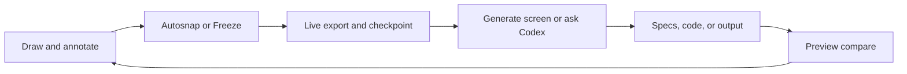
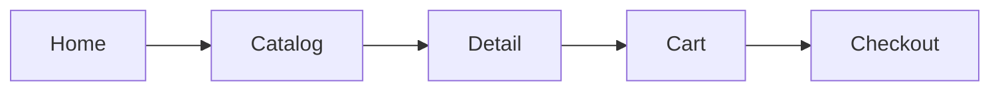
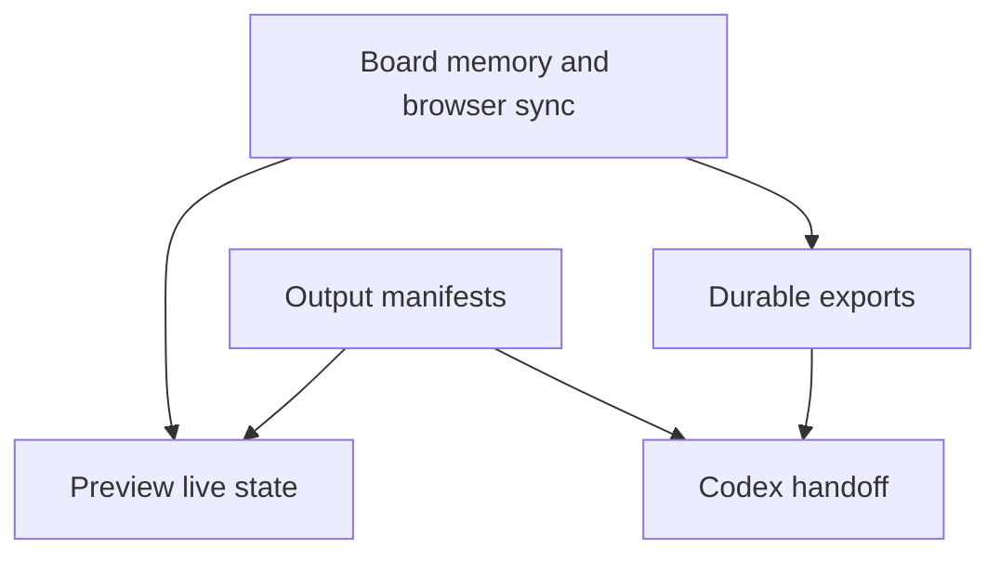
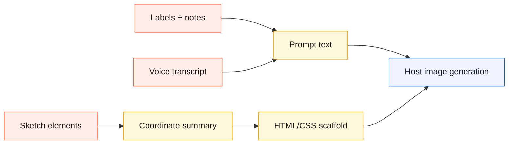
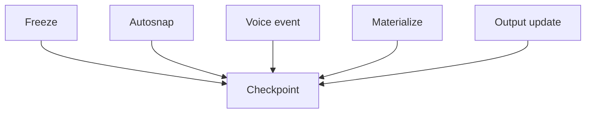
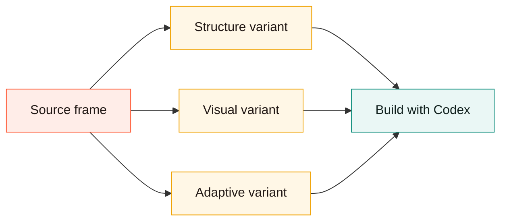
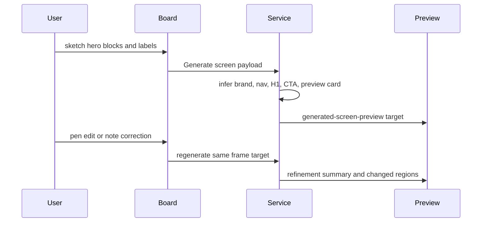
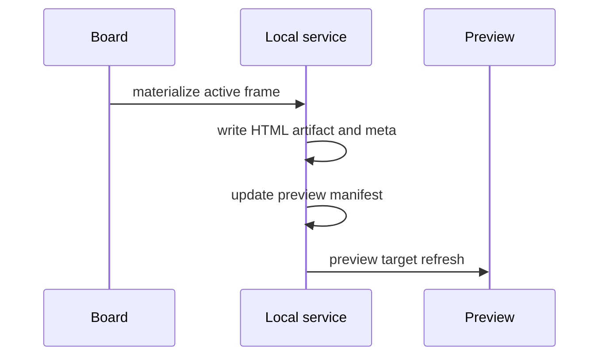

# Use Canvax With Codex

If you want the feature-by-feature behavior map first, read `docs/FEATURES.md` before this guide.

## Operator Loop

```text
draw -> annotate -> freeze/autosnap -> ask Codex -> inspect Preview
  ^                                                       |
  |                                                       v
  +---------------- sketch corrections <------------------+
```



## Core Mental Model

Canvax is a visual handoff surface for Codex.

The intended loop is:

1. open the board
2. stay in `Workbench` when you only need a quick sketch + spoken instruction
3. optionally use `Make real` and draw correction marks over the generated output
4. press `Apply to Codex` to save the sketch, voice note, correction marks, latest export, and checkpoint
5. switch to `Advanced` only when you need frames, flows, captures, or manifest detail
6. tell Codex to use the current Canvax

When Codex Desktop has Browser Use / Atlas available, open the board and Preview in the in-app browser. That is the lowest-friction mode because Codex can inspect the same visual surfaces you are using while it edits code, runs checks, and publishes output context back into Canvax.

```text
Codex chat
   |
   +--> Browser Use / Atlas: Canvax board at localhost:3210
   |
   +--> Browser Use / Atlas: Canvax Preview / generated app
   |
   `--> workspace edits + manifest publishing
```

The intended open behavior is:

- `/canvax` or `$canvax`: Codex-first path, open the board in the in-app browser.
- `./canvax`: local service only, no external browser.
- `./canvax --open-external`: default macOS browser fallback.
- `./canvax --chrome`: Google Chrome fallback.

## What To Draw

Canvax is intentionally generic. Use it for:

- websites
- web apps
- mobile screens
- Qt layouts
- desktop UI ideas
- image prompt composition
- product flow maps
- rough interaction sequences

It is not limited to a hero section or landing page flow.

## Workbench

Use Workbench when Canvax should feel like a scratchpad beside this chat.

It hides advanced panels and keeps only:

- visible surface selection for desktop, mobile, tablet, poster, square, or free canvas
- action selection for `Build UI`, `Refine UI`, `Write spec`, `Image prompt`, or `Variations`
- `New frame` for another screen/state
- `New section` for a connected continuation below the current section
- `Pen`, `Rect`, `Arrow`, and `Erase`
- `Start talking` / `Stop talking`
- a quick manual voice note field
- `Make real` for a local generated-screen preview
- generated output beside the sketch when a preview target exists
- `Sketch`, `Split`, `Output`, and `Map` focus modes for choosing whether the rough canvas, side-by-side comparison, generated surface, or spatial project map is primary
- correction marks drawn directly over generated output
- pasted or dropped images as movable/resizable image assets on the frame
- a bottom floating designer rail for the main tools, undo/redo, brush `-` / `+`, `Talk`, `Make`, `Image`, and `Apply`
- context-sensitive size controls: `-` / `+` resize selected elements in Select mode and otherwise update the current brush/eraser size
- eraser behavior that only removes drawn ink, not the paper/grid base, and does not export as black prompt/materialize geometry
- `Hide tray` / `Show tray` for canvas-first designer focus
- `Apply to Codex`
- `Preview`

```text
Workbench
+--------------------------------------+
| sketch rough placement on the canvas |
| speak or paste the instruction        |
| optionally Make real                  |
| mark corrections over generated output|
+--------------------------------------+
          |
          v
 latest export + latest checkpoint
```

`Apply to Codex` freezes the current frame, writes the live handoff, and saves a Workbench checkpoint. That gives Codex a single clean moment to read: the sketch image, the generated-output correction marks, the transcript/manual note, and the active frame context.

`Image pack` writes a no-API prompt pack for ChatGPT/image-generation host use. It includes a human-readable prompt, normalized coordinates, safe-zone notes, sketch references, output-correction notes, and an HTML/CSS placement scaffold. The scaffold is not production code; it is a coordinate map that tells an image model where each sketched region belongs.

Paste or drop an image onto the canvas when you want to bring a generated candidate, reference crop, book illustration pass, or UI asset back into the frame as an editable object. It can be selected, moved, resized, duplicated, layered, labeled, included in prompt packs, and passed into Materialize. Use `Reference underlay` only when the image should sit behind the sketch as tracing/context.

If the project root contains `DESIGN.md`, Canvax includes it in the task pack, image prompt pack, and prompt markdown. Use that file for reusable style rules, brand direction, illustration constraints, accessibility rules, product tone, or project-specific design system notes.

Advanced mode includes `Create DESIGN.md` in the Generate screen section. That writes a starter file from the current board mood, palette, frame notes, labels, and generated direction. It will not overwrite an existing `DESIGN.md`.

The host chip is intentionally explicit. Today it reports local Codex Browser / file-handoff capability and marks host image generation or native mic bridging as unavailable unless a future Codex client exposes those bridges directly. That prevents Canvax from pretending it can call ChatGPT image generation or the Codex microphone from a localhost page.

`Map` opens the frame graph as a designer-facing spatial workbench inside Workbench. Use it to arrange frames, variants, generated directions, and connected sections without switching to Advanced. The map has its own zoom controls and its positions are exported as `spatialWorkspace` so Codex can read project layout, branches, and screen relationships.

`Free canvas` is still a large single-frame scratchpad preset. `Map` is the first persistent spatial project layer. It is not yet a full infinite canvas for arbitrary files/images/code cards, but it now gives Canvax a zoomable spatial memory for frames and variant branches.

Switch to `Advanced` when you need multi-frame work, flow links, captures, output manifests, or generation/debugging controls. Advanced uses the same Canvax dark workspace language as Workbench, but it intentionally keeps the denser timeline/stage/inspector layout because it is the technical handoff deck. The mode description and deck labels clarify whether you are editing the frame workspace, mapping flow, or inspecting handoff details.

## Frame View

Use Frame view when you want to sketch a single screen, state, or freeform visual sheet.

Use:

- drawing tools for rough structure
- labels for meaning, states, motion, and rules
- notes in the right inspector for interpretation
- captures for saved checkpoints of the current frame

```text
Frame view
+-----------------------------+
| one frame canvas            |
| tools + labels + notes      |
| captures + voice + preview  |
+-----------------------------+
```

## Flow View

Use Flow view when you want to connect frames into a lightweight prototype map.

Use it to:

- arrange screen order
- connect transitions
- define entry points
- describe branching or sequence

Codex should read both the frame sketches and the flow graph.



## Voice Notes

Use `Voice notes` in the inspector when you want Canvax to preserve what you are saying while sketching.

It supports two capture modes:

- `Current frame`: spoken notes attach to the active frame
- `Whole board`: spoken notes apply across the whole session

If browser speech recognition is available, `Start dictation` captures transcript segments live while you keep drawing. If it is not available in the current browser context, use `Manual voice note` and paste text from macOS dictation or your own notes.

If you speak into the Codex chat microphone instead of the Canvax page, Codex can forward that submitted transcript into Canvax:

```bash
./canvax --transcript "Move the CTA above the image and make the hero mobile-first" --scope frame
```

That is a transcript bridge, not raw microphone sharing. The Codex composer microphone is not directly exposed to the localhost page, but the resulting chat transcript can still become Canvax voice context.

Voice notes are included in:

- the live JSON export
- the live prompt markdown
- `exports/canvax-voice-latest.md`

```text
voice input
   |
   +--> frame-scoped note
   `--> board-scoped note
           |
           v
     live export + prompt + voice markdown
```

## How Codex Should Use It

When `/canvax` or `$canvax` is active, Codex should default to:

- `exports/canvax-live-latest.json`
- `exports/canvax-live-latest.md`

The JSON file is the primary source because it contains:

- schema version metadata
- board metadata
- frame notes
- capture counts
- snapshot paths
- flow connections
- voice notes

When present, `exports/canvax-checkpoint-latest.json` is the best “what was happening at this exact moment?” handoff because it merges:

- the current frame graph
- the latest sketch/export pointers
- voice summary
- attached preview/output context

## Transport Model

Canvax currently runs in `local companion` mode.

That means the live collaboration loop is split across:

- browser session mirroring for fast board-to-Preview sync
- durable file exports for Codex handoff
- preview/output manifests for implementation binding

The runtime now writes that transport metadata into live payloads, exports, checkpoints, and preview-state responses so contributors can distinguish:

- what is core Canvax behavior
- what is specific to the current local companion transport
- what would later move to an App Server style richer Codex client



## Useful Prompts In Codex

- `use my current Canvax`
- `read the latest Canvax and implement it`
- `turn this Canvax into a UI spec`
- `use the Canvax flow graph to plan the app`
- `extract image prompts from this Canvax`
- `build the first screen from the latest Canvax`
- `open Canvax in the in-app browser`
- `inspect the Canvax Preview and fix the generated UI`

## What Gets Saved

The live export is written under `exports/`.

Important files:

- `exports/canvax-live-latest.json`
- `exports/canvax-live-latest.md`
- `exports/canvax-voice-latest.md`
- `exports/canvax-task-pack-latest.json`
- `exports/canvax-task-pack-latest.md`
- `exports/canvax-image-prompt-pack-latest.json`
- `exports/canvax-image-prompt-pack-latest.md`
- `exports/canvax-transcript-bridge.json`
- `exports/canvax-transcript-bridge-latest.md`
- `exports/canvax-checkpoint-latest.json`
- `exports/canvax-session-events.jsonl`
- `exports/canvax-preview-manifest.json`
- `artifacts/canvax/codex-output.json`
- `artifacts/canvax/checkpoints/`

The live JSON also includes `spatialWorkspace`, which records:

- map zoom
- frame/variant card positions
- card sizes
- entry frame
- active frame
- spatial links between frames

## Task And Image Prompt Packs

Canvax writes two compact host-facing packs whenever the board saves a live export.

```text
Canvax frame
  |
  +--> task pack
  |     use for Codex build/spec/app work
  |
  `--> image prompt pack
        use for ChatGPT/image generation placement
```



Use the image prompt pack when the output is a poster, children-book spread, illustration, UI concept image, mood board, or image-composition tweak. It is explicitly local-first:

- Canvax does not require `OPENAI_API_KEY`.
- Canvax does not call a paid image API by itself.
- Codex/ChatGPT may use the pack with whatever image-generation capability the current host exposes.
- The pack preserves placement through `x`, `y`, `w`, and `h` values normalized from `0` to `1`.
- The HTML/CSS scaffold is a spatial guide for generation, not final frontend code.
- `DESIGN.md` is included when present, so image or UI work can inherit a reusable style contract instead of relying only on the current sketch.

The same `Image pack` action also writes asset candidate records:

- `exports/canvax-asset-candidates-latest.json`
- `exports/canvax-asset-candidates-latest.md`
- archived copies under `artifacts/canvax/asset-candidates/...`

Asset candidates are prompt-ready records, not generated images. They preserve:

- source frame and region
- prompt and negative prompt
- normalized bounds
- aspect ratio
- HTML/CSS scaffold
- empty output slots where generated images can be attached later

After `Image pack` succeeds, Workbench shows an `Asset candidates` tray. Use it to:

- place an editable image slot back onto the matching source frame or region
- attach a generated image file to that slot after using a host image-generation tool
- keep the asset bound to its `assetCandidateId` so Codex can trace which prompt produced which visual region

The tray still does not call an image API. It is a local bridge between prompt-ready candidates and whatever image-generation host is available in the current Codex/ChatGPT session.

```text
sketch + labels + voice
  -> Image pack
  -> image prompt pack
  -> asset candidate records
  -> Workbench asset candidate tray
  -> host image generation
  -> generated image attached back to the matching editable frame/region slot
```

Older compatibility files may also be written:

- `exports/canvax-storyboard-latest.json`
- `exports/canvax-storyboard-latest.md`

## Current Product Boundary

Today, Canvax is:

- a browser sketch board
- a local command
- a Codex skill wrapper

Today, Canvax is not yet:

- a native embedded drawing surface inside the Codex composer
- able to directly reuse Codex chat microphone input from the local web board
- a full live preview-and-artifact panel for Codex outputs
- a finished voice-plus-sketch checkpoint/event-log surface
- a full Stitch/Canva-style infinite canvas

Those deeper integrations are part of the roadmap in `canvax-live-collaboration-plan.md`.

The current voice path is browser speech recognition when available, or pasted macOS/Codex dictation text when it is not. A native Codex version could reuse the Codex microphone reader directly, but that requires first-party Codex client integration or an app/plugin bridge that exposes transcript events to Canvax.

## Preview Manifest Workflow

The preview window can now read a richer preview manifest, not just a raw URL.

Useful cases:

- bind a local app preview to the current sketch flow
- surface changed files from a Codex implementation pass
- expose generated artifacts like a spec, HTML prototype, or notes file

The main Canvax inspector also reads that manifest now, so the board itself can show:

- the connected implementation target
- generated artifacts
- changed files from a Codex pass

The board now also has `Publish changes`, which reads the current git workspace status, filters out generated Canvax files, and writes the changed-file list into the Codex output manifest automatically.

Regular board syncs now do this too. When autosnap, manual freeze, or explicit export writes a fresh live export, Canvax also refreshes the current workspace change list in the Codex output manifest. Use `Publish changes` only when you want to force that refresh manually.

Preview polling now also overlays a live workspace-follow view of current git changes without rewriting the manifest file every time. That means the board and Preview can keep following Codex file edits while you continue sketching, even between explicit publish/export moments.

Both surfaces now also keep a small live output activity feed, so you can see when the connected output context changed while sketching. Preview also appends a revision key to the implementation iframe source, which means same-URL local previews can refresh when Codex changes relevant implementation files instead of staying visually stale.

Frame cards in both the board and Preview now also show small output-status badges, so you can scan which frames are:

- `Materialized`
- `Output synced`
- `Output stale`
- `Global target`

Canvax now also keeps a `Rewrite queue` in both surfaces. That queue highlights frames that currently need:

- first output
- a frame-specific binding
- a connected target
- a refresh because the sketch is newer than the bound output

That activity feed now rebuilds from recent Canvax session events too, so output updates survive refreshes instead of disappearing with the current tab state.

The preview window now also supports compare modes:

- `Split` to see sketch and output together
- `Sketch` to focus only the input canvas
- `Output` to focus only the generated implementation

If artifacts or changed files include frame bindings, the preview highlights the items relevant to the currently selected frame and shows that frame context under the compare surface.

You can also save a compare checkpoint directly from the preview window with `Save snapshot`. Canvax writes those records under:

- `artifacts/preview/preview-snapshots.json`
- `artifacts/preview/snapshots/...`

Each saved snapshot records the current frame, compare mode, linked target, artifact/change context, and the current sketch image when available.

If the manifest includes an HTML artifact, Canvax can auto-use that as the preview target even without an explicit `--url` or `--preview-path`.

```text
Codex changes files
      |
      v
write-codex-output.mjs
      |
      v
artifacts/canvax/codex-output.json
      |
      v
preview-state merge
      |
      +--> board inspector
      `--> Preview output context
```

## Voice Handoff Files

Canvax now writes a dedicated voice export:

- `exports/canvax-voice-latest.md`
- `exports/canvax-transcript-bridge.json`
- `exports/canvax-transcript-bridge-latest.md`

That file is useful when you or Codex want only the spoken context without re-reading the full JSON or prompt. The live JSON export also includes a `voice` block with:

- total segment counts
- board-scoped vs frame-scoped counts
- frame-grouped transcript segments

## Handoff Checkpoints

Use `Push checkpoint` when you want to preserve the current collaboration moment without waiting for a future change to overwrite the latest export.

Canvax also writes checkpoints automatically for:

- autosnap freeze
- manual freeze
- Workbench apply
- dictation stop
- manual voice note capture
- materialize
- live output-context changes when the connected target/artifact/change digest actually changes

Checkpoint files:

- `exports/canvax-checkpoint-latest.json`
- `exports/canvax-session-events.jsonl`
- `artifacts/canvax/checkpoints/...`

The latest checkpoint includes:

- board/frame summary
- flow summary
- voice summary
- export file pointers
- attached preview target and output context when available
- rewrite queue items that tell Codex which frames currently need output attention next



## Generate Screen

Use `Generate screen` in the main board when you want Canvax itself to push the active frame closer to a real website or app screen before any real app code exists.

That flow:

1. reads the active frame geometry, labels, and notes
2. reads the board generation recipe:
   - direction
   - output style
   - focus
3. writes a richer local HTML artifact under `artifacts/preview/materialized/...`
4. updates `exports/canvax-preview-manifest.json`
5. opens or reuses the Preview window so the generated surface can be compared against the sketch

`Generate screen` is still local and deterministic. It is a richer profile-driven pass, not a paid API call.

## Build With Codex

Use `Build with Codex` when the current frame is ready to become real workspace code.

This is different from `Generate screen`:

- `Generate screen` writes a local HTML preview artifact from the sketch.
- `Build with Codex` writes a Codex-readable implementation request for actual app/page/component files.
- The request does not call a paid API and does not require `OPENAI_API_KEY`.
- `node scripts/execute-build-request.mjs` can execute the latest request into a local HTML preview artifact and publish the frame binding. This is a deterministic smoke path, not a replacement for Codex editing real app files.

Canvax writes the latest request to:

- `exports/canvax-build-real-latest.json`
- `exports/canvax-build-real-latest.md`

It also archives each request under:

- `artifacts/canvax/build-requests/...`

The request contains:

- active frame id, title, viewport, notes, labels, and composition coordinates
- voice/manual notes
- design context from `DESIGN.md` when present
- links to the live export, task pack, checkpoint, and image prompt pack
- the expected Codex output manifest path
- suggested `scripts/write-codex-output.mjs` commands for binding the generated route or artifact back to the frame

```text
sketch + voice + labels
  -> Build with Codex
  -> exports/canvax-build-real-latest.md
  -> Codex implements real files
  -> scripts/write-codex-output.mjs
  -> artifacts/canvax/codex-output.json
  -> Preview and Workbench bind the output to the frame
```

Local smoke path:

```bash
npm run execute-build
```

That writes:

- `artifacts/preview/codex-build/frames/<frame-id>/index.html`
- `artifacts/preview/codex-build/frames/<frame-id>/context.json`
- `artifacts/canvax/codex-output.json`



```mermaid
flowchart LR
    A[Active frame] --> B[Build with Codex]
    B --> C[Build request JSON/MD]
    C --> D[Codex edits real app files]
    D --> E[write-codex-output]
    E --> F[Codex output manifest]
    F --> G[Workbench and Preview]

    classDef sketch fill:#ffede8,stroke:#ff5d3a,color:#211815;
    classDef request fill:#fff7e6,stroke:#f0a202,color:#211815;
    classDef code fill:#eaf7f5,stroke:#0c8d7b,color:#10201d;
    classDef preview fill:#eef3ff,stroke:#2364aa,color:#101828;
    class A sketch;
    class B,C request;
    class D,E,F code;
    class G preview;
```

## Editable Variants

Use `Variants` / `Create variants` when you want alternate directions from the same sketch without leaving Canvax.

This creates three editable branch frames:

- `Structure`: same idea, stronger hierarchy and spacing
- `Visual`: same idea, stronger mood, palette, and art direction
- `Adaptive`: alternate platform, breakpoint, or interaction state

Each variant is a real Canvax frame:

- it can be selected, drawn on, labeled, resized, connected, materialized, or built with Codex
- it keeps lineage metadata pointing back to the source frame
- it appears in Flow view as a connected branch
- it remains local-first and does not require an API key

```text
source frame
  -> Create variants
      -> Structure branch
      -> Visual branch
      -> Adaptive branch
  -> choose a branch
  -> sketch more or Build with Codex
```



For hero-like website frames, Generate screen now uses semantic screen inference:

```text
draw rough blocks
  -> label brand/headline/CTA/preview
  -> Generate screen
  -> polished hero artifact
  -> draw or label a correction
  -> regenerate same frame target
```



## Materialize

Use `Materialize` in the main board when you want Canvax itself to turn the active frame into a styled local preview before any real app code exists.

That flow:

1. reads the active frame geometry, labels, and notes
2. writes a local HTML artifact under `artifacts/preview/materialized/...`
3. writes the serialized frame payload next to it for debugging and iteration
4. updates `exports/canvax-preview-manifest.json`
5. opens or reuses the Preview window so the generated surface can be compared against the sketch

```text
active frame
    |
    v
local materialize endpoint
    |
    +--> html artifact
    +--> frame payload json
    `--> preview manifest update
```



This is a deterministic local transformation, not a paid API call.

When you materialize the same frame again, Canvax now reuses the same per-frame artifact path and only updates the versioned preview URL. That means Preview can stay attached to one frame-specific target while still refreshing reliably after each rematerialize.

If a frame already has a generated or materialized target, autosnap and manual freeze now silently refresh that frame after the live export is saved. That keeps Preview closer to the current sketch without requiring you to press `Generate screen` or `Materialize` again after every edit.

Longer sessions now also reuse cached frame thumbnails/snapshots when Canvax rebuilds the live preview/export payloads. That reduces repeated image re-encoding churn while you keep sketching across many frames.

Preview now also reads Materialize refinement metadata:

- a refinement summary for the current frame
- counts for added, updated, removed, and note-driven changes
- changed-region overlays drawn over both the sketch side and the implementation side

That means the compare window can now point out which parts of the sketch changed between rematerialize passes instead of only saying that output is stale or synced.

The generated materialized preview also includes a few lightweight interaction affordances:

- clickable generated components
- `Show original sketch` as an opt-in transparent review overlay
- `Show design notes` as an opt-in display for free labels and interpretation notes

If Preview says the output is stale, it means the current sketch `updatedAt` is newer than the materialized target metadata. Rematerialize that frame to bring the generated surface back in sync.

The generated output opens clean by default. Sketch overlays and design notes are review aids, not product UI. Turn them on only when you want to compare the generated surface against the rough drawing or inspect the labels that guided Codex.

Materialize is useful when you want a quick “make this sketch feel real” pass while keeping the original sketch board unchanged.

The live JSON export and checkpoint payloads now also include the rewrite queue, so Codex can read which frames are stale, unbound, or still waiting for first output without having to infer that only from timestamps and targets.

You can write that manifest manually with:

```bash
node scripts/write-preview-manifest.mjs --url http://localhost:3000 --change web/app.js::Updated layout --artifact docs/spec.md::Generated handoff spec
```

Or use a workspace HTML target:

```bash
node scripts/write-preview-manifest.mjs --preview-path artifacts/preview/home.html --label "Materialized home preview"
```

## Codex Output Manifest

For implementation results, prefer the canonical Codex output manifest:

```bash
node scripts/write-codex-output.mjs --from-git-status --preview-path artifacts/preview/home.html
```

To bind a file or artifact to a specific frame, add a third `::` segment with one or more frame ids:

```bash
node scripts/write-codex-output.mjs --from-git-status --artifact artifacts/preview/home.html::Generated home preview::frame-home --frame frame-home
```

That writes `artifacts/canvax/codex-output.json`. Canvax merges it automatically with any manual preview manifest, so both the board inspector and preview window can pick up:

- generated preview targets
- changed files
- generated artifacts

If you want to inspect the manifest before writing it, add `--dry-run --json`.

If the Codex output manifest contains an HTML artifact, Canvax can auto-use that artifact as the preview target even without an explicit preview URL.

## Current End-To-End Shape

```text
Board input
  -> live export
  -> Codex reads handoff
  -> Codex writes files/manifests
  -> Preview compares sketch vs output
  -> user sketches corrections
```

## Publish Changes

Use `Publish changes` in the `Live handoff` panel when you want Canvax to reflect the current workspace diff without manually running the manifest writer.

That action:

- reads `git status --porcelain`
- ignores generated Canvax files like `exports/`, checkpoints, and materialized preview artifacts
- writes the changed-file list into `artifacts/canvax/codex-output.json`
- refreshes the board’s changed-file list immediately

Use `Clear published` if you want to remove the auto-published Codex output manifest from the board.
