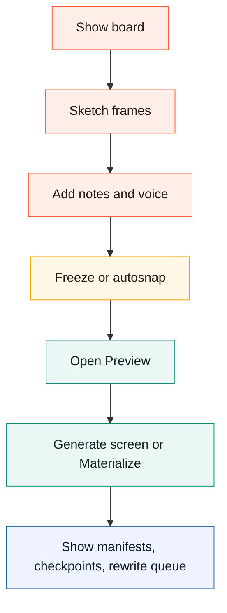
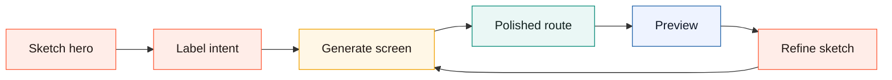

# Canvax Demo Script

This is a short operator script for showing Canvax to another developer, maintainer, or potential upstream reviewer.

This project was created collaboratively with OpenAI Codex.

## Demo Shape

```text
show board
  -> draw rough frames
  -> add voice or notes
  -> freeze
  -> open Preview in Codex Browser Use / Atlas
  -> materialize
  -> inspect manifests/checkpoints
```



## Setup

Run:

```bash
./canvax
```

Then invoke `/canvax` so `http://localhost:3210` opens in Codex Browser Use / Atlas when available. Use `./canvax --open-external` or `./canvax --chrome` only when demonstrating the external-browser fallback.

Optional validation:

```bash
npm run check
npm run regression
```

Optional hero generation demo:

```bash
npm run demo:hero
```

That writes a deterministic sample frame, runs the local `Generate screen` path, and opens a polished hero preview route through the same materialized artifact system used by the board.

## Demo Goal

Show that Canvax lets a user sketch first, keep thinking out loud, and let Codex work from that visual handoff without forcing the user to translate the whole idea into text up front.

## Demo Runtime Story

```text
user input
   -> board
   -> exports/checkpoints
   -> Codex handoff
   -> Preview and output context
```

## Demo Flow

1. Show the board.
   Explain that this is a generic scratchpad, not a website-only wireframe tool.

2. Draw two or three rough frames.
   Use labels, notes, and one or two flow links.

3. Add a voice note.
   Explain that the spoken context is preserved in the handoff files too.

4. Freeze or autosnap.
   Point out that the live handoff is written under `exports/`.

5. Open Preview.
   Show the sketch side and the output side in Codex Browser Use / Atlas.

6. Materialize one frame.
   Explain that this is a deterministic local “make it feel real” pass, not a paid API feature.

7. Run `Generate screen` for a hero-like frame.
   Explain that this is still local and deterministic, but it uses a more semantic renderer that infers nav, headline, body, CTAs, proof chips, and a visual preview card from sketch intent.

8. Publish or inspect output context.
   Show artifacts, changed files, activity, output badges, and the rewrite queue.

9. Push a checkpoint.
   Explain that checkpoints preserve a specific collaboration moment for Codex.

```text
hero demo loop
  rough layout + labels
      -> Generate screen
      -> polished local HTML artifact
      -> Preview compare
      -> pen correction or label update
      -> regenerate same frame route
```



## Talking Points

- `./canvax` is the local command.
- `/canvax` and `$canvax` are the skill-backed Codex entry points.
- Codex Browser Use / Atlas is the preferred visual surface for the board, Preview, and generated app.
- Current transport is local companion mode: files, manifests, and browser mirroring.
- Future richer-client mode is explicitly planned as an App Server path, not hidden magic.
- The Preview window is separate on purpose so the sketch surface stays uncluttered.
- The Canvax logo is original project branding: browser frame, sketch stroke, code brackets, and a central C. It should not be presented as an OpenAI, ChatGPT, or Codex trademark.

## Good Evidence To Show

- `exports/canvax-live-latest.json`
- `exports/canvax-checkpoint-latest.json`
- `exports/canvax-preview-manifest.json`
- `artifacts/canvax/codex-output.json`
- frame-level output badges
- rewrite queue items
- changed-region overlays after rematerialize

## Demo Close

End by summarizing the core point:

Canvax already works as a shareable local Codex companion today, and it is structured so a richer native Codex client could replace the transport later without throwing away the collaboration model.
