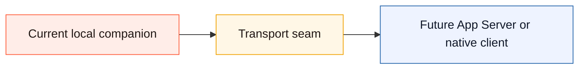
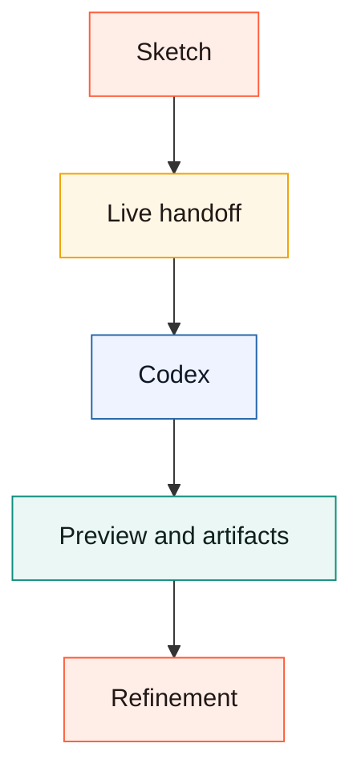

# Canvax Upstream Proposal

This document explains what Canvax proves today, why it ships as a local companion, and what first-party Codex integration would replace.

This project was created collaboratively with OpenAI Codex.

## Current vs Native Shape

```text
today
  local board + Codex in-app browser + preview tab + file handoff + skill

future
  thread-bound canvas + thread-bound preview + event transport
```



## Summary

Canvax is a scratchpad for sketch-first collaboration with Codex:

- draw rough UI, flows, motion, layouts, or image direction
- add labels, notes, and voice context
- keep a live handoff in the workspace
- let Codex turn that into specs, code, previews, and iteration

The current repo proves that this workflow is useful even without a native in-chat canvas.

## Why The Local Companion Exists

Canvax exists as a browser companion plus skill because that is the cleanest currently documented path:

- a local command can launch the board
- Codex in-app browser can keep the board, Preview, and generated app inside the Codex visual loop
- a skill can attach the current thread to the latest handoff
- a preview window can stay separate from the sketch surface
- local files can preserve a durable collaboration record

This is not pretending there is a hidden native canvas extension point inside the first-party Codex app.

```text
current compromise
  Codex browser surface  -> input and inspection
  local files/manifests  -> durable handoff
  skill                  -> thread attachment
```

## What The Repo Already Proves

The current prototype already demonstrates:

- generic sketch input, not only website wireframes
- frame and flow modeling
- voice notes attached to the board
- live preview comparison
- Codex in-app browser inspection of the board, Preview, and generated app routes
- output/activity history
- rewrite queues that tell Codex what needs attention next
- deterministic local materialization from sketch to styled surface
- semantic `Generate screen` output for hero-like website/app screens
- original Canvax branding and logo assets that avoid copying first-party OpenAI marks
- durable checkpoints and session events



## Brand And Trust Boundary

The Canvax identity should feel adjacent to the Codex workflow without impersonating OpenAI branding.

```text
Canvax mark
  browser chrome  -> visual workspace
  sketch stroke   -> freehand input
  code brackets   -> developer output
  central C       -> Canvax identity
```

The upstream version can replace the local SVG with official product UI if OpenAI adopts the concept, but the open repo should keep its original logo assets under:

- `web/assets/canvax-logo.svg`
- `docs/assets/canvax-logo.svg`

## What Native Codex Integration Would Replace

If Codex later ships a first-party canvas surface or a richer App Server client path, the native version should replace:

- browser-tab board startup friction
- explicit Codex in-app browser coordination
- file-path handoff as the primary collaboration transport
- manual preview-window coordination
- manifest files as the main output-binding layer

It should not replace the Canvax interaction model itself.

## Proposed Native End State

The strongest native version would provide:

- a canvas panel bound to the active Codex thread
- live sketch and voice context as conversation state
- preview/artifact surfaces in the same client
- frame/flow/rewrite state directly visible to Codex
- direct event transport instead of file-based handoff

## Migration Strategy

Canvax now carries an explicit transport contract:

- current mode: `local-companion`
- durable handoff: file exports
- output binding: manifest transport
- live mirror: browser session mirroring
- future mode: `app-server`

That contract is the migration seam. A richer client can swap transport without throwing away:

- frame schema
- flow schema
- checkpoint semantics
- output activity model
- rewrite queue semantics

```text
preserve
  frames
  flow
  voice
  checkpoints
  rewrite queue
swap
  files/manifests/browser mirroring
for
  richer thread-bound transport
```

## Non-Goals

This proposal is not claiming:

- that the current repo is already a native Codex plugin
- that the browser companion should be the forever architecture
- that separate paid APIs are required for the core Canvax workflow

## Why Upstreaming Is Worthwhile

The main product value is simple: many users think visually before they can state the request cleanly in text. Canvax gives Codex a way to collaborate with that earlier, rougher, more honest stage of thought.
